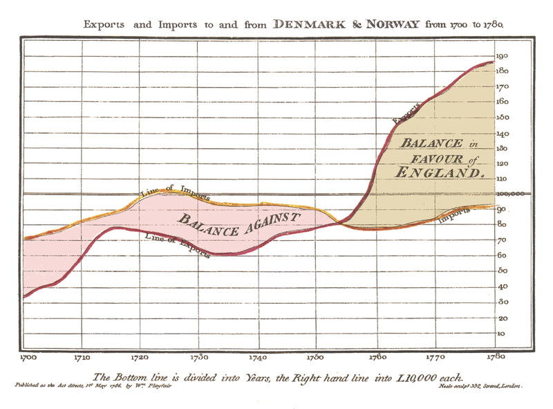
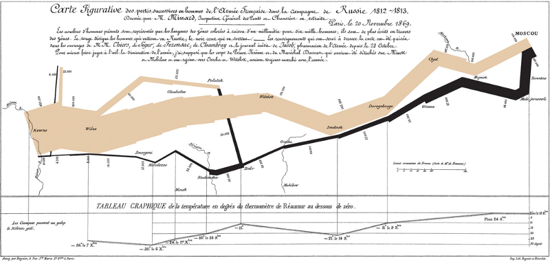
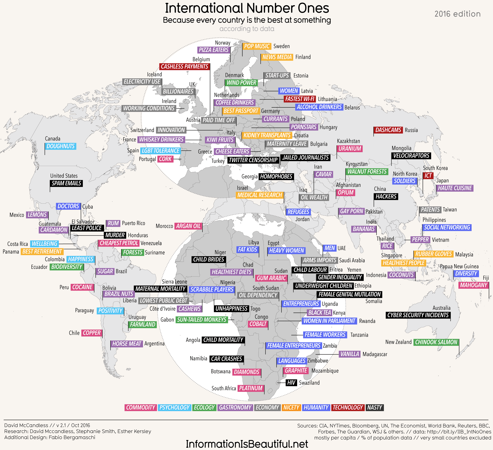
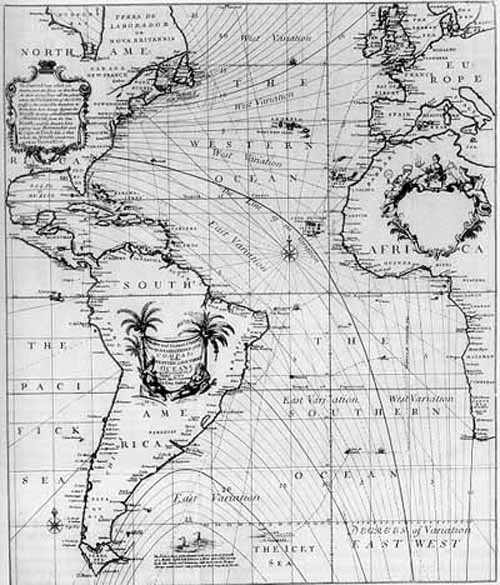
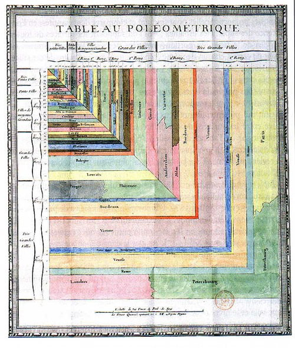

# Introduction

## What is Data Visualization?

Data visualization is a graphic representation that expresses the significance of data. It reveals insights and patterns that are not immediately visible in the raw data. It is an art through which information, numbers, and measurements can be made more understandable. According to [@viz]:

> The primary goal of data visualization is to communicate information clearly and effectively through graphical means. It does not mean that data visualization needs to look boring to be functional or extremely sophisticated to look beautiful. To convey ideas effectively, both aesthetic form and functionality need to go hand in hand, providing insights into a rather sparse and complex data set by communicating its key-aspects more intuitively.

The main goal of data visualization is to communicate information clearly and effectively through graphical means. It doesn't mean that data visualization needs to look boring to be functional or extremely sophisticated to look beautiful. To convey ideas effectively, both aesthetic form and functionality need to go hand in hand, providing insights into a rather sparse and complex data set by communicating its key-aspects in a more intuitive way.

"Data is the new oil" may be a cliche, but it is true. Like oil, data in its raw, unrefined form is pretty worthless. To unlock its value, data needs to be refined, analyzed and understood [@lawfraud]. More and more organizations are seeing potential in their data connections, but how do you allow non-experts to analyze data at scale and extract potentially complex insights? One answer is through interactive graph visualization.

Information visualization is the art of representing data so that it is easy to understand and manipulate, thus making the information useful. Visualization can make sense of information by helping to find relationships in the data and support (or disproving) ideas about the data. [@info_viz] shares some examples and common uses of information visualization, such as:

* Presentation: to explain or persuade
* Exploratory Analysis: to identify relationships or unusual cases in the data
* Confirmatory Analysis: to confirm our understanding and analysis of the data

**Why data visualization is such a powerful tool:**

* It is intuitive – presenting a graph as a node-link structure instantly makes sense, even to people who’ve never worked with graphs before.
* It is fast – our brains are great at spotting patterns, but only when data is presented in a tangible format. Armed with visualization, we can spot trends and outliers very effectively.
* It is flexible – the world is densely connected, so as long as there’s an interesting relationship in your data somewhere, you will find value in graph visualization.
* It is insightful – exploring graph data interactively allows users to gain more in-depth knowledge, understand the context and ask more questions, compared to static visualization or raw data.

## Importance of Data Visualization

### Increased Value for Increasing Volume of Data

The enormous volume of data available to companies, governments and people today means there is a vast (and growing) need for data to be presented so that it delivers value. From business decision making to route navigation, data visualization provides a simple, user-friendly approach to understanding data and making faster, better decisions. 

In his article on the importance of data visualization to businesses, Chris Pittenturf uses the example of an energy bill to explain the impact of data visualization: *before we even read the text of the bill, we look at the graph first* [@viz_importance]. This simple example demonstrates that data visualization is in every part of our daily lives and that we are more likely to analyze and understand the visualizations before reading further along. Pittenturf further explains most data used by businesses are highly unstructured, so visualization provides a better understanding of the complex insights coming from this information. 

### Understanding Concepts that are Difficult to Contextualize

In his TED talk, David McCandless gives an example of how expenditures or valuations of enormous amounts of money are represented in the billion dollar-o-gram by color-coded, relatively-sized boxes. This allows the synthesis of a breadth of information to deliver in a small, easily-digestible and aesthetically pleasing way. Visuals serve as a sort of map for a vast landscape of information—they direct reader's eyes to the relevant places and details. Moreover, the eye, as McCandless notes, is uniquely suited to our senses to process large amounts of information and detect patterns [@viz_ted]. (The billion dollar-o-gram is exceptionally readable and rather pretty, but it seems a bit dubious to compare the predicted Iraq War cost to the "mushroomed" actual cost of Iraq and Afghanistan wars since its purpose seems only to conflate two wars for dramatic effect.) 

3. It can reveal interesting small patterns--"Data detective."

### Revealing Small and Interesting Patterns

Beyond its ability to make information from several different sources and in large amounts easily understandable, data visualization can also reveal smaller interesting patterns, allowing us to play the "data detective" as McCandless calls it. In other words, as we have already discussed, data visualization can not only be handy in a declarative manner but can also be used as an exploratory tool [@viz_ted].

### Easier Decision-making in Healthcare

[@marksman]

Today, data visualization solutions can be found everywhere in healthcare systems from hospital operations monitoring and patient profiling to demand projection and capacity planning. Healthcare service providers are increasing their efforts to investigate different visual and interactive methods in creating and examining large graphs, charts, interactive visualizations, and 2D/3D visualization of discrete event simulation (DES) to comprehend complex and large datasets, recognize connections and trends, model and simulate healthcare events, and communicate and interpret the findings. Expected results include more efficient and effective clinical performance monitoring and improvement, patient flow modeling and management, better patient care quality, security and effectiveness, better support for clinical costing and resource coordination, better-planned development and competitive advantage.
 
Traditional visualization strategies often require significant processing time, which restrains high-throughput analysis. Interactive visualization frameworks maintain a closed loop between the user and the system and, thus, need to be very fast. Building such a framework requires the development of new visualization methods, and there exists the need to design new and useful interaction techniques which are being developed by researchers.
 
Informatics for Integrating Biology and the Bedside (i2b2), an initiative sponsored by the NIH Roadmap National Centers for Biomedical Computing is another such program that provides a query tool that supplies aggregate counts and fundamental analyses of patient populations from clinical data warehouses (CDWs). i2b2 (i2b2 to Tableau) is useful in estimating patient cohort sizes and has an extendable design where modules with additional features can be developed. Other tools such as R and Python are also helping healthcare a lot. Health informatics databases and networks have amplified benefits with information visualization as it dramatically expands the capacity of patients, clinicians, and public health policymakers to make better decisions.

### Law Enforcement and Fraud Detection

The police have been using graph visualization, or link analysis as it is commonly known – for decades to ‘join the dots’ in investigations. What has changed is the use of technology to make joining the dots a more automated and scalable process.

McCandless also postulates that we all have a latent "design literacy" that is being developed every day as we continuously bombard with visuals, and that our minds and our eyes are taking in this information and processing it so that we all have an intuitive sense of design, and have actually begun to demand a visual aspect to our information. This is an interesting perspective since everyone does seem to have a sense of visual aspects of space, color, etc. Of course, the time-honored adage tells us that beauty is in the eye of the beholder, so while it might be whimsical to claim that we are all designers, there is still great value in learning formal principles of design [@viz_ted]. 

A failure to analyze the bigger, joined-up picture was cited as a shortcoming of the intelligence services after the 9/11 terror attacks. In the years that followed, law enforcement and security agencies drove graph visualization forward. New approaches and technologies were explicitly created for large-scale data analysis of communications records, open source intelligence (OSINT), and police databases.

Lawful interception, the legally mandated interception of personal communications data, provided vast volumes of data on criminal and terrorist activity. Paired with social network analysis, graph visualization techniques allowed non-specialized staff to explore the data and uncover important insight.

To that end, Pittenturf explains basic criteria that a data visualization should satisfy to be effective [@viz_importance]:

**Criteria** | **Description**
------------------------------|---------------------------------------------------------------------------------------------------------------------------------------------------------
Informative | The visualization should be able to convey the desired information from the data to the reader.
Efficient|The visualization should not be ambiguous.
Appealing|The visualization should be captivating and visually pleasing. 
Interactive and Predictive (Optional)| The visualizations can contain variables and filters with which the users may interact to predict results of different scenarios.

Pittenturf goes on to give various day-to-day examples where visualization gives a better understanding of the data. One straightforward example used by Pittenturf is that of an energy bill. Pittenturf states that when we, as consumers, receive an energy bill, we usually look at the graph in the bill first before proceeding to read the text in the bill. Pittenturf states that consumers are more likely to analyze and understand the visualizations before reading further along. The article ends with Pittenturf emphasizing the importance of data visualizations in our businesses as well as in our daily lives. It gives a simple, short and crisp understanding of what data visualization is and how it is relevant to everyone. Data visualization is an aid to get a better understanding of the complex insights that any business data provides. Most of the data used by the businesses are highly unstructured, and these businesses can get a better understanding of their businesses by visualizing their data.

Another early adopter of graph visualization techniques was the financial services industry. Fraud detection is about finding unusual connections – between accounts, transactions, insurance policies, devices, etc. There’s great value in visualizing that data as a graph. Known fraud detection is primarily automated with rule scoring and pattern matching. Visualization lets you review edge-cases and outliers more quickly. Speed is important because sometimes analysts only have seconds to approve or deny a transaction. In those cases, visualizations are simple, small and with limited interaction. To get a clear overview quickly, analysts need effective layouts. Other functionalities, like expanding and filtering help fraud analysts to see context on demand.

Three things are consistent across both graph visualization use cases:

  1. They involve highly connected data (apparently).
  2. That highly connected data conceals risk insight.
  3. That insight is needed to power quick and confident decision making.

When connected data insight is critical, only interactive and robust visualization tools are up to the task.

### Design and Data Literacy

McCandless postulates that we all have a latent "design literacy" that is being developed every day as we are constantly bombarded with visuals, and that our minds and our eyes are taking in this information and processing it so that we all have an intuitive sense of design, and have actually begun to demand a visual aspect to our information. This is an interesting perspective, since everyone does seem to have a sense of visual aspects like space, color, etc. Of course, the time-honored adage tells us that beauty is in the eye of the beholder, so while it might be whimsical to claim that we are all designers, there is still great value in learning formal principles of design [@viz_ted]. 

## History of Data Visualization

### Brief history
>"The only new thing in the world is the history you do not know." — Harry S Truman  

#### Data Visualization: A Modern Product?

Given the recent explosion in data availability and visualization tools, it would be natural to assume that statistical graphics and data visualizations are relatively modern developments. However, the graphic representation of quantitative information has deep roots that reach into the histories of the earliest map-making and visual depictions, and up to thematic cartography, statistics, medicine, and other fields.  

Given the recent explosion in availability of data and visualization tools, it would be natural to assume that statistical graphics and data visualizations are relatively modern developments. However, the graphic representation of quantitative information has deep roots that reach into the histories of the earliest map-making and visual depictions, and up to thematic cartography, statistics, medicine, and other fields.  

Developments in technologies (printing, reproduction) mathematical theory and practice, and empirical observation and recording, and those developments enabled the broader use of graphics and new advances in form and content. This paper provides an overview of the intellectual history of data visualization from medieval to modern times, as well as describes and illustrates some significant advances along the way [@data_viz_history].

**Time** | **Phase** | **Description**
--------------|----------------|---------------------------------------------------------------------------------------------------------------------------------------------------------

Pre-17th Century | Early Maps and Diagrams | Data visualization has come a long way. Before the 17th century, data visualization already existed. Though displayed in other formats such as maps, the content is much similar to today's visualizations, which mostly presented geologic, economic, and medical data. The earliest seeds of visualization arose in geometric diagrams, in tables of the positions of stars and other celestial bodies, and in the making of maps to aid in navigation and exploration. 
1600-1699 | Measurement and Theory | Among the most important problems of the 17th century were those concerned with the physical measurement of time, distance, and space for astronomy, surveying, map making, navigation and territorial expansion. This century also saw considerable new growth in theory as well as the dawn of practical application.
1700-1799 | New Graphic Forms | With some rudiments of statistical theory, data of interest and importance, and the idea of graphic representation somewhat established the 18th century witnessed the expansion of these aspects to new domains and new graphic forms. 
1800-1850 | Beginnings of Modern Graphics | With the foundation provided by the previous innovations of design and technique, the first half of the 19th century witnessed explosive growth in statistical graphics and thematic mapping at a rate which would not equal until modern times.

Pre-17th Century | Early Maps and Diagrams | Data visualization has come a long way. Prior to the 17th century, data visualization already existed. Though displayed in other formats such as maps, the content is much similar to today's visualizations, which mostly presented geologic, economic, and medical data. The earliest seeds of visualization arose in geometric diagrams, in tables of the positions of stars and other celestial bodies, and in the making of maps to aid in navigation and exploration. 
1600-1699 | Measurement and Theory | Among the most important problems of the 17th century were those concerned with physical measurement of time, distance, and space for astronomy, surveying, map making, navigation and territorial expansion. This century also saw considerable new growth in theory as well as the dawn of practical application.
1700-1799 | New Graphic Forms | With some rudiments of statistical theory, data of interest and importance, and the idea of graphic representation somewhat established, the 18th century witnessed the expansion of these aspects to new domains and new graphic forms. 
1800-1850 | Beginnings of Modern Graphics | With the foundation provided by the previous innovations of design and technique, the first half of the 19th century witnessed explosive growth in statistical graphics and thematic mapping at a rate which would not be equaled until modern times.

1850–1900 | The Golden Age of Statistical Graphics | By the mid-1800s, all the conditions for the rapid growth of visualization had generated a "perfect storm" for data graphics. Official state statistical offices were established throughout Europe, in recognition of the growing importance of numerical information for social planning, industrialization, commerce, and transportation. 
1900-1950 | The Modern Dark Ages | If the late 1800s were the "golden age" of statistical graphics and thematic cartography, the early 1900s can be called the "modern dark ages" of visualization. There were few graphical innovations, and by the mid-1930s, the enthusiasm for visualization which characterized the late 1800s had been supplanted by the rise of quantification and formal, often statistical, models in the social sciences.
1950–1975 | Rebirth of Data Visualization | Still under the influence of the formal and numerical zeitgeist from the mid-1930s on, data visualization began to rise from dormancy in the mid-1960s. 
1975–present | High-D, Interactive and Dynamic Data Visualization | During the last quarter of the 20th century, data visualization has blossomed into a mature, vibrant and multidisciplinary area of research, as seen in this handbook, and software tools for a wide range of visualization methods and data types are available for every computer.

### Key Figures in the History of Data Visualization

The history of data visualization is full of incredible stories marked by significant events, led by a few key players. The article [@history_viz] introduces some of the fantastic men and women who paved the way by combining art, science, and statistics. One of them is Charles Joseph Minard, whose most famous work is the map of Napoleon’s Russian campaign of 1812 which could use as a data product for Data Visualization. Below we have some visualizes with their famous works and other stories in the article [@history_viz].

The history of data visualization is full of incredible stories marked by major events, led by a few key players. The article [@history_viz] introduces some of the amazing men and women who paved the way by combining art, science, and statistics. Below we have some visualists with their famous works, and other stories in the article [@history_viz].
>

#### William Playfair (1759–1823)

William Playfair is considered the father of statistical graphics, having invented the line and bar chart are used so often today. He is also credited with having created the area and pie chart. Playfair was a Scottish engineer and political economist who published "The Commercial and Political Atlas" in 1786. This book featured a variety of graphs including the image below. In this famous example, he compares exports from England with imports into England from Denmark and Norway from 1700 to 1780.

#### John Snow (1813–1858)

In 1854, a cholera epidemic spread quickly through Soho in London. The Broad Street area had seen over 600 dead, and the surviving residents and business owners had primarily fled the terrible disease. Physician John Snow plotted the locations of cholera deaths on a map. The surviving maps of his work show a method of tallying the death counts, drawn as lines parallel to the street, at the appropriate addresses. Snow’s research revealed a pattern. He saw an evident concentration around the water pump on Broad Street, which helped find the cause of the infection.

#### Charles Joseph Minard (1781–1870)

Charles Joseph Minard was a French civil engineer famous for his representation of numerical data on maps. His most famous work is the map of Napoleon’s Russian campaign of 1812 illustrating the dramatic loss of his army over the advance on Moscow and the following retreat. This classic lithograph dates back to 1869, displaying the number of men in Napoleon’s 1812 Russian army, their movements, and the temperatures they encountered along their way. It has been called one of the "best statistical drawings ever created." The work is an essential reminder that the fundamentals of data visualization lie in a nuanced understanding of the many dimensions of data. Tools like D3.js and HTML are no proper without a firm grasp of your dataset and sharp communication skills. It represents the earliest beginning of data journalism.
 

## Contemporary Visualists 

### Hans Rosling
Hans Rosling took his interest in global health and developed stunning visualizations about it using statistical methods and data from the UN. He was a noted TED speaker and one of his most interesting TED talks is *"Asia’s Rise: How and When"* [@hans]. In this video, Hans shows trends of the Western countries vs. Developing countries like India and China and makes predictions using stunning visualizations like the Bubble chart. He also predicts the exact date on which India and China will move ahead of USA as strong economic forces.

Hans was the co-founder and developer of the Gapminder Foundation which is committed to promoting global sustainable development through the understanding of statistics and data describing issues at the local, national, and global level.  [@gapminder]. One of the most important goals of the Gapminder foundation is to end ignorance in the world by developing fact-based visualizations to present the world as it is [@gapminder].

### David McCandless
David McCandless is a British data-journalist and his blog *Information is Beautiful* [@info_beautiful] hosts some of the most visually stunning graphs, charts, and maps on a wide range of topics like science, food, dogs and countries.

One such chart, *International Number Ones: Because every country is good at something (according to data),* is a captivating work that displays something each country is the best at [@country_chart]. The visualizations on this website are updated and revised whenever new data is available.

## An example to back some of our theories on 'how to tell stories using data visualization' and 'exploratory data visualization'

1. A cool website: MIT Media Lab

[@DataUSA]
[MIT Media Lab](https://www.media.mit.edu) in collaboration with Deloitte has created a new visualization tool, that aggregates US government open source data and mines information to generate trends and stories about cities, jobs, industries, etc.
Just looking at any of the open data sources would give us an idea about the vastness (breadth and depth) of the available data. It is impressive that they have brought it all together on a single platform in a convenient format.

We think of a topic, and it is possible it is there! The benefits are a better understanding of our consumers, talent pool, jobs, climate, which helps improve our decision-making ability. The best part is that the data is also available for download so we can replicate the visuals, redesign and tell our own stories with this data.
There are also other similar websites, that has some good visualizations on census data: [@CensusDataViz] 

2. Standing out categorization of information on the website.

What stands out is the categorization of information on the website which enables the following:

* Easy browsing of various categories of information available at a single glance
* An easy search on any topic of interest and get more in-depth information
* Logical construction of information using data and visuals under each category
* Comparative analysis of cities
* Variety of exploratory visualizations to learn from 
* Most important - Storytelling through data, such as the evolution of the American Worker, how poverty is bad for people's health, how men still dominate in the highest paying industries, and opioid addiction damage. 

3. Automatic visualization vs. context-specific visualization

Automatic visualization is a bad idea, generally speaking. Some parts of visualization indeed should be automatic, such as standard chart types and recurring geometries. Pieces of visualization, such as annotation and axis construction can be automatic.

However, full-on automation where insight fountains out from any dataset is farfetched at this point because this requires automatic analysis. Analytics is usually context-specific and requires more than boilerplate statistics. The most interesting visualizations are context-specific.[@auto_viz]

4. Data analytics software

Data analytics software can analyze vast amounts of data and incredible speeds, but how can it explain the results of that analysis? Today, the only means of doing this is with graphics. Data visualization still leaves room for interpretation. However, technology is catching up. Narrative generation software can run as a plug-in to the dashboards. Tools like Savvy install on a server and allow every dashboard user to get a written summary of demand. This software is fully plugged and play, it takes seconds to install, and it is easy to use. It runs with Microsoft Excel, Qlik Sense 3.0, and is available as an API. It is an example of how automation is making our working lives more comfortable by automating repetitive tasks and allowing us to leverage existing data reserves fully.[@work_place]

5. Data visualization can't explain data, leaving room for interpretation.

According to Alysson Ferreira, a UI Engineer, there is an increasing need to understand the latest trends quickly and efficiently, which means there's also a need for significant sources of trustworthy information.[@UI_engineer]

This is where data visualization comes in. Data visualization is the art of displaying information by combining the beauty of imagery with the conciseness of statistics, which allows us to organize complex data into useful graphical representations. In simple terms, data visualization is the art of translating complex data into meaningful information.[@future_viz]

Plug in any data set into a magic box and it spits out a beautiful visualization you can show all of your co-workers, friends, and family. That is the promise of many startups, but it does not quite work that way. The problem is that graphics alone don't fully explain data, and so we are inundated with queries: why did the numbers fall in whatever month? Data visualization cannot explain data, leaving room for interpretation.

Although simple visualizations such as standard chart types (bar chart, line chart, etc.) are already automated to a certain extent in Microsoft Office tools and other software available in the market, full on automation where insight fountains out from any data set are far-fetched at this point because this requires automated analysis. The automated analysis here means that the tool or algorithm has to understand the context and also select the best visualization.

6. One great tool: D3.js.

The focus in today's world has been on open source tools and technologies and these tools although being free for the most part to require more effort to integrate to the current visualization workflow seamlessly. As mentioned in one of the articles about D3.js:

D3.js is one of the first data visualization tools that comes to mind when talking about free, open-source alternatives. It is a JavaScript-based library for creating web visualization and displays the results on the web page. However, with high power comes great responsibility. 

Ultimately, the focus should be on our goals rather than our tools.

## Additional Resources for Aspiring Data Visualists

Data visualization domain is vast and an aspiring visualizes, a person who can link between storytelling and data-experience design can further broaden his/her knowledge through:

### Tableau Community 

[@Tableau_Community] helps you to explore Tableau further : 

* It will help us enhance our learning
* Get answers for most of your doubts In tableau
* Post new questions and crowd source answers
* Attend events, seminars and join conferences conducted locally/ globally
* Give back to the community once you become an expert in that field

There are very active Tableau social media groups [@LinkedIn_Groups]:

* Tableau Enthusiasts: LinkedIn Group (19K members)
* Tableau Software Fans & Friends: LinkedIn Group (45k members)

### Blogs

Here are some blogs recommended by Tableau [@Top_10_Blogs]:

**Blog** | **Description** | **Link** |
-------- | --------------- | -------- |
Storytelling with Data | This blog provides information about the fundamentals of data visualization and how to make data a critcal component of your story.| http://www.storytellingwithdata.com/ |
Information is Beautiful| This blog was founded by David McCandless, the author of two bestselling infographics books, and provides a variety of visualizations, all of which are continuously revised and updated with the most recent data.| https://informationisbeautiful.net/ |
Flowing Data | This blog not only provides articles about data viz best practices and charts on a variety of topics, but also offers tutorials and courses for honing the skill of data visualizations| https://flowingdata.com/ |
Visualizing Data | This blog provides a space for data visualizers to share news and thoughts about the field as well as offers diverse content about current and cutting-edge techniques, discussion of both practical and theoretical topics. | http://www.visualisingdata.com/ |
Junk Charts | This blog critiques a variety of graphics, providing insights about what works and what doesn't in each visualization, and how to improve them. | http://junkcharts.typepad.com/ |
The Pudding | This blog explores complex and contested issues through visual essays. | https://pudding.cool/ |
The Atlas | This blog provides visualizations on a plethora of topics. | https://www.theatlas.com/ |
Graphic Detail | This blog is the hub of The Economist's data journalism; it provides examples of charts, maps, and infographics (all of which are often interactive). | https://www.economist.com/blogs/graphicdetail |
Tableau Blog | The Tableau blog is a source of data viz trends, issues important to the Tableau community, and updates about Tableau products.| https://www.tableau.com/about/blog |

### Useful Links on Data Visualization Resources, Trends, and Tutorials

**Resource** | **Description** | **Link**
------------------------------|--------------------------------------------------------|-------------------------------------------------------------------------------------------------
[@charts_viz] | You can find different types of plots used in data visualization | [https://datavizcatalogue.com](https://datavizcatalogue.com/search.html).
[@eagereyes_viz]  |  Robert Kosara's website which contains recent developments happening in visualization and are likely to have an impact.
[@research_viz]  |  About Robert Kosara and his research papers.
[@twitter_Kosara]  |  Robert Kosara's twitter handle.
[@flowingdata]  |  Website which offers courses, tutorials and happenings in viz. | [http://flowingdata.com/](http://flowingdata.com/)
[@infogram]  |  An infogram helps a user making different types of plots and learning the art of visualization. Engaging infographics, reports, charts, dashboards and maps can be easily created in minutes with it.|
insert reference | This blog features discussion of all things data | http://beautifuldata.net/ |
insert reference | Improving data visualisation for the public sector (does this link work?) | http://www.improving-visualisation.org/ |
insert reference | Michael Sandberg's blog discusses a wide variety of data visualization examples | https://datavizblog.com/ |
insert reference | This resource is a data visualization gallery of weekly explorations of United States Census data | https://www.census.gov/dataviz/ | 
insert reference | This resource provides a series of interactive data visualizations using FEMA data | https://www.fema.gov/data-visualization |
 

### Infographics vs. Data Visualizations

Data visualization and infographics both present visual information to users. While their purposes may seem similar, they have different use cases. This article explains the differences between an infographic and a data visualization. [@VIZVSINFO].

#### Data Visualization
Data visualization usually involves the presentation of summary statistics using visual forms such as graphs, plots or charts; its goal is to provide clear and succinct information about your research. Data visualization also typically focuses on the two critical aspects of data and design. However, a design should depend on the data itself; for example, the type of chart used in a data visualization should be selected based on which one best displays the particular data set. Since visualizations are essential in telling stories (such as trends), it should avoid adding extraneous and distracting details. Data visualizations should be self-explanatory, and users should be able to conclude on their own.

#### Infographics
An infographic, on the other hand, is typically a combination of illustrations, facts, and text. Infographics might include some components characteristic of data visualization but in general feature less data-driven storytelling. While infographics are not grounded in data, like data visualizations, infographics convey several ideas simultaneously; and like data visualization, the design should be both visually appealing and should base in the function of conveying the visual story.

#### When Should You Use Infographics or Data Visualization?
While both infographics and data visualizations have their distinct use cases, more often than not they can be used together. Some of the effective ways to choose between them are described below.

Data Visualization:

Use Case | Best Visual Representation | Rationale |
-------- | -------------------------- | --------- |
Newsletters | Data Visualization | Newsletters have to catch the interest of viewers. Putting good data visualizations in newsletters makes them more interesting, and includes informative details such as a company's unique findings, statistics, or status. |
White papers & eBooks | Data Visualization | Including data visualizations can help support the argument you make in the document. |
Annual Reports | Data Visualization | Things like an overview of past year, success stories, and company performance can be done well using data visualization. |
Blog Posts | Infographic | Blog posts are generally written for a specific purpose. Including infographics can reinforce the point you are trying to make. |
Case Studies | Infographic | Paired with a case study, an infographic can provide engaging visuals and succinctly summarize a lengthy report, offering valuable insights to readers. |
Marketing Content | Infographic | Marketing content generally tells a story. The best way to tell a story is using proper infographics. These can be great for social media campaigns since infographics can display all the main points.|

**2.1 The History of Data Visualization**
**Author: Dashboard Insight, Dashboard Insight, 2013**
URL: http://www.dashboardinsight.com/news/news-articles/the-history-of-data-visualization.aspx

**2.2 Current research: Deceptive visualizations**
**Author: Infogram, 2016**
URL:https://medium.com/@Infogram/study-asks-how-deceptive-are-deceptive-visualizations-8ff52fd81239

**Author: Agata Kwapien in Data Visualization, 2015**
URL: https://www.datapine.com/blog/misleading-data-visualization-examples/

**2.3 A Brief History of Data Visualization, York University.**
**Auhtor: Michael Friendly, 2006**
URL:http://www.datavis.ca/papers/hbook.pdf
*Summary: * This paper provides an overview of the intellectual history of data visualization from medieval to modern times, describing and illustrating some significant advances along the way.

**2.4 Data Visualization and the 9 Fundamental Design Principles**
**Auhthor: Melissa Anderson, 2017**
URL:https://www.idashboards.com/blog/2017/07/26/data-visualization-and-the-9-fundamental-design-principles/

**2.5 A Practitioner Guide to Best Practices in Data Visualization.Interfaces 47(6):473-488.**
**Auhtor: Jeffrey D. Camm, Michael J. Fry, Jeffrey Shaffer, 2017 ** 
URL: https://doi.org/10.1287/inte.2017.0916

**2.6 The 7 Best Data Visualization Tools In 2017**
**Author: Bernard Marr, 2017**
URL: https://www.forbes.com/sites/bernardmarr/2017/07/20/the-7-best-data-visualization-tools-in-2017/#3a12b8ea6c30

**2.7 The Data Visualisation Catalogue**
URL: https://datavizcatalogue.com

(Source:[@history_viz])

#### Florence Nightingale (1820–1910)

Florence Nightingale is famous for her work as a nurse during the Crimean War, but she was also a data journalist. She realized soldiers were dying from poor sanitation and malnutrition, so she kept meticulous records of the death tolls in the hospitals and visualized the data. Her ‘coxcomb’ or ‘rose’ diagrams helped her fight for better hospital conditions and ultimately save lives.

(Source:[@history_viz])

#### John Snow (1813–1858)

Physician John Snow plotted the locations of deaths during the infamous and tragic 1854 cholera epidemic in London on a map. The surviving maps of his work show a method of tallying the death counts, drawn as lines parallel to the street, at the appropriate addresses. The Broad Street area had seen over 600 dead, and the surviving residents and business owners had largely fled the terrible disease. Snow’s research revealed a pattern - he saw a clear concentration around the water pump on Broad Street, which helped find the cause of the infection.

(Source:[@history_viz])

#### Charles Joseph Minard (1781–1870)

Charles Joseph Minard was a French civil engineer famous for his representation of numerical data on maps. His most famous work is the map of Napoleon’s Russian campaign of 1812 illustrating the dramatic loss of his army over the advance on Moscow and the following retreat. This classic lithograph dates back to 1869, displaying the number of men in Napoleon’s 1812 Russian army, their movements, and the temperatures they encountered along their way. It’s been called one of the "best statistical drawings ever created." The work is an important reminder that the fundamentals of data visualization lie in a nuanced understanding of the many dimensions of data. Tools like D3.js and HTML are no good without a firm grasp of your dataset and sharp communication skills. It represents the earliest beginning of data journalism.
 

(Source:[@history_viz])

#### Edmond Halley (1656–1742)

Edmond Halley was an English astronomer, geophysicist, mathematician, meteorologist, and physicist who is best known for computing the orbit of Halley’s Comet. According to the BBC, Halley developed the use of contour lines on maps to connect and describe areas that display differences in atmospheric conditions from place to place. These lines are now commonly used to describe meteorological variation common to us from weather reports.

(Source:[@history_viz])

#### Charles de Fourcroy (1766–1824)

Charles de Fourcroy was a French mathematician and scholar. He produced a visual analysis of the work of French civil engineers and a comparison of the demographics of European cities.In 1782 he published Tableau Poléometrique, a treatise on engineering and civil construction. His use of geometric shapes predates the modern treemap, which is widely used today to display hierarchical data.

(Source:[@history_viz])

#### Luigi Perozzo (1856–1916)

Luigi Perozzo was an Italian mathematician and statistician who stood out for being the first to introduce 3D graphical representations, showing the relationships between three variables on the same graph. Perozzo published one of the first 3D representations of data showing the age group of the Swedish population between the 18th and 19th centuries.

(Source:[@history_viz])

## Contemporary Visualists 

### Hans Rosling
Hans Rosling took his interest in global health and developed stunning visualizations about it using statistical methods and data from the UN. He was a noted TED speaker and one of his most interesting TED talks is *"Asia’s Rise: How and When"* [@hans]. In this video, Hans shows trends of the western countries vs developing countries like India and China and makes predictions using stunning visualizations like the Bubble chart. He also predicts the exact date on which India and China will move ahead of USA as strong economic forces.

Hans was the co-founder and developer of the Gapminder foundation which is committed to promoting global sustainable development through understanding of statistics and data describing issues at the local, national, and global level.  [@gapminder]. One of the most important goals of the Gapminder foundation is to end ignorance in the world by developing fact-based visualizations to present the world as it is [@gapminder].

### David McCandless
David McCandless is a British data-journalist and his blog *Information is Beautiful* [@info_beautiful] hosts some of the most visually stunning graphs, charts, and maps on a wide range of topics like science, food, dogs and countries.

One such chart, *International Number Ones: Because every country is good at something (according to data),* is a captivating work that displays something each country is the best at [@country_chart]. The visualizations on this website are updated and revised whenever new data is available.

