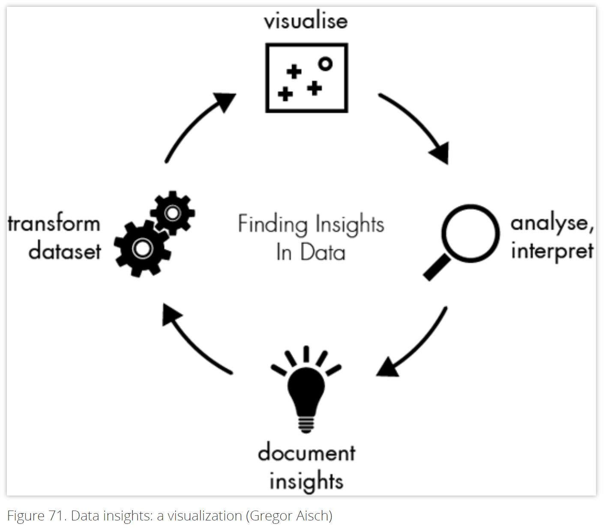
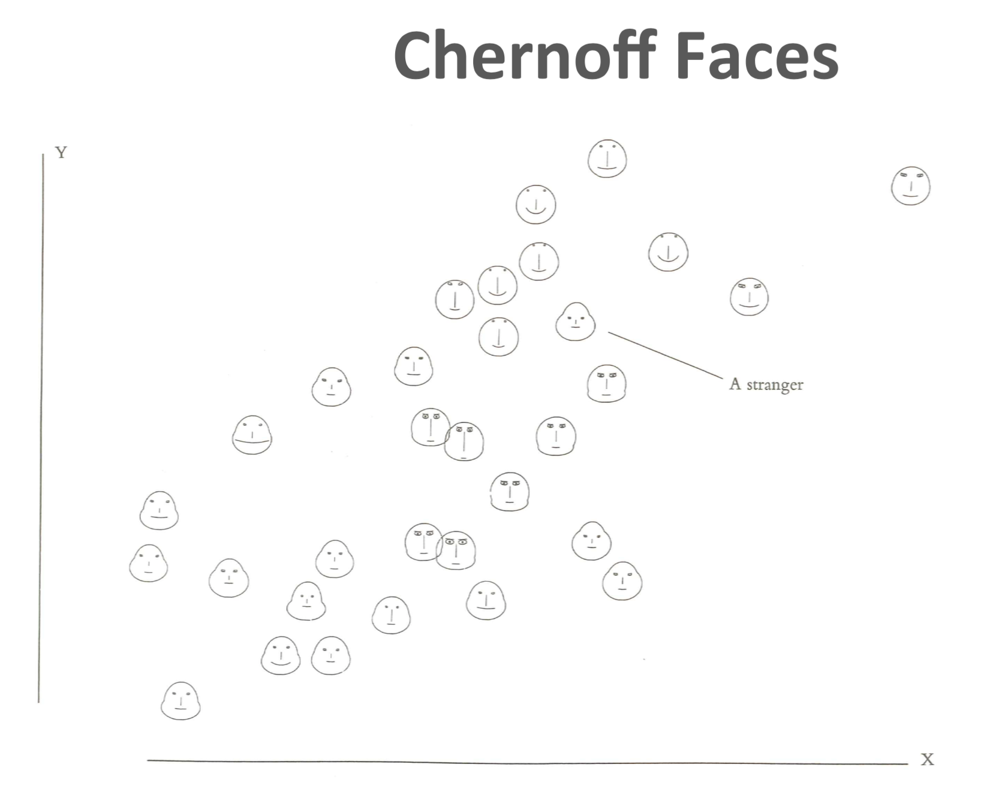
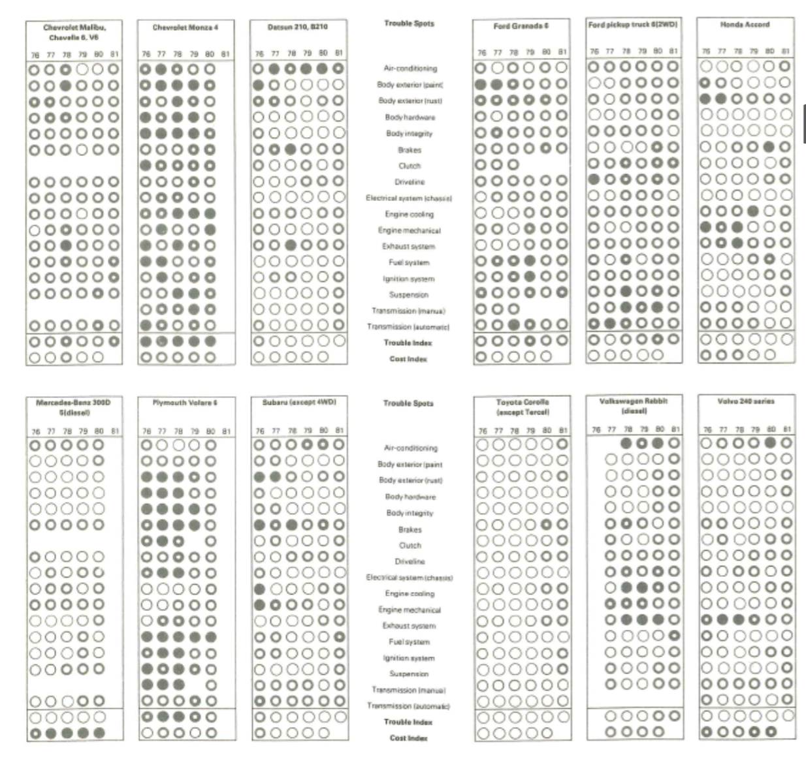
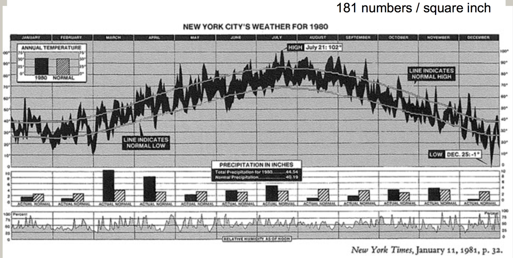
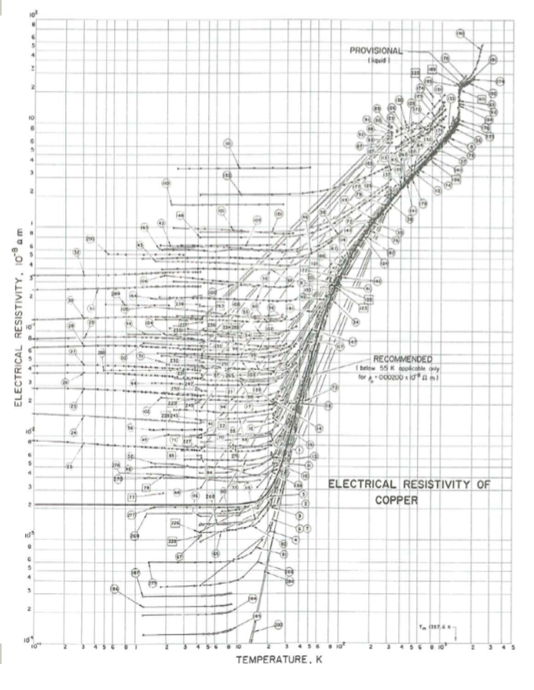
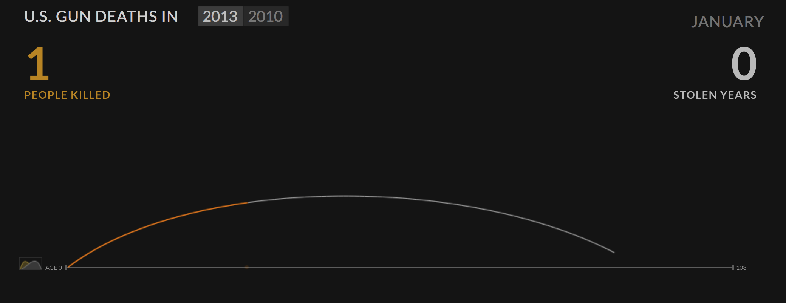
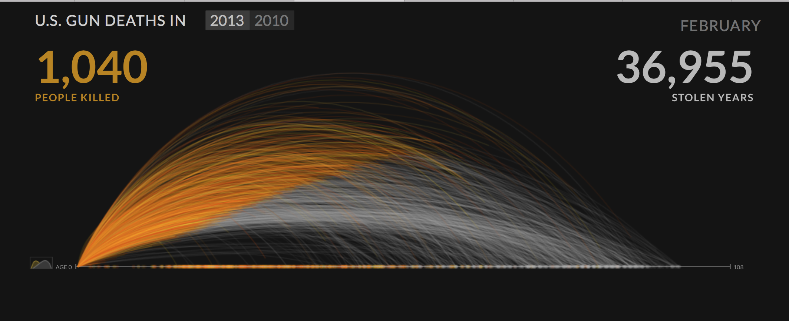
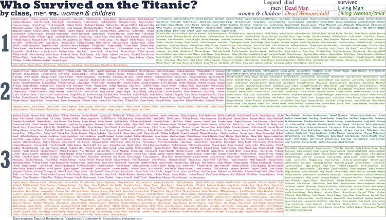

# Fundamentals

## Determine the Story with Insights

Storytelling is an essential part of data visualization. It is extremely important to effectively communicate information through the visualization. Stikeleather's article (2013) discussed the way in which a visual designer tells a story with a visualization.

**Five Ways** | **Explanation**
------------------------------|---------------------------------------------------------------------------------------------------------------------------------------------------------
**Find the compelling narrative** | Along with giving an account of the facts and establishing the connections between them, don’t be boring. You are competing for the viewer’s time and attention, so make sure the narrative has a hook, momentum, or a captivating purpose. Finding the narrative structure will help you decide whether you actually have a story to tell. If you don’t, then perhaps this visualization should support exploratory data analysis (EDA) rather than convey information. 
**Think about the audience** | The visualization needs to be framed around the level of information the audience already has, correct and incorrect: Novice: first exposure to the subject, but doesn’t want oversimplification;Generalist: aware of the topic, but looking for an overview understanding and major themes; Managerial: in-depth, actionable understanding of intricacies and interrelationships with access to detail; Expert: more exploration and discovery and less storytelling with great detail;Executive: only has time to glean the significance and conclusions of weighted probabilities (e.g., novice, generalist, managerial, export, executive)
**Be objective and offer balance** | A visualization should be devoid of bias. Even if it is arguing to influence, it should be based upon what the data says–not what you want it to say. There are simple ways to encourage objectivity: labeling to avoid ambiguity, have graphic dimensions match data dimensions, using standardized units, and keeping design elements from compromising the data. Balance can come from alternative representations (multiple clustering’s; confidence intervals instead of lines; changing timelines; alternative color palettes and assignments; variable scaling) of the data in the same visualization. 
**Don't censor** | Don’t be selective about the data you include or exclude, unless you’re confident you’re giving your audience the best representation of what the data “says”. This selectivity includes using discrete values when the data is continuous; how you deal with missing, outlier and out of range values; arbitrary temporal ranges; capped values, volumes, ranges, and intervals. Viewers will eventually figure that out and lose trust in the visualization (and any others you might produce).
**Edit, Edit, Edit** | Take care to really try to explain the data, not just decorate it. Don’t fall into “it looks cool” trap, when it might not be the best way explain the data. As journalists and writers know, if you are spending more time editing and improving your visualization than creating it, you are probably doing something right.

Data visualization will not always unleash a ready-made story on its own. There are no rules, no protocol that will guarantee us a story. Instead, it makes more sense to look for *insights*, which can be artfully woven into stories in the hands of a good journalist [@data_journ][@design_principles][@DataVizTips][@practitioners_guide].

Here is a process that may be followed for finding insights to tell a story [@VisualizeToInsights]

{width=250px,height=200px}

### Visualize

Loading any data set into a spreadsheet can also be a form of visualization as the data becomes visible in a table. Hence the focus should not be whether we need data visualization or not but should be on which form of data visualization is best for the situation. 

**Focus** | **Description**
------------------------------|---------------------------------------------------------------------------------------------------------------------------------------------------------
**5 Second Rule** | Research shows that the average modern attention span for viewing anything online is less than 5 seconds, so if you can't grab attention within 5 minutes, you've likely lost your viewer. Include clear titles and instructions, and tell people succinctly what the visualization shows and how to interact with it.
**Design and layout matter** | The design and layout should facilitate ease of understanding to convey your message to the viewer. Artists use design principles as the foundation of any visual work. If you want to take your data visualization from an everyday dashboard to a compelling data story, incorporate graphic designer Melissa Anderson's principles of design: balance, emphasis, movement, pattern, repetition, proportion, rhythm, variety, and unity, discussed in more detail in the design principles section [@design_principles].
**Keep it simple** | Keep charts simple and easy to interpret. Instead of overloading viewers' brains with lots of information, keep only necessary elements in the chart and help the audience understand quickly what is going on.
**Pretty doesn't mean effective** | There is a misconception that aesthetically pleasing visualization is more effective. To draw attention, sometimes we want them to be pretty and eye-catching. But if it fails to communicate the data properly, you'll lose your audience's interest as quickly as you gained it.
**Use color purposely and effectively** | Use of color may be prettier and attractive but can be distracting too. Thus, the color should be used only if it assists in conveying your message. 

### Analyze and interpret
Once the data is visualized, the next step is to learn something from the visualization that is created. Questions that can be asked based on the picture can be:

*	What can be seen in this image? Is it what that was expected?
*	Are there any interesting patterns?
*	What does this mean in the context of the data?

Sometimes we might end up with visualization that, in spite of its beauty, might seem to tell that nothing of interest can be found from data. But there is almost always something that we can learn from any visualization, however trivial.

### Document Your Insights and Steps
If you think of this process as a journey through the dataset, the documentation is your travel diary. It will tell you where you have traveled to, what you have seen there and how you made your decisions for your next steps. You can even start your documentation before taking your first look at the data. In most cases when we start to work with a previously unseen dataset, we are already full of expectations and assumptions about the data. Usually, there is a reason why we are interested in that dataset that we are looking at. It's a good idea to start the documentation by writing down these initial thoughts. This helps us to identify our bias and reduces the risk of misinterpretation of the data by just finding what we originally wanted to find. I really think that the documentation is the most important step of the process, and it is also the one we're most likely to tend to skip. As you will see in the example below, the described process involves a lot of plotting and data wrangling. Looking at a set of 15 charts you created might be very confusing, especially after some time has passed. In fact, those charts are only valuable (to you or any other person you want to communicate your findings) if presented in the context in which they have been created. 

Hence, you should take the time to make some notes on things like:

  *	Why have I created this chart?
  *	What have I done to the data to create it?
  *	What does this chart tell me?

#### Transform Data
Naturally, with the insights that you have gathered from the last visualization, you might have an idea of what you want to see next. You might have found some interesting pattern in the dataset which you now want to inspect in more detail. Possible transformations are the following.

**Transformation** | **Description**
------------------------------|---------------------------------------------------------------------------------------------------------------------------------------------------------
Zooming | This allows us to have look at a certain detail in the visualization Aggregation To combine many data points into a single group
Filtering | This helps us to (temporarily) remove data points that are not in our major focus
Outlier handling | This allows us to get rid of single points that are not representative of 99% of the dataset.

Let's consider the following example: You have visualized a graph and what came out of this was nothing but a mess of nodes connected through hundreds of edges (a very common result when visualizing so-called densely connected networks), one common transformation step would be to filter some of the edges. If, for instance, the edges represent money flows from donor countries to recipient countries we could remove all flows below a certain amount [@DataVizBestPrac].

## Design Principles

### Melissa Anderson's Principles of Design

The following principles are from [@design_principles].

**Criteria** | **Description**
------------------------------|---------------------------------------------------------------------------------------------------------------------------------------------------------
Balance | A design is said to be balanced if key visual elements such as color, shape, texture, and negative space are uniformly distributed. Balance doesn't mean that each side of the visualization needs perfect symmetry, but it is important to have the elements of the dashboard/visualization distributed evenly. And it is important to remember the non-data elements, such as a logo, title, caption, etc. that can affect the balance of the display.
Emphasis | Draw viewers' attention towards important data by using key visual elements. Emphasis is the component that is most related to when reading the nine principles of design. It is the key to be conscious of what is drawing the viewers attention to the art. When thinking about the art design of data visualization it is also very important to remain keen on the main point of your story and how the entire visualization is either drawing the viewer to that point of emphasis or how they are being distracted or drawn elsewhere.
Movement | Ideally movement should mimic the way people usually read, starting at the top of the page, moving across it, and then down. Movement can also be created by using complementary colors to pull the user's attention across the page.
Pattern | patterns are ideal for displaying similar sets of information, or for sets of data that equal in value. Disrupting the pattern can also be effective in drawing viewers' attention; it naturally draws curiosity.
Repetition | Relationships between sets of data can be communicated by repeating chart types, shapes, or colors.
Proportion | If a person is portrayed next to a house, the house is going to look bigger. In data visualization, the proportion can indicate the importance of data sets, along with the actual relationship between numbers. Proportion can be subtle but it can go a long way to enhancing a viewer's experience and understanding of the data. The danger of proportion though is that it can be easy to deceive people subconsciously. Naturally, images will have a greater impact on how our brains perceive the dashboard or visualization. For example, someone can change the scale of a graph or images to inflate their results and even if they write the numbers next to it, the shortcut many people will take is to interpret the data based on the image. This is why it is important we take care to accurately reflect proportion in our data visualization and remain critical of how others use proportion in their visualization.
Rhythm | A design has proper rhythm when the design elements create the movement that is pleasing to the eye. If the design is not able to do so, rearranging visual elements may help.
Variety | Variety in color, shape, and chart-type draws and keeps users engaged with data. Including more variety can increase information retention by the viewer. But when there is too much variety, important details can be overlooked. Variety, which could seem counter to balance, but when done correctly, variety can help increase the recall of information. However if overdone, too much variety can feel cluttered and blur together the images and data in the mind of the viewer.
Unity | Unity across design will happen naturally if all other design principles are implemented.

### Gestalt Principles of Design

Data is simply a collection of many individual elements (i.e., observations, typically represented as rows in a data table). In data viz, our goal is usually to group these elements together in a meaningful way to highlight patterns and anomalies. Described this way, it makes sense that the following principles by Gestalt are a good set of guidelines to assemble different elements into groups [@principles-fusioncharts].

**Principle** | **Description**
------------------------------|---------------------------------------------------------------------------------------------------------------------------------------------------------
Proximity | White space can be used to group elements together and separate others
Similarity | Objects that look similar are instinctively grouped together in our minds
Enclosure | Helps distinguish between groups
Symmetry | Objects should not be out of balance, or missing, or wrong. If an object is asymmetrical, the viewer will waste time trying to find the problem instead of concentrating on the instruction.
Closure | We tend to complete shapes and paths even if part of them is missing
Continuity | We tend to continue shapes beyond their ending points (similar to closure)
Connection | Helps group elements together
Figure and ground | We typically notice only one of several main visual aspects of a graph; what we do notice becomes the figure, and everything else becomes the "background". This one is especially interesting because it is not as obvious as some of the others, but is really important in matching a data viz design to its purpose.

### Tufte's Principles of Design
A graph should be impressive and can obtain audience's attention. How can we achieve this? We must consider several aspects: **efficiency, complexity, structure, density and beauty**. We also should consider the audience whether they will be confused about the design.

1. Principle 1: Maximizing the data-ink ratio, within reason

Data-ink is the non-erasable core of a graphic, the non-redundant ink arranged in response to variation in the numbers represented. It is also the proportion of graphic's ink devoted to the non-redundant display of data-information.

$${Data \ Ink \ Ratio} = \frac{{Data \ Ink}}{{Total \ Ink}}$$

This basic idea is illustrated in the following visualizations.

**Erase non-data-ink and redundant data-ink.**
{width=250px,height=200px}
(Source:[@Tufte_2001])

**Erase non-data-ink and redundant data-ink.**
{width=250px,height=200px}
(Source: [@appli_2017])

{width=250px,height=200px}
(Source: [@appli_2017])

**Always revise and edit**
{width=250px,height=200px}
(Source: [@Tufte_2001])

The graphs will be better for more information per unit of space and per unit of ink is displayed. Graphics are almost always going to improve as they go through editing, revision, and testing against different design options. Try to figure out whether the audience looking at the new designs be confused? Nothing is lost to those puzzled by the frame of dashes,and something is gained by those who do understand. We can also assume that if you understand the statistical graphics, most other readers will, too because it is a frequent mistake in thinking about statistical graphics to underestimate the audience. Some of the new designs may appear odd, but this is probably because we have not seen them before.

2. Principle 2: Mobilize every graphical element, perhaps several times over, to show the data.

The danger of multifunctioning elements is that they tend to generate graphical puzzles, with encodings that can only be broken by their inventor.Thus design techniques for enhancing graphical clarity in the face of complexity must be developed along with multifunctioning elements. In other words, we should try to make all present graphical elements data encoding elements. We must make every graphical element effective (See the following example).

(Source: [@Tufte_2001])

3. Principle 3: Maximize data density and the size of the data matrix, within reason.

High preformation graphics should be designed with special care. As volume of data increases, data measures must shrink (smaller dots for scatters,thinner lines for busy time-series).

$${Data \ Density} = \frac{{Entries \ in \ the \ Data \ Matrix}}{{Area \ of \ Chart}}$$

4. Principle 4: Escape flatland - small multiples, parallel sequencing.

Data is multivariate doesn't necessarily mean 3D projection. How can we enhance multivariate data on inherently 2D surfaces? We can use small multiple graghs or parallel sequencing skill.

(Source: [@Tufte_2001])

(Source: [@Tufte_2001])

5. Principle 5: Provide the user with an overview and details on demand.

Carefully designed view can show a macro structure (overview) as well as micro structure (detail) in one space.

(Source: [@Tufte_2001])

6. Principle 6: Utilize Layering & Separation.

Supported by Gestalt laws (The principles of grouping):

* Grouping with colors
* Using Color to separate
* 1 + 1 = 3 (clutter)

(Source: [@Tufte_2001])

7. Principle 7: Utilize narratives of space and time.

Tell a story of position and chronology through visual elements.

(Source: [@narratives_2017])

(Source: [@narratives_2017])

### More ways to improve your visualization design
From online surveys to beefed-up analytics, we're able to gather and analyze more data than ever before. But how do you turn your findings from a dense spreadsheet into something that really makes your point? Good information design is the key.

There's a wealth of free resources out there in the form of handy little design ebooks.

| Title | Author | Description |
|------|--------|-----------------------------------------------------------
|Design's Iron Fist | Jarrod Drysdale | This free ebook is a collection of Drysdale's previous work all wrapped up in one neat little package. Aside from practical tutorials and processes, this book also offers help on how to get into the mindset of being a truly great designer.
|The Creative Aid Handbook | Kooroo Kooroo | Creativity doesn't just happen overnight. It's something that each and every designer has to work at on a day-to-day basis. If you find that your innovative juices are running dry, The Creative Aid Handbook could be the answer. The helpful guide looks at how you can boost your intellect, foster your well-being, and, most importantly, become more creative.
|Designbetter.co | InVision | InVision released three fantastic design books that are available for free. Each book discusses various aspects of design like design process, management, and business. Moreover, some of the materials are available in audio format.
|Type Classification | | Type Classification is a helpful beginner's guide to typography. It should give you the foundations you need to not only start classifying various forms of type but also understanding when and how to use them to alarmingly great effect. It covers a history of each of the type forms and the basic facts you need know about them.[@design_ebooks]

## Adapt your story to a different set of audiences
Jonathon Corum is a graphics designer for The New York Times and he provided a very informative talk to a strictly scientific audience on how to create and design visualizations that explain material originally created for a certain audience, i.e. the scientific community, but now is to be related to a different audience, (in his case, the readership of the Times or maybe the public at large). The talk is filled with examples and break downs of how he has moved from his base content to the final product, all of which are illuminating examples by themselves. There is also great power in the broader themes that he is trying to convey.

Of course is knowing the audience that you are producing the work for, but even in this step, do not lose sight of the ultimate goal of conveying understanding, of explaining a concept. You are searching for a visual idea in your content that can be communicated to your audience. Some of the main highlights to help you make this connection with your audience involved.

**Principle** | **Description**
------------------------------|---------------------------------------------------------------------------------------------------------------------------------------------------------
**Focusing the attention** | What can be removed? Realize that consistency can help eliminate unnecessary distractions. There may be a trade off between losing information but conveying the ultimate meaning more clearly. Label important things rather than relying on a legend, which requires the viewer to hold on to too much information at once.
**Involving your audience:** | Give them opportunities to connect their own general knowledge on the topic. Use real world comparisons or examples to help build and relate context. Encourage comparisons and make this easy for the viewer to process and see.
**Explaining why** | Providing context, adding time sequence details, showing movement, change and mechanism will all guide your audience in connecting the dots and understanding the significance of what you are trying to communicate.

## Data Visualization Tools
### Brief Introduction
Due to the rise of big data analytics, there has been an increased need for data visualization tools to help understand the data. Besides Tableau, there are several other software tools one can use for data visualization like Sisense, Plotly, FusionCharts, Highcharts, Datawrapper, and Qlikview. This article is from Forbes and has a brief, clear introduction about these 7 powerful software options for data visualization. This could be helpful for future reference because for different purposes I may need to use different tools. Each option has its advantages and disadvantages and this article helps highlight them.

**Tool** | **Description**
------------------------------|---------------------------------------------------------------------------------------------------------------------------------------------------------
**Tableau**| The most popular in the group and has many users. It is simple to use, making it easy to learn and can handle large data sets. Tableau can handle big data thanks to integration with database handling applications such as MySQL, Hadoop, and Amazon AWS.
**Qlikview**| The the main competitor to Tableau and is also quite popular. Qlikview is customizable and has a wide range of features which can be a double-edged sword. These features take more time to learn and get acquainted with. However, once one gets past the learning curve, they have a powerful tool at their disposal.
**FusionCharts**| The distinctive aspect of FusionCharts is that graphics do not have to be created from scratch. Users can start with a template and insert their own data from their project.
**Highcharts** | It proudly claims to be used by 72% of the 100 biggest companies in the world. It is a simple tool that does not require specialized training and quickly generates the desired output. Unlike some tools, Highcharts focuses on cross-browser support, allowing for greater access and use.
**Datawrapper**| It is making a name for itself in the media industry. It has a simple user interface making it easy to generate charts and embed into reports.
**Plotly**| It can create more sophisticated visuals thanks to integration with programming languages such as Python and R. The danger is creating something more complicated than necessary. The whole point of data visualization is to quickly and clearly convey information.
**Sisense**|It can bring together multiple sources of data for easier access. It can even work with large data sets. Sisense makes it easy to share finished products across departments, ensuring everyone can get the information they need.
**Altair**| Altair is a statistical visualization library for Python, based on Vega and Vega-Lite. Its sources are widely available on GitHub. With Altair, we can understand the data and its meaning in a better way. Altair’s API is very simple to use. This is simple, elegant and produces beautiful and effective visualizations with a minimal amount of code.

## Data Mining vs. Data Visualization

**Data Mining** involves different processes such as data extraction, data management, data transformations, data pre-processing, etc.
In **Data Visualization**, the primary goal is to convey the information efficiently and clearly without any deviations or complexities in the form of statistical graphs, information graphs, and plots. 
Also, the author listed the top 7 comparisons between data mining and data visualization, and 12 key differences between data mining and data visualization. After reading the article, you will have a very clear understanding of what are data mining and data visualization and the characters for those two techniques.

### Comparison of Different Tools

#### Interactive Data Visualization 
Interactive or Dynamic data visualization delivers today's complex sea of data in a graphically compelling and an easy-to-understand way. It enables direct actions on a plot to change elements and link between multiple plots. It enables users to accomplish traditional data exploration tasks by making charts interactive [@benefits_interactive_viz]. Interactive Data Visualization Software has the following benefits:
 
1. Absorb information in constructive ways: With the volume and velocity of data created everyday, dynamic data viz enables enhanced process optimization, insight discovery and decision making. 
2. Visualize relationships and patterns: Helps in better understanding of correlations among operational data and business performance. 
3. Identify and act on emerging trends faster: Helps decision makers to grasp shifts in behaviors and trends across multiple data sets much more quickly. 
4. Manipulate and interact directly with data: Enables users to engage data more frequently. 
5. Foster a new business language: Ability to tell a story through data that instantly relates the performance of a business and its assets.
 
**There are multiple ways by which interactive data visualizations can be developed.**
 
#### D3.js 
D3.js stands for Data-Driven Document, a JS library for interactive Big Data visualization in literally ANY way required real-time[@d3_interactive_viz]. This is not a tool, mind you, so a user should have a solid understanding of JavaScript to work with the data and present it in a humanly-understandable form. To say more, this library renders the data into SVG and HTML5 formats, so older browsers like IE7 and 8 cannot leverage D3.js capabilities.

The data gathered from disparate sources like huge-scale data sets is bind in real-time with DOM to produce interactive animations ( 2D and 3D alike) in an extremely rapid way. The D3 architecture allows the users to intensively reuse the codes across a variety of add-ons and plug-ins. Some of the key advantages are: It is dynamic, free and open source and very flexible with all web technologies, the ability to handle big data and the functional style allows to reuse the codes.

**The Hitchhiker' Guide to d3.js** is a wonderful guide for self-teaching d3.js. This guide is meant to prepare readers mentally as well as give readers some fruitful directions to pursue. There is a lot to learn besides the d3.js API, both technical knowledge around web standards like HTML, SVG, CSS and JavaScript as well as communication concepts and data visualization principles. Chances are you know something about some of those things, so this guide will attempt to give you good starting points for the things you want to learn more about.

It starts from the insights of learning d3.js by showing interviews with those top visualization practitioners. Then the author gives key concepts and useful features for learning visualization like d3-shape, d3 selection, d3-collection, ds-hierarchy, ds-zoom as well as d3-force.

My favorite part of this guide is it lists a lot of useful resources links for learning d3.js. For example, it recommends d3 API Reference, 2000+ d3 case studies and tutorials for d3. I did my exploratory analysis version of group project on d3. And I found this guide helpful during the progress. It also includes some meetup groups here in the bay area. So, maybe we can meet data friends through the group.

#### Tableau
Tableau is amid the market leaders for the Big Data visualization, especially efficient for delivering interactive data visualization for the results derived from Big Data operations, deep learning algorithms and multiple types of AI-driven apps [@tableau_interactive_viz]. Tableau can be integrated with Amazon AWS, MySQL, Hadoop, Teradata and SAP, making this solution a versatile tool for creating detailed graphs and intuitive data representation. This way the C-suite and middle-chain managers are able to make grounded decisions based on informative and easily-readable Tableau graphs. Tableau is business intelligence (BI) and analytics platform created for the purposes of helping people see, understand, and make decisions with data. It is the industry leader in interactive data visualization tools, offering a broad range of maps, charts, graphs, and more graphical data presentations. It is a painless option when cost is not a concern and you do not need advanced and complex analysis.The application is very handy for quickly visualizing trends in data, connecting to a variety of data sources, and mapping cities/regions and their associated data.

The following tips for Tableau are still missing:
1. Running totals
2. Common Baseline
3. Weighted averages
4. Moving average
5. Grouping by aggregates 
6. Different years comparison
7. Appending excel sheets
8. Bar chart totals
9. Fixed axis when re-drawing charts
10. Auto-fitting screen behavior depending on data selection
 
**The key advantages** are: It provides non technical user the ability to build complex reports and dashboard with zero coding skills. Using drag-n-drop functionalities of Tableau, user can create a very interactive visual within minutes. It can handle millions of rows of data with ease and users can make live to connections to different data sources like SQL etc [@VizBP][@ExtremePre].

#### R Shiny
R Shiny enables us to produce interactive data visualizations with a minimum knowledge of HTML, CSS, or Java using a simple web application framework that runs under the R statistical platform [@shiny_interactive_viz]. Standalone apps can be hosted on a webpage or embedded in R Markdown documents and dashboards can be built using R shiny. It combines the computational power of R with the interactivity of the modern web. The main advantages of using R Shiny are : Its flexibility of pulling in whatever package in R that you want to solve your problem, reaping the benefits of an open source ecosystem for R and JavaScript visualization libraries, thereby allowing to create highly custom applications and enabling timely, high quality interactive data experience without (or with much less) web development and without the limitations or cost of proprietary BI tools.

#### Google chart
A free and powerful integration of all Google power. The tool is rendering the resulting charts to HTML5/SVG, so they are compatible with any browser. Support for VML ensures compatibility with older IE versions, and the charts can be ported to the latest releases of Android and iOS. What's even more important, Google chart combines the data from multiple Google services like Google Maps. This results in producing interactive charts that absorb data real-time and can be controlled using an interactive dashboard [@Top4VizTools].

## Typography and Data Visualization

This article discusses less common applications of typography in data visualization. While data components such as quantitative or categorical data are commonly represented by visual features like colors, sizes or shapes, utilization of boldface, font variation, and other typographic elements in data visualization are less prevalent.

Highlighted in the article are preattentive visual attributes. Preattentive attributes are those that perceptual psychologists have determined to be easily recognized by the human brain irrespective of how many items are displayed. Therefore, "preattentive visual attributes are desirable in data visualization as they can demand attention only when a target is present, can be difficult to ignore, and are virtually unaffected by load." Examples of preattentive attributes are size/area, hue, and curvature.

This brings us to the disparate situation of the popularity of visual aspects like color and size and typographic aspects such as font variation, capitalization and bold. The authors present several possible reasons for this, beginning with the preattentiveness of visual attributes like size and hue.However, some typographic attributes such as line width or size, intensity, or font weight (a combination of the two) are considered preattentive as well.

Furthermore, these visual attributes are inherently more viscerally powerful, and they are easy to code in a variety of programming languages. Technology has also perhaps previously limited the use of typographic attributes, for only recently have fine details such as serifs, italics, etc. been made readily visible to the audiences of data visualizations by technological advances.

Lastly, the authors remark that it is possible the lack of variety of typographic elements used in data visualizations is due to the limited knowledge of computer scientists and other individuals pursuing data visualization in how to apply these elements effectively. While the first few proposed explanations make sense from personal experience with technology and exposure to data visualizations and design in general, the hypothesis that lack of knowledge of typographic elements in data visualization seems more plausible if it was being applied to a small group of people rather than all of the data visualization design community. I would say that it is more likely that the use of typographic elements in data visualization is less popular because there are fewer instances in which it can be used appropriately, or a status quo bias if current visual attributes are received well, the prevailing attitude may be not to fix what is not broken. However, the authors also point out that despite the dearth of typographic attributes in data visualization, other spheres like typography, cartography, mathematics, chemistry, and programming have a rich history with type and font attributes that informs the scope of the parameter space?

The authors continue by pointing out some tips for using typographic attributes to encode different data types, since certain attributes may be suited to particular purposes. For example, font weight (size and intensity) is ideal for representing quantitative or ordered data, and font type (shape) is better suited to denote categories in the data.

Furthermore, as in typography and cartography, use of typographic attributes in data visualization raises concerns of legibility, the ability to understand both individual characters and commonalities that identify a font family, and readability, the ability to read lines and blocks of words. Often, interactivity of a visualization will not only improve functionality, but also provide a solution to readability issues by providing a means to zoom in on small text. 

There are a few examples of unusual/innovative use of typography for data visualization in the article, not all of which I agree are made more effective by the interesting utilization of typographic attributes, but the "Who Survived the Titanic" visualization's use of typographic attributes allowed it to not only answer macro-questions very quickly, such as if women and children were actually first to be evacuated across classes, but also to provide answers to micro-questions, like whether or not the Astors survived. It used common visual elements like color and area to indicate whether or not a person survived and number/proportion of people, as well as typographic aspects like italic and simple text replacement to indicate gender and the passengers names. 

The authors round out the article by addressing the most common criticisms of typography in data visualization, the foremost one being whether or not text should even be considered an element of data visualization, since visualization connotes preattentive visual encoding of information, and text or sequential information necessitates more investment of attention to understand. Another criticism is that textual representations are not as visually appealing even when used effectively. However, the authors counter that "this criticism indicates both the strength and weakness of type? that while text may not be suited for adding style or drama to a visualization, it can be particularly powerful in situations where a finer level of detail is needed, without sacrificing representation of higher level patterns. Lastly, a label length problem is common when using text in visualizations; differing lengths of names or labels may skew perception so that longer labels seem more important than shorter labels. This problem was encountered in the Titanic visualization with the varying lengths representations of passengers' names, and was corrected by only including a given name and a surname, the length of which could only vary so much.

## Data visualization in Business

### Data Visualizations in Industry
Companies tend to rely on dashboards (a compilation of several related data visualizations) to give them high-level insights on company-wide, market-level, or employee-level performance. The following are some common applications of dashboards in business.

**Application** | **Description**
------------------------------|---------------------------------------------------------------------------------------------------------------------------------------------------------
Sales & Marketing | This is one of the most popular uses for dashboards. Companies like to regularly track their revenue, conversions, lead sources, etc. and rely on data visualization to synthesize these large and constantly updated data into visual summaries.
Customer Success | These dashboards can be created by the team, but are also often built into customer service platforms such as Zendesk.  They include various KPIs of the customer success team, such as the ratio of tickets open to tickets closed and time to resolution.
Product Management | These dashboards tend to synthesize sales, marketing, and customer research data together and are typically used for executive reporting. The visuals display metrics such as dollars and hours devoted to various projects and most requested features by customers.

Data visualization is also used across many different industries. One popular area right now is healthcare, especially involving big data. The benefits and uses of interactive data viz are detailed in a paper from the University of Maryland (2013). [@data_viz_healthcare]

**The paper highlights three types of data that can and should be visualized to help in decision-making: personal, clinical, and public health information.** Examples include: exploration of prescription patterns of different drugs and tracking personal health and fitness statistics. (Even the nice, clean Fitbit app home screen is a comprehensive dashboard!) Importantly, making sense of all this data collected from individuals will help healthcare organizations and companies provide more personalized and effective health treatment.

### How visualization impacts Industry/business
[@biz_strategy] According to an Experian report, 95% of U.S. organizations say that they use data to power business opportunities, and another 84 percent believe data is an integral part of forming a business strategy. Visualization helps data impact business in following ways:

#### Cleaning
The simplest way to explain the importance of visualization is to look at visualization as the means to making sense of data. Even the most basic, widely-used data visualization tools that combine simple pie charts and bar graphs help people comprehend large amounts of information fast and easily, compared to paper reports and spreadsheets.
In other words, visualization is the initial filter for the quality of data streams. Combining data from various sources, visualization tools perform preliminary standardization, shape data in a unified way and create easy-to-verify visual objects. As a result, these tools become indispensable for data cleansing and vetting and help companies prepare quality assets to derive valuable insights.

Cleaning the data is usually the first step in data processing and is done to remove the unwanted elements as well as to reduce the size of the data sets, which will make it easier for the algorithms to analyze it. Data cleansing is typically done by using instance reduction techniques.

Instance reduction helps reduce the size of the data set without compromising the quality of insights that can be extracted from the data. It removes instances and generates new ones to make the data set compact. There are two major instance reduction algorithms:

Instance selection: Instance selection is used to identify the best examples from a very large data set with many instances in order to curate them as the input for the analytics system. It aims to select a subset of the data that can act as a replacement for the original data set while completely fulfilling the goal. It will also remove redundant instances and noise.

Instance generation: Instance generation methods involve replacing the original data with artificially generated data in order to fill regions in the domain of an issue with no representative examples in the master data. A common approach is to relabel examples that appear to belong to wrong class labels. Instance generation thus makes the data clean and ready for the analysis algorithm.

**Tools you can use: Drake, DataWrangler, OpenRefine** 

#### Extracting
Known versatile tools for data visualization and analytics Elastic Stack, Tableau, Highcharts, and more complex database solutions like Hadoop, Amazon AWS and Teradata, have wide applications in business, from monitoring performance to improving customer experience on mobile tools. New generation of data visualization based on AR and VR technology, however, provides formerly unfeasible advantages in terms of identifying patterns and drawing insights from various data streams.

Building 3D data visualization spaces, companies can create an intuitive environment that helps data scientists grasp and analyze more data streams at the same time, observe data points from multiple dimensions, identify previously unavailable dependencies and manipulate data by naturally moving objects, zooming, and focusing on more granulated areas. Moreover, these tools allow us to expand the capabilities of data visualization by creating collaborative 3D environments for teams. As a result, new technology helps extract more valuable insights from the same volume of data.

Data has shown phenomenal growth over the past decade and it's widespread application by businesses as a growth catalyst continues to deliver positive results. The scale of data is massive and the volume, velocity and variety of data calls for more efficient processing to make it machine-ready. Although there are a multitude of ways to extract data such as public APIs, custom web scraping services, internal data sources, etc., there would always remain the need to do some pre-processing to make the data perfectly suitable for business applications. Data pre-processing techniques like:

* Data cleansing 
* Data Manipulation
* Data normalization
* Data Transformation
* Missing values imputation
* Noise identification
* Minimizing the pre-processing tasks
 
**play a key role in the process.**

#### Strategizing
As the amount of data grows, it becomes harder to catch up with it. Therefore, data strategy becomes the necessary part of the success in applying data to businesses. Then how data visualization become an important tool in your strategic kit? First, it helps you cleanse your data. Secondly, it allows you to identify and extract meaningful information from it. Finally, data visualization tools enable continuous real-time monitoring of how your strategy and now data-driven decisions influence performance and business outcomes. In other words, these tools visualize not only the data, but also the results, and help correct and optimize strategy on the go.

Data visualization is one of the initial and most important steps made to derive value from data. It determines how efficiently analysts can work with data assets, what insights they are able to extract and how their data strategy will develop over time.

Therefore, the quality and capabilities of data visualization directly influence how data impacts your business strategy and what benefits data applications can bring to the companies and their industries.

### Corporate Scorecards and Data Visualization
Corporate transparency, flat organizations, open book policies, etc. are terms executives and entrepreneurs learn about all the time [@SCORECARDS]. As the corporate world shifts towards a more open culture, the demand for open data and insights have increased dramatically. This shift has helped the overall corporate strategic planning and management process easing the alignment of business activities towards a series of goals. Being transparent top down aligns the culture to sail towards the same North Star.

The growth of corporate transparency is not only important internally, but externally as well. Corporate certifications like B Corporations certifications (B Corp), require companies to provide a transparent view on their social conscious efforts to the general public. Achieving the certification is one step of the process; the true goal is to show the world how and why the certification is truly deserved.

Here's the process on how to get it done.

**Step** | **Name** | **Description**
-------- |----------------------|---------------------------------------------------------------------------------------------------------------------------------------------------------
1 | Perform Data Discovery and Determine The Story | Before this step it is easy to underestimate the effort level it takes to pull the best insights from the data. Data manipulation products like Tableau, Domo, Pentaho, IBM's Many Eyes, and R, among others, make insight extraction that much easier to gain understanding of data using a visual medium. The key is to start with a simple portion of your data and to start pulling basic insights to visualize and correlate with each other. This process leads towards a compound series of questions, which helps provide an overall vision to the end product. We see the effect during our discovery process, which leads to unforeseen avenues for data intelligence.
2 | Data Infrastructure Setup | Data infrastructures can be simple or complex depending what the end goal is. Many clients prefer to go the route of complete data integration in order to centralize their data repositories. Technologies such as Hadoop have helped by unifying disparate data sources, but other options such as data cloud environments can help produce API's for future product deployments. Why is this important? Accessibility of data is an important foundation not only within the context of dashboards, but also the possibility of branching out to other products.
3 | Product Design & Development | Wireframing, prototyping, and application development are the main engines to transform an idea into a final product. Products can range from static presentations/reports to full interactive applications. Mobile, tablet, TV, and workstation platforms can all be mediums to help deliver the final product. The secret to a great end product is how well the data story is conceptualized. If the story is weak then the end product will also suffer. 
4 | QA & Product Release | The best part of any project is to get it finalized and released for all to see. All data gets verified for accuracy, functionality testing (if applicable), application flow (if applicable), design testing, and remaining items are all completed. The end result is an engaging visual product for all intended audiences to see and use.

## Contemporary Research Results & What's Next
With the development, studies and new tools applied in data visualization, more people understand it matters. But given its youth and interdisciplinary nature, research methods and training in the field of data visualization are still developing. So, we asked ourselves: what steps might help accelerate the development of the field? Based on a group brainstorm and discussion, this article shares some of the proposals of ongoing discussion and experiment with new approaches [@next_steps]:
 
* **Adapting the Publication and Review Process:** As the article states, "both 'good' and 'bad' reviews could serve as valuable guides," so providing reviewer guidelines could be helpful for fledgling practitioners in the field.
* **Promoting Discussion and Accretion:** Discussion of research papers actively occurs at conferences, on social media, and within research groups. Much of this discussion is either ephemeral or non-public. So ongoing discussion might explicitly transition to the online forum.
* **Research Methods Training:** Developing a core curriculum for data visualization research might help both cases, guiding students and instructors alike. For example, recognizing that empirical methods were critical to multiple areas of computer science, Stanford CS faculty organized a new course on designing Computer Science Experiments [@stanford_course]. Also, online resources could be reinforced with a catalog of learning resources, ranging from tutorials and self-guided study to online courses. Useful examples include Jake Wobbrock's Practical Statistics for HCI and Pierre Dragicevic's resources for reforming statistical practice.
