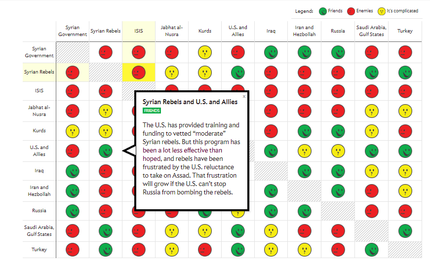
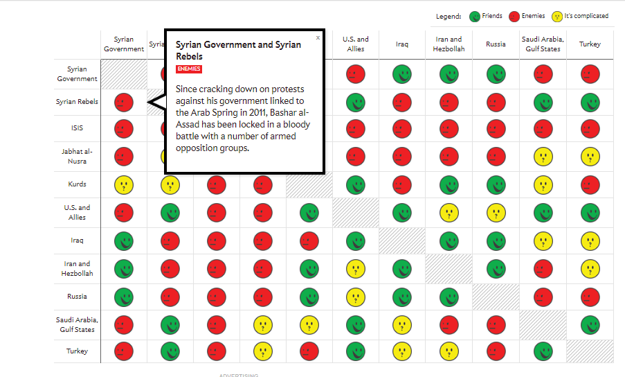
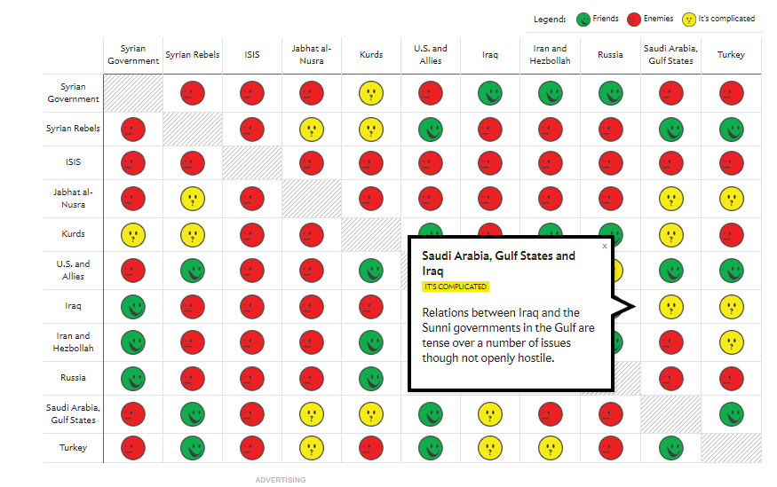
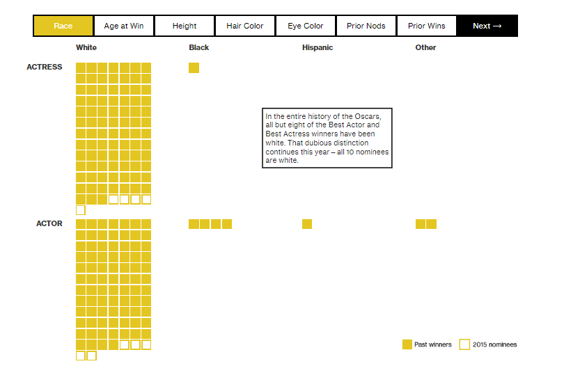
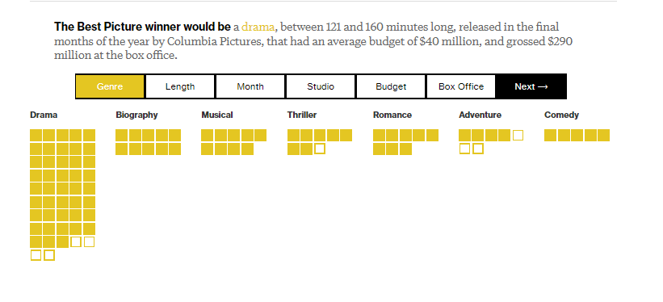

# Case Studies

+ Description and replication of great examples of data visualization

## Description and replication of great examples of data visualization

reference:http://blog.visme.co/best-information-graphics-2016/#e030mFiF7wCpk7Ld.99

1. Connecting the Dots Behind the Election

https://www.nytimes.com/interactive/2015/05/17/us/elections/2016-presidential-campaigns-staff-connections-clinton-bush-cruz-paul-rubio-walker.html?_r=1

This article by the New York Times lists several different candidates and creates compelling visuals that link their campaigns to previous ones.

Each visual contains several different-sized dots that represent a specific campaign, administration, or other governmental organization related to the candidate’s current campaign, which are then connected by arrows.

Hovering over a specific dot highlights the connections between the groups. The visual is a great way to put what would otherwise be a long slog through years of information into an easily accessible, easily viewable format so that voters can figure out where the candidates’ experiences lie.

2. Spies in the Skies

https://www.buzzfeed.com/peteraldhous/spies-in-the-skies?utm_term=.so1GQ6ZGDo#.ec8kL3WkZe

The map is filled with red and blue lines (representing FBI and DHS aircraft, respectively) which illustrate the flight paths of the planes. When planes circle an area more than once, the circles become darker. The circles change in accordance to day and time, and individual cities can be typed into a search bar to see the flight patterns over them.

The visualization, rather creatively, almost looks like a hand-drawn map. While presenting a normally uncomfortable topic, this allows individuals to check things for themselves, hopefully providing some peace of mind.

3. Green Honey

http://muyueh.com/greenhoney/?es_p=1228877

The visualization spans a webpage. As you scroll down, the text changes, as do many colored dots that move over the white background. The dots are used to represent not only each colors’ hue, but the numbers that fall into each category—for example, what colors are the most popular “base” colors for English and Chinese.

The continuous flow of this visualization helps really bring it together, allowing users to scroll through the information at their own pace, but also creating a seamless, creative work.

4. How People Like You Spend Their Time

http://flowingdata.com/2016/12/06/how-people-like-you-spend-their-time/

The visual lists several categories along one side of a graph—such as “personal care” and “work”—with a line illustrating the amount of time the average person in a certain demographic spends on each subject. Entering different statistics at the top—such as changing gender or age—causes the lines to shift to feature that demographic.

The simplicity of this visualization really helps the information get across and avoids bogging down the statistics. Sometimes, less is more.

5. Is it Better to Rent or Buy?

https://www.nytimes.com/interactive/2014/upshot/buy-rent-calculator.html?_r=0

The calculator includes several sloping charts. Each chart includes a factor that’ll affect how much you’ll have to pay, such as the individual cost of your home and your mortgage rates. A movable scale along the bottom of each chart allows you to enter different data, changing the “cost of rent per month” on the side. If you can find a similar house to rent for that much per month or less, it’s more cost effective to just rent the home.

This visualization is incredibly thorough and a useful tool for homeowners of any age and status.

6. What's really warming the world?

https://www.bloomberg.com/graphics/2015-whats-warming-the-world/

In this case study, it first claimed the background story and the analytical questions clearly.
Then it analyzed each different factors separately using both verbal explanations and dynamic graphics to compare with the observed temperature movements, and then grouped related factors into Natural factors category or Human factors category.
After that, it combined all the dynamic graphics into one and made the results more straightforward in terms of comparisons.
In the end, the authors also provided more detailed methodology explanations with dataset sources to support the results shown above.

Overall, this case study is straightforward, easy to understand but also with enough information shown on each graphics.

7. The Strengths of Animated Data Visualization

http://flowingdata.com/2015/12/15/a-day-in-the-life-of-americans/?platform=hootsuite

The page linked above includes a great example of animated data visualization showing the time people spend on daily activities throughout the day. The plot is simple and easy to interpret, but it also includes a good number of variables including time, activity type, number of people doing each activity, and the order in which activities are done.

One of the plot's biggest strengths is that by using one dot to represent each person in the study and using animation, we can actually drill down to each individual and follow them throughout the day.  The accumulation of dots for each particular activity also gives us an aggregate-level view of the same data, so we get both an individual and aggregate insights.

A drawback of the plot is that it is hard for our eyes to keep track of 1000 simultaneously moving dots.  The author of the post addresses this by creating subsequent plots with stationary lines at key times of the day.  This represents people's movements from one activity to another without overwhelming the reader.

Overall, this is an engaging, informative, and fun animated plot that has relevance and tells a story.

8. Case studies: An Aging Population
Aging population is always a hot topic in social economics and politics. I collect several different data visualizations that show aging population in the world. They are good examples to learn and apply to census data. 

8.1 An Aging Nation: Projected Number of Children and Older Adults

[linked phrase](https://www.census.gov/library/visualizations/2018/comm/historic-first.html)

This one includes bar chart and line graph to demonstrate the aging population compared with population of children. The good things about this visualization: simple to see and compare, color to differentiate the category, highlight the intersection point.

8.2 From Pyramid to Pillar: A Century of Change, Population of the U.S.

[linked phrase](https://www.census.gov/library/visualizations/2018/comm/century-of-change.html)

This is a **population pyramid**. “A **population pyramid** is a pair of back-to to histograms for each sex that displays the distribution of a population in all age groups and in gender”.

It is a good candidate to compare changes in population distributions (sex, age, year). Also the shape of pyramid is used to interpret a population. To illustrate, A pyramid with a very wide base and a narrow top section suggests a population with both high fertility and death rates. It is a useful tool in the census data.

8.3 Animated pyramid  

[linked phrase](https://fathom.info/aging/)

This is an animated and multiple population pyramids. It used to compare different patterns across countries. One additional benefit for the interactive population pyramid is that it shows the shape changes year by year, which is useful for countinous time-series comparison.

Similar projected with R code is provided for references:
[linked phrase](https://www.r-bloggers.com/who-is-old-visualizing-the-concept-of-prospective-ageing-with-animated-population-pyramids/)

## Deceptive data graphs examples

references: **Misleading Graphs: Real Life Examples http://www.statisticshowto.com/misleading-graphs/**

Misleading graphs are sometimes deliberately misleading and sometimes it’s just a case of people not understanding the data behind the graph they create. But some real life misleading graphs go above and beyond the classic types. Some are intended to mislead, others are intended to shock. The “classic” types of misleading graphs include cases where:

+ **The Missing Baseline.**

For example, the Vertical scale is too big or too small, or skips numbers, or doesn’t start at zero, like the graph below:

<!--  -->

You might be thinking that the graph on the right shows The Times makes double the sales of The Daily Telegraph. But take a closer look at the scale and you’ll see although The Times does make more sales, it’s only beating the competition by about 10%.

+ **The graph isn’t labeled properly.**

Graghs can have the correct figures, but still can mislead you. 

<!--  -->

This one used a BIG HEADLINE makes you think that 5.3% of children get spinal cord injuries which is a pretty scary statistic for parents. But the real figure is about .0000003% (based on 2000 injuries per year out of a population of around 74,000,000).

And for the figure 1 used in this article: Misleading Graphs: Displaying a Change in One Variable Using Area or Volume https://www.forbes.com/sites/naomirobbins/2012/02/28/misleading-graphs-displaying-a-change-in-one-variable-using-area-or-volume/#696674551781, the label for the smaller triangle in this graph says $26.4 while the label for the larger triangle says $114.6.  $114.6 is 4.34 times $26.4. It certainly looks to me as if more than 4.34 smaller triangles will fit in the larger triangle. It is the altitudes of the triangles that are proportional to the numbers in the labels. 

+ **Data is left out.**

Only include part of the data like the following graph which using temperatures of the first half of the year to prove it was rising dramatically.

<!-- -->

For more examples of misleading graphs or deceptive graphs you can read the following articles for more inspirations:

+ bar charts without zero & evenly spaced tick marks for uneven intervals: https://www.forbes.com/sites/naomirobbins/2011/11/17/whats-wrong-with-this-graph/#502ab1a42a33
+ graphs not drawn to scale: https://www.forbes.com/sites/naomirobbins/2012/02/16/misleading-graphs-figures-not-drawn-to-scale/#351dcf9c15ef

> Some Interesting Visualizations:
https://blog.hubspot.com/marketing/great-data-visualization-examples
http://blog.visme.co/data-visualizations-current-events/
Visualization is like art. It speaks where words fail. There are phenomenas like the Syrian war, the number flights during Thanksgiving in the USA, the understanding of depths for developing perspective about the range of the issue, the controversy of ‘#OscarsSoWhite’, etc. on which we can write bundles of paragraphs, but they might still have scope for ambiguity. 
The links show some intricate visualizations of the topics like those mentioned above, and speak volumes without requiring paragraphs to explain what is going on within these visualizations. 
According to me, it is really interesting to see that almost anything in this world can be explained by visualizations. Visualizations are not just limited to businesses and their analytics. Wars, rescue operations, etc. can also be visualized to get a clear idea of all the details of the issues. 
1.	Picking up from one of the charts shown in the above mentioned links, the visualization of ‘A guide to Who is Fighting Whom in Syria’ is one of the most interesting charts in the list. The visualization and its report can be seen at http://www.slate.com/blogs/the_slatest/2015/10/06/syrian_conflict_relationships_explained.html

This visualization makes an extremely complicated topic like the Syrian War easily understandable. It consists of 3 different emojis in three different colours, with each (colour+facial expression) combination showing the relationship between the various groups involved in the Syrian War. When you click on each of the emoji, a small dialogue box pops up which explains the relationship between the various countries and rebel groups involved in the war. This is not only easy to understand, but it is also pleasing to the eyes.

2.	The second visualization ‘Adding up the White Oscars Winners’ can be seen here (https://www.bloomberg.com/graphics/2016-oscar-winners/) in an article by Bloomberg. The writes of this article developed the attributes of the future winners of Oscars by taking up the attributes of the past winners. It is extremely interesting to see how the article shows the features of the Best Actress, Actor, movies, etc. in a simple and captivating visual.
The visualization is interactive and we can click on each attribute like ‘Hair Color’, ‘Eye Color’, etc. to see what are the features of the actors and actresses who are more likely to win the Oscars.

Similarly, the visualization gives information about the different aspects of movies that are more likely to win, like ‘Length’ ,’Month’ ,’Budget’, etc.

8. Young voters, class and turnout: how Britain voted in 2017

Reference: https://www.theguardian.com/politics/datablog/ng-interactive/2017/jun/20/young-voters-class-and-turnout-how-britain-voted-in-2017

The article's goal is to convey the change in party votes in the 2017 UK general election compared to votes in 2015. The change in party votes was shown with regards to three demographic factors: age, class, and ethnicity. For each factor, there are four graphs (one per political party), each illustrated in their party's standard color. The change in percent of votes is shown as an arrow where the arrow's shaft is the length of the difference from 2015 to 2017 while the x-axis is the demographic factor split into different bins.
What makes this a good visualization is that it is very easy to read and interpret. The color-coding of the arrows and party name makes it easy to pick out the different parties and the arrow lengths highlight just how large of a change happened. For example, in the Age section, it is easy to see the pattern between the Labour party gaining many voters ages 18 to 44 and the Conservative party gaining voters ages 45 and up.

