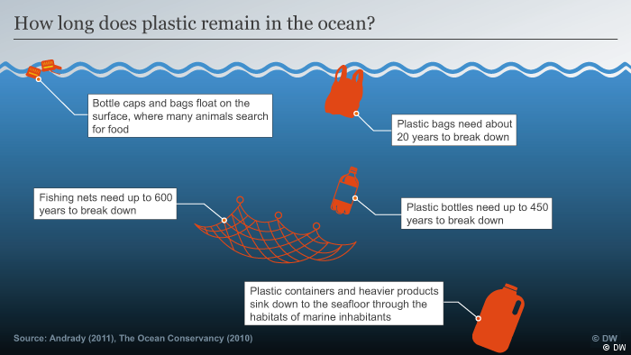

# Case Studies

Visualization is like art; it speaks where words fail. There are phenomena like the Syrian war, the number flights during Thanksgiving in the USA, the understanding of depths for developing a perspective about the range of the issue, the controversy of ‘#OscarsSoWhite’, etc. on which we can write endless paragraphs might still fail to convince the readers. The links below show some intricate visualizations of some of these important and relevant topics - visualizations that speak volumes and are much more persuasive than an essay, with a tiny fraction of text. The usefulness of data visualizations is not just limited to business and analytics; almost anything in the world can be explained by visualizations. Wars, rescue operations, social issues etc. can be visualized to get a clear idea of all the details of the issues.

This chapter contains some useful case studies on such visualizations. Case studies contain valuable information about development records. The examination and evaluation of case studies helps show that new designs are just as usable as existing techniques, demonstrating that the field is suitable for future development. Many of the case studies below come from the following articles:

**Source** | **Description**
-----------|---------------------------------------------------------------
[@10_BEST] | This source picks the top 10 best data visualizations of 2015. For each pick, the author displays the project plot and also describes his reasoning for choosing that chart as an exemplary visualization. This article is useful for getting a basic understanding of what characteristics a good visualization should include.
[@cool_data] | The author has chosen fifteen of the best infographics and data visualizations from 2016 and explained the reasoning behind these choices.
[@int_viz_capt] | 16 Captivating Data Visualization Examples
[@15_mindblowing] | 15 Data Visualizations That Will Blow Your Mind: These 15 data visualizations show the vast range that data analysis is applicable to, from pop culture to public good. Take a look at them to get inspiration/understanding for your own work. 
[@int_viz_capt][@int_viz_current] | 15 Data Visualizations That Explain Trump, the White Oscars and Other Crazy Current Events
[@vizwiz] | Vizwiz is a blog about Tableau-based data visualization. It has case studies about how to improve your visualizations, written by Andy Kriebel, a famous Tableau Zen Master. I would like to recommend this blog because it is not only practical but also full of insights. My favorite part of this blog is the "Makeover Monday," which develops a new visualization based on an original one. This blog also includes great tips for and examples of Tableau.

## Geographic Visualizations
Often, people use maps to visualize data that should not be mapped. Here are some examples of when a map visualization is a good choice.

### Spies in the Skies
The map below is from a Buzzfeed article [@spies_sky]. It is filled with red and blue lines (representing FBI and DHS aircraft, respectively) which illustrate the flight paths of the planes. When planes circle an area more than once, the circles become darker. The circles change in accordance to day and time, and individual cities can be typed into a search bar to see the flight patterns over them. The visualization rather creatively looks almost like a hand-drawn map. While presenting a normally uncomfortable topic, this allows individuals to check things for themselves, hopefully providing some peace of mind. 

Reference: [@cool_data]

### Two Centuries of U.S. Immigration
The interactive map from [@immigration] shows the rate of immigration into the U.S. from other countries over the last 200 years in 10-year segments. Colored dots represent 10,000 people coming from the specified country. Countries then light up when they have one of the highest rates of migration. A tracker on the left indicates what countries sent the most people to the U.S. at what times.

What makes this a good visualization is that it is engaging and easy to read and interpret. The movement of the dots draws the reader's attention while the brightly lit countries make it easy to pick out the highest total migrations.The bright colors and dark background help the information stand out. This map is a bit simpler, but perhaps that’s all it needs.

Reference: [@cool_data].

### Uber: Crafting Data-Driven Maps
Map visualization is very important for companies like Uber that need to track metrics using geo-space points. In this article, the designer from Uber talks about the challenges of designing such visualizations and the possible solutions [@uber_maps]. 

The challenges that Uber faced to craft geospatial visualizations:

1. There are great individual maps but as a whole lack consistency across company.
2. Common graphing tools like Sketch does not support GIS file, which is essential to Uber's insights.
3. The scale of the framework includes more than 400 cities in the world with a variety of different geographic features and data types.

To tackle these problems, Uber started by defining base map themes by optimizing detail, color and typography. Based on that, data layers are added using scatter plots and hex bins, with careful color selection to help their team make decisions. To make it even better, Uber took a further step by adding trip lines (see images below), which became a signature visualization of Uber. Choropleths are also used to help visualize how metrics and values differ across geographic areas. Uber uses US postal codes as geographic boundaries and infuses various datasets to create the color variation.

The visualization in this article is a classic problem of visualizing geographic data. The detailed explanation in the problems and how they are solved can be beneficial for people or startups trying to conceptualize and make appropriate visualizations that support the decision-making process.  

## Demographic Comparisons
One common use of visualization is to compare different groups against each other, such as political parties or generations.

### Young voters, class and turnout: How Britain voted in 2017
This article's goal is to convey the change in party votes in the 2017 UK general election compared to votes in 2015 [@UKvotes2017]. The change in party votes was shown with regards to three demographic factors: age, class, and ethnicity. For each factor, there are four graphs (one per political party), each illustrated in the party's standard color. The change in the percent of votes is shown as an arrow where the arrow's shaft is the length of the difference from 2015 to 2017 while the x-axis is the demographic factor split into different bins.

What makes this a good visualization is that it is very easy to read and interpret. The color-coding of the arrows and party names makes it easy to pick out the different parties. The arrow lengths highlight just how large of a change happened. For example, in the Age section, it is easy to see the pattern between the Labour party gaining many voters aged 18 to 44 and the Conservative party gaining voters aged 45 and up.

### U.S. Migration Patterns 
The New York Times data team mapped out Americans’ moving patterns from 1900 to present, and the results are fascinating to interact with [@migration]. You can see where people living in each state were born, and where people are moving to and from. The groupings of the destinations vary based on that state's trends, preventing unnecessary clutter while still showing detail when important, as can be seen by the difference between the charts for California and Pennsylvania.

Overall this type of chart can work really well to visualize movement in data over time, such as with migration. However it must be done carefully to maintain clarity. Too many categories with colors and crossing lines can make it difficult for a reader to keep track of what the data is saying and it can quickly go from a very descriptive visualization to a chaotic mess of lines. The designer does a pretty good job with these visualizations by limiting the number of categories in grouping states by west, south, midwest, etc. However it is not completely clear why so many crossing lines are necessary in the Pennsylvania chart. The crossing lines, along with use of the same color for different categories can make it difficult for a reader to follow along with what the chart is trying to convey.

### The American Workday
NPR tapped into American Time Use Survey data to ascertain the share of workers in a wide range of industries who are at work at any given time [@NPR_workday]. The chart overlays the traditional 9 AM-5 PM standard over the graph for a reference point, helping the audience draw interesting conclusions.

### How People Like You Spend Their Time
This visualization from [@spendingtime] lists several categories such as "personal care" and "work" along one side of a graph with a line illustrating the amount of time the average person in a certain demographic spends on each subject. Entering different parameters at the top, such as changing gender or age, causes the lines to shift to feature that demographic. The simplicity of this visualization helps the information get across and avoids bogging down the statistics. Sometimes, less is more. 

Reference: [@cool_data]

### Britain's diet in data
This is a good example about how to present a large amount of comprehensive data - distributed across different categories and measured in different metrics - in a simple yet effective manner, while still maintaining interest and aesthetics. The data product attempts to show how the average Briton's diet has changed over the last 4 decades for the better [@britain_diet_2016]. It does this by displaying simple trend lines that show that more harmful and rich foods are being consumed less while the healthier and leaner foods are being consumed more. It further breaks down every major food category into tens of its constituent products, and in both the overview and deep-dive versions, provides further levers to massage more meaning out of the data. It also shows how the contribution of different foods to the typical diet has changed over the years. Here, we can toggle the year to see exactly how much of each food was consumed, again with another deep-dive into the constituents of every major food group.

Source: [@britain_diet_2016]

Such a visualization is ideal for the layman who would want to walk away with a basic and accurate understanding of the dietary changes. It also provides plenty for the more discerning viewer who might have more time and inclination to dissect and parse through the graphs. It is difficult to use the same data product to cater to both types of viewers in such a satisfactory capacity, which is what makes this particular data product so impressive and effective. It satisfies the principles of graphical excellence as stated by Edward Tufte :
>"Graphical excellence is that which gives to the viewer the greatest number of ideas in the shortest time with the least ink in the smallest space." 

Reference: [@visual_display]

### Selfie City
Selfie City, a detailed multi-component visual exploration of 3,200 selfies from five major cities around the world, offers a close look at the demographics and trends of selfies [@selfie]. This project is based on a unique dataset compiled by analysing tens of thousands of images from each city, both through automatic image analysis and human judgement. The team behind the project collected and filtered the data using Instagram and Mechanical Turk. Rich media visualizations (imageplots) assemble thousands of photos to reveal interesting patterns. It explores the differences between selfies snapped in New York and Berlin for example, as well as those between men and women across the world. 

## Evolving Demographics
Another common use is to look at how something changes over time. Time-series data can be shown many ways and these are some examples.

### Millennial Generation Diversity
The millennial generation is bigger and more diverse than the baby boomer generation [@age_groups]. CNNMoney’s interactive chart showing the size and diversity of the millennial generation compared to baby boomers was built using U.S. Census Data. It turns dry numbers into an intriguing story, illustrating the racial makeup of different age groups from 1913 to present.

### How the Recession Reshaped the Economy, in 255 Charts
The first large graph contains 255 lines to show how the number of jobs has changed for every industry in America, using color to highlight the lines and let viewers see the specifics for each industry [@recession_economy]. By hovering over a line, viewers can get the detailed information of that industry's job trend. Keeping this extra data hidden until needed makes it easier for readers to absorb the bigger picture from this huge data visualization.  
Below the overall chart are subsets categorized by job sector and sub-industries. Readers can choose the industry or sector they are interested in and, like in the first graph, view the more detailed information by hovering over a line.

### An Aging Nation: Projected Number of Children and Older Adults 
Aging population is always a hot topic in social economics and politics [@aging_nation]. There are several different data visualizations collected to show the aging population in the world.

This one includes a bar chart and a line graph to demonstrate the aging population compared with the population of children. The good things about this visualization are that it is simple to see and compare, employs color to differentiate the categories, and highlights the intersection point.

### From Pyramid to Pillar: A Century of Change, Population of the U.S.

This is a **population pyramid**. "A **population pyramid** is a pair of back-to-back histograms for each sex that displays the distribution of a population in all age groups and in gender" [@population_pyramid]. It is a good candidate to visualize changes in population distributions (sex, age, year). The shape of a pyramid is also used to represent other characteristics of a population. To illustrate, A pyramid with a very wide base and a narrow top section suggests a population with both high fertility and death rates. It is a useful tool for making sense of census data. [@animated_pyramid] offers an animated pyramid.

This is an animated and multiple-population pyramid. It used to compare different patterns across countries. One additional benefit for the interactive population pyramid is that it shows the shape changes by year, which is useful for continuous time-series comparison. A similar project with R code is [here](https://www.r-bloggers.com/who-is-old-visualizing-the-concept-of-prospective-ageing-with-animated-population-pyramids/).

### Music Timeline
Google’s Music Timeline illustrates a variety of music genres waxing and waning in popularity from 2010 to the present day, based on how many Google Play Music users have an artist or album in their library, and other data such as album release dates [@google_music]. One part of why this is a good visualization is that in addition to the general timeline of all music, the reader is able to drill down to one specific genre to see its subgenres. The drill-down interaction allows for more details without creating one detailed and cluttered visualization.

## Environmental Related Problems
There are many case studies on visualizations of environment related issues.

### Global Carbon Emissions
This data visualization, based on data from the World Resource Institute’s Climate Analysis Indicators Tool and the Intergovernmental Panel on Climate Change, shows how national CO₂ emissions have transformed over the last 150 years and what the future might hold. It also allows the audience to explore emissions by country for a range of different scenarios [@CO2_emission].

### What's really warming the world?
This case study begins by clearly explaining necessary background information and the analytic questions it seeks to answer. Next, it analyzes each factor separately using both verbal explanations and dynamic graphics to compare the observed temperature movements, and then categorizes related factors into "natural factors" or "human factors". After that, it combines all the dynamic graphics into one, which makes the results easier and more straightforward to compare. Lastly, the authors provide further detailed explanations with data set sources to support their results. Overall, this case study is straightforward, easy to understand and informative [@world_warming] referenced in [@int_viz_capt].

### Understanding Plastic pollution using visualization
Plastic pollution is the accumulation of plastic products in the environment that adversely affects wildlife, wildlife habitat, or humans. Human usage of plastic has increased manifolds in last few decades. Since plastic is inexpensive and durable, they have a wide variety of usage in our everyday life. Since the 1950's an estimated 6.3 billion tons of plastic has been produced, of which only about 9% is recycled [@Wiki_Plastic_Pollution].

Usage of plastic in last few decades [@Plastic_Pollution_visualizations]:

Plastic has become part of our daily life and human dependence on plastic has increased over time. Below shows some of the plastic products used day in day out by us undermining their effects on environment. [@Plastic_Pollution_visualizations]

What is plastic used for. [@Plastic_Pollution_visualizations]

With a share of 26 percent, China may be the largest plastic producer in the world - yet the largest plastic consumer is neighboring Japan. The people living in the island nation have a consumption that exceeds even that of the entire rest of Asia and Africa combined. [@Plastic Pollution visualizations]

Plastic Use: Industrial nations top the charts [@Plastic_Pollution_visualizations]

Visualization of Ocean Plastic collection: This world view visualization shows how much plastic is in our oceans.[@Ocean_Plastic_Pollution]

Infographic plastic pollution [@Plastic_Pollution_Infographics]

Infographic plastic pollution [@Plastic_Pollution_Infographics]

How long does plastic remain in the ocean? [@Plastic_Pollution_visualizations]

Overall, this visualization is good in the following ways:

- It provide Content: those plots serve one of the main purposes of Data Visualization-- storytelling. It natuarally leads the audience to understand the what along with the plastic pollution. 
- Using of charts is right: the correct use of different types of plots makes the visualization both efficient and interesting
- Use of color is efficient: this visualization exactly shows that color plays an important role in a data viz by guiding the reader to grasp the data relationships. No redendant color and no necessary color is missing.

## Animated Data Visualization
Like evolving demographics, these visualizations are demographics that change over time. These however, are self-animated instead of interactive.

### A Day in the Life of Americans
This animated data visualization shows the time people spend on daily activities throughout the day [@American_life]. The plot is simple and easy to interpret, but it also includes a good number of variables including time, activity type, number of people doing each activity, and the order in which activities are done.

One of the plot's biggest strengths is that by using one dot to represent each person in the study and using animation, we can actually drill down to the level of an individual and follow him or her throughout the day. The accumulation of dots for each particular activity also gives us an aggregate-level view of the same data, so we get both individual and aggregate insights.

A drawback of the plot is that it is hard for our eyes to keep track of 1000 simultaneously moving dots. The author of the post addresses this by creating subsequent plots with stationary lines at key times of the day. This represents people's movements from one activity to another without overwhelming the reader.

Overall, this is an engaging, informative, and a fun animated plot that has relevance and tells a story.

### Hans Rosling’s 200 Countries, 200 Years, 4 Minutes
Global health data expert Hans Rosling’s famous statistical documentary "The Joy of Stats" aired on BBC in 2010, but it’s still turning heads. In the remarkable segment "200 Countries, 200 Years, 4 Minutes", Rosling uses augmented reality to explore public health data in 200 countries over 200 years using 120,000 numbers, in just four minutes [@hans_rosling].

## Language

### Green Honey
The visualization spans a webpage [@green_honey] referenced in [@cool_data]. As you scroll down, the text changes, as do many colored dots that move over the white background. The dots are used to represent not only each colors’ hue, but the numbers that fall into each category—for example, what colors are the most popular "base" colors for English and Chinese. The continuous flow of this visualization helps bring it together, allowing users to scroll through the information at their own pace, but also creating a seamless, creative work.

### Linguistic Concepts
This case study is about the usage of linguistic concepts; it discusses how the data is being used and how visual graphics are used to deliver the main insights. It presents an educational tool that integrates computational linguistics resources for use in non-technical undergraduate language science courses. By using the tool in conjunction with case studies, it provides opportunities for students to gain an understanding of linguistic concepts and analysis through the lens of realistic problems in feasible ways [@lingui_data].

HistoBankVis, is a novel visualization system designed for the interactive analysis of complex, multidimensional data to facilitate historical linguistic work [@lingui_data1]. In this paper, the visualization’s efficacy and power is illustrated by means of a concrete case study investigating the diachronic interaction of word order and subject case in Icelandic.

Much of what computational linguists falls back upon to improve natural language processing and model language "understanding" is structure that has, at best, only an indirect attestation in observable data. The sheer complexity of these structures, and the observable patterns on which they are based, however, usually limits their accessibility, often even to the researchers creating or studying them. Traditional statistical graphs and custom-designed data illustrations fill the pages of CL papers, providing insight into linguistic and algorithmic structures, but visual 'externalizations' such as these are almost exclusively used in CL for presentation and explanation. 

Visualizations can also be used as an aid in the process of research itself. There are special statistical methods, falling under the rubric of "exploratory data analysis", and visualization techniques just for this purpose. But these are not widely used or even known in CL. These novel data visualization techniques offer the potential for creating new methods that reveal structure and detail in data. Visualization can provide new methods for interacting with large corpora, complex linguistic structures, and can lead to a better understanding of the states of stochastic processes. 

### State of the Union 2014 Minute by Minute on Twitter
Twitter’s data team assembled an impressive interactive data hub that depicts how Twitter users across the globe reacted to each paragraph of President Obama’s 2014 State of the Union address [@SotU2014]. You can slice and dice the data by topic hashtag (for example, #budget, #defense, or #education) and state, resulting in a pretty powerful visualization.

## Political Relationships

### Connecting the Dots Behind the Election
This article by the New York Times lists several different candidates and creates compelling visuals that link their campaigns to previous ones [@campaign_staff][@cool_data]. Each visual contains several different sized dots that represent a specific campaign, administration, or other governmental organization related to the candidate’s current campaign, which are then connected by arrows. Hovering over a specific dot highlights the connections between the groups. The visual is a great way to summarize what would otherwise require a long slog through years of information into an easily accessible and viewable format so that voters can figure out where the candidates’ experiences lie. Source: [@campaign_staff] referenced in [@cool_data]

### A Guide to Who is Fighting Whom in Syria 

One of the charts shown in the link [@int_viz_capt], the visualization of ‘A Guide to Who is Fighting Whom in Syria’ is an interesting graphic to study. The visualization and its report can be seen at [@syria_chart].

This visualization helps elucidate an extremely complicated topic like the Syrian War. It consists of 3 different emojis in three different colors, with each (color+facial expression) combination showing the ties and conflicts between the various groups involved in the Syrian War. When you click on each emoji, a small dialogue box pops up that explains the relationships between the various countries and rebel groups involved in the war. This is not only easy to understand, but is also pleasing to the eyes.

  
### Law enforcement and fraud detection
"Data is the new oil"– it may be a cliche, but it’s true. Like oil, data in its raw, unrefined form is pretty worthless. To unlock its value, data needs to be refined, analyzed and understood [@lawfraud]. You can say the same about graphs. More and more organizations are seeing potential in their data connections. The question is, how do you get non-experts to analyze graphs at scale and understand potentially complex insight? Most of the time, the answer is through interactive graph visualization.

There are four reasons why graph visualization is such a powerful tool:

* It’s intuitive – presenting a graph as a node-link structure instantly makes sense, even to people who’ve never worked with graphs before.
* It’s fast – our brains are great at spotting patterns, but only when data is presented in a tangible format. Armed with visualization, we can spot trends and outliers very effectively.
* It’s flexible – the world is densely connected, so as long as there’s an interesting relationship in your data somewhere, you’ll find value in a graph visualization.
* It’s insightful – exploring graph data interactively allows users to gain deeper knowledge, understand context and ask more questions, compared to static visualization or raw data.

In a growing number of domains, graph visualization has become a must-have data analysis tool. Let’s take a quick look at the ways graph visualization is being used in real life.

The police have been using Graph visualization, or link analysis as it’s commonly known – for decades to ‘join the dots’ in investigations. What has changed is the use of technology to make joining the dots a more automated and scalable process.

A failure to analyze the bigger, joined-up picture was cited as a shortcoming of the intelligence services after the 9/11 terror attacks. In the years that followed, law enforcement and security agencies drove graph visualization forward. New approaches and technologies were created specifically for large-scale data analysis of communications records, open source intelligence (OSINT), and police databases.

Lawful interception, the legally mandated interception of personal communications data, provided huge volumes of data on criminal and terrorist activity. Paired with social network analysis, graph visualization techniques allowed non-specialized staff to explore the data and uncover important insight.

Another early adopter of graph visualization techniques was the financial services industry. Fraud detection is about finding unusual connections – between accounts, transactions, insurance policies, devices, etc. There’s great value in visualizing that data as a graph. Known fraud detection is largely automated with rule scoring and pattern matching. Visualization lets you review edge-cases and outliers more quickly. Speed is important, because sometimes analysts only have seconds to approve or deny a transaction. In those cases, visualizations are simple, small and with limited interaction. To get a clear overview quickly, analysts need effective layouts. Other functionalities, like expanding and filtering helps fraud analysts to see context on demand.

Three things are consistent across both graph visualization use cases:

  1. They involve highly connected data (obviously).
  2. That highly connected data conceals risk insight.
  3. That insight is needed to power quick and confident decision making.

When connected data insight is critical, only interactive and robust visualization tools are up to the task.

## Uncategorized

### Simpson’s Paradox
The Visualizing Urban Data Idealab (VUDlab) out of the University of California-Berkeley put together this visual representation of data that disproves the claim in a 1973 suit that charged the school with sex discrimination. Though the graduate schools had accepted 44% of male applicants but only 35% of female applicants, researchers later uncovered that if the data were properly pooled, there was actually a small but statistically significant bias in favor of women. This is called a Simpson’s Paradox.
By "properly pooled" the investigators meant broken down by department. For instance men were more inclined towards science and
women towards humanities. When compared together science department require special skills and humanities accept the standard undergrad curriculum thus creating the Simpson's Paradox.

### Every Satellite Orbiting Earth
Reference: 

This interactive graph, built using a database from the Union of Concerned Scientists, displays the trajectories of the 1,300 active satellites currently orbiting the Earth. Each satellite is represented by a circular icon, color-coded by country and sized according to launch mass [@Satellite]. 

### Malaria
The authors of Vizwiz redesigned "The Seasonality of Confirmed Malaria Cases in Zambia Southern Province" by pointing out what works well, what could be improved, and why their new visualization will be better 
New Version:
[@malaria_cases_zambia] 

Original Version:
[@malaria_zambia_original]

The original visualization effectively shows the seasonality of malaria cases but is unclear if the two reporting categories are stacked or one behind the other (and is rather garish). The creator of the redesign made the seasonality more obvious by combining the reporting categories. However, it is unclear what his intent was when adding the yearly data split by districts.
The author has attempted to improve to show the overall decline clearly and explained the spikes better.The author has combined the data to find out what the data looks like when combined with health facilities and health workers.And the usage of the color scheme is much more effective than the previous version which makes seasonality more evident.

### Is it Better to Rent or Buy?
There are many factors involved in deciding to rent or buy a house which has led to many calculators that are supposed to simplify this decision. This calculator includes several sloping charts, each including a factor that will affect how much you’ll have to pay, such as the individual cost of your home and your mortgage rates [@rent_or_buy]. A movable scale along the bottom of each chart allows you to enter different data, such as changing the "cost of rent per month" on the side. This can be useful in price comparison: if you can find a similar house to rent for that much per month or less, it’s more cost effective to just rent the home.
This visualization is incredibly thorough and a useful tool for homeowners of any age and status.

### An Interactive Visualization of NYC Street Trees
Reference: [@trees]

Using data from NYC Open Data, this interactive visualization shows the variety and quantity of street trees planted across the five New York City boroughs. As the reader hovers over a tree or bar segment, the connected sections light up, making it easier for the reader to look at what otherwise could have been a very dense chart.
We can see what were some of the common and uncommon trees planted in the five boroughs of New York City. This visualization allows one to quickly see the distribution. There could be inferences which could drawn based on the distirbution such as trees in the Bronx and Manhattan seem to be distributed more uniformly compared to the other three boroughs. It gives a direct comparison between 5 boroughs of New York City which could be used to make a compelling decision by the audience.

Interactive Visualization has the advantages that it enables the display and intuitive understanding of multidimensional data, provides a variety of visualization chart types, and enables audience to accomplish traditional data exploration tasks by making charts interactive. And this visualization provides a good example: it enable audience to ‘manipulation’ and find interesting facts about NYC Street Trees.

### Adding up the White Oscars Winners

A visualization of all previous winners of the Best Actor/Actress Oscar winners can be seen in an article by Bloomberg [@adding_oscars]. From the attributes of past Ocsars winners, the authors have developed a set of attributes that they believe will continue to be prevalent in future Oscar winners. It is extremely interesting to see how the article shows the features of the Best Actress, Actor, movies, etc. in a simple and captivating visual.

The visualization is interactive and we can click on each attribute like ‘Hair Color’, ‘Eye Color’, etc. to see the features of the actors and actresses who are likely to win the Oscars.
Based on different attributes selected the visualization changes to give you the data specific to the attributes. For every attribute selected it gives you a fact about the selected attribute related to the Oscar Winner(for instance: when you select race it states "In the entire history of the Oscars all but 8 of the Best Actors and Best Actresses have been white".)Similarly, the visualization gives also information about the different aspects of movies that are more likely to win, like 'Length,' ‘Month,' 'Budget,' etc and also predict about the future nominees who are likely to win Oscar.

 

[@oscars_sowhite_chart] 

### Kissmetrics blog: visualization of metrics

[@facebook_organic]
Kissmetrics blog is a place where people talk about analytics, marketing, and testing through narratives and visualization of metrics. Metrics are important in the real world, especially when developing/promoting products. Visualization of metrics is also essential so that stakeholders can monitor performance, identify problems and dive deep into potential issues. 

A good example from the Kissmetrics blog is about Facebook’s organic reach. One important point discussed in the blog is whether the Facebook’s organic reach is decreasing drastically. 
The general trend shows that there is a huge decline in Facebook’s page organic reach.

The following graphs show that the engagement is increasing; that is, while the quantity of content is decreasing, the quantity is increasing. 

This resonates with what we have learned at class in terms of how different perspectives of interpreting data can lead to different conclusions. 

### Describe Artists with Emoji
Using the data from Spotify, the author listed the 10 most distinctive emoji used in the playlists related to popular artists [@artist_emoji]. The table being used in this visual is very straightforward to link the artist to the emojis and is very easy to compare among artists. When you hover over the emoji, further information is presented.

### Goldilocks Exoplanets

[https://news.nationalgeographic.com/news/2014/04/140417-exoplanet-interactive/](https://news.nationalgeographic.com/news/2014/04/140417-exoplanet-interactive/)

Using data from the Planetary Habitability Laboratory at the University of Puerto Rico, the interactive graph plots planetary mass, atmospheric pressure, and temperature to determine what exoplanets might be home, or have been home at one point, to living beings.

### Washington Wizards’ Shooting Stars

[@basketball]

This detailed data visualization demonstrates D.C.’s basketball team’s shooting success during the 2013 season. Using statistics released by the NBA, the visualization allows viewers to examine data for each of 15 players. For example, viewers are able to see how successful each player was at a variety of types of shots from a range of spots on the court, compared to others in the league.

### Visualization of big data security: a case study on the KDD99 cup data set

This paper utilized a visualization algorithm together with big data analysis in order to gain better insights into the KDD99 dataset:

**Abstract**  
Cybersecurity has been thrust into the limelight in the modern technological era because of an array of attacks often bypassing untrained intrusion detection systems (IDSs). Therefore, deciphering better methods for identifying attack types to train IDSs more effectively has become a field of great interest. Key cyber-attack insights exist in big data; however, an efficient approach is required to determine strong attack types to train IDSs to become more effective in key areas. Despite the rising growth in IDS research, there is a lack of studies involving big data visualization, which is key. The KDD99 dataset has served as a strong benchmark since 1999; therefore, this data set was utilized in the experiment. This study utilized a hash algorithm, a weight table, and sampling method to deal with the inherent problems caused by analyzing big data: volume, variety, and velocity. By utilizing a visualization algorithm, the researchers were able to gain insights into the KDD99 data set with a clear identification of "normal" clusters and described distinct clusters of effective attacks.

To read the full paper, please follow the reference link:

[@gapminder]

### How Data Visualization is Helping in Healthcare Decision Making

[@marksman]

Healthcare service providers are increasing their efforts to investigate different visual and interactive methods in creating and examining large graphs, charts, interactive visualizations, and 2D/3D visualization of discrete event simulation (DES) to comprehend complex and large datasets, recognize connections and trends, model and simulate healthcare events, and communicate and interpret the findings. Expected results include more efficient and effective clinical performance monitoring and improvement, patient flow modeling and management, better patient care quality, security and effectiveness, better support for clinical costing and resource coordination, better-planned development and competitive advantage.
 
Traditional visualization strategies often require significant processing time, which restrains high-throughput analysis. Interactive visualization frameworks maintain a closed loop between the user and the system and, thus, need to be very fast. Building such a framework requires the development of new visualization methods, and there exists the need to design new and effective interaction techniques which are being developed by researchers.
 
Informatics for Integrating Biology and the Bedside (i2b2), an initiative sponsored by the NIH Roadmap National Centers for Biomedical Computing is another such program that provides a query tool that supplies aggregate counts and basic analyses of patient populations from clinical data warehouses (CDWs). i2b2 (i2b2 to Tableau) is effective in estimating patient cohort sizes and has an extendable design where modules with additional features can be developed. Other tools such as R and Python are also helping healthcare a lot.
 
Today, data visualization solutions can be found everywhere in healthcare systems from hospital operations monitoring and patient profiling to demand projection and capacity planning. Moreover, health informatics databases and networks have amplified benefits with information visualization as it dramatically expands the capacity of patients, clinicians, and public health policy makers to make better decisions.

### The Atlas of Sustainable Development Goals 2018 - Data Visualization of World Development
[@Word_Bank_Data]

This is an interesting source and a good visual guide to data and development. It discusses trends, comparisons, and measurement issues using accessible and shareable data visualizations. As the graphs cite below, they're informative and clean:

1  | 2
------------- | -------------
   | 

The data draws on the World Development Indicators- the World Bank's compilation of internationally comparable statistics about global development and the quality of people's lives. For each of the SDGs, relevant indicators have been chosen to illustrate important ideas.
The Atlas features maps and data visualizations, primarily drawn from World Development Indicators (WDI) - the World Bank’s compilation of internationally comparable statistics about global development and the quality of people’s lives.
 
The editors have been selective to emphasize on important issues by experts in the World Bank’s Global Practices. The Atlas aims to reflect the breadth of the Goals themselves and presents national and regional trends and snapshots of progress towards the UN’s seventeen Sustainable Development Goals related to: poverty, hunger, health, education, gender, water, energy, jobs, infrastructure, inequalities, cities, consumption, climate, oceans, the environment, peace, institutions, and partnerships.

The contents of this publication are available as a [@worldbankpub].
The data is available in the [@DATAACCESS].
The code used to generate the majority of figures is available on [@worldbankcode].
