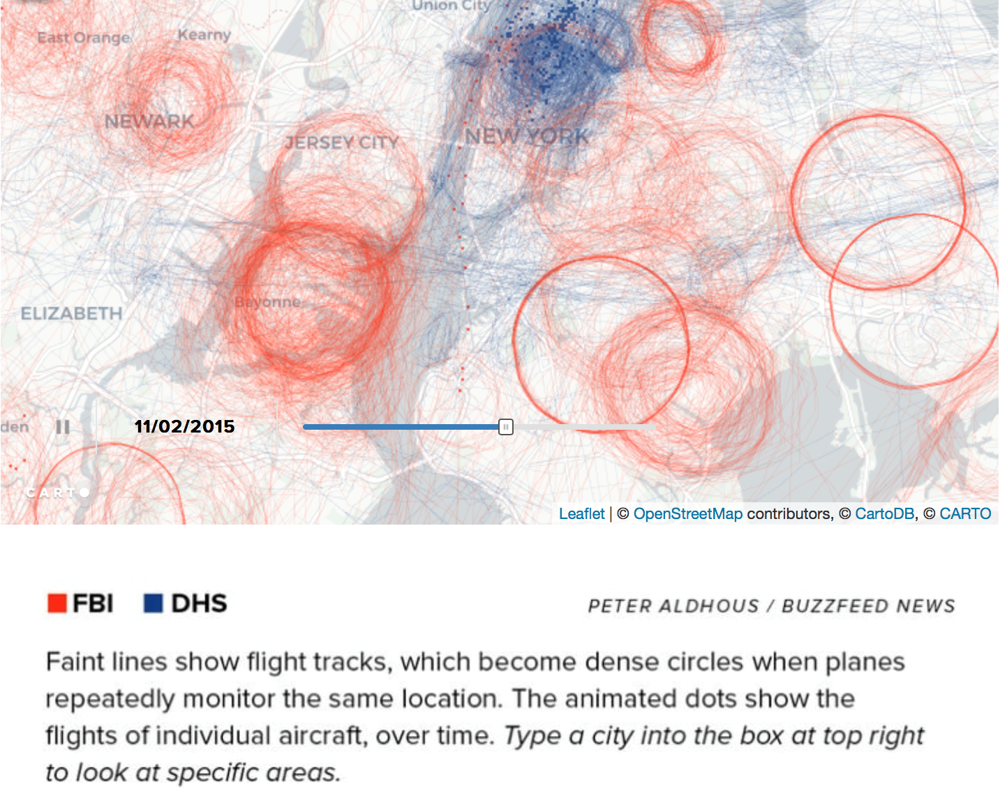

# Case Studies

+ Description and replication of great examples of data visualization


http://flowingdata.com/2015/12/22/10-best-data-visualization-projects-of-2015/

The author picked top 10 projects for the best data visualization of 2015, for each pick, the author showed the project plot and also described the reason why he chose. So after reading this article, I have a basic understanding of what kind of characters should include in a good visualization project.

## Description and replication of great examples of data visualization

reference:http://blog.visme.co/best-information-graphics-2016/#e030mFiF7wCpk7Ld.99

1. **Connecting the Dots Behind the Election**

This article by the New York Times lists several different candidates and creates compelling visuals that link their campaigns to previous ones.

Each visual contains several different-sized dots that represent a specific campaign, administration, or other governmental organization related to the candidate’s current campaign, which are then connected by arrows.

Hovering over a specific dot highlights the connections between the groups. The visual is a great way to put what would otherwise be a long slog through years of information into an easily accessible, easily viewable format so that voters can figure out where the candidates’ experiences lie.
<!--  -->
+reference: [@campaign_staff]


2. **Spies in the Skies**

The map is filled with red and blue lines (representing FBI and DHS aircraft, respectively) which illustrate the flight paths of the planes. When planes circle an area more than once, the circles become darker. The circles change in accordance to day and time, and individual cities can be typed into a search bar to see the flight patterns over them.

The visualization, rather creatively, almost looks like a hand-drawn map. While presenting a normally uncomfortable topic, this allows individuals to check things for themselves, hopefully providing some peace of mind.
<!--  -->
+reference: [@spies_sky]


3. **Green Honey**

The visualization spans a webpage. As you scroll down, the text changes, as do many colored dots that move over the white background. The dots are used to represent not only each colors’ hue, but the numbers that fall into each category—for example, what colors are the most popular “base” colors for English and Chinese.

The continuous flow of this visualization helps really bring it together, allowing users to scroll through the information at their own pace, but also creating a seamless, creative work.
<!--  -->
+reference: [@green_honey]


4. **How People Like You Spend Their Time**

The visual lists several categories along one side of a graph—such as “personal care” and “work”—with a line illustrating the amount of time the average person in a certain demographic spends on each subject. Entering different statistics at the top—such as changing gender or age—causes the lines to shift to feature that demographic.

The simplicity of this visualization really helps the information get across and avoids bogging down the statistics. Sometimes, less is more.
<!--  -->
+reference: [@spendingtime]


5. **Is it Better to Rent or Buy?**

https://www.nytimes.com/interactive/2014/upshot/buy-rent-calculator.html?_r=0

The calculator includes several sloping charts. Each chart includes a factor that’ll affect how much you’ll have to pay, such as the individual cost of your home and your mortgage rates. A movable scale along the bottom of each chart allows you to enter different data, changing the “cost of rent per month” on the side. If you can find a similar house to rent for that much per month or less, it’s more cost effective to just rent the home.

This visualization is incredibly thorough and a useful tool for homeowners of any age and status.
<!--  -->
+reference: [@rentorbuy]

6. **Two Centuries of U.S. Immigration**

The interactive map shows the rate of immigration into the U.S. from other countries over the last 200 years in 10-year segments. Colored dots represent 10,000 people coming from the specified country. Countries then light up when they have one of the highest rates of migration. 
What makes this a good visualization is that it is engaging and easy to read and interpret. The movement of the dots draws the reader's attention while the brightly lit countries make it easy to pick out the highest total migrations.
<!--  -->
+reference: [@Immigration]


7. **What's really warming the world?**

https://www.bloomberg.com/graphics/2015-whats-warming-the-world/

In this case study, it first claimed the background story and the analytical questions clearly.
Then it analyzed each different factors separately using both verbal explanations and dynamic graphics to compare with the observed temperature movements, and then grouped related factors into Natural factors category or Human factors category.
After that, it combined all the dynamic graphics into one and made the results more straightforward in terms of comparisons.
In the end, the authors also provided more detailed methodology explanations with dataset sources to support the results shown above.

Overall, this case study is straightforward, easy to understand but also with enough information shown on each graphics.


8. **The Strengths of Animated Data Visualization**

http://flowingdata.com/2015/12/15/a-day-in-the-life-of-americans/?platform=hootsuite

The page linked above includes a great example of animated data visualization showing the time people spend on daily activities throughout the day. The plot is simple and easy to interpret, but it also includes a good number of variables including time, activity type, number of people doing each activity, and the order in which activities are done.

One of the plot's biggest strengths is that by using one dot to represent each person in the study and using animation, we can actually drill down to each individual and follow them throughout the day.  The accumulation of dots for each particular activity also gives us an aggregate-level view of the same data, so we get both an individual and aggregate insights.

A drawback of the plot is that it is hard for our eyes to keep track of 1000 simultaneously moving dots.  The author of the post addresses this by creating subsequent plots with stationary lines at key times of the day.  This represents people's movements from one activity to another without overwhelming the reader.

Overall, this is an engaging, informative, and fun animated plot that has relevance and tells a story.


9. **An Aging Population**

Aging population is always a hot topic in social economics and politics. I collect several different data visualizations that show aging population in the world. They are good examples to learn and apply to census data. 

9.1 An Aging Nation: Projected Number of Children and Older Adults
[Source](https://www.census.gov/library/visualizations/2018/comm/historic-first.html)


+reference: [@aging_nation]

This one includes bar chart and line graph to demonstrate the aging population compared with population of children. The good things about this visualization: simple to see and compare, color to differentiate the category, highlight the intersection point.

9.2 From Pyramid to Pillar: A Century of Change, Population of the U.S.
[Source](https://www.census.gov/library/visualizations/2018/comm/century-of-change.html)


+reference: [@population_pyramid]

This is a **population pyramid**. “A **population pyramid** is a pair of back-to to histograms for each sex that displays the distribution of a population in all age groups and in gender”.

It is a good candidate to compare changes in population distributions (sex, age, year). Also the shape of pyramid is used to interpret a population. To illustrate, A pyramid with a very wide base and a narrow top section suggests a population with both high fertility and death rates. It is a useful tool in the census data.

9.3 Animated pyramid [Source](https://fathom.info/aging/)

+reference: [@animated_pyramid]

This is an animated and multiple population pyramids. It used to compare different patterns across countries. One additional benefit for the interactive population pyramid is that it shows the shape changes year by year, which is useful for countinous time-series comparison.

Similar projected with R code is provided for references:
[link](https://www.r-bloggers.com/who-is-old-visualizing-the-concept-of-prospective-ageing-with-animated-population-pyramids/)

10. **Some Interesting Visualizations**
https://blog.hubspot.com/marketing/great-data-visualization-examples
http://blog.visme.co/data-visualizations-current-events/
Visualization is like art. It speaks where words fail. There are phenomenas like the Syrian war, the number flights during Thanksgiving in the USA, the understanding of depths for developing perspective about the range of the issue, the controversy of ‘#OscarsSoWhite’, etc. on which we can write bundles of paragraphs, but they might still have scope for ambiguity. 
The links show some intricate visualizations of the topics like those mentioned above, and speak volumes without requiring paragraphs to explain what is going on within these visualizations. 
According to me, it is really interesting to see that almost anything in this world can be explained by visualizations. Visualizations are not just limited to businesses and their analytics. Wars, rescue operations, etc. can also be visualized to get a clear idea of all the details of the issues. 

1.	Picking up from one of the charts shown in the above mentioned links, the visualization of ‘A guide to Who is Fighting Whom in Syria’ is one of the most interesting charts in the list. The visualization and its report can be seen at http://www.slate.com/blogs/the_slatest/2015/10/06/syrian_conflict_relationships_explained.html

<!--  -->

This visualization makes an extremely complicated topic like the Syrian War easily understandable. It consists of 3 different emojis in three different colours, with each (colour+facial expression) combination showing the relationship between the various groups involved in the Syrian War. When you click on each of the emoji, a small dialogue box pops up which explains the relationship between the various countries and rebel groups involved in the war. This is not only easy to understand, but it is also pleasing to the eyes.

<!--  -->

<!--  -->

<!--  -->

2.	The second visualization ‘Adding up the White Oscars Winners’ can be seen here (https://www.bloomberg.com/graphics/2016-oscar-winners/) in an article by Bloomberg. The writes of this article developed the attributes of the future winners of Oscars by taking up the attributes of the past winners. It is extremely interesting to see how the article shows the features of the Best Actress, Actor, movies, etc. in a simple and captivating visual.
The visualization is interactive and we can click on each attribute like ‘Hair Color’, ‘Eye Color’, etc. to see what are the features of the actors and actresses who are more likely to win the Oscars.

<!-- -->

Similarly, the visualization gives information about the different aspects of movies that are more likely to win, like ‘Length’ ,’Month’ ,’Budget’, etc.

<!--  -->

11. **Young voters, class and turnout: how Britain voted in 2017**

The article's goal is to convey the change in party votes in the 2017 UK general election compared to votes in 2015. The change in party votes was shown with regards to three demographic factors: age, class, and ethnicity. For each factor, there are four graphs (one per political party), each illustrated in their party's standard color. The change in percent of votes is shown as an arrow where the arrow's shaft is the length of the difference from 2015 to 2017 while the x-axis is the demographic factor split into different bins.
What makes this a good visualization is that it is very easy to read and interpret. The color-coding of the arrows and party name makes it easy to pick out the different parties and the arrow lengths highlight just how large of a change happened. For example, in the Age section, it is easy to see the pattern between the Labour party gaining many voters ages 18 to 44 and the Conservative party gaining voters ages 45 and up.
<!--  -->
+reference: [@UKvotes2017]

12. **Vizwiz blog: casestudies about how to improve your visualizations**

http://www.vizwiz.com/

This is a blog about Tableau based data visualization. The author is Andy Kriebel who is a famous Tableau Zen Master. I would like to recommend this blog because it is not only practical, but also full of insights.

My favorite part of this blog is so called “Makeover Monday”, which will develop a new visualization based on an original one. 
For example, the author re-designed “The Seasonality of Confirmed Malaria Cases in Zambia Southern Province” by pointing out “what works well”, “what could be improved” and also his goals for the new visualization (ref: http://www.vizwiz.com/2018/04/malaria.html)
That’s how you can learn all the insight and reason behind a good visualization.

Besides, this blog also includes great tips and showcases for Tableau.

13. **Uber: Crafting Data-Driven Maps**

Map visualization is very important for companies like Uber that needs to track metrics using geo space points. In this article, the designer from Uber talks about the challenges of design such visualization and their solutions. While a lot of the problems are related to the large scale of the data, there are some insights on using scatter plots and hex bins, adding trip lines and making custom tools to help make decisions. The visualization in this article is beneficial for developing geo spatial graphics. 

Reference: https://medium.com/uber-design/crafting-data-driven-maps-b0835b620554

14. **Case Study**
Following the idea behind this article, it helped understand the case study and its importance. [@article_case]. The case study follows. This case study is about the linguistic concepts usage. How the data is being used and how visual graphics is used to deliver the insight. It presents an educational tool that integrates computational linguistics resources for use in non-technical undergraduate language science courses. By using the tool in conjunction with case studies, it provides opportunities for students to gain an understanding of linguistic concepts and analysis through the lens of realistic problems in feasible ways.
[@lingui_data]


15. **Kissmetrics blog: visualization of metrics**

Kissmetrics blog is a place where people talk about analytics, marketing and testing through narratives and metrics visualization. Metrics are important in real-life world especially when developing/promoting products. Visualization of metrics are also essential so that stakeholders can monitor performance, identify problems and deep dive into potential issues. 

A good example from the Kissmetrics blog is about Facebook’s Organic Reach. One important point in the blog discussed whether the Facebook’s organic reach is decreasing drastically. 
The general trend shows that there is a huge decline in Facebook’s page organic reach.

The following graphs show that the engagement is actually increasing, meaning while the quantity of content is decreasing, the quality is increasing. 


This resonates with what we have learnt at class in terms of how different perspectives of interpreting data can lead to different conclusions. 

Reference:https://blog.kissmetrics.com/is-facebook-organic-reach-dead/

16. **How the Recession Reshaped the Economy, in 255 Charts**

https://www.nytimes.com/interactive/2014/06/05/upshot/how-the-recession-reshaped-the-economy-in-255-charts.html

A big chart combines 255 lines to show how the number of job has changed for every industry in American. Using color to highlight the lines and letting viewer to know the story in different secenarios. By pointing the line, the detailed information of typical industry will show up. It makes readers easier to get the information in huge data.

Below the big chart on top. 255 charts was categorized by sectors and sub-industries. Readers can choose the industry or sector they are interseted and know the change of job number and salary information by having mouse on typical the chart.

### 15 Data Visualizations That Will Blow Your Mind

**Reference**

Allison Stadd,January 21, 2015.15 Data Visualizations That Will Blow Your Mind,Udacity.
https://blog.udacity.com/2015/01/15-data-visualizations-will-blow-mind.html

If a picture is worth a thousand words, a data visualization is worth at least a million.

As inspiration for your own work with data, check out these 15 data visualizations that will wow you. Taken together, this roundup is an at-a-glance representation of the range of uses data analysis has, from pop culture to public good.

1. Every Satellite Orbiting Earth
+ https://qz.com/296941/interactive-graphic-every-active-satellite-orbiting-earth/

This interactive graph, built using a database from the Union of Concerned Scientists, displays the trajectories of the 1,300 active satellites orbiting the Earth as you read this. Each satellite is represented by a circular icon, color-coded by country and sized according to launch mass. 

2. Simpson’s Paradox
+ http://vudlab.com/simpsons/

The Visualizing Urban Data Idealab (VUDlab) out of the University of California-Berkeley put together this visual look at data that disproves the claim in a 1973 suit that charged the school with sex discrimination. Though the graduate schools had accepted 44% of male applicants but only 35% of female applicants, researchers later uncovered that if the data were properly pooled, there was actually a small but statistically significant bias in favor of women. That’s called a Simpson’s Paradox. 

3. Charles Minard’s Visualization of Napoleon’s 1812 March
+ https://www.edwardtufte.com/tufte/minard

This classic lithograph dates back to 1869, displaying the number of men in Napoleon’s 1812 Russian army, their movements, and the temperatures they encountered along their way. It’s been called one of the “best statistical drawings ever created.” The work is an important reminder that the fundamentals of data visualization lie in a nuanced understanding of the many dimensions of data. Tools like D3.js and HTML are no good without a firm grasp of your dataset and sharp communication skills.

4. Hans Rosling’s 200 Countries, 200 Years, 4 Minutes
+ https://www.youtube.com/watch?feature=player_embedded&v=jbkSRLYSojo

Global health data expert Hans Rosling’s famous statistical documentary The Joy of Stats aired on BBC in 2010, but it’s still turning heads. One segment in particular is pretty mind-blowing. In “200 Countries, 200 Years, 4 Minutes,” Rosling uses augmented reality to explore public health data in 200 countries over 200 years using 120,000 numbers, in just four minutes.

5. Renting vs. Buying
+ https://www.nytimes.com/interactive/2014/upshot/buy-rent-calculator.html

Mike Bostock, New York Times graphics department editor and inventor of D3.js, built a complex interactive data calculator that offers a cost/benefit analysis for prospective homebuyers. Along with his colleagues Shan Charter and Archie Tse, Bostock tapped into everything from home price and mortgage-interest tax deduction to property tax rate and inflation to help you determine whether to rent or buy a home.

6. Music Timeline
+ https://research.google.com/bigpicture/music/

Google’s Music Timeline illustrates a variety of music genres waxing and waning in popularity from 2010 to present day, based on how many Google Play Music users have an artist or album in their library, and other data such as album release dates. 

7. State of the Union 2014 Minute by Minute on Twitter
+ http://twitter.github.io/interactive/sotu2014/#p1

Twitter’s data team assembled an impressive interactive data hub that depicts how Twitter users across the globe reacted to each paragraph of President Obama’s 2014 State of the Union address. You can slice and dice the data by topic hashtag (for example, #budget, #defense, or #education) and state. Pretty powerful.

8. NYC Street Trees
+ https://www.cloudred.com/labprojects/nyctrees/#about

Using data from NYC Open Data, this interactive visualization shows the variety and quantity of street trees planted across the five New York City boroughs.

9. Millennial Generation Diversity
+ http://money.cnn.com/interactive/economy/diversity-millennials-boomers/

CNNMoney’s interactive chart showing the size and diversity of the millennial generation compared to baby boomers was built using U.S. Census Data. It turns dry numbers into an intriguing story, illustrating the racial makeup of different age groups from 1913 to present.

10. Goldilocks Exoplanets
+ https://news.nationalgeographic.com/news/2014/04/140417-exoplanet-interactive/

Using data from the Planetary Habitability Laboratory at the University of Puerto Rico, the interactive graph plots planetary mass, atmospheric pressure, and temperature to determine what exoplanets might be home, or have been home at one point, to living beings.

11. Washington Wizards’ Shooting Stars
+ http://www.washingtonpost.com/wp-srv/special/sports/wizards-shooting-stars/

This detailed data visualization demonstrates D.C.’s basketball team’s shooting success during the 2013 season. Using stats released by the NBA, the visualization lets you examine data for each of 15 players. See how successful each person was at a variety of types of shots from a range of spots on the court, compared with others in the league.

12. U.S. Migration Patterns
+ https://www.nytimes.com/interactive/2014/08/13/upshot/where-people-in-each-state-were-born.html?abt=0002&abg=0

The New York Times data team mapped out Americans’ moving patterns from 1900 to present, and the results are fascinating to play around with. You can see where people living in each state were born, and to what states people move from others. 

13. Selfie City
+ http://selfiecity.net/

Selfie City, a detailed multi-component visual exploration of 3,200 selfies from five major cities around the world, offers a close look at the demographics and trends of selfies. The team behind the project collected and filtered the data using Instagram and Mechanical Turk. Explore the differences between selfies snapped in, say, New York and Berlin, as well as those between men and women across the world.

14. The American Workday
+ https://www.npr.org/sections/money/2014/08/27/343415569/whos-in-the-office-the-american-workday-in-one-graph?/templates/story/story_php=

NPR tapped into American Time Use Survey data to ascertain the share of workers in a wide range of industries who are at work at any given time. The chart overlays the traditional 9 AM-5 PM standard over the graph for a reference point, helping you draw interesting conclusions.

15. Global Carbon Emissions
+ https://www.theguardian.com/environment/ng-interactive/2014/dec/01/carbon-emissions-past-present-and-future-interactive

This data visualization, based on data from the World Resource Institute’s Climate Analysis Indicators Tool and the Intergovernmental Panel on Climate Change, shows how national CO₂ emissions have transformed over the last 150 years and what the future might hold. Explore emissions by country for a range of different scenarios.

## Deceptive data graphs examples
references: **Misleading Graphs: Real Life Examples http://www.statisticshowto.com/misleading-graphs/**

Misleading graphs are sometimes deliberately misleading and sometimes it’s just a case of people not understanding the data behind the graph they create. But some real life misleading graphs go above and beyond the classic types. Some are intended to mislead, others are intended to shock. The “classic” types of misleading graphs include cases where:

+ **The Missing Baseline.**

For example, the Vertical scale is too big or too small, or skips numbers, or doesn’t start at zero, like the graph below:

<!--  -->

You might be thinking that the graph on the right shows The Times makes double the sales of The Daily Telegraph. But take a closer look at the scale and you’ll see although The Times does make more sales, it’s only beating the competition by about 10%.


+ **The graph isn’t labeled properly.**

Graghs can have the correct figures, but still can mislead you. 

<!-- [](http://www.statisticshowto.com/wp-content/uploads/2014/01/usa-today-1.png) -->

This one used a BIG HEADLINE makes you think that 5.3% of children get spinal cord injuries which is a pretty scary statistic for parents. But the real figure is about .0000003% (based on 2000 injuries per year out of a population of around 74,000,000).

And for the figure 1 used in this article: Misleading Graphs: Displaying a Change in One Variable Using Area or Volume https://www.forbes.com/sites/naomirobbins/2012/02/28/misleading-graphs-displaying-a-change-in-one-variable-using-area-or-volume/#696674551781, the label for the smaller triangle in this graph says $26.4 while the label for the larger triangle says $114.6.  $114.6 is 4.34 times $26.4. It certainly looks to me as if more than 4.34 smaller triangles will fit in the larger triangle. It is the altitudes of the triangles that are proportional to the numbers in the labels. 


+ **Data is left out.**

Only include part of the data like the following graph which using temperatures of the first half of the year to prove it was rising dramatically.

<!--[](http://www.statisticshowto.com/wp-content/uploads/2014/01/new-haven-ct-300x145.jpg) -->

For more examples of misleading graphs or deceptive graphs you can read the following articles for more inspirations:

+ bar charts without zero & evenly spaced tick marks for uneven intervals: https://www.forbes.com/sites/naomirobbins/2011/11/17/whats-wrong-with-this-graph/#502ab1a42a33
+ graphs not drawn to scale: https://www.forbes.com/sites/naomirobbins/2012/02/16/misleading-graphs-figures-not-drawn-to-scale/#351dcf9c15ef

+ **Treating correlation as causation.**

Even if the labels and data in your graph is correct, it does not mean that the conclusion is logically correct. A correlation between X and Y does not automatically indicate that the change in one variable is caused by the change in the values of the other one, whereas the causation means that one event is the result of the occurrence of the other event. From the graph, we should bear in mind that it only presents the correlation between ice cream sold and murders, rather than causation.

```{r harlin-ice-cream, echo=FALSE, out.width='70%', fig.show='hold', fig.cap='A strange correlation between ice cream sales and murders (Source: [@harlin-coorelation])'}
knitr::include_graphics("images/harlin-ice-cream.png")
```

##Application of Data Visualization

Data visualization isn’t just for your resident data scientist. There are ways to use it at every level of an organization. Data Visualization applications lets us quickly create insightful data visualizations, in minutes. It allows users to visualize data and explore the vast domain interactively. Ref: [@app1] Some of them are mentioned below:

**Data Preprocessing**

We use data visualization for outliar detection in the dataset. Different methods for outlier detection in functional data have been developed during the years. Among them, several rely on different notions of functional depth , on robust principal components, or on random projections of infinite-dimensional data into R. Also, some distributional approaches have been considered (Gervini, 2009).  In functional data analysis, we observe curves defined over a given real interval and shape outliers may be defined as those curves that exhibit a different shape from the rest of the sample. Whereas magnitude outliers, that is, curves that lie outside the range of the majority of the data, are in general easy to identify, shape outliers are often masked among the rest of the curves and thus difficult to detect.

[@outliar]

##Data Augmentation

Computer interfacing is changing everyday, it is important for our clients to adapt the technology. The language of communicating data in 3D is explored to understand ways to take advantage of all dimensions in augmented reality and virtual reality to deliver information based on the user’s perspective, interest, and urgency.

Creating a mechanism to become aware of the user’s intention by analyzing the gaze through reactive design, we achieved developing a complex system for demonstrating massive amount of data and organizing it in a spatial system. The user could walk through and explore the data and interact with different data visualizations. Moving through space is used to provide different levels of detail for specific data through Z axis.
Ref: [@ref_pdf_ar]

Analytical engineer Steluta Iordache states virtual reality is changing the environment of data analysis. It has long been predicted that augmented reality (AR) and virtual reality (VR) will, sooner rather than later, dive head first into the mainstream of public consciousness. Now, expectations are to meeting reality, and heavy investment from tech giants such as Facebook, Samsung, and Google, this seems inevitable. However, placing the headsets and gaming – the industry most experts believe AR and VR will most dynamically disrupt – to one side, these nascent technologies can be used by corporate organisations, too.

By using proper visualization, it is possible to discover a solution more easily. By using proper visualisation, it is possible to simplify understanding of a problem and discover a solution more easily. Using VR and AR you could build a more efficient visualisation of the data. Recently we have seen data integrated in the real world and users have been able to interact with that data, which is not possible with traditional methods such as plots and charts. We believe AR and VR can build the presentation of the data and show more information at the same time, and it can allow the viewer to explore the data by interacting with it. But when we analyse data it can be difficult to see the big picture while also having access to the detail. So the question is: how can AR and VR be used to understand complex data by interacting with it within a virtual environment? A simple answer would be the link : http://theconversation.com/how-virtual-reality-technology-is-changing-the-way-students-learn-63271 .


##Outlier Detection
A simple example is mentioned below. Outlier treatment is important because, it can drastically bias/change the fit estimates and predictions. Illustration: 

```{r}
# Inject outliers into data.
cars1 <- cars[1:30, ]  # original data
cars_outliers <- data.frame(speed=c(19,19,20,20,20), dist=c(190, 186, 210, 220, 218))  # introduce outliers.
cars2 <- rbind(cars1, cars_outliers)  # data with outliers.

# Plot of data with outliers.
par(mfrow=c(1, 2))
plot(cars2$speed, cars2$dist, xlim=c(0, 28), ylim=c(0, 230), main="With Outliers", xlab="speed", ylab="dist", pch="*", col="red", cex=2)
plot(cars2$dist,cars2$speed)


# Plot of original data without outliers. Note the change in slope (angle) of best fit line.
plot(cars1$speed, cars1$dist, xlim=c(0, 28), ylim=c(0, 230), main="Outliers removed \n A much better fit!", xlab="speed", ylab="dist", pch="*", col="red", cex=2)
```
Detection of Outliers is prformed using:

+ Univariate approach
+ Multivariate approach
+ Multivariate Model Approach

##Genetic Network Reconstruction

Data visualization techniques are used to reconstruct genetic networks from genomics data. Reconstructed genetic networks are predicted interactions among genes of interest and these interactions are inferred from genomics data,microarray data or DNA sequence. Genomics data are generally contaminated and high-dimensional. It is important to examine and clean data carefully to attain meaningful inferences. Thus visualization tools that are used in the preprocessing of data associated with genetic network reconstruction are also reviewed and chosen wisely.

TWO AWESOME VIZUALISTS 
1.	DAVID McCANDLESS
a.	David McCandless is a British data-journalist and his blog “Information is Beautiful” (https://informationisbeautiful.net/) hosts some of the most visually stunning graphs, charts and maps on a wide range of topics like science, food, dogs and countries.
b.	A chart on this blog,”International Number Ones: Because every country is good at something (according to data)” is an interesting and captivating work that shows which country is No.1 in what. https://informationisbeautiful.net/visualizations/because-every-country-is-the-best-at-something/
Some of the interesting findings are as follows:
‘Country’ : ‘No.1 in’ 
Canada: Doughnuts
USA: Spam Emails
India: Bananas
Norway: Pizza Eaters
Togo: Unhappiness
Colombia: Happiness	

The visualizations on this website are updated and revised whenever new data is available. The original version of the above mentioned graph can be seen here: http://infobeautiful4.s3.amazonaws.com/2010/05/1276_international_number_ones.png

2.	HANS ROSLING 
a.	Hans Rosling took his interest in Global Health and developed stunning visualizations about it using statistical methods and data from the UN. He was a noted TED speaker and one of his most interesting TED talks is “Asia’s Rise: How and When” (https://www.ted.com/talks/hans_rosling_asia_s_rise_how_and_when#t-926764). In this, Hans shows trends of the Western countries vs Developing countries like India and China and makes predictions using stunning visualizations like the Bubble chart. In this video, he also predicts the exact date on which India and China will move ahead of USA as strong economic forces.

Hans was the co-founder and developer of the foundation “Gapminder”( https://www.gapminder.org/) which develops tools to help the people make sense of global data. One of the most important goals of Gapminder foundation is to end ignorance in the world by developing fact-based visualizations to show how the world really is.  


