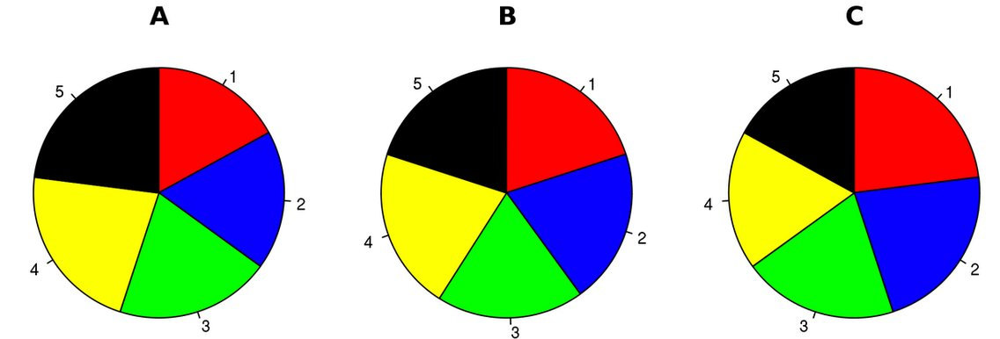
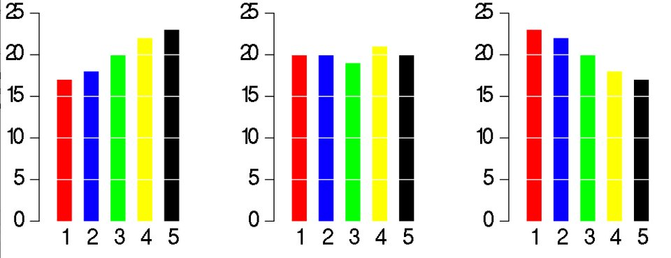

# Patterns

 + Reusable solutions to everyday data visualization questions
 + Applied by multiple members of the course

## Why pie chart is bad: a comparison with bar chart

Using pie chart is usually considered as a bad idea when it comes to data visualization. But why? Here, we explore some cons of using pie chart to convey information and compare its effectiveness to bar chart [@hickey-pie-worst] [@henry-defense-pie] [@quach-penny].

1. Some information may look nearly identical in pie chart. But if the data is presented with bar charts, the story is different. See figure \@ref(fig:hickey-before) and \@ref(fig:hickey-after) for examples.

```{r hickey-before, echo=FALSE, out.width='70%', fig.show='hold', fig.cap='Three pie charts.'}

```

```{r hickey-after, echo=FALSE, out.width='70%', fig.show='hold', fig.cap='Three bar charts.'}

```

2. It is difficult to compare the slices of a circle to figure out the distinctions in size between each pie slice, especially when there are a lot of categories.

3. Pie chart is easy to be manipulated (e.g. using a 3D pie chart).

4. Pie chart may be useful when comparing 2 different categories with different amounts of information. Specifically, it does a better job to distinguish two parts with a 25:75 split or one that is not 50:50 as people are sensitive to a right angle or a dividing line that is not straight. But this could be simply done by showing two numbers!

## Chose the right baseline in data visualization

Baseline is very important to data visualization. If baseline is different, the meanning will change a lot. Now here is a case study to show the importance of baseline and how to use it in different ways. 

Here I use the same method for a new dataset to .

```{r}
# Create the data.
a <-rep(c(2010,2011,2012,2013,2014,2015),each = 4)
b <- seq(1:24)
c <- c(64.9,65.33,71.67,79.17,68.78,69.83,78.61,92.68,89.28,90.43,97.96,106.96,100.66,107.53,117.06,119.21,110.05,97.42,93.62,97.99,80,88.74,102.06,83)
data <- as.data.frame(cbind(a,b,c))
colnames(data) <-c("year","quater","sales")
```
1. Regular quaterly sales. We can see sales decreased a lot around 2014.  **The baseline here is historical sales.**
```{r eval=FALSE}
# Regular time series for sales
par(cex.axis=0.7)
data.ts <- ts(data$sales, start=c(2010, 1), frequency=4)
plot(data.ts, xlab="", ylab="", main="sales per quater", las=1, bty="n")
```

2. Quaterly and yearly change sales. **The baseline here is zero and look at the percentage changes.**
```{r eval=FALSE}
 # Quaterly change
curr <- as.numeric(data$sales[-1])
prev <- as.numeric(data$sales[1:(length(data$sales)-1)])
quaChange <- 100 * round( (curr-prev) / prev, 2 )
barCols <- sapply(quaChange, 
	function(x) { 
		if (x < 0) {
			return("#2cbd25")
		} else {
			return("gray")
		}
	})
#monChange.ts <- ts(monChange, start=c(1976, 2), frequency=12)
barplot(quaChange, border=NA, space=0, las=1, col=barCols, main="% change, quaterly")
```


```{r eval=FALSE}
# Year-over-year change
curr <- as.numeric(data$sales[-(1:4)])
prev <- as.numeric(data$sales[1:(length(data$sales)-4)])
annChange <- 100 * round( (curr-prev) / prev, 2 )
barCols <- sapply(annChange, 
	function(x) { 
		if (x < 0) {
			return("#2cbd25")
		} else {
			return("gray")
		}
	})
barplot(annChange, border=NA, space=0, las=1, col=barCols, main="% change, annual")
```
From this plot, it is very clear that the magnitude of drops in sales for some quaters.

3. The sales difference compare to now. **The baseline here is the current sales.**
```{r eval=FALSE}
# Relative to current 2015
curr <- as.numeric(data$sales[length(data$sales)])
salesDiff <- as.numeric(data$sales) - curr
barCols.diff <- sapply(salesDiff,
	function(x) {
		if (x < 0) {
			return("gray")
		} else {
			return("black")
		}
	}
)
barplot(salesDiff, border=NA, space=0, las=1, col=barCols.diff, main="Sales difference from last quater 2015")
```
4. Sales difference compared to the first quater. ** The baseline here is the first quater sales.**
```{r eval=FALSE}
# Relative to first quater
ori <- as.numeric(data$sales[1])
salesDiff <- as.numeric(data$sales) - ori
barCols.diff <- sapply(salesDiff,
	function(x) {
		if (x < 0) {
			return("gray")
		} else {
			return("black")
		}
	}
)
barplot(salesDiff, border=NA, space=0, las=1, col=barCols.diff, main="Sales difference from first quater 2010")
```

5. The difference between quater sales and mean. ** The baseline is mean now.**
```{r eval=FALSE}
# difference from the mean
mean <- mean(as.numeric(data$sales))
salesDiff <- as.numeric(data$sales) - mean
barCols.diff <- sapply(salesDiff,
	function(x) {
		if (x < 0) {
			return("gray")
		} else {
			return("black")
		}
	}
)
barplot(salesDiff, border=NA, space=0, las=1, col=barCols.diff, main="Sales difference from mean")
```


So before we start to plot, we should decide the baseline we want to use. Different baseline will lead to totally different graphs.

Reference: https://flowingdata.com/2013/11/26/the-baseline/

