# Patterns

## Using Shapes as Filters in Tableau When Your Fields Are Measures

[@interworks]

[@gunviolence]

This article  is useful to analyze and redesign different graphs presented in the article "America’s unique gun violence problem, explained in 17 maps and charts" gun violence article referenced above .This article introduces the methodologies on how to use shapes as filters in Tableau when your fields are measures. Basically, it teaches you how to load custom shapes as action filters and use them for showing different graphs with those filters, which can make your visualization more interesting and interactive. You can also download the tableau file for practice.

Case studies document the development record of a project. They provide the user with an insight into what occurred and relevant details of the process. A person can gain valuable knowledge that can be reused in their own projects and improve his or her own methodologies simply by learning from what others have done.

This article explains how data visualization can enhance awareness of the data available and its importance in business decisions. The author explains a situation where poor data visualization led to bad decisions and the negative impact of these decisions.

## Outlier Detection

We can use data visualization for outlier detection in a data set[@outliar]. Different methods for outlier detection in functional data have been developed during the years. Several of these methods rely on different notions of functional depth, robust principal components, or random projections of infinite-dimensional data into R. Some distributional approaches have also been considered (Gervini, 2009). In functional data analysis, we observe curves defined over a given real interval and shape outliers may be defined as those curves that exhibit a different shape from the rest of the sample. Other types of outliers include:

**Type 1:** Global outliers (also called “point anomalies”): 
A data point is considered a global outlier if its value is far outside the entirety of the data set in which it is found.

**Type 2:** Contextual (conditional) outliers: 
A data point is considered a contextual outlier if its value significantly deviates from the rest the data points in the same context. Note that this means that same value may not be considered an outlier if it occurred in a different context. If we limit our discussion to time series data, the “context” is almost always temporal, because time series data are records of a specific quantity over time. Contextual outliers are common in time series data.

**Type 3:** Collective outliers: 
A subset of data points within a data set is considered anomalous if those values as a collection deviate significantly from the entire data set, but the values of the individual data points are not themselves anomalous in either a contextual or global sense. In time series data, one way this can manifest is as normal peaks and valleys occurring outside of a time frame when that seasonal sequence is normal or as a combination of time series data that is in an outlier as a group.

Below is a simple example. Outlier treatment is important because it can drastically bias/change the fit estimates and predictions. Illustration: 

```{r Outliar Detection, echo=TRUE}
# Inject outliers into data.
cars1 <- cars[1:30, ]  # original data
cars_outliers <- data.frame(speed=c(19,19,20,20,20), dist=c(190, 186, 210, 220, 218))  # introduce outliers.
cars2 <- rbind(cars1, cars_outliers)  # data with outliers.

# Plot of data with outliers.
par(mfrow=c(1, 2))
plot(cars2$speed, cars2$dist, xlim=c(0, 28), ylim=c(0, 230), main="With Outliers", xlab="speed", ylab="dist", pch="*", col="red", cex=2)
plot(cars2$dist,cars2$speed)

# Plot of original data without outliers. Note the change in slope (angle) of best fit line.
plot(cars1$speed, cars1$dist, xlim=c(0, 28), ylim=c(0, 230), main="Outliers removed \n A much better fit!", xlab="speed", ylab="dist", pch="*", col="red", cex=2)
```

Detection of Outliers is performed using:

* Univariate Approach
* Multivariate Approach
* Multivariate Model Approach

## Genetic Network Reconstruction

Data visualization techniques are used to reconstruct genetic networks from genomics data. Reconstructed genetic networks are predicted interactions among genes of interest and these interactions are inferred from genomics data, microarray data or DNA sequences. Genomics data are generally contaminated and high-dimensional. It is important to examine and clean data carefully to attain meaningful inferences. Thus, visualization tools that are used in the preprocessing of data associated with genetic network reconstruction are also reviewed and chosen wisely.

## Tips to Improve Data Visualization

### Comparison
Include a zero baseline if possible. Although a line chart does not have to start at a zero baseline, it should be included if it gives more context for comparison. If relatively small fluctuations in data are meaningful (e.g., in stock market data), you may truncate the scale to showcase these variances; Always choose the most efficient visualization; Watch your placement You may have two nice stacked bar charts that are meant to let your reader compare points, but if they’re placed too far apart to “get” the comparison, you’ve already lost; Tell the whole story. Maybe you had a 30% sales increase in Q4. Exciting! But what’s more exciting? Showing that you’ve actually had a 100% sales increase since Q1.

### Copy
Don’t over explain if the copy already mentions a fact, the subhead, callout, and chart header don’t have to reiterate it; Keep chart and graph headers simple and to the point. There’s no need to get clever, verbose, or pun-tastic. Keep any descriptive text above the chart brief and directly related to the chart underneath. Remember: Focus on the quickest path to comprehension; Use callouts wisely Callouts are not there to fill space. They should be used intentionally to highlight relevant information or provide additional context; Don’t use distracting fonts or elements Sometimes you do need to emphasize a point. If so, only use bold or italic text to emphasize a point—and don’t use them both at the same time.

### Color
Use a single color to represent the same type of data; Watch out for positive and negative numbers Don’t use red for positive numbers or green for negative numbers. Those color associations are so strong it will automatically flip the meaning in the viewer’s mind; Make sure there is sufficient contrast between colors; Avoid patterns Stripes and polka dots sound fun, but they can be incredibly distracting. If you are trying to differentiate, say, on a map, use different saturation of the same color. On that note, only use solid-colored lines (not dashes); Select colors appropriately; Don’t use more than 6 colors in a single layout.

### Ordering
Order data intuitively There should be a logical hierarchy. Order categories alphabetically, sequentially, or by value; Order consistently; Order evenly Use natural increments on your axes (0, 5, 10, 15, 20) instead of awkward or uneven increments (0, 3, 5, 16, 50).

### Audience perspective
Let the users lead; Know your audience, designers should consider the way users prefer to understand information, even in choosing basic analytic approaches. For users to feel comfortable adopting and sharing insights from analytics, they must be able to explain and defend the data.

### Use layers to tell a story
While style is one form of customization, layering unique data sets on a single visualization can tell a richer narrative and connect users to the data without getting too crowded. On a map, this can be as simple as zooming in and out, but it can also involve drill-downs (choosing a data point and expanding it to show more detail), links and other shortcuts.

### Keep it simple
Analytic results shouldn’t be presented to 10 decimal places when the user doesn’t need that level of precision to make a decision or understand a concept. Effective visual interfaces avoid 3-D effects or ornate gauge designs (a.k.a. “chart junk”) when simple numbers, maps or graphs will do.

Reference: [@French] [@Steier]

## Building Advanced Analytics Application with TabPy 
[@TabPy]
Imagine a scenario where we can just enter some x values in a dashboard form, and the visualization would predict the y variable!!! Here is a link that shows how to integrate and visualize data from Python in Tableau. This is especially relevant to all data science students, as this is one of the tools used for visualizing advanced analytics. The author here has given an example using data from Seattle's police department's 911 calls and he tries to identify criminal hotspots in the area. The author uses machine learning (spatial clustering) and creates a great interactive visualization, where you can click on the type of criminal activity and the graph will show various clusters. There are other examples and use cases that may be downloaded, and the scripts are also given by the author to anyone who is interested in trying it out. 

## Pick the Right Chart Type
Data visualization is a combination of art and science. When it comes to the artistic aspect, there are no correct answers for doing the visualization. There are many ways to present the data. However, when making sense of facts, numbers, and measurement, the better understanding is promoted by a logical path to follow. To determine the best type of chart is hard for those new to data visualization. Most people learn it by referring to other people's work without understanding the underlying logic, so they don't have the theory in their mind to make the judgment.

When we are choosing the type of chart, we need to answer some questions: 

* How many features would you like to show in a chart? 
* How many data points do you want to display for each variable? 
* Will you display time serious data or among items or groups. 

After answering these questions, you should able to get a better imagination of your ideal graph. The simple guidance for using the different type of chart is line charts for tracking trends over time, bar charts to compare quantities, scatter plots for a joint variation of two data items, bubble charts showing joint variation of three data items, and pie charts to compare parts of a whole.
 
## Why pie chart is bad: a comparison with the bar chart

Using pie chart is usually considered as a bad idea when it comes to data visualization. But why? Here, we explore some cons of using the pie chart to convey information and compare its effectiveness to bar chart 

[@hickey-pie-worst] 

[@henry-defense-pie]

[@quach-penny]

1. Some information may look nearly identical in pie chart. But if the data is presented with bar charts, the story is different.
See figure \@ref(fig:hickey-before) and \@ref(fig:hickey-after) for examples.

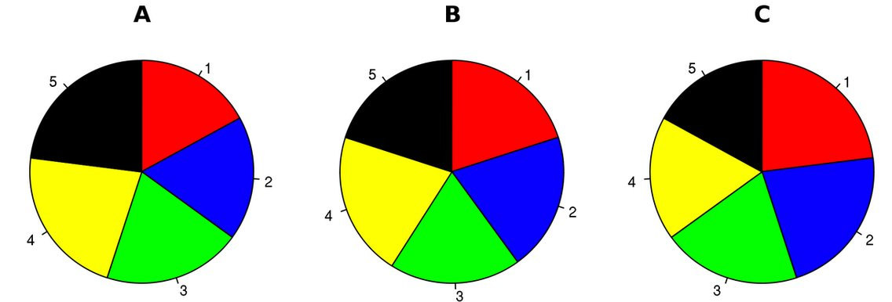

<sup>Source: [@hickey-pie-worst]</sup>

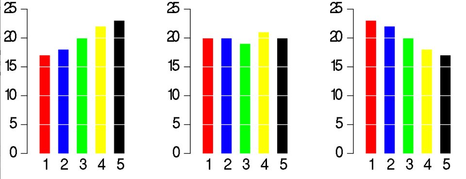

<sup>Source: [@hickey-pie-worst]</sup>

2. It is difficult to compare the slices of a circle to figure out the distinctions in size between each pie slice, especially when there are a lot of categories.
See figure \@ref(fig:hickey-breakdown) for example.

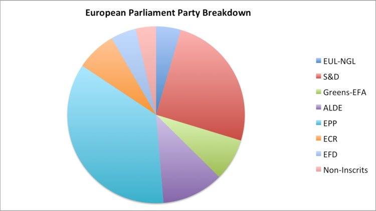

<sup>Source: [@hickey-pie-worst]</sup>

3. A Pie chart is easy to be manipulated (e.g. using a 3D pie chart). See figure \@ref(fig:hickey-3D) for example. 

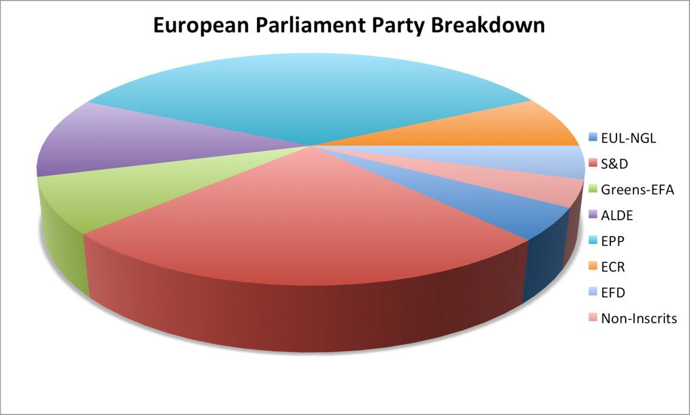

<sup>Source: [@hickey-pie-worst]</sup>

4. A Pie chart may be useful when comparing 2 different categories with different amounts of information.
Specifically, it does a better job to distinguish two parts with a 25:75 split or one that is not 50:50 as people are sensitive to a right angle or a dividing line that is not straight. But this could be simply done by showing two numbers! See figure \@ref(fig:henry-quarter) and \@ref(fig:henry-half) for examples.

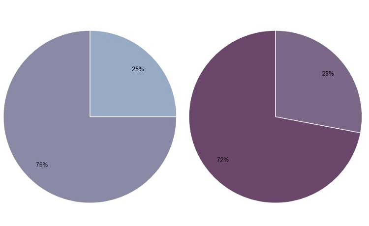

<sup>Source: [@henry-defense-pie]</sup>

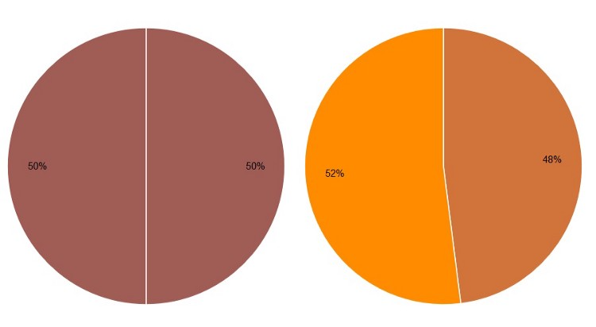
<sup>Source: [@henry-defense-pie]</sup>

## Use maps only when effective
Maps are a popular choice when it comes to displaying geographical data. They are more exciting than a simple bar or line chart but still easy to comprehend. Maps grab the reader's attention, so at first glance they seem like a great option.

However, just because the data can be represented on a map doesn't mean it should be. The map should be serving a purpose and telling a story. When used properly, a map does an excellent job of this. But they are not the solution every time. As with any visual, one should step back and evaluate if the map is the best way to convey their message.

One good use of a map is to show points or specific locations. This style can show how points are distributed and reveal patterns such as certain areas having more high end restaurants. This is not the right approach if the points do not tell a story. If the story is more about comparing data such as median salary, a map is not the most effective. A map of this kind can also lose its meaning if there are too many points and the data blurs together.

Encoding the data is another potential area for confusion. The most popular methods are using color, shape, and size. Again, each of these can be effective when done properly but must avoid common mistakes. Using too many colors can make the chart harder to interpret. If necessary, data can be grouped into categories such as good vs. bad or high, medium and low. Shapes should be easily distinguished, so there shouldn't be too many unique ones. Also, if the use of shapes doesn't significantly add to the story, it is probably best to remove them. The size of a marker is a clear way to describe amounts but can easily become a problem if there are outliers. Locations with large values could obscure other data points. The best practice is to use just one of these methods rather than combining two or more.
Source: [@Bradshaw]

## Chose the right baseline in data visualization
The baseline is very important to data visualization. If the baseline is different, the meaning will change a lot. Now here is a case study to show the importance of baseline and how to use it in different ways. 

```{r}
# Create the data.
a <-rep(c(2010,2011,2012,2013,2014,2015),each = 4)
b <- seq(1:24)
c <- c(64.9,65.33,71.67,79.17,68.78,69.83,78.61,92.68,89.28,90.43,97.96,106.96,100.66,107.53,117.06,119.21,110.05,97.42,93.62,97.99,80,88.74,102.06,83)
data <- as.data.frame(cbind(a,b,c))
colnames(data) <-c("year","quater","sales")
```

1. Regular quarterly sales. We can see sales decreased a lot around 2014.  **The baseline here is historical sales.**
```{r}
# Regular time series for sales
par(cex.axis=0.7)
data.ts <- ts(data$sales, start=c(2010, 1), frequency=4)
plot(data.ts, xlab="", ylab="", main="sales per quater", las=1, bty="n")
```

2. Quarterly and yearly change sales. **The baseline here is zero and look at the percentage changes.**
```{r}
# Quaterly change
curr <- as.numeric(data$sales[-1])
prev <- as.numeric(data$sales[1:(length(data$sales)-1)])
quaChange <- 100 * round( (curr-prev) / prev, 2 )
barCols <- sapply(quaChange, 
	function(x) { 
		if (x < 0) {
			return("#2cbd25")
		} else {
			return("gray")
		}
	})

barplot(quaChange, border=NA, space=0, las=1, col=barCols, main="% sales change, quaterly")
```


```{r}
# Year-over-year change
curr <- as.numeric(data$sales[-(1:4)])
prev <- as.numeric(data$sales[1:(length(data$sales)-4)])
annChange <- 100 * round( (curr-prev) / prev, 2 )
barCols <- sapply(annChange, 
	function(x) { 
		if (x < 0) {
			return("#2cbd25")
		} else {
			return("gray")
		}
	})

barplot(annChange, border=NA, space=0, las=1, col=barCols, main="% sales change, annual")
```
From this plot, it is very clear that the magnitude of drops in sales for some quarters.

3. The sales difference compare to now. **The baseline here is the current sales.**
```{r}
# Relative to current 2015
curr <- as.numeric(data$sales[length(data$sales)])
salesDiff <- as.numeric(data$sales) - curr
barCols.diff <- sapply(salesDiff,
	function(x) {
		if (x < 0) {
			return("gray")
		} else {
			return("black")
		}
	}
)
barplot(salesDiff, border=NA, space=0, las=1, col=barCols.diff, main="Sales difference from last quater 2015")
```

4. Sales difference compared to the first quarter. ** The baseline here is the first quater sales.**
```{r}
# Relative to first quater
ori <- as.numeric(data$sales[1])
salesDiff <- as.numeric(data$sales) - ori
barCols.diff <- sapply(salesDiff,
	function(x) {
		if (x < 0) {
			return("gray")
		} else {
			return("black")
		}
	}
)
barplot(salesDiff, border=NA, space=0, las=1, col=barCols.diff, main="Sales difference from first quater 2010")
```

5. The difference between quarter sales and mean. ** The baseline is mean now.**
```{r}
# difference from the mean
mean <- mean(as.numeric(data$sales))
salesDiff <- as.numeric(data$sales) - mean
barCols.diff <- sapply(salesDiff,
	function(x) {
		if (x < 0) {
			return("gray")
		} else {
			return("black")
		}
	}
)
barplot(salesDiff, border=NA, space=0, las=1, col=barCols.diff, main="Sales difference from mean")
```

So before we start to plot, we should decide the baseline we want to use. Different baseline will lead to totally different graphs.
source: [@Baseline_2013]

## Using design patterns to find greater meaning in your data

Visualizations that show comparisons, connections, and conclusions offer analytical clarity. 

Patterns based on function can help you see differences and similarities more clearly, understand relationships and behaviors more intimately, and predict future results with a greater level of certainty. When these patterns are presented as visualizations, they help you 1) see comparisons, 2) make connections, and 3) draw conclusions from your data sets. The major functions can be described as:

### Comparisons

As shown in Figure 1, the bar chart with sparkline enables you to review the data at two different levels: a high-level assessment of the short-term three-month returns is represented with the bar chart, while the sparkline (the line chart below the bar) provides the details of the historical returns. Quickly and concisely, the sparkline shows you the path that has led up to the most recent returns. You can then assess that a narrow path provides consistent returns across the years while a wide path provides varied returns. Side-by-side comparisons of funds organized into two columns—% Returns and % Ahead of Benchmark—enables peer comparisons and fund-specific benchmark comparisons. Hence, you can see that not only has Global Large Cap Core provided positive returns, it has also provided the best and most consistent returns when compared to the benchmark.


### Connections
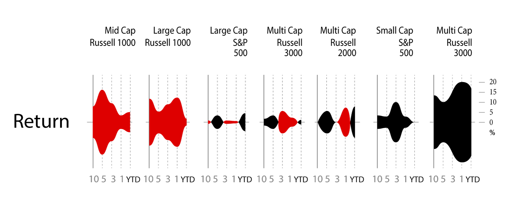
The string of charts in Figure 2 shows 10-year to year-to-date (YTD) performance returns, which can be interpreted as individual charts or a group of category charts.

Similar to sounds waves, the symmetrical area charts grow equidistant from the source (the zero line) at each time interval to accentuate the returns even further. Here, the y-axis is shown in percentage. Instead of using the zero line to indicate positive or negative returns, it uses color to denote if the category returns are positive (black) or negative (red). For example, Multi-Cap Russell 3000 Growth produced 20% positive returns within the one-year time period and is shown with color fill in both directions from the zero line to purposefully duplicate the large gains and specifically uses black color fill to indicate the returns are positive. As evident from the name, the symmetrical chart doubles the returns to emphasize the amount of color fill.

What else can you derive from organizing the information in a spectrum of negative to positive returns? Based on this organization, three groups of categories have resulted in straight losses (red), heavy gains (black), or a mix of gains and losses across a decade of returns. The string of charts makes it easier for you to see these three groups of categories to assess their distribution. Just like sound waves, each chart is a sound bite that streams the returns for each category with a “scream” announcing a huge gain (e.g., Multi-Cap Russel 3000 Growth) or loss (e.g., Mid-Cap Russel Mid Cap Growth). In some cases (e.g., Large Cap S&P 500), the chart quietly announces mixed returns to adequately demand less attention.

Next, you might wonder how you would have fared if you had invested in certain funds. You might ask: if I had purchased this fund five years ago, what would my return be? And what about the YTD returns? Since market timing is key to investment choices, the following presentation of hypothetical investments represents a range of results. 

### Conclusions
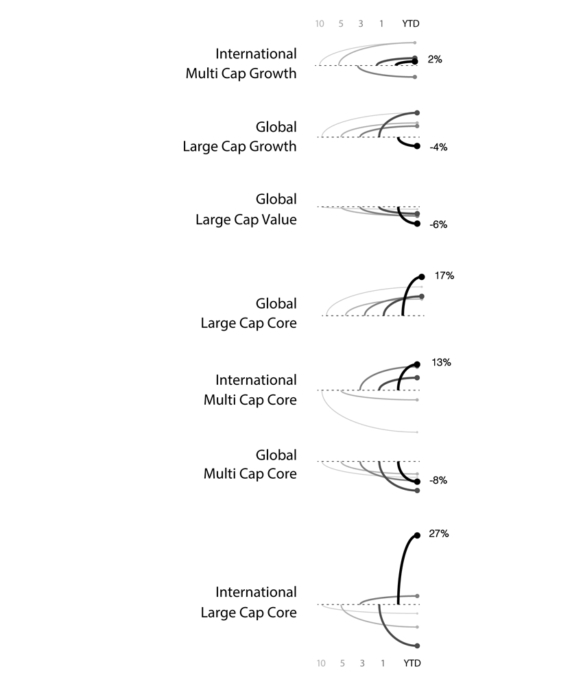
In Figure 3, varied performance results become clear with a layered approach to show five potential entry points (10-year, 5-year, 3-year, 1-year, YTD) into an investment. For example, the International Large Cap Core fund provided 27% YTD returns, which contrast the negative returns you would have received had you invested in the fund 1, 5, or 10 years ago. Here, conclusions are derived based on known inputs with a divided review of positive or negative outcomes (shown on the y-axis).

The line weights help to identify each entry point and show the range of differences between the entry points. Accordingly so, resulting returns are shown with simplified curves that connect the inputs and outputs. In this case, the chart has been customized to show an instance in which the user has opted to see the YTD return values as percentages listed to the right of each resulting output.[@data_meaning]

## Chart types
Let's review the most commonly used chart types and explain what circumstance should better use typical chart and the pros and cons of each type of chart. Before introducing different types of charts, you can use the following website to familiar with different types of charts [@charts_viz]. 

### Time Series Data

What are some of the most common data visualizations seen in newspapers, textbooks, and corporate annual reports? Graphs showing a country's GDP growth trends or charts capturing a company's sales growth in the last 4 quarters would be high up on the list. **Essentially, these are visualizations that track time series data  -- the performance of an indicator over a period of time -- also known as temporal visualizations.**

Temporal visualizations are one of the simplest, quickest ways to represent important time series data. There are 7 handy temporal visualization styles for your time series data.
source: [@aya-time-series]

### Line Graph
A line graph is the simplest way to represent time series data. It is intuitive, easy to create, and helps the viewer get a quick sense of how something has changed over time.

### Stacked Area Chart
Stacked area charts are area charts similar to a line chart. In an area chart, multiple variables are "stacked" on top of each other, and the area below each line is colored to represent each variable. Stacked area charts are useful to show how both a cumulative total and individual components of that total changed over time. The order in which we stack the variables is crucial because there can sometimes be a difference in the actual plot versus human perception.

The figure below is a stacked area chart showing time series data:
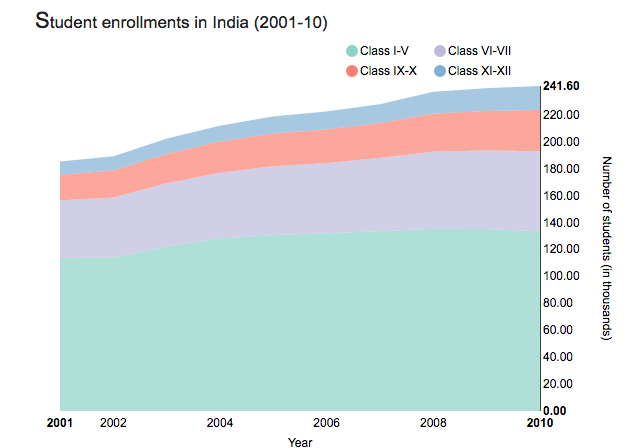 

<sup>Source: [@aya-time-series]</sup>

### Bar Charts
represent data as horizontal or vertical bars. The length of each bar is proportional to the value of the variable at that point in time. A bar chart is the right choice for you when you wish to look at how the variable moved over time or when you wish to compare variables versus each other. Grouped or stacked bar charts help you combine both these purposes in one chart while keeping your visualization simple and intuitive. The chart plots the value vertically whereas we perceive the value to be at right angles to the general direction of the chart.
For instance, in the figure below, a bar graph would be a cleaner alternative.
 

<sup>Source: [@aya-time-series]</sup>

For instance, this grouped bar chart in this interactive visualization of a number of deaths by disease type in India not only lets you compare the deaths due to diarrhea, malaria, and acute respiratory disease across time, but also lets you compare the number of deaths by these three diseases in a given year. By switching to the stacked bar chart view, you get an intuitive sense of the proportion of deaths caused by each disease.
We can use two different bar charts to represent time series data.

### Column Charts
This should be the most popular chart type. This chart is good to do a comparison between different values when specific values are important. TBD 

Still have hard time to choose? There are many resources on-line can help you do the decision. For example, Dr. Andre Abela creates a chart selection diagram that is helpful to pick the right chart depends on the data type. The link of website is]**

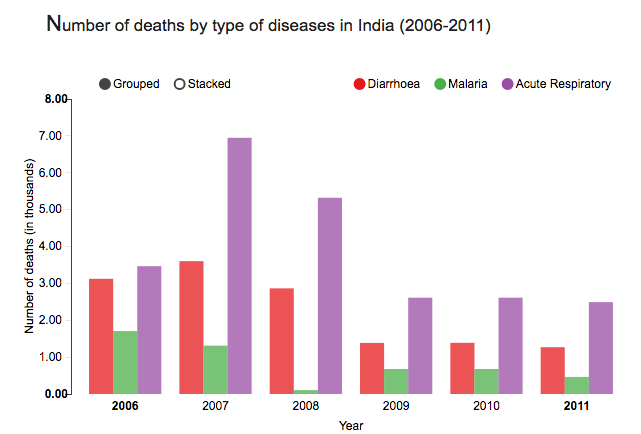

<sup>Source: [@aya-time-series]</sup>

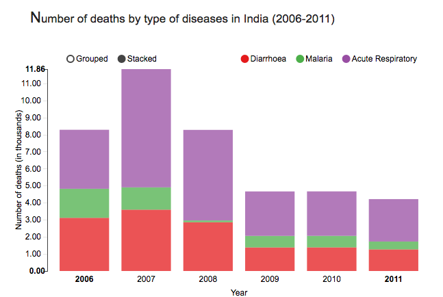

<sup>Source: [@aya-time-series]</sup>

To avoid clutter and confusion, make sure to not use more than 3 variables in a stacked or group bar chart. It is also a good practice to use consistent bold colors and leave appropriate space between two bars in a bar chart. Also, check out our blog on 5 common mistakes that lead to bad data visualization to learn why the base axis for your bar charts should start from zero.


### Gantt Chart

**Gantt charts are a popular project management tool since they present a concise snapshot of various tasks spread across various phases of the project.** You can show additional information such as the correlation between individual tasks, resources used in each task, overlapping resources, etc., by the use of colors and placement of bars in a Gantt chart.

is a horizontal bar chart showing work completed in a certain period of time with respect to the time allocated for that particular task. It is named after the American engineer and management consultant Henry Gantt who extensively used this framework for project management.
Assume you're planning the logistics for a dance concert. There are lots of activities to be completed, some of which will take place simultaneously while some can be done only after another activity has been completed. For instance, the choreographers, soundtrack, and dancers need to be finalized before the choreography can begin. However, the costumes, props, and stage decor can be planned at the same time as the choreography. With careful preparation, Gantt charts can help you plan for complex, long-term projects that are likely to undergo several revisions and have various resource and task dependencies.
Gantt charts are a popular project management tool since they present a concise snapshot of various tasks spread across various phases of the project. You can show additional information such as the correlation between individual tasks, resources used in each task, overlapping resources, etc., by the use of colors and placement of bars in a Gantt chart.

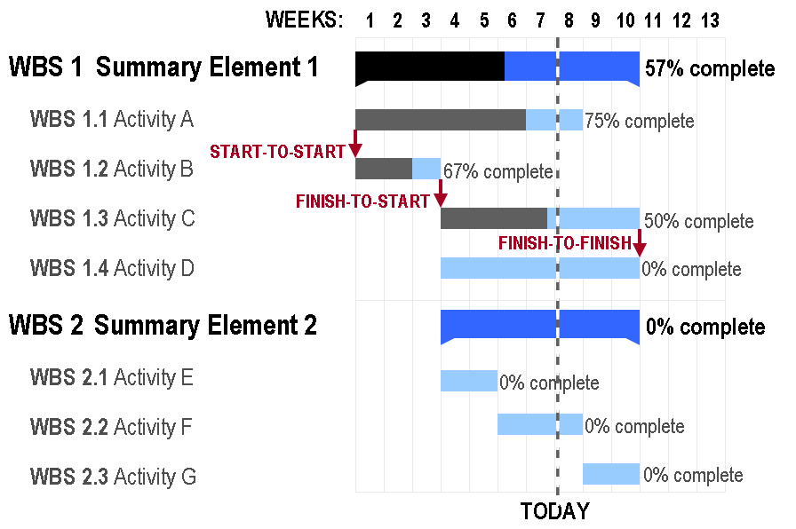


### Stream Graph

**Stream graphs are great to represent and compare time series data for multiple variables.** Stream graphs are, thus, apt for large data sets. Remember that choice of colors is very important, especially when there are lots of variables. Variables that do not have significantly high values might tend to get drowned out in the visualization if the colors are not chosen well.

(Source: [@aya-time-series])is essentially a stacked area graph, but displaced around a central horizontal axis. The stream graph looks like flowing liquid, hence the name. They are great to represent and compare time series data for multiple variables. Stream graphs are, thus, apt for large data sets. Remember that choice of colors is very important, especially when there are lots of variables. Variables that do not have significantly high values might tend to get drowned out in the visualization if the colors are not chosen well.

A stream graph showing a randomly chosen listener's last.fm music-listening habits over time.


### Heat Map

**Heat maps are perfect for a two-tiered time frame** -- for instance, 7 days of the week spread across 52 weeks in the year, or 24 hours in a day spread across 30 days of the month, and so on. The limitation, though, is that only one variable can be visualized in a heat map. Comparison between two or more variables is very difficult to represent.
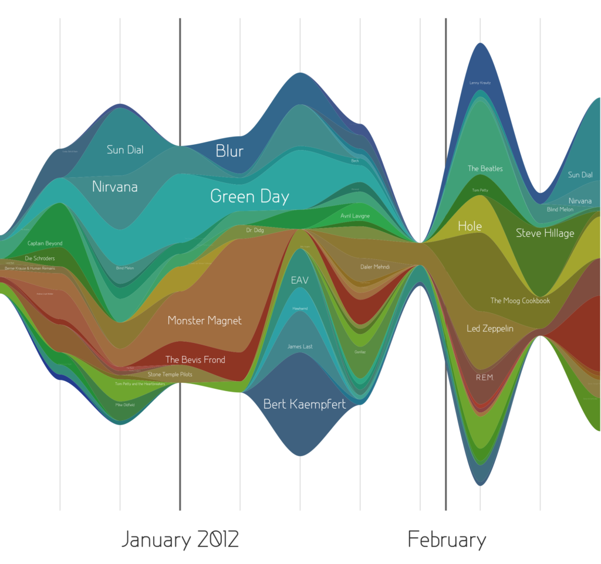

<sup>Source: [@aya-time-series]</sup>

Geo-spatial visualizations often use heat maps since they quickly help identify "Hot spots" or regions of high concentrations of a given variable. When adapted to temporal visualizations, heat maps can help us explore two levels of time in a 2D array. Heat maps are perfect for a two-tiered time frame -- for instance, 7 days of the week spread across 52 weeks in the year, or 24 hours in a day spread across 30 days of the month, and so on. The limitation, though, is that only one variable can be visualized in a heat map. Comparison between two or more variables is very difficult to represent.

This heat map visualizes birthdays for babies born in the United States between 1973 and 1999. The vertical axis represents the 31 days in a month while the horizontal axis represents the 12 months in a year. This chart quickly helps us identify that a large number of babies were born in the later half of July, August, and September.

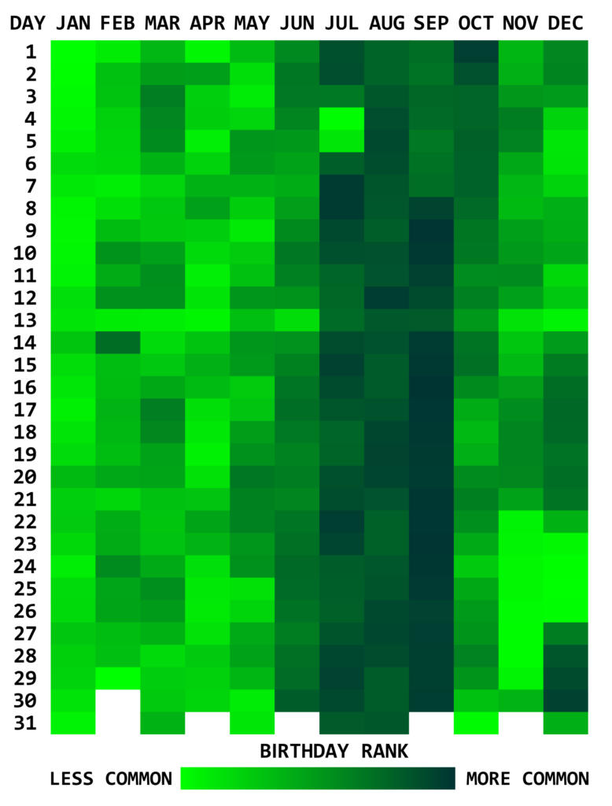

<sup>Source: [@aya-time-series]</sup>

### Polar Area Diagram
Think beyond the straight line! Sometimes, time series data can be cyclical -- a season in a year, time of the day, and so on. Polar area diagrams help represent the cyclical nature time series data cleanly. A polar diagram looks like a traditional pie chart, but the sectors differ from each other not by the size of their angles but by how far they extend out from the center of the circle.

**Polar area diagrams are useful for representing seasonal or cyclical time series data, such as climate or seasonal crop data. Multiple variables can be neatly stacked in the various sectors of the pie.**

It is crucial to clarify whether the variable is proportional to the area or radius of the sector. It is a good practice to have the area of the sectors proportional to the value being represented. In that case, the radius should be proportional to the square root of the value of the variable (since area of a circle is proportional to the square of the radius).


This popular polar area diagram created by Florence Nightingale shows causes of mortality among British troops in the Crimean War. Each color in the diagram represents a different cause of death. (Check out the the text legend for more details.)

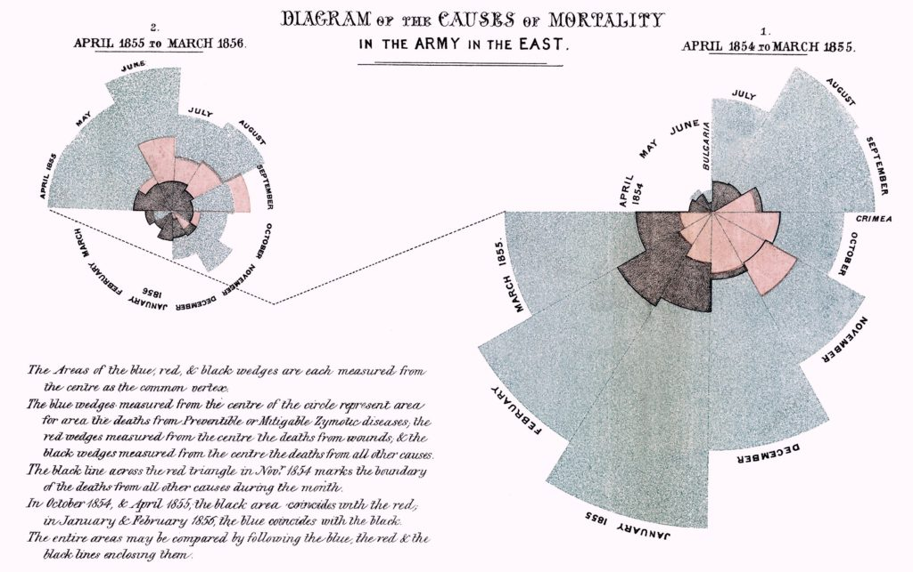

<sup>Source: [@aya-time-series]</sup>

[@TimeSeries]
This article explains how time series data visualization can sometimes be deceptive. 

It first takes an example of two random time series data and plots them on a graph which gives an impression that the two are strongly correlated. But if we do some statistical testing the two do not show any relationship, this is an example of **"correlation does not necessary mean causation"**. 

In another set of examples author has taken trending two random time series data and shown how even statistical tests can give a wrong interpretation. The article then explains using visualization how a general trended time series can be different than a more controlled and measured trending time series.

## 5 Tips to improve Data Visualization

### Comparison
**Include a zero baseline if possible.** Although a line chart does not have to start at a zero baseline, it should be included if it gives more context for comparison. If relatively small fluctuations in data are meaningful (e.g., in stock market data), you may truncate the scale to showcase these variances; Always choose the most efficient visualization; Watch your placement You may have two nice stacked bar charts that are meant to let your reader compare points, but if they’re placed too far apart to “get” the comparison, you’ve already lost; Tell the whole story. Maybe you had a 30% sales increase in Q4. Exciting! But what’s more exciting? Showing that you’ve actually had a 100% sales increase since Q1.

### Copy
**Don’t over explain.** If the copy already mentions a fact, the subhead, callout, and chart header don’t have to reiterate it; Keep chart and graph headers simple and to the point There’s no need to get clever, verbose, or pun-tastic. Keep any descriptive text above the chart brief and directly related to the chart underneath. **Remember: Focus on the quickest path to comprehension; Use callouts wisely Callouts are not there to fill space.** They should be used intentionally to highlight relevant information or provide additional context; Don’t use distracting fonts or elements Sometimes you do need to emphasize a point. If so, only use bold or italic text to emphasize a point—and don’t use them both at the same time.

### Color
**Use a single color to represent the same type of data; Watch out for positive and negative numbers.** Don’t use red for positive numbers or green for negative numbers. Those color associations are so strong it will automatically flip the meaning in the viewer’s mind; Make sure there is sufficient contrast between colors; Avoid patterns Stripes and polka dots sound fun, but they can be incredibly distracting. If you are trying to differentiate, say, on a map, use different saturation of the same color. On that note, only use solid-colored lines (not dashes); Select colors appropriately; Don’t use more than 6 colors in a single layout.

### Ordering
**Order data intuitively should have a logical hierarchy.** Order categories alphabetically, sequentially, or by value; Order consistently; Order evenly Use natural increments on your axes (0, 5, 10, 15, 20) instead of awkward or uneven increments (0, 3, 5, 16, 50).

### Audience perspective
**Let the users lead; Know your audience.** Designers should consider the way users prefer to understand information, even in choosing basic analytic approaches. For users to feel comfortable adopting and sharing insights from analytics, they must be able to explain and defend the data.

### Use layers to tell a story
**While style is one form of customization, layering unique data sets on a single visualization can tell a richer narrative and connect users to the data without getting too crowded.** On a map, this can be as simple as zooming in and out, but it can also involve drill-downs (choosing a data point and expanding it to show more detail), links and other shortcuts.

### Keep it simple
**Keep it as simple as possible!**Analytic results shouldn’t be presented to 10 decimal places when the user doesn’t need that level of precision to make a decision or understand a concept. Effective visual interfaces avoid 3-D effects or ornate gauge designs (a.k.a. “chart junk”) when simple numbers, maps or graphs will do.

references: [@French] [@Steier]


## Word Cloud

A Word Cloud or Tag Cloud is a visual representation of text data in the form of tags, which are typically single words whose importance is visualized by way of their size and color. It displays how frequently words appear in a given body of text, by making the size of each word proportional to its frequency.

Word clouds can add clarity during text analysis in order to effectively communicate your data results.It is an effective tool for Q researchers, marketers, Non-profits, Human resources ,Educators, Politicians and journalists.

**Pros of Word Clouds**

1. It is easy to understand and make an impact.
2. It can easily be shared.
3. It is visually engaging than a table data.
4. It is fast and reveals the essential. 
5. They delight and provide emotional connection.

**Cons of Word Clouds**

1. Emphasis based on length of the words.
2. Words whose letters contain many ascenders and descenders may receive more attention.
3. They're not very accurate.
4. A lot of data cleaning required before generating the word cloud.
5. Context is lost.

[@wordcloud]

**Ways of generating a word cloud**

**R:** The procedure of creating word clouds is very simple in R with text mining package (TM) and the word cloud generator package. The major steps involved are: text mining which involves text cleaning and transformation, building term-document matrix and generating word cloud [@r].

**Wordle:** Wordle is a toy for generating “word clouds” from text that you provide.It is very popular, free and easy to use. You do need Java though Chrome. In Wordle, you generate word clouds from text you input. Clouds can be tweaked with different color schemes, layouts, and fonts. Images created from this tool can be saved and reused [@wordle].

Other popular tools include ABCya, Tagul, Tag Crowd, CloudArt.

### Calendar View 
[@Calendar_Layout]

We have all seen the calendar views in the various data products that we worked on.  Please find an open source code that I found, this will help you replicate and create your own calendar:
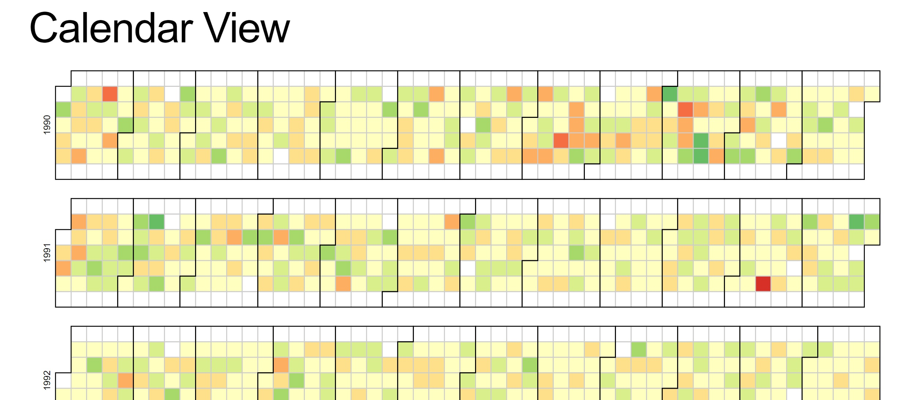

<sup>[@CalendarView]</sup>
 
Reproducible code for reference: 
This example demonstrates loading of CSV data, which is then quantized into a diverging color scale. The values are visualized as colored cells per day. Days are arranged into columns by week, then grouped by month and years. 

```{html}
<!DOCTYPE html>
<body>
<script src="https://d3js.org/d3.v4.min.js"></script>
<script>

var width = 960,
    height = 136,
    cellSize = 17;

var formatPercent = d3.format(".1%");

var color = d3.scaleQuantize()
    .domain([-0.05, 0.05])
    .range(["#a50026", "#d73027", "#f46d43", "#fdae61", "#fee08b", "#ffffbf", "#d9ef8b", "#a6d96a", "#66bd63", "#1a9850", "#006837"]);

var svg = d3.select("body")
  .selectAll("svg")
  .data(d3.range(1990, 2011))
  .enter().append("svg")
    .attr("width", width)
    .attr("height", height)
  .append("g")
    .attr("transform", "translate(" + ((width - cellSize * 53) / 2) + "," + (height - cellSize * 7 - 1) + ")");

svg.append("text")
    .attr("transform", "translate(-6," + cellSize * 3.5 + ")rotate(-90)")
    .attr("font-family", "sans-serif")
    .attr("font-size", 10)
    .attr("text-anchor", "middle")
    .text(function(d) { return d; });

var rect = svg.append("g")
    .attr("fill", "none")
    .attr("stroke", "#ccc")
  .selectAll("rect")
  .data(function(d) { return d3.timeDays(new Date(d, 0, 1), new Date(d + 1, 0, 1)); })
  .enter().append("rect")
    .attr("width", cellSize)
    .attr("height", cellSize)
    .attr("x", function(d) { return d3.timeWeek.count(d3.timeYear(d), d) * cellSize; })
    .attr("y", function(d) { return d.getDay() * cellSize; })
    .datum(d3.timeFormat("%Y-%m-%d"));

svg.append("g")
    .attr("fill", "none")
    .attr("stroke", "#000")
  .selectAll("path")
  .data(function(d) { return d3.timeMonths(new Date(d, 0, 1), new Date(d + 1, 0, 1)); })
  .enter().append("path")
    .attr("d", pathMonth);

d3.csv("dji.csv", function(error, csv) {
  if (error) throw error;

  var data = d3.nest()
      .key(function(d) { return d.Date; })
      .rollup(function(d) { return (d[0].Close - d[0].Open) / d[0].Open; })
    .object(csv);

  rect.filter(function(d) { return d in data; })
      .attr("fill", function(d) { return color(data[d]); })
    .append("title")
      .text(function(d) { return d + ": " + formatPercent(data[d]); });
});

function pathMonth(t0) {
  var t1 = new Date(t0.getFullYear(), t0.getMonth() + 1, 0),
      d0 = t0.getDay(), w0 = d3.timeWeek.count(d3.timeYear(t0), t0),
      d1 = t1.getDay(), w1 = d3.timeWeek.count(d3.timeYear(t1), t1);
  return "M" + (w0 + 1) * cellSize + "," + d0 * cellSize
      + "H" + w0 * cellSize + "V" + 7 * cellSize
      + "H" + w1 * cellSize + "V" + (d1 + 1) * cellSize
      + "H" + (w1 + 1) * cellSize + "V" + 0
      + "H" + (w0 + 1) * cellSize + "Z";
}
</script>
```

## An example to back some of our theories on 'how to tell stories using data visualization' / 'exploratory data visualization'

[@DataUSA]
MIT Media Lab in collaboration with Deloitte has created a new visualization tool, that aggregates US government open source data and mines information to generate trends and stories about cities, jobs, industries etc.
Just looking at any of the open data sources would give us an idea about the vastness (breadth and depth) of the available data. It is impressive that they have brought it all together on a single platform in a convenient format.
What stands out is the categorization of information on the website which enables the following:

1. Easy browsing of various categories of information available at a single glance
2. An easy search on any topic of interest and get deeper information
3. Logical construction of information using data and visuals under each category
4. Comparative analysis of cities
5. Variety of exploratory visualizations to learn from 
6. Most important - Storytelling through data, such as the evolution of the American Worker, how poverty is bad for your health, how men still dominate in the highest paying industries, and opioid addiction damage. 

We think of a topic, and it's possible it's there! The benefits to students, organizations, governments etc. is a better understanding of your consumers, talent pool, jobs, climate, which helps improve our decision-making ability. The best part is that the data is also available for download so we can replicate the visuals, redesign and tell our own stories with this data.
There are also other similar websites, that has some good visualizations on census data: [@CensusDataViz] 

**Automatic visualization is a bad idea, generally speaking.** Some might argue that automated visualization is a worthwhile pursuit. And I would agree that some parts of visualization certainly should be automatic, such as standard chart types and recurring geometries. Pieces of visualization, such as annotation and axis construction can be automatic. There are plenty of tools to make our lives easier.

But full-on automation where insight fountains out from any dataset are farfetched at this point, because this requires automatic analysis. The analysis is context-specific and requires more than boilerplate statistics. The most interesting visualization is context-specific.[@auto_viz]

In 2016, Arden Manning believed Workplace Automation making Data Visualization Smarter. According to him, the goal of data visualization tools was to make understanding data easier, but more often than not it doesn’t quite go to plan. We’ve all been there. The software is able to analyze huge amounts of data and incredible speeds, but how can it explain the results of that analysis? Today, the only means of doing this is with graphics. However, data visualization can’t explain data, leaving room for interpretation. The thought behind graphics makes sense – turn data into something easy to understand – but the reality is more complex, and we are left working late writing reports explaining how many trades were canceled and by what desks or why sales fell in August of 2015. Whenever I am stuck doing a repetitive task, I always think ‘why can’t we automate this’? And now, finally, technology has caught up. Narrative generation software can run as a plug-in to your dashboards. Tools like Savvy actually install on your server and allow every dashboard user to get a written summary anytime they want. This software is fully plugged and play, it takes seconds to install, and it’s easy to use. Today, it runs with Microsoft Excel, Qlik Sense 3.0, and is available as an API. In fact, the software even lets you copy and paste the text it generates so that you can use it in emails and reports explaining data. Yet again automation is making our working lives easier by automating repetitive tasks and allowing us to fully leverage existing data reserves.[@work_place]

According to Alysson Ferreira, a UI Engineer, he published his idea of Data Visualization tools in 2017. In this new era of information, there's an increasing need to understand the latest trends quickly and efficiently, which means there's also a need for meaningful sources of trustworthy information.[@UI_engineer]

This is where data visualization comes in. Data visualization is the art of displaying information by combining the beauty of imagery with the conciseness of statistics, which allows us to organize complex data into convenient graphical representations. In simple terms, data visualization is the art of translating complex data into meaningful information.[@future_viz]

We can also find the topic of data visualization's future on Quora. Amalie Sharma thought in future trend of data visualization are better tools, open for all, Increase in Interactivity/Animation and Portable Data. 

Plug in any data set into a magic box and it spits out a lovely visualization you can show all of your co-workers, friends, and family. That's the promise of a lot of startups, but it doesn't quite work that way. The goal of data visualization tools was to make understanding data easier, but more often than not it doesn't quite go to plan. The problem is that graphics alone don't fully explain data, and so we are inundated with queries: why did the numbers fall in whatever month? Data visualization can't explain data, leaving room for interpretation.

Although simple visualizations such as standard chart types (bar chart, line chart etc.) are already automated to a certain extend in Microsoft Office tools and other software available in the market, but full on automation where insight fountains out from any data set is far-fetched at this point, because this requires automatic analysis. The automated analysis here means that the tool or algorithm has to understand the context and also select the best visualization.

The focus in today's world has been on open source tools and technologies and these tools although being free for the most part require more effort to seamlessly integrate to the current visualization workflow. As mentioned in one of the articles about D3.js:

D3.js is one of the first data visualization tools that comes to mind when talking about free, open-source alternatives. It's a JavaScript-based library for creating web visualization and displays the results on the web page. However, with great power comes great responsibility. D3.js is extremely powerful and flexible, because it allows you to build amazing things with it, but as a trade-off, it's not the easiest tool to use, so you might need to spend some time going through the helpful library documentation.

At the end, it's not only about the tool its more about what you are trying to do; what your professor, client, business or whatever needs.


## Reusable Data Visualization Code in R
[@viz_R]

This site includes full sets of R code to generate specific types of graphs in ggplot2.  Plots in ggplot2 are created by using "layering".  There is a base plot and then other aspects of the plot such as aesthetics, titles ,and labels are added to using extra code. For those who favor Python for data visualization, this layering approach in R is actually similar to the syntax in Python's matplotlib library, in which set_style and specifying the axes labels and title are done separately from the code that generates the plot itself.

To provide an example the "layering" mentioned above, here is a generic snippet of code for creating a scatterplot with ggplot2 and the mtcars data set in R base, using this website's code as a template:
```{r}
library(ggplot2)

theme_set(theme_bw())  #set background theme

plot1 <- ggplot(mtcars, aes(x = hp, y = mpg)) + geom_point(aes(col=factor(vs), size = 2)) + geom_smooth(method = "loess", se = F) + xlim(c(0, 400)) + ylim(c(0, 40)) + labs(title = "Horsepower vs. MPG", y = "Miles Per Gallon", x = "Horsepower")

plot(plot1)  #we have to actually call the plot() function on the plot object we created
```
The ggplot2 package allows R users to go beyond the simple and often rudimentary-looking graphs in R and offers many ways of customizing data visualizations.  In a way, the layering technique also makes it easier to remember the code to generate these plots, since geom functions for the layers remain constant and they are all included in a single line of code.  

## Data Mining and Data Visualization

According to a paper in 2018, we can tell the difference of data mining from data visualizations. Here is a chart that helps us understand this better. [@data_mining]

In Data Mining, there are different processes involved in carrying out the data mining process such as data extraction, data management, data transformations, data pre-processing, etc.

In Data Visualization, the primary goal is to convey the information efficiently and clearly without any deviations or complexities in the form of statistical graphs, information graphs, and plots. 

The author has also listed top 7 comparisons between data mining and data visualization, and 12 key differences between data mining and data visualization. The article provides a very clear understanding of data mining and data visualization techniques. 

**BASIS FOR COMPARISON** | **Data Mining** | **Data Visualization**
------------------------------|---------------------------------------------------------------------------------------------------------------------------------------------------------|---------------------------------------------------------------------------------------------------------------------------------------------------------
Definition|Searches and produces a suitable result from large data chunks|Gives a simple overview of complex data
Preference|This is has different applications and preferred for web search engines|Preferred for data forecasting and predictions
Area|Comes under data science|Comes under the area of data science
Platform|Operated with web software systems or applications|Supports and works better in complex data analyses and applications
Generality|New technology but underdeveloped|More useful in real time data forecasting
Algorithm|Many algorithms exist in using data mining|No need of using any algorithms
Integration|Runs on any web-enabled platform or with any applications|Irrespective of hardware or software, it provides visual information


##Creating a Diverging Bar Chart

A diverging bar chart shows and compares positive and negative values for a particular variable.  One popular use case is survey analysis, in which multiple options are given as the categories, so each option has one bar, and there are two opposite ends of the spectrum for the values.  These two sides are usually 'positive' vs 'negative', but they can also be categorical values such as 'agree' or 'disagree'. 

Below is the R code template one can use to create a diverging bar chart.  Reference for the code: [@viz_R]

```{r}
library(ggplot2)
theme_set(theme_bw())  

# Data Prep
data("mtcars")  # load data
mtcars$`car name` <- rownames(mtcars)  # create new column for car names
mtcars$mpg_z <- round((mtcars$mpg - mean(mtcars$mpg))/sd(mtcars$mpg), 2)  # compute normalized mpg
mtcars$mpg_type <- ifelse(mtcars$mpg_z < 0, "below", "above")  # above / below avg flag
mtcars <- mtcars[order(mtcars$mpg_z), ]  # sort
mtcars$`car name` <- factor(mtcars$`car name`, levels = mtcars$`car name`)  # convert to factor to retain sorted order in plot.

# Diverging Barcharts
ggplot(mtcars, aes(x=`car name`, y=mpg_z, label=mpg_z)) + 
  geom_bar(stat='identity', aes(fill=mpg_type), width=.5)  +
  scale_fill_manual(name="Mileage", 
                    labels = c("Above Average", "Below Average"), 
                    values = c("above"="#00ba38", "below"="#f8766d")) + 
  labs(subtitle="Normalised mileage from 'mtcars'", 
       title= "Diverging Bars") + 
  coord_flip()
```

Diverging bar charts are also convenient to create in Tableau.  Below is an example using survey response data.


## 10 Useful Python Data Visualization Libraries 

[@PythonDataVizLibraries]

[Click here for sample charts for each]https://blog.modeanalytics.com/python-data-visualization-libraries/

**1.	Matplotlib**
Because matplotlib was the first Python data visualization library, many other libraries are built on top of it or designed to work in tandem with it during analysis.
While matplotlib is good for getting a sense of the data, it's not very useful for creating publication-quality charts quickly and easily.

**2.	Seaborn**
Seaborn harnesses the power of matplotlib to create beautiful charts in a few lines of code. The key difference is Seaborn's default styles and color palettes, which are designed to be more aesthetically pleasing and modern. Since Seaborn is built on top of matplotlib, you'll need to know matplotlib to tweak Seaborn's defaults.


**3.	Ggplot**
ggplot is based on ggplot2, an R plotting system, and concepts from The Grammar of Graphics. ggplot operates differently than matplotlib: it lets you layer components to create a complete plot. For instance, you can start with axes, then add points, then a line, a trendline, etc. Although The Grammar of Graphics has been praised as an "intuitive" method for plotting, seasoned matplotlib users might need time to adjust to this new mindset.

**4.	Bokeh**
Like ggplot, Bokeh is based on The Grammar of Graphics, but unlike ggplot, it's native to Python, not ported over from R. Its strength lies in the ability to create interactive, web-ready plots, which can be easily output as JSON objects, HTML documents, or interactive web applications. Bokeh also supports streaming and real-time data.

**5.	Pygal**
Like Bokeh and Plotly, pygal offers interactive plots that can be embedded in the web browser. Its prime differentiator is the ability to output charts as SVGs. As long as you're working with smaller datasets, SVGs will do you just fine. But if you're making charts with hundreds of thousands of data points, they'll have trouble rendering and become sluggish.

**6.	Plotly**
You might know Plotly as an online platform for data visualization, but did you also know you can access its capabilities from a Python notebook? Like Bokeh, Plotly's forte is making interactive plots, but it offers some charts you won't find in most libraries, like contour plots, dendograms, and 3D charts.

**7.	Geoplotlib**
geoplotlib is a toolbox for creating maps and plotting geographical data. You can use it to create a variety of map-types, like choropleths, heatmaps, and dot density maps. You must have Pyglet (an object-oriented programming interface) installed to use geoplotlib. Nonetheless, since most Python data visualization libraries don't offer maps, it's nice to have a library dedicated solely to them.

**8.	Gleam**
Gleam is inspired by R's Shiny package. It allows you to turn analyses into interactive web apps using only Python scripts, so you don't have to know any other languages like HTML, CSS, or JavaScript. Gleam works with any Python data visualization library. Once you've created a plot, you can build fields on top of it so users can filter and sort data.

**9.	Missingno**
Dealing with missing data is a pain. missingno allows you to quickly gauge the completeness of a dataset with a visual summary, instead of trudging through a table. You can filter and sort data based on completion or spot correlations with a heatmap or a dendrogram.

**10.	Leather**
Leather's creator, Christopher Groskopf, puts it best: "Leather is the Python charting library for those who need charts now and don't care if they're perfect." It's designed to work with all data types and produces charts as SVGs, so you can scale them without losing image quality. Since this library is relatively new, some of the documentation is still in progress. The charts you can make are pretty basic-but that's the intention.


