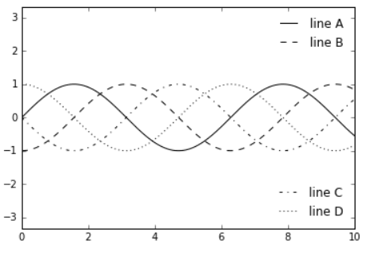

# Patterns

This chapter is a practical guide to a plethora of data visualizations; it explores different types of visualizations and tools and provides helpful tips for using them effectively.

## Outlier Detection  
[@outliar]

We can use data visualization for outlier detection in a data set. Different methods for outlier detection in functional data have been developed over the years. Several of these methods rely on different notions of functional depth, robust principal components, or random projections of infinite-dimensional data into R. Some distributional approaches have also been considered (Gervini, 2009). In functional data analysis, we observe curves defined over a given real interval and shape outliers may be defined as those curves that exhibit a different shape from the rest of the sample. Other types of outliers include:

| Outlier      | Description                                                 |
| ------------ | ----------------------------------------------------------- |
|Global Outliers (or “point anomalies”) | A data point is considered a global outlier if its value is far outside the entirety of the data set in which it is found. |
|Contextual (Conditional) Outliers | A data point is considered a contextual outlier if its value significantly deviates from the rest of the data points in the same context. Note that this means that the same value may not be considered an outlier if it occurred in a different context. If we limit our discussion to time series data, the “context” is almost always temporal, because time series data are records of a specific quantity over time. Contextual outliers are common in time series data. |
|Collective outliers | A subset of data points within a data set is considered anomalous if those values as a collection deviate significantly from the entire data set, but the values of the individual data points are not themselves anomalous in either a contextual or global sense. In time series data, one way this can manifest is as normal peaks and valleys occurring outside of a time frame when that seasonal sequence is normal or as a combination of time series data that is in an outlier as a group. |

Below is a simple example. Outlier treatment is important because it can drastically bias/change the fit estimates and predictions.

```{r Outliar Detection}
# Inject outliers into data.
cars1 <- cars[1:30, ]  # original data
cars_outliers <- data.frame(speed=c(19,19,20,20,20), dist=c(190, 186, 210, 220, 218))  # introduce outliers.
cars2 <- rbind(cars1, cars_outliers)  # data with outliers.

# Plot of data with outliers.
par(mfrow=c(1, 2))
plot(cars2$speed, cars2$dist, xlim=c(0, 28), ylim=c(0, 230), main="With Outliers", xlab="speed", ylab="dist", pch="*", col="red", cex=2)
plot(cars2$dist,cars2$speed)
```

```{r Outliar Detection2}
# Plot of original data without outliers. Note the change in slope (angle) of best fit line.
plot(cars1$speed, cars1$dist, xlim=c(0, 28), ylim=c(0, 230), main="Outliers removed \n A much better fit!", xlab="speed", ylab="dist", pch="*", col="red", cex=2)
```


Detection of Outliers is performed using:

* Univariate Approach
* Multivariate Approach
* Multivariate Model Approach


## Tips to Improve Data Visualization  
[@French], [@Steier]

### Comparison
Include a zero baseline if possible. Although a line chart does not have to start at a zero baseline, it should be included if it gives more context for comparison. If relatively small fluctuations in data are meaningful (e.g., in stock market data), you may truncate the scale to showcase these variances. Always choose the most efficient visualization. Watch your placement - You may have two nice stacked bar charts that are meant to let your reader compare points, but if they’re placed too far apart to “get” the comparison, you’ve already lost. Tell the whole story. Maybe you had a 30% sales increase in Q4. Exciting! But what’s more exciting? Showing that you’ve actually had a 100% sales increase since Q1.

### Copy
Don’t over explain if the copy already mentions a fact. The subhead, callout, and chart header don’t have to reiterate it. Keep the chart and graph headers simple and to the point. There’s no need to get clever, verbose, or puntastic. Keep any descriptive text above the chart brief and directly related to the chart underneath. Remember: Focus on the quickest path to comprehension. Use callouts wisely. Callouts are not there to fill space. They should be used intentionally to highlight relevant information or provide additional context. Don’t use distracting fonts or elements. Sometimes you do need to emphasize a point. If so, only use bold or italic text to emphasize a point — and don’t use them both at the same time.

### Color
Use a single color to represent the same type of data. Watch out for positive and negative numbers. Don’t use red for positive numbers or green for negative numbers. Those color associations are so strong it will automatically flip the meaning in the viewer’s mind. Make sure there is sufficient contrast between colors. Avoid patterns. Stripes and polka dots sound fun, but they can be incredibly distracting. If you are trying to differentiate, say, on a map, use different saturation of the same color. On that note, only use solid-colored lines (not dashes). Select colors appropriately. Don’t use more than 6 colors in a single layout.

**- Leveraging Color in Visuals**

|Use Case | Tip                   | Rationale                      |
| ------- | ----------------------| ------------------------------ |
Numerical Scales | Color for numerical scales should be used with caution. | The way you interpret a shade depends on the colors around it and sometimes it can lead to false conclusions. |
Color Associations | Color can be used to leverage long-term memory very quickly. | We automatically associated strawberries with red. If we can leverage the how people associate different colors with different things, we will not even need a legend to explicitly match color to meaning. |
Highlights | Bright colors can be used to highlight a certain part of the data. |Alarming colors draw the eye quickly to areas that need attention. |

### Ordering
Order data intuitively. There should be a logical hierarchy. Order categories alphabetically, sequentially, or by value. Order consistently. Order evenly. Use natural increments on your axes (0, 5, 10, 15, 20) instead of awkward or uneven increments (0, 3, 5, 16, 50).

### Audience Perspective
Let the users lead. Know your audience. Designers should consider the way users prefer to understand the information, even in choosing basic analytic approaches. For users to feel comfortable adopting and sharing insights from analytics, they must be able to explain and defend the data.

### Use Layers to Tell a Story
While style is one form of customization, layering unique data sets on a single visualization can tell a richer narrative and connect users to the data without getting too crowded. On a map, this can be as simple as zooming in and out, but it can also involve drill-downs (choosing a data point and expanding it to show more detail), links and other shortcuts.

### Keep It Simple
Analytic results shouldn’t be presented to 10 decimal places when the user doesn’t need that level of precision to make a decision or understand a concept. Effective visual interfaces avoid 3-D effects or ornate gauge designs (a.k.a. “chart junk”) when simple numbers, maps or graphs will suffice.


## Charts

### What makes a chart effective?
Data visualization is a combination of art and science. When it comes to the artistic aspect, there are no correct answers for doing the visualization. There are many ways to present the data. However, when making sense of facts, numbers, and measurements, a better understanding and effectiveness is promoted by a logical path to follow. To determine the best type of chart is hard for those new to data visualization. Most people learn it by referring to other people's work without understanding the underlying logic, so they don't have the theory in their mind to make the judgment.

Therefore, before we begin visualizing our data, we need to start with the following: 

* **Know the purpose**[@ chart_purpose] - (Analytical or Presentation)(Ref-https://research.tableau.com/sites/default/files/Kosara-C4PGV-2016.pdf): It is important to know the purpose of designing a visualization. In many cases, it is designed to explore or analyze data to enable readers to find insights in data themselves. But there are also cases when its purpose is to present and create awareness about certain findings or even to make a decision. For example, when a journalist creates a visualization for reporting on the current weather situation, the goal there is to mainly present the key trends and create awareness among the general public. When climate scientists create visualizations for communicating their results to policy makers on climate change, they are mainly calling for actions. 
* **Know your audience**[@ chart_audience]: After we know the why we are designing a visualization, it is important to know who are we targeting with that visual. No matter who your intended audience is, it is important to customize it to their needs, interest, level of expertise and analytical ability. Certain factors like their cultural preferences, expertise level, etc., also play a key role in designing an effective visualization. For eg., colors have a special  significance in Chinese culture. They use red to represent a dynamic or/and a positive event, such as growing sales in a region, while in most of the western world blue or green represents positive trends, such as sales revenue, etc. Similarly, a visualization designed for a finance analyst will be different from a visual designed for a marketing manager. Therefore, customization is key in ensuring effectiveness of a visualization. 
* **Know the right chart type**[@ chart_audience]: Once you know the purpose and have identified the target audience, it is important to choose the right chart type. Choosing the right visual, which could be a chart, map, table, dashboard or infographic, ensures that it resonates well with your audience. Also, it empowers the readers to explore the data, identify insights and make decisions after evaluating different scenarios. 

After answering these questions, you should be able to get a better image of your ideal graph. The simple guidance for using the different types of the chart is - line charts for tracking trends over time, bar charts to compare quantities, scatter plots for a joint variation of two data items, bubble charts showing the joint variation of three data items, and pie charts to compare parts of a whole. However, let's delve deeper into the various presentation styles and types of common charts.

### Chart Types
[@charts_viz]  
This is a survey of the most commonly used chart types, best use cases for each, and pros and cons of each.  

### Temporal Visualizations  
[@aya-time-series]  
What are some of the most common data visualizations seen in newspapers, textbooks, and corporate annual reports? Graphs showing a country's GDP growth trends or charts capturing a company's sales growth in the last 4 quarters would be high up on the list. **Essentially, these are visualizations that track time series data  -- the performance of an indicator over a period of time -- also known as temporal visualizations.**

Temporal visualizations are one of the simplest and quickest ways to represent important time series data. There are 7 handy temporal visualization styles for your time series data.

### Line Graph  
A line graph is the simplest way to represent time series data. It is intuitive, easy to create, and helps the viewer get a quick sense of how something has changed over time.

### Stacked Area Chart  
Stacked area charts are area charts similar to a line chart. In an area chart, multiple variables are "stacked" on top of each other, and the area below each line is colored to represent each variable. Stacked area charts are useful to show how both a cumulative total and individual components of that total changed over time. The order in which we stack the variables is crucial because sometimes, there can be a difference in the actual plot versus the human perception.

The figure below is a stacked area chart showing time series data:
 

(Source: [@aya-time-series])

### Bar Charts  
Bar charts represent data as horizontal or vertical bars. The length of each bar is proportional to the value of the variable at that point in time. A bar chart is the right choice when you wish to look at how the variable moved over time or when you wish to compare the variable with each other. Grouped or stacked bar charts help you combine both these purposes in one chart while keeping your visualization simple and intuitive. The chart plots the value vertically whereas we perceive the value to be at right angles to the general direction of the chart.

In the figure below, a bar graph would be a cleaner alternative.

 

(Source: [@aya-time-series])

For instance, the grouped bar chart in this interactive visualization of number of deaths by disease type in India not only lets you compare the deaths due to diarrhea, malaria, and acute respiratory disease across time, but also lets you compare the number of deaths by these three diseases in a given year. By switching to the stacked bar chart view, you get an intuitive sense of the proportion of deaths caused by each disease.
We can use two different bar charts to represent time series data.

### Column Charts for Time Series Data  
This should be the most popular chart type. This chart is good to do a comparison between different values when specific values are important.

Still have hard time to choose? There are many resources online which can help you make the decision. For example, Dr. Andre Abela creates a chart selection diagram that is helpful to pick the right chart depending on the data type. The link of website is]**


(Source: [@aya-time-series])


(Source: [@aya-time-series])

To avoid clutter and confusion, make sure not to use more than 3 variables in a stacked or group bar chart. It is also a good practice to use consistent bold colors and leave appropriate space between two bars in a bar chart.

### Gantt Chart  
**Gantt charts are a popular project management tool since they present a concise snapshot of various tasks spread across various phases of the project.** A Gantt chart is a horizontal bar chart showing work completed in a certain period of time with respect to the time allocated for that particular task. It is named after the American engineer and management consultant Henry Gantt who extensively used this framework for project management. You can show additional information such as the correlation between individual tasks, resources used in each task, overlapping resources, etc. by the use of colors and placement of bars in a Gantt chart.

The planning of logistics for a dance concert presents a situation in which a Gantt chart is a good option. There are many activities to be completed, some of which will take place simultaneously while some can only be done sequentially. For instance, the choreographers, soundtrack, and dancers need to be finalized before the choreography can begin. However, the costumes, props, and stage decor can be planned at the same time as the choreography. With careful preparation, Gantt charts can help you plan for complex, long-term projects that are likely to undergo several revisions and have various resource and task dependencies.

Gantt charts are a popular project management tool since they present a concise snapshot of various tasks spread across various phases of the project. You can show additional information such as the correlation between individual tasks, resources used in each task, overlapping resources, etc., by the use of colors and placement of bars in a Gantt chart.


### Stream Graph  
**Stream graphs are great to represent and compare time series data for multiple variables.** Stream graphs are, thus, apt for large data sets. Remember that choice of colors is very important, especially when there are lots of variables. Variables that do not have significantly high values might tend to get drowned out in the visualization if the colors are not chosen well.

(Source: [@aya-time-series])is essentially a stacked area graph, but displaced around a central horizontal axis. The stream graph looks like flowing liquid, hence the name. They are great to represent and compare time series data for multiple variables. Stream graphs are, thus, apt for large data sets. Remember that choice of colors is very important, especially when there are lots of variables. Variables that do not have significantly high values might tend to get drowned out in the visualization if the colors are not chosen well.  
A stream graph showing a randomly chosen listener's last.fm music-listening habits over time.


(Source: [@aya-time-series])

### Heat Map  
**Heat maps are perfect for a two-tiered time frame** -- for instance, 7 days of the week spread across 52 weeks in the year, or 24 hours in a day spread across 30 days of the month, and so on. The limitation, though, is that only one variable can be visualized in a heat map. Comparison between two or more variables is very difficult to represent in a heat map.

Geo-spatial visualizations often use heat maps since they quickly help identify "hot spots" or regions of high concentrations of a given variable. When adapted to temporal visualizations, heat maps can help us explore two levels of time in a 2D array. 

This heat map visualizes birthdays of babies born in the United States between 1973 and 1999. The vertical axis represents the 31 days in a month while the horizontal axis represents the 12 months in a year. This chart quickly helps us identify that a large number of babies were born in the latter half of July, August, and September.


(Source: [@aya-time-series])

### Polar Area Diagram  
Think beyond the straight line! Sometimes, time series data can be cyclical -- a season in a year, time of the day, and so on. Polar area diagrams help represent the cyclical nature time series data cleanly. A polar diagram looks like a traditional pie chart, but the sectors differ from each other not by the size of their angles but by how far they extend out from the center of the circle.

**Polar area diagrams are useful for representing seasonal or cyclical time series data, such as climate or seasonal crop data. Multiple variables can be neatly stacked in the various sectors of the pie.**

It is crucial to clarify whether the variable is proportional to the area or radius of the sector. It is a good practice to have the area of the sectors proportional to the value being represented. In that case, the radius should be proportional to the square root of the value of the variable (since the area of a circle is proportional to the square of the radius).

This popular polar area diagram created by Florence Nightingale shows causes of mortality among British troops in the Crimean War. Each color in the diagram represents a different cause of death. (Check out the  text legend for more details.)


(Source: [@aya-time-series])


### Time Series Data and Its Deceptive Potential  
[@TimeSeries]

This article explains how time series data visualization can sometimes be deceptive. 

It first takes an example of two random time series data and plots them on a graph which gives an impression that the two are strongly correlated. But if we do some statistical testing, the two do not show any relationship, this is an example of **"correlation does not necessarily mean causation"**. 

In another set of examples, the author has taken trending two random time series data and shown how even statistical tests can give a wrong interpretation. The article then explains using visualization how a general trended time series can be different than a more controlled and measured trending time series.

### Pie Chart and Why Pie Charts are Bad: a Comparison with the Bar Chart  
[@quach-penny]

Using a pie chart is usually considered as a bad idea when it comes to data visualization. Here, we explore some cons of using the pie chart to convey information and compare its effectiveness to the bar chart. 

**1.** Some information may be difficult to distinguish in a pie chart; however, if the data is presented with bar charts, differences in the data presented may be more obvious.


(Source: [@hickey-pie-worst])


(Source: [@hickey-pie-worst])

**2.** It is difficult to compare the slices of a circle to figure out the distinctions in size between each pie slice, especially when there are many categories.


(Source: [@hickey-pie-worst])

**3.** A pie chart is easily manipulated (e.g. using a 3D pie chart).


(Source: [@hickey-pie-worst])

**4.** A pie chart may be useful when comparing two different categories with different amounts of information. Specifically, it does a better job to distinguish two parts with a 25:75 split or one that is not 50:50 as people are sensitive to a right angle or a dividing line that is not straight. However, this could be done more simply by showing two numbers!


(Source: [@henry-defense-pie])


(Source: [@henry-defense-pie])


## Maps

**Use Maps Only When Effective**  
[@Bradshaw]  
Maps are a popular choice when it comes to displaying geographical data; they are more exciting and engaging than a simple bar or line chart but still easy to comprehend. Maps are attention-grabbing, so at the first glance they seem like a great option.

However, just because the data can be represented on a map does not mean that it should be. When used properly, a map can be an excellent choice for illustrating a story. However, if geographic information is not relevant to convey the desired message, then a visualizing your data using a map is actually counterproductive.  As with any visual, maps are not a universal solution simply because they are eye-catching.

One good use of a map is to show points or specific locations. This use of a map can show how points are distributed and reveal patterns, for example, certain areas having more high-end restaurants. This is not the right approach if the geographic information does not tell a story. If the story is more about comparing data such as median salary, a map is not the most effective. Caution should also be exercised with map visualizations if there are too many points and the data blurs together, causing the data to lose its meaning. 

Encoding the data is another potential area for confusion. The most popular methods are using color, shape, and size. Again, each of these can be effective when done properly, but many people misuse them. Using too many colors can make the chart harder to interpret. If necessary, data can be grouped into categories such as good and bad or high, medium and low. Shapes should be easily distinguished, so there shouldn't be too many unique ones. Also, if the use of shapes does not significantly add to the story, it is probably best to remove them. The size of a marker is a clear way to describe amounts but can easily become a problem if there are outliers. Locations with large values could obscure other data points. The best practice is to use just one of these methods rather than combining two or more.

Use of maps can be tricky. Geographical data doesn't imply that a map is the best choice to represent it. Maps can be useful for application where proximity matters, but for straight "what is higher" type comparisons, they're not very effective since large regions will draw more attention than smaller regions due to more concentrated color.


## Choosing the Right Baseline in Data Visualization  
[@baseline_2013]

The baseline is very important to data visualization. If the baseline is different, the appearance of the data may change drastically. Here is a case study to show the importance of baseline:

```{r}
# Create the data.
a <-rep(c(2010,2011,2012,2013,2014,2015),each = 4)
b <- seq(1:24)
c <- c(64.9,65.33,71.67,79.17,68.78,69.83,78.61,92.68,89.28,90.43,97.96,106.96,100.66,107.53,117.06,119.21,110.05,97.42,93.62,97.99,80,88.74,102.06,83)
data <- as.data.frame(cbind(a,b,c))
colnames(data) <-c("year","quater","sales")
```

**1.** Regular quarterly sales. We see sales decreased a lot around 2014.  **The baseline here is historical sales.**
```{r}
# Regular time series for sales
par(cex.axis=0.7)
data.ts <- ts(data$sales, start=c(2010, 1), frequency=4)
plot(data.ts, xlab="years", ylab="sales", main="sales per quater", las=1, bty="n")
```

**2.** Quarterly and yearly change sales. **The baseline here is zero and look at the percentage changes.**
```{r}
# Quaterly change
curr <- as.numeric(data$sales[-1])
prev <- as.numeric(data$sales[1:(length(data$sales)-1)])
quaChange <- 100 * round( (curr-prev) / prev, 2 )
barCols <- sapply(quaChange, 
	function(x) { 
		if (x < 0) {
			return("#8E1600")
		} else {
			return("#2cbd25")
		}
	})

barplot(quaChange, border=NA, space=0, las=1, col=barCols, main="% sales change, quaterly")
```

```{r}
# Year-over-year change
curr <- as.numeric(data$sales[-(1:4)])
prev <- as.numeric(data$sales[1:(length(data$sales)-4)])
annChange <- 100 * round( (curr-prev) / prev, 2 )
barCols <- sapply(annChange, 
	function(x) { 
		if (x < 0) {
			return("#8E1600")
		} else {
			return("#2cbd25")
		}
	})

barplot(annChange, border=NA, space=0, las=1, col=barCols, main="% sales change, annual")
```

From this plot, it is very clear that the magnitude drops in sales for some quarters.

**3.** The sales difference compare to now. **The baseline here is the current sales.**
```{r}
# Relative to current 2015
curr <- as.numeric(data$sales[length(data$sales)])
salesDiff <- as.numeric(data$sales) - curr
barCols.diff <- sapply(salesDiff,
	function(x) {
		if (x < 0) {
			return("#8E1600")
		} else {
			return("#2cbd25")
		}
	}
)
barplot(salesDiff, border=NA, space=0, las=1, col=barCols.diff, main="Sales difference from last quater 2015")
```

**4.** Sales difference compared to the first quarter. **The baseline here is the first quater sales.**
```{r}
# Relative to first quater
ori <- as.numeric(data$sales[1])
salesDiff <- as.numeric(data$sales) - ori
barCols.diff <- sapply(salesDiff,
	function(x) {
		if (x < 0) {
			return("#8E1600")
		} else {
			return("#2cbd25")
		}
	}
)
barplot(salesDiff, border=NA, space=0, las=1, col=barCols.diff, main="Sales difference from first quater 2010")
```

**5.** The difference between quarter sales and mean. ** The baseline is mean now.**
```{r}
# difference from the mean
mean <- mean(as.numeric(data$sales))
salesDiff <- as.numeric(data$sales) - mean
barCols.diff <- sapply(salesDiff,
	function(x) {
		if (x < 0) {
			return("gray")
		} else {
			return("black")
		}
	}
)
barplot(salesDiff, border=NA, space=0, las=1, col=barCols.diff, main="Sales difference from mean")
```

So before we start to plot, we should decide the baseline we want to use. Different baselines will lead to totally different graphs.


## Using Design Patterns to Find Greater Meaning in Your Data  
[@greater]

Visualizations that show comparisons, connections, and conclusions offer analytical clarity. 

Patterns based on function can help you see differences and similarities more clearly, understand relationships and behaviors more intimately, and predict future results with a greater level of certainty. When these patterns are presented as visualizations, they help you - 1) see comparisons, 2) make connections, and 3) draw conclusions from your data sets. The major functions can be described with the following examples:

### Comparisons


As shown in Figure 1, the bar chart with sparkline enables you to review the data at two different levels: a high-level assessment of the short-term three-month returns is represented with the bar chart, while the sparkline (the line chart below the bar) provides the details of the historical returns. Quickly and concisely, the sparkline shows you the path that has led up to the most recent returns. You can then assess that a narrow path provides consistent returns across the years while a wide path provides varied returns. Side-by-side comparisons of funds organized into two columns—% Returns and % Ahead of Benchmark—enables peer comparisons and fund-specific benchmark comparisons. Hence, you can see that not only has Global Large-Cap Core provided positive returns, it has also provided the best and most consistent returns when compared to the benchmark.

### Connections


The string of charts in Figure 2 shows 10-year to year-to-date (YTD) performance returns, which can be interpreted as individual charts or a group of category charts.

Similar to sounds waves, the symmetrical area charts grow equidistant from the source (the zero line) at each time interval to accentuate the returns even further. Here, the y-axis is shown in percentage. Instead of using the zero line to indicate positive or negative returns, it uses color to denote if the category returns are positive (black) or negative (red). For example, Multi-Cap Russell 3000 Growth produced 20% positive returns within the one-year time period and is shown with color fill in both directions from the zero line to purposefully duplicate the large gains and specifically uses black color fill to indicate the returns are positive. As evident from the name, the symmetrical chart doubles the returns to emphasize the amount of color fill.

What else can we derive from organizing the information in a spectrum of negative to positive returns? Based on this organization, three groups of categories have resulted in straight losses (red), heavy gains (black), or a mix of gains and losses across a decade of returns. The string of charts makes it easier to see these three groups of categories to assess their distribution. Just like sound waves, each chart is a sound bite that streams the returns for each category with a “scream” announcing a huge gain (e.g., Multi-Cap Russel 3000 Growth) or loss (e.g., Mid-Cap Russel Mid Cap Growth). In some cases (e.g., Large Cap S&P 500), the chart quietly announces mixed returns to adequately demand less attention.

Next, we might wonder how we would have fared if we had invested in certain funds. We might ask: if we had purchased this fund five years ago, what would the return be? And what about the YTD returns? Since market timing is key to investment choices, the following presentation of hypothetical investments represents a range of results. 

### Conclusions  


In Figure 3, varied performance results become clear with a layered approach to show five potential entry points (10-year, 5-year, 3-year, 1-year, YTD) into an investment. For example, the International Large Cap Core fund provided 27% YTD returns, which contrast the negative returns you would have received had you invested in the fund 1, 5, or 10 years ago. Here, conclusions are derived based on known inputs with a divided review of positive or negative outcomes (shown on the y-axis).

The line weights help to identify each entry point and show the range of differences between the entry points. Accordingly so, resulting returns are shown with simplified curves that connect the inputs and outputs. In this case, the chart has been customized to show an instance in which the user has opted to see the YTD return values as percentages listed to the right of each resulting output.


## Takeaways From Recreating One Chart Using 24 Tools  
[@different_tools]

Lisa Rost's article "What I learned recreating one chart using 24 tools" describes lessons learned from recreating one chart using many different data visualization tools. The author used apps Excel, Plotly, Easycharts, Google Sheets, Lyra, Highcharts, Tableau, Polestar, Quadrigram, Illustrator, RAW, and NodeBox, as well as charting libraries ggvis, Bokeh, Highcharts, ggplot2, Processing, NVD3, Seaborn, Vega, D3, matplotlib, Vega-Lite, and R. She links her GitHub page on the project which details the data set she used, containing the health expectancy in years as well as GDP per capita and population for about 200 countries in the year 2015, as well as her process and results of visualizing the data using each tool. However, in the article, she focuses on the main takeaways from the exercise, which was especially interesting in the context of our class discussion on different types of tools and their respective strengths. She also provides her own graphics to help illustrate her lessons learned. 

### Takeaway 1: There is No Perfect Tool, Just Good Tools for People with Certain Goals  
Since data visualization is used in a wide variety of fields, from science to journalism, data visualization projects will often have differing objectives, as the people working on them will have different requirements. As the author aptly points out, it is impossible for one tool to satisfy the need of every data visualizer. Each tool has its own pros and cons and it is up to the author in decided which is better suited to meet his/her's specific situation. Hence, when deciding on a tool or tools to use, one should always consider the purpose of the visualization. For example, consider if the visualization is to show exploratory data analysis or to be presented as a finding to the general public or a specific audience.


(Source:[@different_tools])

The author also notes that the flexibility of a tool is a sticking point as well if you need to change your data while developing a data visualization, as certain apps like Illustrator will not be ideal because changing the data even slightly requires you to build the graph again from scratch. Another thing to think about is the type of chart you are trying to create. Is a basic bar or line graph sufficient (in which case something like Excel will do the trick), or does your project require a more innovative or custom chart (using D3.js)? While interactivity is a plus point, relevancy of the visualization is more important.


(Source:[@different_tools])

### Takeaway 2: There Are No Perfect Tools, Just Good Tools for People with Certain Mindsets  
This section of the article is all about the difference in people's preferences and opinions; from the people who build the tools to the users, everyone thinks differently. Therefore, certain tools will be inherently more intuitive to use for different people. 

### Takeaway 3: We Still Live in an 'Apps Are for the Easy Stuff, Code Is for the Good Stuff in the World'  
Basically, writing code can be scary for anyone without a coding background, but it provides more flexibility, and, as mentioned in class, the code is perfectly reproducible. On the other hand, apps are much more user-friendly for the less computer science-savvy. 


(Source:[@different_tools])

### Takeaway 4: Every Tool Forces You Down a Path  
Rost quotes her former NPR Visuals teammate for the final lesson header, pointing out that tools themselves influence the development of a data visualization with their respective features, strengths, and limitations. 


(Source:[@different_tools])

  
## Word Cloud  
[@wordcloud]

A Word Cloud or Tag Cloud is a visual representation of text data in the form of tags, which are typically single words whose importance is visualized by way of their size and color. It displays how frequently words appear in a given body of text, by making the size of each word proportional to its frequency.

Word clouds can add clarity to text analysis in order to effectively communicate your data results.  

|**Pros of Word Clouds** | **Cons of Word Clouds** |
| :------------------: | :-------------------: |
| Impactful and easy to understand | Possibly erroneous emphasis based on length of the words |
| Quick to generate and easily shared | Words with letters that contain many ascenders and descenders may receive more attention |
| More visually engaging than a data table | Not very accurate |
| Reveals essential information | Requires a lot of data cleaning |
| Delightful and promote emotional connection | Context is lost |

**Ways to generate a word cloud**

**R:**  [@r]  
Creating word clouds is very simple in R with the text mining package (TM) and the word cloud generator package. The major steps involved are: text mining which involves text cleaning and transformation, building term-document matrix and generating word cloud.

**Python:** Source (www.geeksforgeeks.org/)
For generating word cloud in Python, modules needed are – matplotlib, pandas and wordcloud. By using a mask, you can generate wordclouds in arbitrary shapes. You can color a word-cloud by using an image-based coloring strategy implemented in ImageColorGenerator. It uses the average color of the region occupied by the word in a source image. You can combine this with masking - pure-white will be interpreted as ‘don’t occupy’ by the WordCloud object when passed as mask. If you want white as a legal color, you can just pass a different image to “mask”, but make sure the image shapes line up. You can also use the recolor method and custom coloring functions.

**Wordle:**  [@wordle]
Wordle is a toy for generating “word clouds” from the text that you provide.  It is free and easy to use. You do need Java through Chrome. In Wordle, you generate word clouds from text you give as input. Clouds can be tweaked with different color schemes, layouts, and fonts. Images created from this tool can be saved and reused [@wordle].

Other popular tools include ABCya, Tagul, Tag Crowd and CloudArt.


## Dashboards  
[@intuitive_dash],[@dashboard_practices]  


[@dashboard]
> "A dashboard is a visual display of the most important information needed to achieve one or more objectives; consolidated and arranged on a single screen so the information can be monitored at a glance." -Stephen Few

### Rules and Best Practices for Developing Intuitive Dashboards
Often, data visuals end up too intricate and overly complicated. A dashboard should be appealing but also easy to understand. Following these rules will lead to the effective presentation of the data.

|Best Practice | Description                                            |
| ------------ | ------------------------------------------------------ |
**The dashboard should read left to right** | Because we read from top to bottom and left to right, a reader's eyes will naturally look in the upper left of a page. The content should therefore flow like words in a book. It is important to note that the information at the top of the page does not always have to be the most important. Annual data is usually more important to a business but daily or weekly data could be used more often for day to day work. This should be kept in mind when designing a dashboard since dashboards are often used as a quick convenient way to look up data. |
**Group related information together** | Grouping related data together is an intuitive way to help the flow of the visual. It does not make sense for a user to have to search in different areas to find the information they need. |
**Find relationships between seemingly unrelated areas and display visuals together to show the relationship.** | Grouping unrelated data seems contradictory to the second rule, but the important thing is to tell a story not previously observed. Data analytics is all about finding stories the data are trying to tell. Once they are discovered, the stories need to be presented in an effective manner. Grouping unrelated data together makes it easier to see how they change together. |
**Choose metrics based on why they matter** | Chosen metrics should be important and relevant to the current task. That doesn't mean that each metric ought to be incorporated. You ought to be highly selective in determining which metrics earn a spot on your dashboard. Organization's core objectives, availability of  data that can shed light on the objectives, effectiveness of metric to  explain contribution to the objectives etc. are some of the aspects to consider while  choosing metrics. In short, every metric on your dashboard should connect to the organization objectives. |
**Keep it visual** | Dashboards are meant to be fast and easy to read. A well-designed, highly visual dashboard will be more widely adopted by audiences. Since metrics are also chosen in line with corporate objective, it will help in speeding peoples' understanding. This will also help see the  translation of individual department objectives into broader organizations objective. | Things to consider when designing a dashboard are use of colors, shapes, lines, thicknesses, degrees of shading etc.. Things to avoid are cute widgets, 3D graphic treatments, and graph types not commonly seen. |
**Make it interactive** | Interactive, highly visual dashboards should enable audience to perform basic analytical tasks, such as filtering the views, drilling down, examining underlying data etc. Viewers should be  able to get the big picture from the dashboard and then be able to drill down into a view that tells them the information they need  to get their jobs done. |
**Keep it current or don't bother** | Selected metrics should reflect current business challenges. You don't need up-to-the-minute data. Data can be current quarterly, weekly, hourly, etc. as relevant to the timeline of the organization. Ability to change and update the metrics represented in the dashboard is an important aspect. |
**Make it simple to access and use** | Making dashboards easily accessible is critical. Web distribution is ideal for this - especially if dashboards can constantly pull current data and can adhere to IT protocols and security standards. Another alternative is posting files on websites, Wiki's or blogs.


## Using Visualization Softwares and Libraries

### Using Shapes as Filters in Tableau When Your Fields Are Measures  
[@measures]  
This article [@measures] introduces the methodologies on how to use shapes as filters in Tableau when your fields are measures. It teaches you how to load custom shapes as action filters and use them for showing different graphs with those filters, which can make your visualization more interesting and interactive. You can also download the Tableau file for practice.

### How to Customize a Legend in Python with Matplotlib  
[@PythonDataScienceHandbook]
A legend shows descriptive labels and their respective colors or shapes for each plotted data series. A good legend helps us to better understand the graph and what each series represents.

#### Add a Basic Legend  
First, we need to import the matplotlib library in Python.  Then we use the legend() function to add a basic legend. For example, if we already have a line graph with multiple lines, we can add a legend to distinguish them from each other with the ax.legend() function, as shown below:
```{python eval=FALSE}
import matplotlib.pyplot as plt
plt.style.use('classic')
#matplotlib inline
import numpy as np

x = np.linspace(0, 10, 1000)
fig, ax = plt.subplots()
ax.plot(x, np.sin(x), '-b', label='Sine')
ax.plot(x, np.cos(x), '--r', label='Cosine')
ax.axis('equal')
leg = ax.legend();
```


#### Add a Legend on Different Position  
To specify the position of the legend, the 'loc' parameter inside the function can be used: 
```{python eval=FALSE}
ax.legend(loc='upper left', frameon=False)
fig
```


#### Customize a Box Surrounding the Legend  
We can also specify whether we want a box surrounding the legend with the 'fancybox' parameter: 
```{python eval=FALSE}
ax.legend(fancybox=True, framealpha=1, shadow=True, borderpad=1)
fig
```


#### Legend for Size of Points  
```{python eval=FALSE}
import pandas as pd
cities = pd.read_csv('data/california_cities.csv')

# Extract the data we're interested in
lat, lon = cities['latd'], cities['longd']
population, area = cities['population_total'], cities['area_total_km2']

# Scatter the points, using size and color but no label
plt.scatter(lon, lat, label=None,
            c=np.log10(population), cmap='viridis',
            s=area, linewidth=0, alpha=0.5)
plt.axis(aspect='equal')
plt.xlabel('longitude')
plt.ylabel('latitude')
plt.colorbar(label='log$_{10}$(population)')
plt.clim(3, 7)

# Here we create a legend:
# we'll plot empty lists with the desired size and label
for area in [100, 300, 500]:
    plt.scatter([], [], c='k', alpha=0.3, s=area,
                label=str(area) + ' km$^2$')
plt.legend(scatterpoints=1, frameon=False, labelspacing=1, title='City Area')

plt.title('California Cities: Area and Population');
```


#### Multiple Legends  
```{python eval=FALSE}
fig, ax = plt.subplots()

lines = []
styles = ['-', '--', '-.', ':']
x = np.linspace(0, 10, 1000)

for i in range(4):
    lines += ax.plot(x, np.sin(x - i * np.pi / 2),
                     styles[i], color='black')
ax.axis('equal')

# specify the lines and labels of the first legend
ax.legend(lines[:2], ['line A', 'line B'],
          loc='upper right', frameon=False)

# Create the second legend and add the artist manually.
from matplotlib.legend import Legend
leg = Legend(ax, lines[2:], ['line C', 'line D'],
             loc='lower right', frameon=False)
ax.add_artist(leg);
```

##How to customize a legend in MATLAB
Legend creates a legend with descriptive labels for each plotted data series. A good legend helps us to better understand the graph. For instance, we can accurately tell the meaning for a line of a plot or we can understand the extented range for certain colors from a legend. Without a legend, everything can be confusing for the readers.
I would like to introduce some basic methods of customizing a legend. 

**Add a basic legend**
First, we use the legend() function to add a basic legend. For example, say we already have a line graph and there are several lines on that plot. We can simply add a legend to distinguish them from each other by using the ax.legend() function.

```{html}
<!DOCTYPE html>
import matplotlib.pyplot as plt
plt.style.use('classic')
%matplotlib inline
import numpy as np

x = np.linspace(0, 10, 1000)
fig, ax = plt.subplots()
ax.plot(x, np.sin(x), '-b', label='Sine')
ax.plot(x, np.cos(x), '--r', label='Cosine')
ax.axis('equal')
leg = ax.legend();
</script>
```


**Add a legend on different position**
If we want it on a specific position of the plot, we can use loc='upper left' inside the function to indicate where you want to put the legend at. 
```{html}
<!DOCTYPE html>
ax.legend(loc='upper left', frameon=False)
fig
</script>
```


**Customize a box surrounding the legend**
Also, we can decide whether you need a box surrounding the legend or not. 

```{html}
<!DOCTYPE html>
ax.legend(fancybox=True, framealpha=1, shadow=True, borderpad=1)
fig
</script>
```


**Legend for the size of points**

```{html}
import pandas as pd
cities = pd.read_csv('data/california_cities.csv')

# Extract the data we're interested in
lat, lon = cities['latd'], cities['longd']
population, area = cities['population_total'], cities['area_total_km2']

# Scatter the points, using size and color but no label
plt.scatter(lon, lat, label=None,
            c=np.log10(population), cmap='viridis',
            s=area, linewidth=0, alpha=0.5)
plt.axis(aspect='equal')
plt.xlabel('longitude')
plt.ylabel('latitude')
plt.colorbar(label='log$_{10}$(population)')
plt.clim(3, 7)

# Here we create a legend:
# we'll plot empty lists with the desired size and label
for area in [100, 300, 500]:
    plt.scatter([], [], c='k', alpha=0.3, s=area,
                label=str(area) + ' km$^2$')
plt.legend(scatterpoints=1, frameon=False, labelspacing=1, title='City Area')

plt.title('California Cities: Area and Population');
</script>
```


**Multiple legends**
```{html}
<!DOCTYPE html>
fig, ax = plt.subplots()

lines = []
styles = ['-', '--', '-.', ':']
x = np.linspace(0, 10, 1000)

for i in range(4):
    lines += ax.plot(x, np.sin(x - i * np.pi / 2),
                     styles[i], color='black')
ax.axis('equal')

# specify the lines and labels of the first legend
ax.legend(lines[:2], ['line A', 'line B'],
          loc='upper right', frameon=False)

# Create the second legend and add the artist manually.
from matplotlib.legend import Legend
leg = Legend(ax, lines[2:], ['line C', 'line D'],
             loc='lower right', frameon=False)
ax.add_artist(leg);
```


#### ggplot2 code template for data viz in R

[@viz_R]  
This site includes full sets of R code to generate specific types of graphs in ggplot2.  Plots in ggplot2 are created by using "layering". Layering combines a base plot with other aspects such as aesthetics, titles, and labels using additional code. For those who favor Python for data visualization, this layering approach in R is actually quite similar to the syntax in Python's matplotlib library, in which set_style and specifying the axes labels and title are done separately from the code that generates the plot itself.

To provide an example of the "layering" mentioned above, here is a generic snippet of code for creating a scatterplot with ggplot2 and the mtcars data set in R base, using this website's code as a template:
```{r}
library(ggplot2)

theme_set(theme_bw())  #set background theme

plot1 <- ggplot(mtcars, aes(x = hp, y = mpg)) + geom_point(aes(col=factor(vs), size = 2)) + geom_smooth(method = "loess", se = F) + xlim(c(0, 400)) + ylim(c(0, 40)) + labs(title = "Horsepower vs. MPG", y = "Miles Per Gallon", x = "Horsepower")

plot(plot1)  #we have to actually call the plot() function on the plot object we created
```

The ggplot2 package allows R users to go beyond the simple and often rudimentary-looking graphs in R and offers many ways of customizing data visualizations.  The layering technique also makes it easier to remember the code to generate these plots, since geom functions for the layers remain constant and they are all included in a single line of code.  

#### Reusable Calendar View Code  
[@Calendar_Layout]  
We have all seen the calendar views in the various data products that we worked on. Below is an open source code which will help you replicate and create your own calendar:


<sup>[@CalendarView]</sup>
 
Reproducible code for reference: 
This example demonstrates loading of CSV data, which is then quantized into a diverging color scale. The values are visualized as colored cells per day. Days are arranged into columns by week, then grouped by month and years. 
```{html eval=FALSE}
<!DOCTYPE html>
<body>
<script src="https://d3js.org/d3.v4.min.js"></script>
<script>

var width = 960,
    height = 136,
    cellSize = 17;

var formatPercent = d3.format(".1%");

var color = d3.scaleQuantize()
    .domain([-0.05, 0.05])
    .range(["#a50026", "#d73027", "#f46d43", "#fdae61", "#fee08b", "#ffffbf", "#d9ef8b", "#a6d96a", "#66bd63", "#1a9850", "#006837"]);

var svg = d3.select("body")
  .selectAll("svg")
  .data(d3.range(1990, 2011))
  .enter().append("svg")
    .attr("width", width)
    .attr("height", height)
  .append("g")
    .attr("transform", "translate(" + ((width - cellSize * 53) / 2) + "," + (height - cellSize * 7 - 1) + ")");

svg.append("text")
    .attr("transform", "translate(-6," + cellSize * 3.5 + ")rotate(-90)")
    .attr("font-family", "sans-serif")
    .attr("font-size", 10)
    .attr("text-anchor", "middle")
    .text(function(d) { return d; });

var rect = svg.append("g")
    .attr("fill", "none")
    .attr("stroke", "#ccc")
  .selectAll("rect")
  .data(function(d) { return d3.timeDays(new Date(d, 0, 1), new Date(d + 1, 0, 1)); })
  .enter().append("rect")
    .attr("width", cellSize)
    .attr("height", cellSize)
    .attr("x", function(d) { return d3.timeWeek.count(d3.timeYear(d), d) * cellSize; })
    .attr("y", function(d) { return d.getDay() * cellSize; })
    .datum(d3.timeFormat("%Y-%m-%d"));

svg.append("g")
    .attr("fill", "none")
    .attr("stroke", "#000")
  .selectAll("path")
  .data(function(d) { return d3.timeMonths(new Date(d, 0, 1), new Date(d + 1, 0, 1)); })
  .enter().append("path")
    .attr("d", pathMonth);

d3.csv("dji.csv", function(error, csv) {
  if (error) throw error;

  var data = d3.nest()
      .key(function(d) { return d.Date; })
      .rollup(function(d) { return (d[0].Close - d[0].Open) / d[0].Open; })
    .object(csv);

  rect.filter(function(d) { return d in data; })
      .attr("fill", function(d) { return color(data[d]); })
    .append("title")
      .text(function(d) { return d + ": " + formatPercent(data[d]); });
});

function pathMonth(t0) {
  var t1 = new Date(t0.getFullYear(), t0.getMonth() + 1, 0),
      d0 = t0.getDay(), w0 = d3.timeWeek.count(d3.timeYear(t0), t0),
      d1 = t1.getDay(), w1 = d3.timeWeek.count(d3.timeYear(t1), t1);
  return "M" + (w0 + 1) * cellSize + "," + d0 * cellSize
      + "H" + w0 * cellSize + "V" + 7 * cellSize
      + "H" + w1 * cellSize + "V" + (d1 + 1) * cellSize
      + "H" + (w1 + 1) * cellSize + "V" + 0
      + "H" + (w0 + 1) * cellSize + "Z";
}
</script>
```


### Building Advanced Analytics Application with TabPy  
[@TabPy]  
Imagine a scenario where we can just enter some x values in a dashboard form, and the visualization would predict the y-variable! TabPy allows us to integrate and visualize data from Python in Tableau. 

The author here has given an example in which he tries to identify criminal hotspots in the area using data from Seattle's police department's 911 calls. The author uses machine learning (spatial clustering) and creates a great interactive visualization which allows viewers to click on the type of criminal activity to show various clusters.

There are other examples and use cases that may be downloaded, and the scripts are also given by the author to anyone who is interested in replicating the visualizations.

### Creating a Diverging Bar Chart  
[@viz_R]  
A diverging bar chart shows and compares positive and negative values for a particular variable.  One popular use case is survey analysis, in which multiple options are given as the categories, so each option has one bar, and there are two opposite ends of the spectrum for the values.  These two sides are usually 'positive' vs 'negative', but they can also be categorical values such as 'agree' or 'disagree'. 

Below is the R code template one can use to create a diverging bar chart.  
```{r}
library(ggplot2)
theme_set(theme_bw())  

# Data Prep
data("mtcars")  # load data
mtcars$`car name` <- rownames(mtcars)  # create new column for car names
mtcars$mpg_z <- round((mtcars$mpg - mean(mtcars$mpg))/sd(mtcars$mpg), 2)  # compute normalized mpg
mtcars$mpg_type <- ifelse(mtcars$mpg_z < 0, "below", "above")  # above / below avg flag
mtcars <- mtcars[order(mtcars$mpg_z), ]  # sort
mtcars$`car name` <- factor(mtcars$`car name`, levels = mtcars$`car name`)  # convert to factor to retain sorted order in plot.

# Diverging Barcharts
ggplot(mtcars, aes(x=`car name`, y=mpg_z, label=mpg_z)) + 
  geom_bar(stat='identity', aes(fill=mpg_type), width=.5)  +
  scale_fill_manual(name="Mileage", 
                    labels = c("Above Average", "Below Average"), 
                    values = c("above"="#00ba38", "below"="#f8766d")) + 
  labs(subtitle="Normalised mileage from 'mtcars'", 
       title= "Diverging Bars") + 
  coord_flip()
```

Diverging bar charts are also convenient to create in Tableau.  Below is an example using survey response data.


