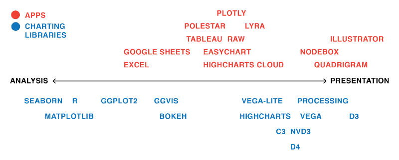
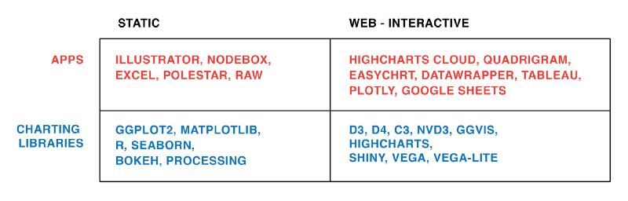

# Patterns


 
## Building advanced analytics application with TabPy** 
[@TabPy]
 
Imagine a scenario where we can just enter some x values in a dashboard form, and the visualization would predict the y variable!!! Here is a link that shows how to integrate and visualize data from Python in Tableau. This is especially relevant to all data science students, as this is one of the tools used for visualizing advanced analytics. The author here has given an example using data from Seattle's police department's 911 calls and he tries to identify criminal hotspots in the area.The author uses machine learning (spatial clustering) and creates a great interactive visualization, where you can click on the type of criminal activity and the graph will show various clusters.There are other examples and use cases that may be downloaded, and the scripts are also given by the author for anyone who is interested in trying it out. 

## Pick the Right Chart Type
Data visualization is a combination of art and science. When it comes to the artistic aspect, there are no correct answers for doing the visualization. There are many ways to present the data. However, when making sense of facts, numbers, and measurement, better understanding is promoted by a logical path to follow. To determine the best type of chart is hard for those new to data visualization. Most people learn it by referring to other people's work without understanding the underlying logic, so they don't have the theory in their mind to make the judgement.

When we are choosing the type of chart, we need to answer some questions: 

* How many features would you like to show in a chart? 
* How many data points do you want to display for each variable? 
* Will you display time serious data or among items or groups. 

After answered this question, you should able to get a better imagination of your ideal graph. The simple guidance for using different type of chart is line charts for tracking trends over time, bar charts to compare quantities, scatter plots for joint variation of two data items, bubble charts showing joint variation of three data items, and pie charts to compare parts of a whole.
 
Let's review the most commonly used chart types and explain what circumstance should better use typical chart and the pros and cons of each type of chart. Before introduce different types of charts, you can use the following website to familiar with different types of charts [@charts_viz]. 

**Type 1 Column Charts.** 
This should be the most popular chart type. This chart is good to do comparison between different values when specific values are important. TBD 

Still have hard time to choose? There are many resources on line can help you do the decision. For example, Dr. Andre Abela create a chart selection diagram that is helpful to pick the right chart depends on the data type. The link of website is

## Why pie chart is bad: a comparison with bar chart

Using pie chart is usually considered as a bad idea when it comes to data visualization. But why? Here, we explore some cons of using pie chart to convey information and compare its effectiveness to bar chart [@hickey-pie-worst] [@henry-defense-pie] [@quach-penny].

1. Some information may look nearly identical in pie chart. But if the data is presented with bar charts, the story is different.
See figure \@ref(fig:hickey-before) and \@ref(fig:hickey-after) for examples.


Source: [@hickey-pie-worst]


Source: [@hickey-pie-worst]

2. It is difficult to compare the slices of a circle to figure out the distinctions in size between each pie slice, especially when there are a lot of categories. **
See figure \@ref(fig:hickey-breakdown) for example.


(Source: [@hickey-pie-worst])

3. Pie chart is easy to be manipulated (e.g. using a 3D pie chart). See figure \@ref(fig:hickey-3D) for example. 


Source: [@hickey-pie-worst]

4. Pie chart may be useful when comparing 2 different categories with different amounts of information.
Specifically, it does a better job to distinguish two parts with a 25:75 split or one that is not 50:50 as people are sensitive to a right angle or a dividing line that is not straight. But this could be simply done by showing two numbers! See figure \@ref(fig:henry-quarter) and \@ref(fig:henry-half) for examples.


(Source: [@henry-defense-pie])


(Source: [@henry-defense-pie])

## Chose the right baseline in data visualization
Baseline is very important to data visualization. If baseline is different, the meaning will change a lot. Now here is a case study to show the importance of baseline and how to use it in different ways. 

Here I use the same method for a new data set to .

```{r}
# Create the data.
a <-rep(c(2010,2011,2012,2013,2014,2015),each = 4)
b <- seq(1:24)
c <- c(64.9,65.33,71.67,79.17,68.78,69.83,78.61,92.68,89.28,90.43,97.96,106.96,100.66,107.53,117.06,119.21,110.05,97.42,93.62,97.99,80,88.74,102.06,83)
data <- as.data.frame(cbind(a,b,c))
colnames(data) <-c("year","quater","sales")
```

1. Regular quarterly sales. We can see sales decreased a lot around 2014.  **The baseline here is historical sales.**
```{r}
# Regular time series for sales
par(cex.axis=0.7)
data.ts <- ts(data$sales, start=c(2010, 1), frequency=4)
plot(data.ts, xlab="", ylab="", main="sales per quater", las=1, bty="n")
```

2. Quarterly and yearly change sales. **The baseline here is zero and look at the percentage changes.**
```{r}
# Quaterly change
curr <- as.numeric(data$sales[-1])
prev <- as.numeric(data$sales[1:(length(data$sales)-1)])
quaChange <- 100 * round( (curr-prev) / prev, 2 )
barCols <- sapply(quaChange, 
	function(x) { 
		if (x < 0) {
			return("#2cbd25")
		} else {
			return("gray")
		}
	})

barplot(quaChange, border=NA, space=0, las=1, col=barCols, main="% change, quaterly")
```


```{r}
# Year-over-year change
curr <- as.numeric(data$sales[-(1:4)])
prev <- as.numeric(data$sales[1:(length(data$sales)-4)])
annChange <- 100 * round( (curr-prev) / prev, 2 )
barCols <- sapply(annChange, 
	function(x) { 
		if (x < 0) {
			return("#2cbd25")
		} else {
			return("gray")
		}
	})

barplot(annChange, border=NA, space=0, las=1, col=barCols, main="% change, annual")
```
From this plot, it is very clear that the magnitude of drops in sales for some quarters.

3. The sales difference compare to now. **The baseline here is the current sales.**
```{r}
# Relative to current 2015
curr <- as.numeric(data$sales[length(data$sales)])
salesDiff <- as.numeric(data$sales) - curr
barCols.diff <- sapply(salesDiff,
	function(x) {
		if (x < 0) {
			return("gray")
		} else {
			return("black")
		}
	}
)
barplot(salesDiff, border=NA, space=0, las=1, col=barCols.diff, main="Sales difference from last quater 2015")
```

4. Sales difference compared to the first quarter. ** The baseline here is the first quater sales.**
```{r}
# Relative to first quater
ori <- as.numeric(data$sales[1])
salesDiff <- as.numeric(data$sales) - ori
barCols.diff <- sapply(salesDiff,
	function(x) {
		if (x < 0) {
			return("gray")
		} else {
			return("black")
		}
	}
)
barplot(salesDiff, border=NA, space=0, las=1, col=barCols.diff, main="Sales difference from first quater 2010")
```

5. The difference between quarter sales and mean. ** The baseline is mean now.**
```{r}
# difference from the mean
mean <- mean(as.numeric(data$sales))
salesDiff <- as.numeric(data$sales) - mean
barCols.diff <- sapply(salesDiff,
	function(x) {
		if (x < 0) {
			return("gray")
		} else {
			return("black")
		}
	}
)
barplot(salesDiff, border=NA, space=0, las=1, col=barCols.diff, main="Sales difference from mean")
```

So before we start to plot, we should decide the baseline we want to use. Different baseline will lead to totally different graphs.

## Using design patterns to find greater meaning in your data
Visualizations that show comparisons, connections, and conclusions offer analytical clarity. Patterns based on function can help you see differences and similarities more clearly, understand relationships and behaviors more intimately, and predict future results with a greater level of certainty. When these patterns are presented as visualizations, they help you 1) see comparisons, 2) make connections, and 3) draw conclusions from your data sets. The major functions can be described as:

### Comparisons
```{r pressure1, eval=FALSE, echo=FALSE, out.width = '100%'}
knitr::include_graphics('/Users/yuyingjie/Desktop/1.jpg')
```
As shown in Figure 1, the bar chart with sparkline enables you to review the data at two different levels: a high-level assessment of the short-term three-month returns is represented with the bar chart, while the sparkline (the line chart below the bar) provides the details of the historical returns. Quickly and concisely, the sparkline shows you the path that has led up to the most recent returns. You can then assess that a narrow path provides consistent returns across the years while a wide path provides varied returns. Side-by-side comparisons of funds organized into two columns—% Returns and % Ahead of Benchmark—enables peer comparisons and fund-specific benchmark comparisons. Hence, you can see that not only has Global Large Cap Core provided positive returns, it has also provided the best and most consistent returns when compared to the benchmark.


### Connections
The string of charts in Figure 2 shows 10-year to year-to-date (YTD) performance returns, which can be interpreted as individual charts or a group of category charts.
```{r pressure2, eval=FALSE, echo=FALSE, out.width = '100%'}
knitr::include_graphics('/Users/yuyingjie/Desktop/2.jpg')
```
Similar to sounds waves, the symmetrical area charts grow equidistant from the source (the zero line) at each time interval to accentuate the returns even further. Here, the y-axis is shown in percentage. Instead of using the zero line to indicate positive or negative returns, it uses color to denote if the category returns are positive (black) or negative (red). For example, Multi Cap Russell 3000 Growth produced 20% positive returns within the one-year time period and is shown with color fill in both directions from the zero line to purposefully duplicate the large gains and specifically uses black color fill to indicate the returns are positive. As evident from the name, the symmetrical chart doubles the returns to emphasize the amount with color fill.

What else can you derive from organizing the information in a spectrum of negative to positive returns? Based on this organization, three groups of categories have resulted in straight losses (red), heavy gains (black), or a mix of gains and losses across a decade of returns. The string of charts makes it easier for you to see these three groups of categories to assess their distribution. Just like sound waves, each chart is a sound bite that streams the returns for each category with a “scream” announcing a huge gain (e.g., Multi-Cap Russel 3000 Growth) or loss (e.g., Mid Cap Russel Mid Cap Growth). In some cases (e.g., Large Cap S&P 500), the chart quietly announces mixed returns to adequately demand less attention.

Next, you might wonder how you would have fared if you had invested in certain funds. You might ask: if I had purchased this fund five years ago, what would my return be? And what about the YTD returns? Since market timing is key to investment choices, the following presentation of hypothetical investments represents a range of results. 

### Conclusions
```{r pressure3, eval=FALSE, echo=FALSE, out.width = '100%'}
knitr::include_graphics('/Users/yuyingjie/Desktop/3.jpg')
```
In Figure 3, varied performance results become clear with a layered approach to show five potential entry points (10-year, 5-year, 3-year, 1-year, YTD) into an investment. For example, the International Large Cap Core fund provided 27% YTD returns, which contrast the negative returns you would have received had you invested in the fund 1, 5, or 10 years ago. Here, conclusions are derived based on known inputs with a divided review of positive or negative outcomes (shown on the y-axis).

The line weights help to identify each entry point and show the range of differences between the entry points. Accordingly so, resulting returns are shown with simplified curves that connect the inputs and outputs. In this case, the chart has been customized to show an instance in which the user has opted to see the YTD return values as percentages listed to the right of each resulting output.[@data_meaning]


## Example Visualizations of Time Series Data

Reference: [@aya-time-series]
What are some of the most common data visualizations you see in newspapers, textbooks, and corporate annual reports? Graphs showing a country's GDP growth trends or charts capturing a company's sales growth in the last 4 quarters would be high up on the list. Essentially, these are visualizations that track time series data  -- the performance of an indicator over a period of time -- also known as temporal visualizations.

Temporal visualizations are one of the simplest, quickest ways to represent important time series data. There are 7 handy temporal visualization styles for your time series data.

1. *Line Graph*. A line graph is the simplest way to represent time series data. It is intuitive, easy to create, and helps the viewer get a quick sense of how something has changed over time.
2. *Stacked Area Chart* is an area chart similar to a line chart. In an area chart, multiple variables are "stacked" on top of each other, and the area below each line is colored to represent each variable.
3. *Bar Charts* represent data as horizontal or vertical bars. The length of each bar is proportional to the value of the variable at that point in time. A bar chart is the right choice for you when you wish to look at how the variable moved over time or when you wish to compare variables versus each other. Grouped or stacked bar charts help you combine both these purposes in one chart while keeping your visualization simple and intuitive.
4. A *Gantt Chart* is a horizontal bar chart showing work completed in a certain period of time with respect to the time allocated for that particular task. It is named after the American engineer and management consultant Henry Gantt who extensively used this framework for project management.
5. A *Stream Graph* is essentially a stacked area graph, but displaced around a central horizontal axis. The stream graph looks like flowing liquid, hence the name.
6. *Heat Map* Geo-spatial visualizations often use heat maps since they quickly help identify "Hot spots" or regions of high concentrations of a given variable. When adapted to temporal visualizations, heat maps can help us explore two levels of time in a 2D array.
7. *Polar Area Diagram*. Think beyond the straight line! Sometimes, time series data can be cyclical -- a season in a year, time of the day, and so on. Polar area diagrams help represent the cyclical nature time series data cleanly. A polar diagram looks like a traditional pie chart, but the sectors differ from each other not by the size of their angles but by how far they extend out from the center of the circle.

Figure \@ref(fig:aya-stacked) is a stacked area chart showing time series data:
```{r aya-stacked, echo=FALSE, out.width='60%', fig.align="center", fig.cap='Student enrollments in India from 2001-10. (Source: [@aya-time-series])'}
knitr::include_graphics("images/aya-stacked.png")
```

Stacked area charts are useful to show how both a cumulative total and individual components of that total changed over time.

The order in which we stack the variables is crucial because there can sometimes be a difference in the actual plot versus human perception. The chart plots the value vertically whereas we perceive the value to be at right angles to the general direction of the chart. For instance, in the figure below, a bar graph would be a cleaner alternative.

```{r aya-stacked-perception, echo=FALSE, out.width='30%', fig.align="center", fig.cap='Human perception vs actual value. (Source: [@aya-time-series])'}
knitr::include_graphics("images/aya-stacked-perception.jpg")
```

For instance, this grouped bar chart in this interactive visualization of number of deaths by disease type in India not only lets you compare the deaths due to diarrhea, malaria, and acute respiratory disease across time, but also lets you compare the number of deaths by these three diseases in a given year. By switching to the stacked bar chart view, you get an intuitive sense of the proportion of deaths caused by each disease.

```{r aya-bar, echo=FALSE, out.width='40%', fig.align="center", fig.show='hold', fig.cap='Two different bar charts to represent time series data. (Source: [@aya-time-series])'}
knitr::include_graphics(c("images/aya-bar1.png", "images/aya-bar2.png"))
```

To avoid clutter and confusion, make sure to not use more than 3 variables in a stacked or group bar chart. It is also a good practice to use consistent bold colors and leave appropriate space between two bars in a bar chart. Also, check out our blog on 5 common mistakes that lead to bad data visualization to learn why the base axis for your bar charts should start from zero.

```{r aya-gantt, echo=FALSE, out.width='50%', fig.align="center", fig.show='hold', fig.cap='A typical Gantt chart. (Source: [@aya-time-series])'}
knitr::include_graphics("images/aya-gantt.png")
```

Assume you're planning the logistics for a dance concert. There are lots of activities to be completed, some of which will take place simultaneously while some can be done only after another activity has been completed. For instance, the choreographers, soundtrack, and dancers need to be finalized before the choreography can begin. However, the costumes, props, and stage decor can be planned at the same time as the choreography. With careful preparation, Gantt charts can help you plan for complex, long-term projects that are likely to undergo several revisions and have various resource and task dependencies.

Gantt charts are a popular project management tool since they present a concise snapshot of various tasks spread across various phases of the project. You can show additional information such as the correlation between individual tasks, resources used in each task, overlapping resources, etc., by the use of colors and placement of bars in a Gantt chart.

```{r aya-stream, echo=FALSE, out.width='60%', fig.align="center", fig.cap='A stream graph showing a randomly chosen listener\'s last.fm music-listening habits over time. (Source: [@aya-time-series])'}
knitr::include_graphics("images/aya-stream.png")
```

Stream graphs are great to represent and compare time series data for multiple variables. Stream graphs are, thus, apt for large data sets. Remember that choice of colors is very important, especially when there are lots of variables. Variables that do not have significantly high values might tend to get drowned out in the visualization if the colors are not chosen well.

This heat map visualizes birthdays for babies born in the United States between 1973 and 1999. The vertical axis represents the 31 days in a month while the horizontal axis represents the 12 months in a year. This chart quickly helps us identify that a large number of babies were born in the later half of July, August, and September.

```{r aya-heat-map, echo=FALSE, out.width='40%', fig.align="center", fig.cap='Heat map can be useful to present 2-D time data. (Source: [@aya-time-series])'}

```

Heat maps are perfect for a two-tiered time frame -- for instance, 7 days of the week spread across 52 weeks in the year, or 24 hours in a day spread across 30 days of the month, and so on. The limitation, though, is that only one variable can be visualized in a heat map. Comparison between two or more variables is very difficult to represent.

This popular polar area diagram created by Florence Nightingale shows causes of mortality among British troops in the Crimean War. Each color in the diagram represents a different cause of death. (Check out the the text legend for more details.)

```{r aya-polar, echo=FALSE, out.width='50%', fig.align="center", fig.cap='Source: [@aya-time-series]'}
knitr::include_graphics("images/aya-polar.jpg")
```

Polar area diagrams are useful for representing seasonal or cyclical time series data, such as climate or seasonal crop data. Multiple variables can be neatly stacked in the various sectors of the pie.

It is crucial to clarify whether the variable is proportional to the area or radius of the sector. It is a good practice to have the area of the sectors proportional to the value being represented. In that case, the radius should be proportional to the square root of the value of the variable (since area of a circle is proportional to the square of the radius).


## Avoiding Common Mistakes with Time Series
This article explains how time series data visualization can sometimes be deceptive. It first takes an example of two random time series data and plots them on a graph which gives an impression that the two are strongly correlated. But if we do some statistical testing the two do not show any relationship, this is an example of "correlation does not necessary mean causation". In another set of examples author has taken trending two random time series data and shown how even statistical tests can give a wrong interpretation. The article then explains using visualization how a general trended time series can be different than a more controlled and measured trending time series.
master


## Word Cloud

A Word Cloud or Tag Cloud is a visual representation of text data in the form of tags, which are typically single words whose importance is visualized by way of their size and color. It displays how frequently words appear in a given body of text, by making the size of each word proportional to its frequency.

Word clouds can add clarity during text analysis in order to effectively communicate your data results.It is an effective tool for Q researchers, marketers, Non-profits, Human resources ,Educators, Politicians and journalists.

** Pros of Word Clouds **

1. It is easy to understand and make an impact.
2. It can easily be shared.
3. It is visually engaging than a table data.
4. It is fast and reveals the essential. 
5. They delight and provide emotional connection..

** Cons of Word Clouds **

1. Emphasis based on length of the words.
2. Words whose letters contain many ascenders and descenders may receive more attention.
3. They're not very accurate.
4. Lot of data cleaning required before generating word cloud.
5. Context is lost.

[@wordcloud]

** Ways of generating a word cloud **

**R:** The procedure of creating word clouds is very simple in R with text mining package (tm) and the word cloud generator package. The major steps involved are: text mining which involves text cleaning and transformation, building term-document matrix and generating word cloud [@r].
**Wordle:** Wordle is a toy for generating “word clouds” from text that you provide.It is very popular, free and easy to use. You do need Java though Chrome. In Wordle, you generate word clouds from text you input. Clouds can be tweaked with different color schemes, layouts, and fonts. Images created from this tool can be saved and reused [@wordle].

Other popular tools include ABCya, Tagul, Tag Crowd, CloudArt.

### Calendar View 
(Reproducible code for reference)

[@Calendar_Layout]

We have all seen the calendar views in the various data products that we worked on.  Please find below an open source code that I found, this will help you replicate and create your own calendar:


We have all seen the calendar views in the various data products that we worked on. Please find below an open source code that I found, this will help you replicate and create your own calendar:
[@CalendarView]
 

This example demonstrates loading of CSV data, which is then quantized into a diverging color scale. The values are visualized as colored cells per day. Days are arranged into columns by week, then grouped by month and years. 

<!DOCTYPE html>
<body>
<script src="https://d3js.org/d3.v4.min.js"></script>
<script>

var width = 960,
    height = 136,
    cellSize = 17;

var formatPercent = d3.format(".1%");

var color = d3.scaleQuantize()
    .domain([-0.05, 0.05])
    .range(["#a50026", "#d73027", "#f46d43", "#fdae61", "#fee08b", "#ffffbf", "#d9ef8b", "#a6d96a", "#66bd63", "#1a9850", "#006837"]);

var svg = d3.select("body")
  .selectAll("svg")
  .data(d3.range(1990, 2011))
  .enter().append("svg")
    .attr("width", width)
    .attr("height", height)
  .append("g")
    .attr("transform", "translate(" + ((width - cellSize * 53) / 2) + "," + (height - cellSize * 7 - 1) + ")");

svg.append("text")
    .attr("transform", "translate(-6," + cellSize * 3.5 + ")rotate(-90)")
    .attr("font-family", "sans-serif")
    .attr("font-size", 10)
    .attr("text-anchor", "middle")
    .text(function(d) { return d; });

var rect = svg.append("g")
    .attr("fill", "none")
    .attr("stroke", "#ccc")
  .selectAll("rect")
  .data(function(d) { return d3.timeDays(new Date(d, 0, 1), new Date(d + 1, 0, 1)); })
  .enter().append("rect")
    .attr("width", cellSize)
    .attr("height", cellSize)
    .attr("x", function(d) { return d3.timeWeek.count(d3.timeYear(d), d) * cellSize; })
    .attr("y", function(d) { return d.getDay() * cellSize; })
    .datum(d3.timeFormat("%Y-%m-%d"));

svg.append("g")
    .attr("fill", "none")
    .attr("stroke", "#000")
  .selectAll("path")
  .data(function(d) { return d3.timeMonths(new Date(d, 0, 1), new Date(d + 1, 0, 1)); })
  .enter().append("path")
    .attr("d", pathMonth);

d3.csv("dji.csv", function(error, csv) {
  if (error) throw error;

  var data = d3.nest()
      .key(function(d) { return d.Date; })
      .rollup(function(d) { return (d[0].Close - d[0].Open) / d[0].Open; })
    .object(csv);

  rect.filter(function(d) { return d in data; })
      .attr("fill", function(d) { return color(data[d]); })
    .append("title")
      .text(function(d) { return d + ": " + formatPercent(data[d]); });
});

function pathMonth(t0) {
  var t1 = new Date(t0.getFullYear(), t0.getMonth() + 1, 0),
      d0 = t0.getDay(), w0 = d3.timeWeek.count(d3.timeYear(t0), t0),
      d1 = t1.getDay(), w1 = d3.timeWeek.count(d3.timeYear(t1), t1);
  return "M" + (w0 + 1) * cellSize + "," + d0 * cellSize
      + "H" + w0 * cellSize + "V" + 7 * cellSize
      + "H" + w1 * cellSize + "V" + (d1 + 1) * cellSize
      + "H" + (w1 + 1) * cellSize + "V" + 0
      + "H" + (w0 + 1) * cellSize + "Z";
}
</script>

## Data Visualization Tools

Due to the rise of big data analytics, there has been an increased need for data visualization tools to help understand the data. Besides Tableau, there are several other software tools one can use for data visualization like Sisense, Plotly, FusionCharts, Highcharts, Datawrapper, and Qlikview. This article is from Forbes and has a brief, clear introduction about these 7 powerful software options for data visualization. This could be helpful for future reference because for different purposes I may need to use different tools. Each option has its advantages and disadvantages and this article helps highlight them.

**Tool** | **Description**
------------------------------|---------------------------------------------------------------------------------------------------------------------------------------------------------
**Tableau**| The most popular in the group and has many users. It is simple to use, making it easy to learn and can handle large data sets. Tableau can handle big data thanks to integration with database handling applications such as MySQL, Hadoop, and Amazon AWS.
**Qlikview**| The the main competitor to Tableau and is also quite popular. Qlikview is customizable and has a wide range of features which can be a double-edged sword. These features take more time to learn and get acquainted with. However, once one gets past the learning curve, they have a powerful tool at their disposal.
**FusionCharts**| The distinctive aspect of FusionCharts is that graphics do not have to be created from scratch. Users can start with a template and insert their own data from their project.
**Highcharts:** | It proudly claims to be used by 72% of the 100 biggest companies in the world. It is a simple tool that does not require specialized training and quickly generates the desired output. Unlike some tools, Highcharts focuses on cross-browser support, allowing for greater access and use.
**Datawrapper:**| It is making a name for itself in the media industry. It has a simple user interface making it easy to generate charts and embed into reports.
**Plotly:**| It can create more sophisticated visuals thanks to integration with programming languages such as Python and R. The danger is creating something more complicated than necessary. The whole point of data visualization is to quickly and clearly convey information.
**Sisense:**|It can bring together multiple sources of data for easier access. It can even work with large data sets. Sisense makes it easy to share finished products across departments, ensuring everyone can get the information they need.

**Building advanced analytics application with TabPy**
 [@TabPy]
 Imagine a scenario where we can just enter some x values in a dashboard form, and the visualization would predict the y variable!!! 
 Here is a link that shows how to integrate and visualize data from Python in Tableau. This is especially relevant to all data science students, as this is one of the tools used for visualizing advanced analytics. 
 The author here has given an example using data from Seattle's police department's 911 calls and he tries to identify criminal hotspots in the area.The author uses machine learning (spatial clustering) and creates a great interactive visualization, where you can click on the type of criminal activity and the graph will show various clusters. 
 There are other examples and use cases that may be downloaded, and the scripts are also given by the author for anyone who is interested in trying it out. 

### Comparison of Different Tools

**Interactive Data Visualization**

In Data Mining, there are different processes involve carrying out the data mining process such as data extraction, data management, data transformations, data pre-processing, etc.
In Data Visualization, the primary goal is to convey the information efficiently and clearly without any deviations or complexities in the form of statistical graphs, information graphs, and plots. 
Also, the author listed the top 7 comparisons between data mining and data visualization, and 12 key differences between data mining and data visualization. After reading the article, you will have a very clear understanding of what are data mining and data visualization and the characters for those two techniques. 

## Interactive Data Visualization
 
Interactive or Dynamic data visualization delivers today’s complex sea of data in a graphically compelling and an easy-to-understand way. It enables direct actions on a plot to change elements and link between multiple plots. It enables users to accomplish traditional data exploration tasks by making charts interactive[@benefits_interactive_viz].

Benefits of Interactive Data Visualization Software:
 
1. Absorb information in constructive ways: With the volume and velocity of data created everyday, dynamic data viz enables enhanced process optimization, insight discovery and decision making. 
2. Visualize relationships and patterns: Helps in better understanding of correlations among operational data and business performance. 
3. Identify and act on emerging trends faster: Helps decision makers to grasp shifts in behaviors and trends across multiple data sets much more quickly. 
4. Manipulate and interact directly with data: Enables users to engage data more frequently. 
5. Foster a new business language : Ability to tell a story through data that instantly relates the performance of a business and its assets.
 
**There are multiple ways by which interactive data visualizations can be developed:**
 
### D3.js 
D3.js stands for Data Driven Document, a JS library for interactive Big Data visualization in literally ANY way required real-time[@d3_interactive_viz]. This is not a tool, mind you, so a user should have a solid understanding of JavaScript to work with the data and present it in a humanly-understandable form. To say more, this library renders the data into SVG and HTML5 formats, so older browsers like IE7 and 8 cannot leverage D3.js capabilities.

The data gathered from disparate sources like huge-scale data sets is bind in real-time with DOM to produce interactive animations ( 2D and 3D alike) in an extremely rapid way. The D3 architecture allows the users to intensively reuse the codes across a variety of add-ons and plug-ins. Some of the key advantages are: It is dynamic, free and open source and very flexible with all web technologies, the ability to handle big data and the functional style allows to reuse the codes.

**The Hitchhiker' Guide to d3.js** is a wonderful guide for self-teaching d3.js. This guide is meant to prepare readers mentally as well as give readers some fruitful directions to pursue. There is a lot to learn besides the d3.js API, both technical knowledge around web standards like HTML, SVG, CSS and JavaScript as well as communication concepts and data visualization principles. Chances are you know something about some of those things, so this guide will attempt to give you good starting points for the things you want to learn more about.

It starts from the insights of learning d3.js by showing interviews with those top visualization practitioners. Then the author gives key concepts and useful features for learning visualization like d3-shape, d3 selection, d3-collection, ds-hierarchy, ds-zoom as well as d3-force.

My favorite part of this guide is it lists a lot of useful resources links for learning d3.js. For example, it recommends d3 API Reference, 2000+ d3 case studies and tutorials for d3. I did my exploratory analysis version of group project on d3. And I found this guide helpful during the progress. It also includes some meetup groups here in the bay area. So, maybe we can meet data friends through the group.

### Tableau
Tableau is amid the market leaders for the Big Data visualization, especially efficient for delivering interactive data visualization for the results derived from Big Data operations, deep learning algorithms and multiple types of AI-driven apps [@tableau_interactive_viz]. Tableau can be integrated with Amazon AWS, MySQL, Hadoop, Teradata and SAP, making this solution a versatile tool for creating detailed graphs and intuitive data representation. This way the C-suite and middle-chain managers are able to make grounded decisions based on informative and easily-readable Tableau graphs. Tableau is business intelligence (BI) and analytics platform created for the purposes of helping people see, understand, and make decisions with data. It is the industry leader in interactive data visualization tools, offering a broad range of maps, charts, graphs, and more graphical data presentations. It is a painless option when cost is not a concern and you do not need advanced and complex analysis.The application is very handy for quickly visualizing trends in data, connecting to a variety of data sources, and mapping cities/regions and their associated data.
 
The key advantages are: It provides non technical user the ability to build complex reports and dashboard with zero coding skills. Using drag-n-drop functionalities of Tableau, user can create a very interactive visuals within minutes. It can handle millions of rows of data with ease and users can make live to connections to different data sources like SQL etc.


[@VizBP]
[@ExtremePre]

### R Shiny
R Shiny enables us to produce interactive data visualizations with a minimum knowledge of HTML, CSS, or Java using a simple web application framework that runs under the R statistical platform [@shiny_interactive_viz]. Standalone apps can be hosted on a webpage or embedded in R Markdown documents and dashboards can be built using R shiny. It combines the computational power of R with the interactivity of the modern web. The main advantages of using R Shiny are : Its flexibility of pulling in whatever package in R that you want to solve your problem, reaping the benefits of an open source ecosystem for R and JavaScript visualization libraries, thereby allowing to create highly custom applications and enabling timely, high quality interactive data experience without (or with much less) web development and without the limitations or cost of proprietary BI tools.
 
### Jupyter

### Google chart
A free and powerful integration of all Google power. The tool is rendering the resulting charts to HTML5/SVG, so they are compatible with any browser. Support for VML ensures compatibility with older IE versions, and the charts can be ported to the latest releases of Android and iOS. What’s even more important, Google chart combines the data from multiple Google services like Google Maps. This results in producing interactive charts that absorb data real-time and can be controlled using an interactive dashboard. 
[https://towardsdatascience.com/top-4-popular-big-data-visualization-tools-4ee945fe207d](https://towardsdatascience.com/top-4-popular-big-data-visualization-tools-4ee945fe207d)

## Tips for Tableau
1. Running totals
2. Common Baseline
3. Weighted averages
4. Moving average
5. Grouping by aggregates 
6. Different years comparison
7. Appending excel sheets
8. Bar chart totals
9. Fixed axis when re-drawing charts
10. Auto-fitting screen behavior depending on data selection

## What I learned recreating one chart using 24 tools
Lisa Rost's article "What I learned recreating one chart using 24 tools" describes lessons learned from recreating one chart using many different data visualization tools [@different_tools]. The author used apps Excel, Plotly, Easycharts, Google Sheets, Lyra, Highcharts, Tableau, Polestar, Quadrigram, Illustrator, RAW, and NodeBox, as well as charting libraries ggvis, Bokeh, Highcharts, ggplot2, Processing, NVD3, Seaborn, Vega, D3, matplotlib, Vega-Lite, and R. She links her github page on the project which details the data set she used, containing the health expectancy in years as well as GDP per capita and population for about 200 countries in the year 2015, as well has her process and results of visualizing the data using each tool. However, in the article, she focuses on the main takeaways from the exercise, which was especially interesting in the context of our class discussion on different types of tools and their respective strengths. She also provides her own graphics to help illustrate her lessons learned. 

Takeaway 1: **“There Are No Perfect Tools, Just Good Tools for People with Certain Goals”**
Since data visualization is necessary in many spheres, from science to journalism, data visualization projects will often have quite disparate objectives, and the people working on them will have different requirements. And as the author aptly points out, it is impossible for one tool to satisfy the needs of every data visualizer; so there will necessarily be tools better suited to specific situations. For example, does the user need a tool for exploratory visualization of the data, or does the user seek to create graphs and charts to show the public or a specific audience something? 



The author also notes that the flexibility of a tool is a sticking point as well—if you need to change your data while developing a data visualization, certain apps like Illustrator will not be ideal because changing the data even slightly requires you to build the graph again from scratch. Another thing to think about is the type of chart you are trying to create—is a basic, canned bar or line graph all you need (in which case something like Excel will do the trick), or does your project necessitate a more innovative or custom chart (like something possible in D3.js)? Interactivity is another big question—only certain tools will make this possible.



Takeaway 2: **“There Are No Perfect Tools, Just Good Tools for People with Certain Mindsets”**

This section of the article is all about the difference in people’s preferences and opinions; from the people who build the tools to the users, everyone thinks differently. Therefore, certain tools will be inherently more intuitive to use for different people. 

Takeaway 3: **“ We Still Live in an ‘Apps Are for the Easy Stuff, Code Is for the Good Stuff in the World”**
Basically, writing code can be scary for anyone without a coding background, but it provides more flexibility, and, as mentioned in class, code is perfectly reproducible. On the other hand, apps are much more user-friendly for the less computer science-savvy. 


Takeaway 4: **“‘Every Tool Forces You Down a Path’”**

Rost quotes her former NPR Visuals teammate for the final lesson header, pointing out that tools themselves influence the development of a data visualization with their respective features, strengths, and limitations. 


## An example to back some of our theories on 'how to tell stories using data visualization' / 'exploratory data visualization'

[@DataUSA]
MIT Media Lab in collaboration with Deloitte has created a new visualization tool, that aggregates US government open source data from various sources and mines information to generate trends and stories about cities, jobs, industries etc. to the common man.
Just looking at any of the open data sources would give us an idea about the vastness (breadth and depth) of the available data. It is amazing to see how they have brought it all together on a single platform in a very easy to decipher format.
What caught my attention here is the categorization of Information on the website that enables the following:

1. Easy browsing of various categories of information available at a single glance
2. Easy search on any topic of interest and get deeper information on each
3. Logical construction of information using data and visuals under each category
4. Comparative Analysis of cities
5. Variety of exploratory visualizations to learn from 
6. Most important - Stories that these data tell For e.g. Evolution of the American Worker, Poverty is bad for your health, Men still dominate in the highest paying industries, Opioid addiction damage and so many others. 

We think of a topic, and its possible it's there! Value add to students, organizations, governments etc. is better understanding of your consumers, talent pool, jobs, climate, and what not, that just improves our decision-making ability manifold by spending just a few seconds on the website And for this class, the best part is that the data is also available for download. So, we can easily download this data, replicate the visuals and try to redesign and tell our own stories with this data.
There is also other similar websites, that has some good visualizations on census data: [@CensusDataViz] 

Automatic visualization is a bad idea, generally speaking. Some (many?) might argue that automated visualization is a worthwhile pursuit. And I would agree that some parts of visualization certainly should be automatic, such as standard chart types and recurring geometries. Pieces of visualization, such as annotation and axis construction can be automatic. There are plenty of tools to make our lives easier.

But full on automation where insight fountains out from any dataset is farfetched at this point, because this requires automatic analysis. Analysis is context-specific and requires more than boilerplate statistics. The most interesting visualization is context-specific.

In 2016, Arden Manning believed Workplace Automation making Data Visualization Smarter. According to him, the goal of data visualization tools was to make understanding data easier, but more often than not it doesn’t quite go to plan. We’ve all been there. The software is able to analyze huge amounts of data and incredible speeds, but how can it explain the results of that analysis? Today, the only means of doing this is with graphics. However, data visualization can’t explain data, leaving room for interpretation. The thought behind graphics makes sense – turn data into something easy to understand – but the reality is more complex, and we are left working late writing reports explaining how many trades were cancelled and by what desks or why sales fell in August of 2015. Whenever I am stuck doing a repetitive task, I always think ‘why can’t we automate this’? And now, finally, technology has caught up. Narrative generation software can run as a plug-in to your dashboards. Tools like Savvy actually install on your server and allow every dashboard user to get a written summary anytime they want. This software is fully plug and play, it takes seconds to install, and it’s easy to use. Today, it runs with Microsoft Excel, Qlik Sense 3.0, and is available as an API. In fact, the software even lets you copy and paste the text it generates so that you can use it in emails and reports explaining data. Yet again automation is making our working lives easier by automating repetitive tasks and allowing us to fully leverage existing data reserves.

According to Alysson Ferreira, a UI Engineer, he published his idea of Data Visualization tools in 2017. In this new era of information, there's an increasing need to understand the latest trends quickly and efficiently, which means there's also a need for meaningful sources of trustworthy information.  

This is where data visualization comes in. Data visualization is the art of displaying information by combining the beauty of imagery with the conciseness of statistics, which allows us to organize complex data into convenient graphical representations. In simple terms, data visualization is the art of translating complex data into meaningful information.

We can also find topic of data visualization's future on Quora. Amolie Sharma thought in future trend of data visualization are better tools, open for all, Increase in Interactivity/Animation and Portable Data. 

Plug in any data set into a magic box and it spits out a lovely visualization you can show all of your co-workers, friends, and family. That's the promise of a lot of start ups, but it doesn't quite work that way. The goal of data visualization tools was to make understanding data easier, but more often than not it doesn't quite go to plan. The problem is that graphics alone don't fully explain data, and so we are inundated with queries: why did the numbers fall in whatever month? Data visualization can't explain data, leaving room for interpretation.

Although simple visualizations such as standard chart types (bar chart, line chart etc.) are already automated to a certain extend in Microsoft Office tools and other software available in the market, but full on automation where insight fountains out from any data set is far-fetched at this point, because this requires automatic analysis. Automated analysis here means that the tool or algorithm has to understand the context and also select the best visualization.

The focus in today's world has been on open source tools and technologies and these tools although being free for most part require more effort to seamlessly integrate to the current visualization workflow. As mentioned in one of the articles about D3.js:

D3.js is one of the first data visualization tools that comes to mind when talking about free, open-source alternatives. It's a JavaScript based library for creating web visualization and displays the results on the web page. However, with great power comes great responsibility. D3.js is extremely powerful and flexible, because it allows you to build amazing things with it, but as a trade-off, it's not the easiest tool to use, so you might need to spend some time going through the helpful library documentation.

At the end its not only about the tool its more about what you are trying to do; what your professor, client, business or whatever needs.


## Reusable Data Visualization Code in R
[@viz_R]

This site includes full sets of R code to generate specific types of graphs in ggplot2.  Plots in ggplot2 are created by using "layering".  There is a base plot and then other aspects of the plot such as aesthetics, titles and labels are added on using extra code.  For those who favor Python for data viz, this layering approach in R is actually similar to the syntax in Python's matplotlib library, in which set_style and specifying the axes labels and title are done separately from the code that generates the plot itself.

To provide an example the "layering" mentioned above, here is a generic snippet of code for creating a scatterplot with ggplot2 and the mtcars data set in R base, using this website's code as a template:
```{r}
library(ggplot2)

theme_set(theme_bw())  #set background theme

plot1 <- ggplot(mtcars, aes(x = hp, y = mpg)) + geom_point(aes(col=factor(vs), size = 2)) + geom_smooth(method = "loess", se = F) + xlim(c(0, 400)) + ylim(c(0, 40)) + labs(title = "Horsepower vs. MPG", y = "Miles Per Gallon", x = "Horsepower")

plot(plot1)  #we have to actually call the plot() function on the plot object we created
```
The ggplot2 package allows R users to go beyond the simple and often rudimentary-looking graphs in R and offers many ways of customizing data visualizations.  In a way, the layering technique also makes it easier to remember the code to generate these plots, since geom functions for the layers remain constant and they are all included in a single line of code.  


## Data Mining and Data Visualization

According to a paper in 2018, we can tell difference of data mining from data visualizations. Here is a chart that helps us understand this better.

**BASIS FOR COMPARISON** | **Data Mining** | **Data Visualization**
------------------------------|---------------------------------------------------------------------------------------------------------------------------------------------------------|---------------------------------------------------------------------------------------------------------------------------------------------------------
Definition|Searches and produces a suitable result from large data chunks|Gives a simple overview of complex data
Preference|This is has different applications and preferred for web search engines|Preferred for data forecasting and predictions
Area|Comes under data science|Comes under the area of data science
Platform|Operated with web software systems or applications|Supports and works better in complex data analyses and applications
Generality|New technology but underdeveloped|More useful in real time data forecasting
Algorithm|Many algorithms exist in using data mining|No need of using any algorithms
Integration|Runs on any web-enabled platform or with any applications|Irrespective of hardware or software, it provides visual information

In Data Mining, there are different processes involve carrying out the data mining process such as data extraction, data management, data transformations, data pre-processing, etc.

In Data Visualization, the primary goal is to convey the information efficiently and clearly without any deviations or complexities in the form of statistical graphs, information graphs, and plots. 

Also, the author listed the top 7 comparisons between data mining and data visualization, and 12 key differences between data mining and data visualization. After reading the article, you will have a very clear understanding of what are data mining and data visualization and the characters for those two techniques. 
