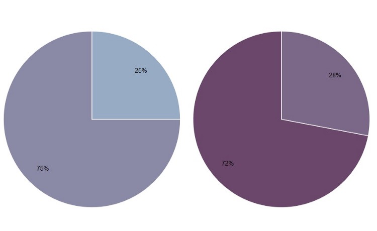

# Patterns

 + Reusable solutions to everyday data visualization questions
 + Applied by multiple members of the course

## Why pie chart is bad: a comparison with bar chart

Using pie chart is usually considered as a bad idea when it comes to data visualization. But why? Here, we explore some cons of using pie chart to convey information and compare its effectiveness to bar chart [@hickey-pie-worst] [@henry-defense-pie] [@quach-penny].

1. Some information may look nearly identical in pie chart. But if the data is presented with bar charts, the story is different. See figure \@ref(fig:hickey-before) and \@ref(fig:hickey-after) for examples.

```{r hickey-before, echo=FALSE, out.width='70%', fig.show='hold', fig.cap='Are there any differences among the pollings at points A, B and C? (Source: [@hickey-pie-worst])'}
knitr::include_graphics("images/hickey-before.jpg")
```

```{r hickey-after, echo=FALSE, out.width='70%', fig.show='hold', fig.cap='The differences can be clearly told from the bar charts. (Source: [@hickey-pie-worst])'}
knitr::include_graphics("images/hickey-after.jpg")
```

2. It is difficult to compare the slices of a circle to figure out the distinctions in size between each pie slice, especially when there are a lot of categories. See figure \@ref(fig:hickey-breakdown) for example.

```{r hickey-breakdown, echo=FALSE, out.width='70%', fig.show='hold', fig.cap='It is hard to compare the size of the slides. (Source: [@hickey-pie-worst])'}

```

3. Pie chart is easy to be manipulated (e.g. using a 3D pie chart). See figure \@ref(fig:hickey-3D) for example.

```{r hickey-3D, echo=FALSE, out.width='70%', fig.show='hold', fig.cap='S&D (red) appears to be roughly even with EPP (teal) in a 3D pie chart! (Source: [@hickey-pie-worst])'}
knitr::include_graphics("images/hickey-3D.jpg")
```

4. Pie chart may be useful when comparing 2 different categories with different amounts of information. Specifically, it does a better job to distinguish two parts with a 25:75 split or one that is not 50:50 as people are sensitive to a right angle or a dividing line that is not straight. But this could be simply done by showing two numbers! See figure \@ref(fig:henry-quarter) and \@ref(fig:henry-half) for examples.

```{r henry-quarter, echo=FALSE, out.width='70%', fig.show='hold', fig.cap='25%:75% VS 28%:72% (Source: [@henry-defense-pie])'}

```

```{r henry-half, echo=FALSE, out.width='70%', fig.show='hold', fig.cap='50%:50% VS 48%:52% (Source: [@henry-defense-pie])'}

```

## Chose the right baseline in data visualization

Baseline is very important to data visualization. If baseline is different, the meanning will change a lot. Now here is a case study to show the importance of baseline and how to use it in different ways. 

Here I use the same method for a new dataset to .

```{r}
# Create the data.
a <-rep(c(2010,2011,2012,2013,2014,2015),each = 4)
b <- seq(1:24)
c <- c(64.9,65.33,71.67,79.17,68.78,69.83,78.61,92.68,89.28,90.43,97.96,106.96,100.66,107.53,117.06,119.21,110.05,97.42,93.62,97.99,80,88.74,102.06,83)
data <- as.data.frame(cbind(a,b,c))
colnames(data) <-c("year","quater","sales")
```
1. Regular quaterly sales. We can see sales decreased a lot around 2014.  **The baseline here is historical sales.**
```{r eval=FALSE}
# Regular time series for sales
par(cex.axis=0.7)
data.ts <- ts(data$sales, start=c(2010, 1), frequency=4)
plot(data.ts, xlab="", ylab="", main="sales per quater", las=1, bty="n")
```

2. Quaterly and yearly change sales. **The baseline here is zero and look at the percentage changes.**
```{r eval=FALSE}
 # Quaterly change
curr <- as.numeric(data$sales[-1])
prev <- as.numeric(data$sales[1:(length(data$sales)-1)])
quaChange <- 100 * round( (curr-prev) / prev, 2 )
barCols <- sapply(quaChange, 
	function(x) { 
		if (x < 0) {
			return("#2cbd25")
		} else {
			return("gray")
		}
	})
#monChange.ts <- ts(monChange, start=c(1976, 2), frequency=12)
barplot(quaChange, border=NA, space=0, las=1, col=barCols, main="% change, quaterly")
```


```{r eval=FALSE}
# Year-over-year change
curr <- as.numeric(data$sales[-(1:4)])
prev <- as.numeric(data$sales[1:(length(data$sales)-4)])
annChange <- 100 * round( (curr-prev) / prev, 2 )
barCols <- sapply(annChange, 
	function(x) { 
		if (x < 0) {
			return("#2cbd25")
		} else {
			return("gray")
		}
	})
barplot(annChange, border=NA, space=0, las=1, col=barCols, main="% change, annual")
```
From this plot, it is very clear that the magnitude of drops in sales for some quaters.

3. The sales difference compare to now. **The baseline here is the current sales.**
```{r eval=FALSE}
# Relative to current 2015
curr <- as.numeric(data$sales[length(data$sales)])
salesDiff <- as.numeric(data$sales) - curr
barCols.diff <- sapply(salesDiff,
	function(x) {
		if (x < 0) {
			return("gray")
		} else {
			return("black")
		}
	}
)
barplot(salesDiff, border=NA, space=0, las=1, col=barCols.diff, main="Sales difference from last quater 2015")
```
4. Sales difference compared to the first quater. ** The baseline here is the first quater sales.**
```{r eval=FALSE}
# Relative to first quater
ori <- as.numeric(data$sales[1])
salesDiff <- as.numeric(data$sales) - ori
barCols.diff <- sapply(salesDiff,
	function(x) {
		if (x < 0) {
			return("gray")
		} else {
			return("black")
		}
	}
)
barplot(salesDiff, border=NA, space=0, las=1, col=barCols.diff, main="Sales difference from first quater 2010")
```

5. The difference between quater sales and mean. ** The baseline is mean now.**
```{r eval=FALSE}
# difference from the mean
mean <- mean(as.numeric(data$sales))
salesDiff <- as.numeric(data$sales) - mean
barCols.diff <- sapply(salesDiff,
	function(x) {
		if (x < 0) {
			return("gray")
		} else {
			return("black")
		}
	}
)
barplot(salesDiff, border=NA, space=0, las=1, col=barCols.diff, main="Sales difference from mean")
```


So before we start to plot, we should decide the baseline we want to use. Different baseline will lead to totally different graphs.

Reference: https://flowingdata.com/2013/11/26/the-baseline/

## Tips to improve Data Visualization
### 1.Comparison
Include a zero baseline if possibleAlthough a line chart does not have to start at a zero baseline, it should be included if it gives more context for comparison. If relatively small fluctuations in data are meaningful (e.g., in stock market data), you may truncate the scale to showcase these variances; Always choose the most efficient visualization; Watch your placement You may have two nice stacked bar charts that are meant to let your reader compare points, but if they’re placed too far apart to “get” the comparison, you’ve already lost; Tell the whole story Maybe you had a 30% sales increase in Q4. Exciting! But what’s more exciting? Showing that you’ve actually had a 100% sales increase since Q1.
### 2.Copy
Don’t over explain If the copy already mentions a fact, the subhead, callout, and chart header don’t have to reiterate it; Keep chart and graph headers simple and to the point There’s no need to get clever, verbose, or pun-tastic. Keep any descriptive text above the chart brief and directly related to the chart underneath. Remember: Focus on the quickest path to comprehension; Use callouts wisely Callouts are not there to fill space. They should be used intentionally to highlight relevant information or provide additional context; Don’t use distracting fonts or elements Sometimes you do need to emphasize a point. If so, only use bold or italic text to emphasize a point—and don’t use them both at the same time.
### 3.Color
Use a single color to represent the same type of data; Watch out for positive and negative numbers Don’t use red for positive numbers or green for negative numbers. Those color associations are so strong it will automatically flip the meaning in the viewer’s mind; Make sure there is sufficient contrast between colors; Avoid patterns Stripes and polka dots sound fun, but they can be incredibly distracting. If you are trying to differentiate, say, on a map, use different saturations of the same color. On that note, only use solid-colored lines (not dashes); Select colors appropriately; Don’t use more than 6 colors in a single layout.
### 4.Ordering
Order data intuitively There should be a logical hierarchy. Order categories alphabetically, sequentially, or by value; Order consistently; Order evenly Use natural increments on your axes (0, 5, 10, 15, 20) instead of awkward or uneven increments (0, 3, 5, 16, 50).
### 5.Audience perspective
Let the users lead;Know your audience,Designers should consider the way users prefer to understand information, even in choosing basic analytic approaches. For users to feel comfortable adopting and sharing insights from analytics, they must be able to explain and defend the data.
### 6.Use layers to tell a story
While style is one form of customization, layering unique data sets on a single visualization can tell a richer narrative and connect users to the data without getting too crowded. On a map, this can be as simple as zooming in and out, but it can also involve drill-downs (choosing a data point and expanding it to show more detail), links and other shortcuts.
### 7.Keep it simple
Analytic results shouldn’t be presented to 10 decimal places when the user doesn’t need that level of precision to make a decision or understand a concept. Effective visual interfaces avoid 3-D effects or ornate gauge designs (a.k.a. “chart junk”) when simple numbers, maps or graphs will do.

References: [@https://www.columnfivemedia.com/25-tips-to-upgrade-your-data-visualization-design ] [@http://www.govtech.com/pcio/10-Tips-for-Data-Visualization.html]

## Tips for Tableau
Running totals

Common Baseline

Weighted averages

Moving average

Grouping by aggregates

Different years comparison

Appending excel sheets

Bar chart totals

Fixed axis when re-drawing charts

Auto-fitting screen behavior depending on data selection 

References: [@http://cdn2.hubspot.net/hubfs/257922/Docs/BlueGranite_whitepaper_10useful.pdf]
