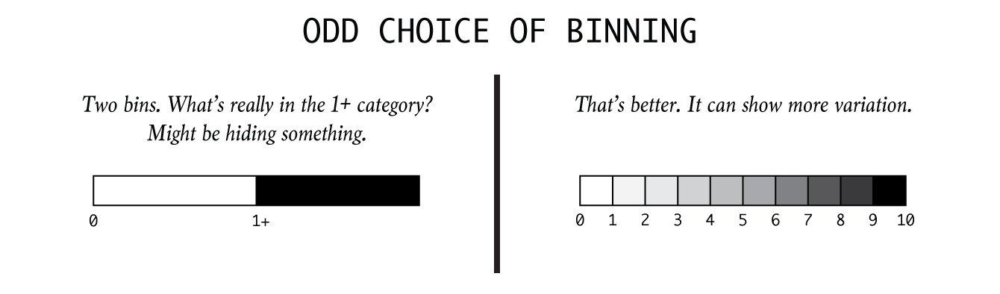

# Ethics

## Importance of Ethics in Visualization  
[@ethical_infographics]

Alberto Cairo sees data visualization as harmonization of journalism and engineering. From these two disciplines, he takes the journalist ethos of truth-telling and combines this with an engineering focus on efficacy and efficiency. The result is a data visualization that contains accurate and relevant information which is precisely and concisely conveyed. Cairo explains that as a "rule utilitarian," he believes it is "morally right" to create graphics in this way. Here, it is useful to review his blog post introducing the article. In short, the responsibility of an ethical data visualizer is to create the most good while doing the least harm. As such, conveying honest and relevant information increases a person's understanding, and increased understanding and knowledge positively correlates with personal well-being.

Alberto Cairo addresses the ethical 'why' of data visualization in this article, while still grounding the discussion in a straightforward analysis of harmful and helpful practices. He emphasizes that the effectiveness of the display's communication of a message is as important as the information itself. This makes intuitive sense because useful information is rendered utterly useless if no one can understand it.

Cairo briefly addresses four guidelines that are applicable in all information gathering fields: 
1. Beware of selection bias when choosing preexisting datasets, validate the data, and include essential context. 
2. False or irrelevant information does not improve anyone's decision-making capacity, so it cannot enhance well-being. 
3. Even if the information is both accurate and relevant, moral pitfalls may remain. 
4. To avoid the unethical trap of inscrutable or misleading graphics, Cairo exhorts us to take an evidence-based approach when possible. The purpose of the graphic dictates the form it takes; aesthetic preferences should never override clarity. 

**Again, since the moral purpose is to improve well-being through understanding, a graphic that is confusing or misleading is unethical, regardless of intent, since it creates misunderstanding for the audience.** While it can be a bit jarring to think of a poorly designed graphic as "morally wrong," it is essential to think of the unintended consequences that powerful yet misleading visuals may have on their viewers.

## Implications of (Good/Bad) Data Visualization

Raw data is often meaningless or at the very least is difficult to derive immediate meaning from. When people face a broad set of measurements and/or in large quantities, they are unable or unwilling to spend the time required to process it. Technological advances of the Digital Age contribute to an ever-growing pool of “big data” and have dramatically improved our ability to collect such large amounts of information. Thus, filtering, visualization, and interpretation of data becomes increasingly important.

We should understand how to best derive meaning from data, but first we should understand why its presentation in graphical format is so powerful. Furthermore, while the ideal purpose of data visualization is to facilitate understanding of data, visualization can also be used to mislead. Some of the main methods of doing so are omitting baselines, axis manipulation, omitting data, and ignoring graphing convention. Examples of these methods will be explored later in this chapter.


**Principle** | **Description**
------------------------------|---------------------------------------------------------------------------------------------------------------------------------------------------------
**1. Easy Recall** | People can process images quicker than words. When data is transformed into images, the readability and cognition of the content greatly improves. While people can only remember just 10% of what they hear and 20% of what they read, retention jumps up to 80% for visual information with interaction.
**2. Providing Window for Perspective** | With infographics, you can pack a lot of information into a small space. Colors, shape, movement, the contrast in scale and weight, and even sound can be used to denote different aspects of the data allowing for multi-layered understanding [@image_good].
**3. Enable Qualitative Analysis** | Color, shape, sounds, and size can make evident relationships within data very intuitive. When data points are represented as images or components of an entire scene, readers are able to see the correlation and analytical insights can be easily derived.  
**4. Increase in User Participation** | Interactive infographics can substantially increase the amount of time someone will spend with the content and the degree to which they participate in the information, both in its collection and its dissemination.

## General Guidelines for Ethical Visuals  
[@ethics_code]

Data visualization is an up-and-coming field that currently does not have many established regulations. This makes it easy to manipulate readers without technically reporting false information. However, certain standards should be followed in order to generate meaningful and accurate visuals. The process can be broken down into three steps, each with its own set of guiding rules.

### Data Collection  
The first step in any project is gathering the data. This is relatively simple and does not offer much of an opportunity to introduce confusion. The one thing to remember is to always get data from a reliable source. The data provides the foundation for the entire project and must, therefore, be trustworthy and verifiable. Furthermore, special care should be taken for identification of inherent biases while using an existing dataset or creating a new one.

### Data Analysis  
This is the stage where the discoveries are made and thus, is the first opportunity to manipulate the story. There is usually a lot of data cleaning to do before creating a visual representation, but all data wrangling steps should be deliberate and reasonable. If possible the underlying code should be publicly shared so anyone can follow the entire process. It is also important to explicitly state any assumptions taken, though these ideally should be kept to a minimum. Here, it is important to look at what the source data actually shows. It is the ethical responsibility of presenters to perform careful analysis of the data and extract true stories from them.

As the amount of data grows, it becomes increasingly difficult to keep the insight derivation up to speed with the collection of data. Therefore, data strategy becomes an imperative part of successfully applying data to the business. 

### Design  
Once a visualizer decides on an argument, it is important to present it honestly. While there is an inherent tradeoff between truthfulness of the visualization and effectiveness of its argument, visualizers should strive to maximize both. Deceptive techniques may be tempting to make a stronger argument, but besides being ethically wrong, the intentional use of deceptive visualization techniques will hurt the credibility of the author and anyone else involved in the publication since an experienced individual will know how to spot and disregard these deceptions.

Visualization should not be used to intentionally hide or confuse the truth. It should not seek to mislead the uninformed. Visualization has great power, and as they say, with great power comes great responsibility.


## Definitions of Data Deception and Graphic Integrity  
[@decept_study],[@rose_tint]

Data visualization is a powerful communication tool to support arguments with numbers in a way that is accessible and engaging. It is an increasingly popular way to communicate and support arguments. More people than ever before are making their own charts and infographics, creating a unique problem. Despite the availability of great charting resources and resources online to create and design amazing data products, we are witnessing an influx of poorly-designed, misleading, or downright deceptive data visualizations.

What does **data deception** mean? Data deception, defined by School of Law at the New York University, is “a graphical depiction of information, designed with or without an intent to deceive, that may create a belief about the message and/or its components, which varies from the actual message.” Deceptive, misleading, or distorted graphs are those that intentionally or unintentionally skew the data, and result in a representation of incorrect conclusions.

Edward Tufte already introduced the concept of graphical integrity in his book and presented six principles of graphic integrity. Here are the principles of the book:

* The representation of numbers, as physically measured on the surface of the graphic itself, should be directly proportional to the numerical quantities measured.
* Clear, detailed, and thorough labeling should be used to defeat graphical distortion and ambiguity. Write out explanations of the data on the graphic itself. Label important events in the data.
* In time-series displays of money, deflated and standardized units of monetary measurement are nearly always better than nominal units.
* The number of information-carrying (variable) dimensions depicted should not exceed the number of dimensions in the data.
* Show data variation, not design variation.
* Graphics must not quote data out of context.

There are some ways in which distorted graphs can be created:  
[@evil_axes],[@mislead_graph_ex]

**Tool** | **Description**
------------------------------|---------------------------------------------------------------------------------------------------------------------------------------------------------
**Improper scaling of y-axis** | This is one of the classic way of creating misleading graphs. Instead of scale starting from zero or a baseline, the y-axis is scaled conveniently to highlight the differences among bins.
**Improper labeling of graphs** | Lack of labels makes the graph hard to interpret for the reader and leads to wrong conclusions.
**Paired graphs on different scale** | It is not a fair comparison if two elements are plotted side-by-side, on a different scale and compared. This makes one graph look better than the other, even when it is not.
**Dual axis with different scales** | If we are plotting two elements on the same graph with different scales, it is assumed that both axes are on the same scale even if the axes are properly labeled. Especially if the two elements are represented in a similar way ( bargraph or line graph)
**Incomplete data** | Short-term graphs are made to manipulate the trend, which will not be seen otherwise. Time-series data are cut intentionally to show a trend within a particular period to create a more favorable visual impression.


## Ethical Challenges in Data Visualization  
[@dataviz_for_good]

Matt Stempeck's article recaps a brainstorming session concerning data visualization ethics, and provides a fairly comprehensive list of considerations for data visualizers to use as a guide to evaluate how ethical their data products actually are. From replicability of a data visualization, to persuasiveness and ambiguity in the data, this article challenges data visualizers to assess how to ethically present data.  

The discussion on perspective is an interesting one; it asks how data visualizers might show different perspectives on the same data. Clearly from the “deceptive versions” we have created for Vox’s gun violence article’s visualizations, the same data can be used to show vastly different perspectives, or make extremely contrasting claims. This may counteract common opinion of data, since most people perhaps believe there is an inherent truth to the data, but the data visualizer is in control of what the audience sees; the person creating the visualization cultivates a perspective to argue the claim. The data is at the heart of this argument, but how the data visualizer presents it to the audience may or may not include the whole story or the most truthful story. Furthermore, while this challenge to show different perspectives proposed by the article clearly should be undertaken by data visualizers for the ethical good; when the goal of a data visualizer is to persuade his/her audience to accept the visualizer’s perspective, being fair and thorough in considering the other side of the argument may contradict the data visualizer’s objective.  

Of course, the challenge posed by the tug-of-war between ethics and utility ( not to say that they are always contradictory in nature)  remains central in many sciences, including the data sciences, and it makes the discussion of finding a balance between the two all the more important.


## Data Visualization: A Tool for Social Change in Cities 
[@socialchange]

One field in which visualization can have a meaningful social impact is promoting understanding of and generating discussions around cities. With the development of a city, demographic changes, economic, environmental and social problems become important issues. Visualization plays an important role in promoting understanding of how the cities and the societies within them work, debating the problems that cities face, and engaging citizens to work toward their dream cities.

Recently, as part of Habitat III side event , LlactaLAB - Sustainable Cities Research Group, presented a project called Live Infographics. It was an interactive methodology that put citizens and experts opinions about the New Urban Agenda on one platform to help generate a 'horizontal governance'. The different opinions were materialized with a dynamic map to visualize the generated data. The primary objective of the project is to generate citizen-led data collection and to enable governments to build a better understanding of public sentiment, and then engaging people in the process.

A great Urban Data Visualization ought to have the capacity to start "Sociological Imagination". It should provoke individuals to consider how their individual choices, issues, struggles, and in general their daily lives, are a extension of society, and how their choices collectively influence public opinion.

As urban areas continue to develop, diverse and complex issues evolve along with them. Disparity, isolation, loss of biodiversity and environmental quality, etc. are all important but thorny issues, and finding successful solutions will require uniting strategy producers, academics, designers, and citizens. Visualization, if done right, can help jumpstart important discussions between these diverse groups of people and help solve the issues that emerge as the world becomes more urbanized.

## Ethical Theory and Practice from Journalism and Engineering  
[@poli_social_science]

The fundamental objective of data visualization is to provide an efficient graphical display for summarizing quantitative information and supporting an argument. During the last decades, political science has accumulated a large corpus of various kinds of data, and has gradually evolved into a more scientific field, requiring the use of quantitative information in analysis of relevant data.

Under U.S. law, research institutions receiving federal fundings must consider ethical aspects of their research. Over time, researchers and lawyers have established rules and practices for proper data collection and utilization, with particular attention on human subject research. Consent of the subjects to use their data, evaluation of any risk with use or collection of data, and protecting the anonymity of data are some of the rules that must be considered in ethical research methods. However, these rules continue to evolve.

The ability to use data visualization to manipulate and mislead also presents an issue. Research has found that even if viewers do not originally support an idea, data presented in charts can persuade viewers on the subject matter. Thus, many deceptive techniques can be used to intentionally produce a dangerous visualization. Techniques such as truncated axis (where the y-axis does not start at zero) or using the area to represent a quantity (for instance comparing the size of two adjacent circles) were found leading to wrong conclusions.

Misleading, incomprehensible, or incredible data visualization can jeopardize people’s trust, goodwill, or faith in research and advocacy on vital human rights issues. There is no shortage of techniques for deception through data visualization, and researchers have an ethical responsibility to give a correct and faithful representation of data and subjects.


## Misinformation Can be beautiful too  
[@harford-misinformation]

Camouflage usually means blending in. That wasn't an option for the submarine-dodging battleships of a century ago, which advertised their presence against an ever-changing sea and sky with bow waves and smokestacks. So, dazzle camouflage was born, an abstract riot of squiggles and harlequin patterns. It wasn't hard to spot a dazzle ship but the challenge for the periscope operator was to quickly judge a ship's speed and direction before firing a torpedo on a ponderous intercept. Dazzle camouflage was intended to provoke misjudgments, and there are some evidence proving that it worked.

Now let's talk about data visualization, the latest fashion in numerate journalism, albeit one that harks back to the likes of Florence Nightingale. She was not only the most famous nurse in history but also the creator of a beautiful visualization technique, the "Coxcomb diagram", and the first woman to be elected as a member of the Royal Statistical Society.


(Source: [@aya-time-series])

Data visualization creates powerful, elegant images from complex data. It's like good prose: a pleasure to experience and a force for good in the right hands, but also seductive and potentially deceptive. Because we have less experience of data visualization than of rhetoric, we are naive, and allow ourselves to be dazzled. Too much data visualization is the statistical equivalent of dazzle camouflage: striking looks grab our attention but either fail to convey useful information or actively misdirect us.

For a relatively harmless example, consider The New Yorker's recent online subway map of inequality. "New York has a problem with inequality," we are told. Then we are invited to click on different subway maps to see a cross-sectional graph, showing us the peaks and troughs of median income along different subway lines. The result is gorgeous but far less informative than a map would have been. It is a piece of art pretending to be a piece of statistical analysis.

A more famous example is David McCandless's unforgettable animation "Debtris", in which large blocks fall slowly against an eight-bit soundtrack in homage to the addictive computer game Tetris. Their size indicates their dollar value. "\$60bn: estimated cost of Iraq war in 2003" is followed by "\$3000bn: estimated total cost of Iraq war", and then Walmart's revenue, the UN's budget, the cost of the financial crisis, and much else.

The animation is pure dazzle camouflage. Statistical apples are compared with statistical oranges throughout. The Iraq comparison, for instance, is not one of "then versus now" as it first appears - but one of what the US Department of Defense once thought it would spend versus a broader estimate, including a financial value on the lives of dead soldiers, and over a trillion dollars of "macroeconomic costs". The war was a disaster- No need for a statistical bait-and-switch to make that case.

Information can be beautiful, McCandless tells us. Unfortunately misinformation can be beautiful too. Or, as statistical guru Michael Blastland puts it, "We are in danger of making the same statistical mistakes that we've always made - only prettier."

Those beautiful Coxcomb diagrams are no exception. They show the causes of mortality in the Crimean war, and make a powerful case that better hygiene saved lives. But Hugh Small, a biographer of Nightingale, argues that she chose the Coxcomb diagram in order to make exactly this case. A simple bar chart would have been clearer: too clear for Nightingale's purposes, because it suggested that winter was as much of a killer as poor hygiene was. Nightingale's presentation of data was masterful. It was also designed not to inform but to persuade. When we look at modern data visualizations, we should remember that.

## Visual Lies
[@visual-lies] 

This article focuses on a few methods that data visualizers utilize to mislead users about research findings. For each method, the author has highlighted the signifiers that are manipulated to promote an unrealistic understanding of the visualized data. The author has concentrated on examples of three areas to create deceptive data visualization: size, segmentation, and graph type.

### Size   
Size signifies quantity, volume or degree of variables within a data. In the first figure, the y-axis from the graph to the right is cut when transcribed onto the graph on the left. Here, both the graphs show the same data but the one on the left represents the data in a misleading fashion because of the way the axis is cut, and the result is that interest rates have increased drastically from 2008 to 2012 – a misinterpretation that is avoided in the graph on the right.


(Source:[@misleading_data]) 

### Quantity  
 
Quantity measures size. When depicting points on a scatter plot, it is helpful to manipulate the size of the points to represent differing values of a variable that is not represented on the x and y axes. The following graph shows quantity as two completely different measures. One chart uses quantity as area and other uses it as radius. The result is that the differences in quantity between points on such a scatter plot would appear more dramatic than they should.


(Source:[@study_asks])

### Segmentation  
The figure below is an example of segmentation with a deceptive instance of binning given in the legend on the left.
Segmentation can be used to show category, parts, domains or ranges within a chart. The author states that correct use of segmentation can be a powerful tool to enhance understanding, but can be deceptive if used incorrectly. This example shows how binning can be misleading; in the left figure, binning is not done appropriately, and it is therefore difficult to come up with actual values of the data.



(Source:[@visual-lies])

### Graph  
Two graphs that are often misrepresented are pie-charts and maps. In the following figure, the author explains that pie-charts cannot be compared accurately to one another. When striving for an accurate portrayal of values, they should be avoided. The author further states that it would be difficult to understand the pie-charts had the numbers not been given. 


(Source:[@visual-lies])

The author also asserts that when showing spatial data analysis, always show population density when visualizing values that are person-dependent. On a heat map where color signifies quantity, the author suggests that a user will be drawn to the colors that a legend indicates as most extreme. 

In the following figure, areas that are darkest are simply the most population-dense regions of the United States. Without accounting for population density, the newly created map may look the same as hundreds of maps bearing a striking resemblance to the figure, which are falsely considered informative and are regularly shared across social media sites.


(Source:[@visual-lies])

The above pointers are helpful when analyzing a deceptive version of a data product. However, data visualizers need to carefully draw the line between creating misleading graphs that tell a different story and developing deceptive versions that intend to exaggerate. This should be applied in our projects and can also be used to enhance our understanding of data visualization products.

Misleading graphs are sometimes deliberately misleading and sometimes, it’s just a case of people not understanding the data behind the graph they create [@andale_2014]. But some real-life misleading graphs go above and beyond the classic types. Some are intended to mislead, others are intended to shock. The “classic” types of misleading graphs include cases such as:

### The Missing Baseline  
For example, the vertical scale is too big or too small, skips numbers, or does not start at zero. For example, in the graph below, you might be thinking that the graph on the right shows that The Times makes double the sales of The Daily Telegraph. However, a closer look at the scale reveals that although The Times does make more sales, it is only beating the competition by about 10%.

### The Graph is not Labeled Properly  
A graph may have the correct figures but still mislead its audience. This one used a big headline that suggests to its audience that 5.3% of children get spinal cord injuries, which is a pretty scary statistic for parents. But the real figure is about .0000003% (based on 2000 injuries per year out of a population of around 74,000,000). And for the figure 1 used in this article, "Misleading Graphs: Displaying a Change in One Variable Using Area or Volume" [@scaling_issues], the label for the smaller triangle in this graph says \$26.4 while the label for the larger triangle says \$114.6. \$114.6 is 4.34 times \$26.4. It certainly looks to me as if more than 4.34 smaller triangles will fit in the larger triangle. It is the altitudes of the triangles that are proportional to the numbers in the labels. 

### Data is Left Out  
Including only a part of the data is also an easy opportunity to mislead. The following graph uses temperatures of only the first half of the year to prove it was rising dramatically. For more examples and inspirations on misleading or deceptive graphs refer the following articles:

* Bar charts without zero & evenly spaced tick marks for uneven intervals: [@whats_wrong]
* Graphs not drawn to scale:[@scaling_issues] 

### Treating Correlation as Causation  
Even if the labels and data in your graph are correct, the conclusion is not necessarily logically correct. A correlation between X and Y does not automatically indicate that the change in one variable is caused by the change in the values of the other one, i.e. correlation does not imply causation. Viewers should bear in mind that such visuals only present the correlation between ice cream sold and murders, not than causation.

```{r harlin-ice-cream, echo=FALSE, out.width='70%', fig.show='hold', fig.cap='A strange correlation between ice cream sales and murders (Source: [@harlin-coorelation])'}
knitr::include_graphics("images/harlin-ice-cream.png")
```

Another trick for creating misleading graphs is an axis change: Changing the y-axis maximum affects how the information in the graph is perceived. A higher maximum will make the graph appear less volatile or steep than a lower maximum. The axis can also be altered to deceive by changing the ratio of a graph's dimensions, as demonstrated in the below graphs.


While not technically wrong, improper extraction, tactic omitting data or including only a certain chunk of data is certainly misleading. This is more common in graphs that have time as one of their axes.


Visualizations should be simple and easy to understand, but at the same time they should contain the essence of responsible visualization. To make final results pure,  ethical procedures need to be practiced throughout all the steps of visualization.


In the data visualization terms, we call it truncated graph. A truncated graph (also known as a torn graph) has a y-axis that does not start at 0. These graphs can create the impression of important change where there is relatively little change.Truncated graphs are useful in illustrating small differences.[16] Graphs may also be truncated to save space. Commercial software such as MS Excel tend to truncate graphs by default if the values are all within a narrow range. Truncating graphs makes a small difference look like a huge one, thereby changing the readers' judgement 

An example of using good data in a misleading graph to fool readers comes from Fox News.


(Source:[@datamining_vs_viz])

The question of ethics in data visualization is not something that comes to the fore when we start working. It is rarely the case that one sets out to deceive without altering data. The topic of good ethics in data visualization is very important and it is the duty of the creator to take care of it.
