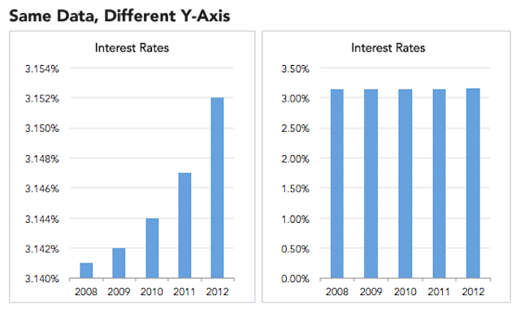
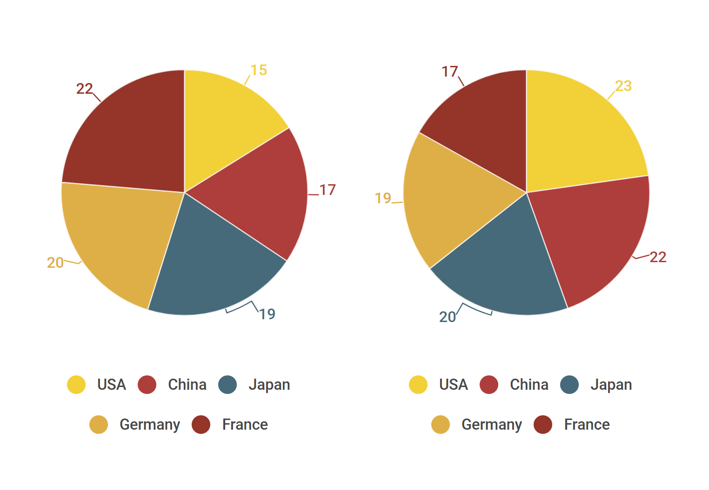
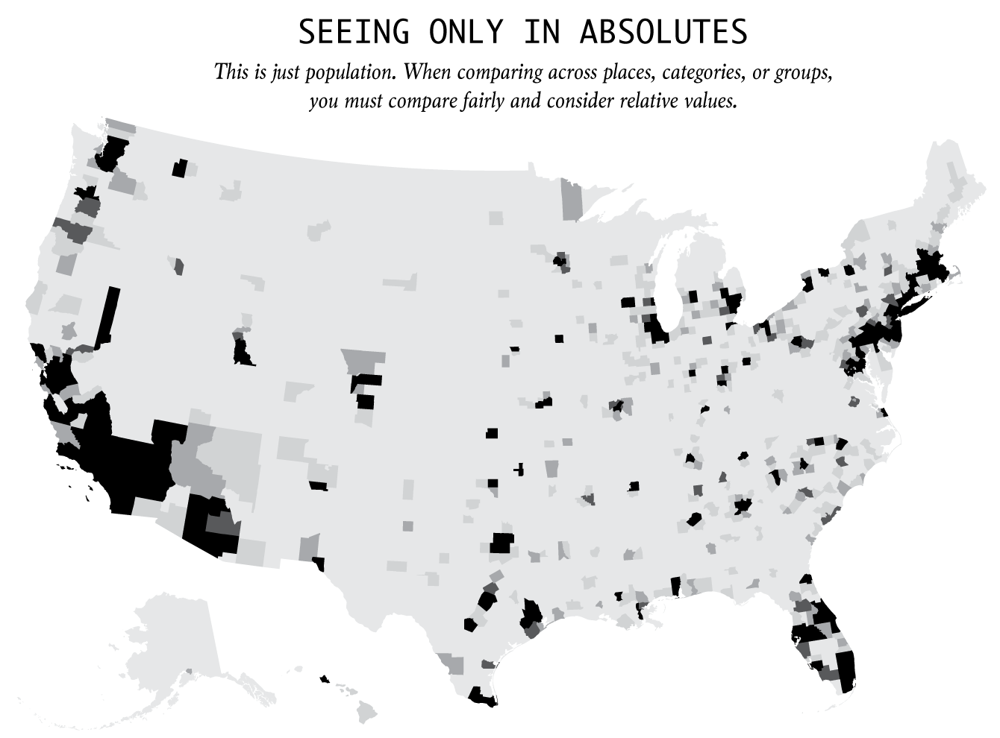
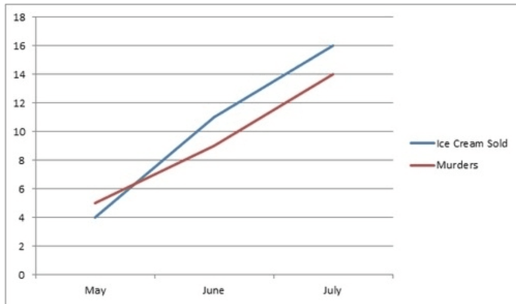
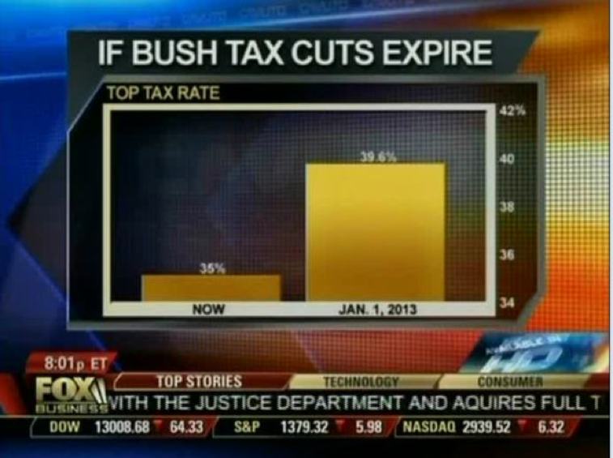

# Ethics


##Ethical Theory and Practice from Journalism and Engineering
[@poli_social_science]
Over the years, researchers and lawyers have come up with rules and practices for proper data collection and utilization, with particular attention on human subject research. Consent of the subjects to use their data, evaluation of any risk with use or collection of data, and protecting the anonymity of data are some of the rules that must be considered for ethical research methods. Under U.S. law, research institutions receiving federal funding must consider ethical aspects of their research. These rules continue to evolve.

Data presented in charts can persuade viewers on the subject matter, even if viewers do not support the idea presented. This means that visualizations can also be used to deceive and there are many techniques for this leading viewers to wrong conclusions. Misleading, incomprehensible, or incredible data visualization can jeopardize people's trust, goodwill, or faith in research and advocacy on vital human rights issues. Its ethical responsibility to create visualizations to give the correct and faithful representation of data and subjects.

The basic objective of data visualization is to provide an efficient graphical display for summarizing and reasoning about quantitative information. And during the last decades, political science has accumulated a large corpus of various kinds of data, which gradually become a more scientific and requires using quantitative information in the analysis and reasoning. 

Data visualization plays several important roles in it:

1. it helps create informative illustrations of the data, recapitulating a large amount of quantitative information on a   diagram;
2. it helps formulate new or support existing hypotheses from quantitative data;
3. it guides a statistical analysis of data and checks its validity.

Some useful visualization methods are:

1. Statistical graphics and infographics; 
2. Geographical information systems (GIS); 
3. Graph visualization or network maps; 
4. Data cartography.


## Importance of Ethics in Visualization
[@ethical_infographics]

Alberto Cairo addresses the ethical 'why' of data visualization in this article, while still grounding the discussion in a straightforward analysis of what to do and what not to do. He emphasizes that the effectiveness of the communicative display is as important as the information itself. This makes intuitive sense because useful information is rendered utterly useless if no one can understand it. Cairo sees data visualization as a harmonization of journalism and engineering. From these two disciplines, he takes the journalist ethos of truth-telling and honesty and combines this with an engineering focus on efficacy and efficiency. The result is a data visualization that contains accurate and relevant information which is clearly and concisely conveyed. Cairo describes himself as a "rule utilitarian" and uses this to explain why it is ethical or, in his words, "morally right," to create graphics in this way. Here, it very useful to review his post on the blog introducing the article. Essentially, the goal is to create the most good while doing the least harm. As such, conveying truthful and honest relevant information increases a person's understanding. Increased understanding and knowledge positively correlates with personal well-being. The information presented must be accurate and relevant. Cairo briefly addresses guidelines for this which are applicable in all information gathering fields: beware of selection bias when choosing preexisting datasets, validate the data, and include important context. False or irrelevant information doesn't improve anyone's decision-making capacity, so it cannot enhance well-being. Even if the information is both accurate and relevant, moral engineering pitfalls may remain. To avoid the unethical trap of inscrutable (or misleading) graphics, Cairo exhorts us to take an evidenced-based approach when possible. The purpose of the graphic dictates the form it takes; aesthetic preferences should never override clarity. Again, since the ethical purpose is to improve well-being through understanding, a graphic which is confusing or misleading is unethical, regardless of intent, since it actually creates misunderstanding for the audience. While it can be a bit jarring to think of a poorly designed graphic as "morally wrong", it is important to think of the unintended consequences of visuals which have a powerful impact on their viewers.


## Implications of (Good/Bad) Data Visualization

Raw data is often meaningless or their meaning is not easily concluded. When people face a large set of measurements they are unable or unwilling to spend the time required to process it. Our modern living contributes to an ever-growing pool of “big data” and our ability to collect this type of information becomes easier and easier.  Thus filtering, visualization, and interpretation of data become increasingly important.

We should understand what to do with data, but first we should understand why their presentation in graphical format is so powerful.

**Principle** | **Description**
------------------------------|---------------------------------------------------------------------------------------------------------------------------------------------------------
**1. Easy Recall** | People can process images more quickly than words. When data is transformed into images, the readability and cognition of the content greatly improve. While people can only remember just 10% of what they hear and 20% of what they read, retention jumps up to 80% when they for visual information with interaction.
**2. Providing Window for Perspective** | With infographics you can pack a lot of information into a small space. Colors, shape, movement, the contrast in scale and weight, and even sound can be used to denote different aspects of the data allowing for multi-layered understanding [@image_good].
**3. Enable Qualitative Analysis** | Color, shape, sounds, and size can make evident relationships within data very intuitive. When data points are represented as images or components of an entire scene, readers are able to see the big picture and understand how the information fits within a larger context. 
**4. Increase in User Participation** | Interactive infographics can substantially increase the amount of time someone will spend with the content. Because of their impact, infographics are widely used nowadays. A quick google will produce a huge array of great examples — as well as poor ones. Because while people recognize the value of information graphic design, and a number of tools are available today that make the creation of them possible for the layperson, it doesn’t mean that they’re all successful or even necessary.


## General Guidelines for Ethical Visuals
[@ethics_code]

Data visualization is an up and coming field that currently doesn't have many regulations. This makes it easy to manipulate readers without technically reporting false information. However, certain standards should be followed in order to generate meaningful visuals. The process can be broken down into three steps, each with its own set of guiding rules.

**1. Data Collection**

The first step in any project is gathering the data. This is relatively simple and does not offer much of an opportunity to introduce confusion. The one thing to remember is to always get data from a reliable source. The data provides the foundation for the entire project and must ,therefore, be trustworthy and verifiable.

**2. Data Analysis**

This is the stage where the discoveries are made and provided the first opportunity to manipulate the story for good or bad. There is usually a lot of data cleaning to do before creating a visual representation, but all manipulation should make sense. Code should be shared so anyone can follow the entire process. It is also important to explicitly state any assumptions taken, though these should be kept to a minimum. Here it is important to look at what the source data actually shows its ethical responsibility of presenters for careful analysis of the data and find true stories from them.

**3. Design**

Once a story is found, it must be presented in an honest way. This is where deceptive techniques could be tempting to make a stronger argument. An experienced individual will know how to spot these deceptions and disregard any findings. This ultimately hurts the credibility of the author and anyone else involved in the publication.

Visualization should not be used to intentionally hide or confuse the truth, it should not mislead the uninformed. Visualization has got great power and so does lots of responsibility.


## Misrepresentation through Data Visualization
While the ideal purpose of data visualization is to improve others' understanding of the data presented, visualization can also be used to mislead. Some of the main methods of doing so are omitting baselines, axis manipulation, omitting data, and going against graphing convention. Omitting baselines is used to imply a greater difference between two categories, such as in poll results comparing political parties. Axis manipulation by increasing the highest value on the y-axis affects the visibility of a slope, making data with an otherwise visible trend appear flat. Omitting selected data points or narrowing the window of a graph is used to hide an overall trend, such as a graph of a stock only showing a current trend and hiding previous bubbles. Graphs can also be designed to subvert convention so that at first glance the graph is conveying the opposite message, for example, by using the reader's associations of colors and temperature to create a graph where hot is blue and cold is red.


### Defintions of Data Deception and Graphic Integrity

Data visualization is a powerful communication tool to support arguments with numbers in a way that is accessible and engaging. It is becoming more and more popular to communicate and support arguments nowadays. More people than ever before are making their own charts and infographics, which is presenting a unique problem. Despite the availability of some great charting resources and resources online to create and design amazing data products, we are witnessing an influx of poorly-designed misleading or downright deceptive data visualizations [@decept_study],[@rose_tint].

So what does **data deception** mean? Data deception, defined by School of Law at the New York University, as “a graphical depiction of information, designed with or without an intent to deceive, that may create a belief about the message and/or its components, which varies from the actual message.” Deceptive, misleading, or distorted graphs are graphs created which skews the data, intentionally or unintentionally, resulting in a representation of incorrect conclusions.

Edward Tufte already introduced the concept of graphical integrity in his book and presented six principles of graphic integrity. Here are the principles from the book:

* The representation of numbers, as physically measured on the surface of the graphic itself, should be directly proportional to the numerical quantities measured.
* Clear, detailed, and thorough labeling should be used to defeat graphical distortion and ambiguity. Write out explanations of the data on the graphic itself. Label important events in the data.
* In time-series displays of money, deflated and standardized units of monetary measurement are nearly always better than nominal units.
* The number of information-carrying (variable) dimensions depicted should not exceed the number of dimensions in the data.
* Show data variation, not design variation.
* Graphics must not quote data out of context.

There are some ways in which distorted graphs can be created [@evil_axes],[@mislead_graph_ex]:

**Tool** | **Description**
------------------------------|---------------------------------------------------------------------------------------------------------------------------------------------------------
**Improper scaling of y-axis** | This is one of the classic misleading graphs. Instead of scale starting from zero or a baseline, y-axis is scaled conveniently to highlight the differences among bins.
**Improper labeling of graphs** | Lack of labels make the graph hard to interpret for the reader and lead to wrong conclusions.
**Paired graphs on different scale** | It is not a fair comparison if two elements are plotted side-by-side, on a different scale and compared. This makes one graph look better than the other, even when it is not.
**Dual axis with different scales** | If we are plotting two elements on the same graph with different scales, even if the axes are properly labeled, it is assumed that both axes are on the same scale.
**Incomplete data** | Short-term graphs are made to manipulate the trend, which will not be seen otherwise. Time-series data are cut intentionally to just show a trend within a particular period to create a more favorable visual impression.


[@visual-lies] focuses on a few methods that data visualizers utilize to mislead users about research findings. For each method, the author has highlighted the signifiers that are manipulated to promote an unrealistic understanding of the visualized data. The author has concentrated on examples of three areas to create deceptive data visualization: size, segmentation, and graph type.

** Size ** 
Size signifies quantity, volume or degree of variables within a data. In first figure, the y-axis from the graph to the right is cut when transcribed onto the graph on the left. Here both the graphs show the same data but the one on the left represents the data in a misleading fashion because of the way the axis is cut, and the result is that interest rates have increased drastically from 2008 to 2012 – a misinterpretation that is avoided in the graph on the right. 



** Quantity **
Quantity is the measure of size. When depicting points on a scatter plot, the author suggest that it is helpful to manipulate the size the points to represent differing values of a variable that is not represented on the x and y axes. Following graph shows quantity as a two completely different measure. One chart uses quantity as Area and other uses it as radius. The result is that the differences in quantity between points on such a scatter plot would appear more dramatic than they should be.


** Segmentation ** 
Figure shows an example of this with a deceptive instance of binning given in the legend on the left.
Segmentation can be used to show category, parts, domains or ranges within a chart. The author states that correct use of segmentation can enable users to enhance understanding and if used incorrectly can be deceptive. It is shown here binning is different in both and since in the left figure binning is not done appropriately it is difficult to come up with actual values of the data.

Figure 3: 


** Graph ** 
Two graphs that are most often misrepresented are pie-charts and maps. The author explains that in the following figure Pie charts can’t be compared accurately to one another. When striving for an accurate portrayal of values, they should be avoided. The author further states that it would be difficult to understand the pie-charts had the numbers were not’t given.



The author then states that when showing spatial data analysis always show population density when visualizing values that are person-dependent. On a heat map where color signifies quantity, The author suggests that a user will be drawn to the colors that a legend indicates are most extreme. 

In following figure, areas that are darkest are simply the most population-dense regions of the United States. Without accounting for population density, the newly created map may look the same as hundreds of maps bearing a striking resemblance to the figure, which are falsely considered informative and are regularly shared across social media sites.



The above pointers are very helpful when analyzing a deceptive version of a data product. However, as data visualizers we carefully need to draw the line between creating misleading graphs that tells a different story and deceptive version which is meant for exaggeration. The above can be applied in our projects and can also be used to enhance our understanding of great data visualization product.


Misleading graphs are sometimes deliberately misleading and sometimes it’s just a case of people not understanding the data behind the graph they create [@andale_2014]. But some real life misleading graphs go above and beyond the classic types. Some are intended to mislead, others are intended to shock. The “classic” types of misleading graphs include cases where:

**The Missing Baseline**
For example, the Vertical scale is too big or too small, or skips numbers, or does not’t start at zero, like the graph below: You might be thinking that the graph on the right shows The Times makes double the sales of The Daily Telegraph. But take a closer look at the scale and you’ll see although The Times does make more sales, it’s only beating the competition by about 10%.

**The graph isn’t labeled properly.**
Graphs can have the correct figures, but still can mislead you. This one used a BIG HEADLINE makes you think that 5.3% of children get spinal cord injuries which is a pretty scary statistic for parents. But the real figure is about .0000003% (based on 2000 injuries per year out of a population of around 74,000,000). And for the figure 1 used in this article: Misleading Graphs: Displaying a Change in One Variable Using Area or Volume [@scaling_issues], the label for the smaller triangle in this graph says \$26.4 while the label for the larger triangle says \$114.6. \$114.6 is 4.34 times \$26.4. It certainly looks to me as if more than 4.34 smaller triangles will fit in the larger triangle. It is the altitudes of the triangles that are proportional to the numbers in the labels. 

**Data is left out**
Only includes part of the data like the following graph which uses temperatures of the first half of the year to prove it was rising dramatically. For more examples and inspirations on misleading graphs or deceptive graphs refer the following articles :

* Bar charts without zero & evenly spaced tick marks for uneven intervals: [@whats_wrong]
* Graphs not drawn to scale:[@scaling_issues] 

**Treating correlation as causation.**
Even if the labels and data in your graph is correct, it does not mean that the conclusion is logically correct. A correlation between X and Y does not automatically indicate that the change in one variable is caused by the change in the values of the other one, whereas the causation means that one event is the result of the occurrence of the other event. From the graph, we should bear in mind that it only presents the correlation between ice cream sold and murders, rather than causation.

```{r harlin-ice-cream, echo=FALSE, out.width='70%', fig.show='hold', fig.cap='A strange correlation between ice cream sales and murders (Source: [@harlin-coorelation])'}

```

Another trick of misleading graph is axis change: Changing thy y-axis maximum affect how the graph look like. A higher maximum will make the graph to appear less volatile ,less steep than a lower maximum. The other way of axis change is changing the ratio of a graph's dimensions. This way will affect how the graph appears. We demonstrate changing the ratio of graph dimension for below graphs.


It is not technically wrong but it is definitely misleading.This is often called improper extraction or tactic omitting data, when only a certain chunk of data is included.This is more common in graphs that have time as one of their axis. Here is the graph to show what it is.


In the data visualization terms, we call it truncated graph. A truncated graph (also known as a torn graph) has a y-axis that does not start at 0. These graphs can create the impression of important change where there is relatively little change.Truncated graphs are useful in illustrating small differences.[16] Graphs may also be truncated to save space. Commercial software such as MS Excel will tend to truncate graphs by default if the values are all within a narrow range. Truncating graphs make the readers to change their judgement for something that is not significant looks like a huge difference. 

 A example of using good data in a misleading graph to fool readers comes from Fox News.



[@DataMiningVsViz]

