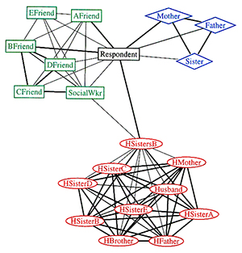

# Conclusion

As we conclude our brief study on data visualization, it is clear that the field is rich in potential applications in diverse disciplines, at the same time we need to be aware of its practical and ethical complexities. In the previous chapters, we have presented some important theoretical and practical principles to keep in mind when designing a data visualization. We have also discussed and critiqued several examples of data visualizations, learning common pitfalls and helpful tricks along the way. As we have seen, developing an effective and ethical data visualization is a complex process. In this chapter we will touch upon the future of data visualization and additional resources for data visualizers.

## The Future of Data Visualization
@future_viz

Data visualization is entering a new era. Emerging sources of intelligence, theoretical developments and advances in multidimensional imaging are reshaping the potential value that analytics and insights can provide, with visualization playing a key role. The principles of effective data visualization won’t change. However, nextgen technologies and evolving cognitive frameworks are opening new horizons, moving data visualization from art to science.

Looking back, much attention has been given to the principles of effective data visualization, such as substance, context and actionability. As timeless tenets that will continue to be important, regardless of medium or format, a brief review seems in order:

* **Effective data visualization should be substantive** And while creative visuals can enhance interest and memory, embellishment can’t make up for lack of substance. According to purist Edward Tufte, “Every single pixel should testify directly to content.”

* **Visualization should be accurate and contextual.** David McCandless’s Billion Dollar O’Gram provides an example of how greater meaning can be added by incorporating the bigger picture. According to McCandless, “Absolute figures in a connected world don’t give you the whole picture. They’re not as true as they could be. We need relative figures that are connected to other data so that we can see a fuller picture.” 

(Source: @future_viz)

* **More than anything else, data visualization should facilitate decision-making**, a goal that is difficult to achieve for many. According to a recent KPMG study, while data and analytics are deemed increasingly important to organizations, generating actionable insights remains a top challenge.

### Recent Developments

Consider the Internet of Things, Network and Complexity Theories, and recent developments in multidimensional visualization, we can clearly see how data visualization has evolved along with the field.

The Internet has transformed the way we visualize information through a better understanding of networks and an explosion in profile, behavioral and attitudinal data. Sociograms, for example, have gone from relatively simple graphs to multifaceted relational maps, as illustrated in the following two charts, courtesy of the Journal of Social Structure and the Leadership Learning Community.

(Source: @future_viz)

(Source: @future_viz)

The Internet of Things is expected to have a similar impact, with billions of connected devices capturing human and machine activity. Fully capitalizing on the data generated will require further advances in our ability to synthesize and display spatiotemporal activities.

Network Theory has been in use for decades, with its earliest applications largely in social structure analysis. More recently, Network Theory is being applied to understand relationships and interactions in a variety of domains, such as crime prevention and disease management. Dirk Brockmann and Dirk Helbling’s work modeling the spread of infectious diseases provides an example of the power that Network Theory holds.

### Future Direction

As organizations collect more and more data, the data science field is challenged with the task of making meaningful sense out of the data. Data visualization tools slice and dice the data and present insights to scientists. Data visualization will be the center piece in the analytics domain. Few of the fields which are really pushing its limits are Artificial Intelligence, Virtual Reality, Augmented Reality and Real Time Analytics based on Live Streaming data.

Below are the salient points from the Data Visualization Summit 2016 (Source:@speaker_notes) key note address highlighting the future of data visualization.

+ Supporting big data 3 Vs at scale: like 100X for Volume, 10X for Velocity, 5X for Variety.
+ The end-to-end set up time will be much shorter, the learning curve to be a data viz expert would be within days.
+ More flexible user interfaces with easier ways to surface complicated cases w/o any further advanced coding for discovering the underlying knowledge and relationships, such as social graphing, 3+ dimensional graphing, etc.
+ More integration could happen here, such as new intelligent features in data viz application for predictive modeling, pattern discovery, automatic alerting, etc.
+ Given the recent crazy popularity in AR technology for Pokemon Go, interesting data viz application to support AR or VR will soon become available

## Key Lessons Going Forward

### Laying the groundwork for data visualization 

[@why_dataviz_matters]  
Before implementing new technology, there are some steps you need to take. Not only do you need to have a solid grasp on your data, you also need to **understand your goals, needs and audience.** Preparing your organization for data visualization technology requires that you first:  

+ Understand the data you’re trying to visualize, including its size and cardinality (the uniqueness of data values in a column).
+ Determine what you’re trying to visualize and what kind of information you want to communicate.
+ Know your audience and understand how it processes visual information.
+ Use a visual that conveys the information in the best and simplest form for your audience.  

Once you've answered those initial questions about the type of data you have and the audience who'll be consuming the information, you need to prepare for the amount of data you'll be working with. Big data brings new challenges to visualization because large volumes, different varieties and varying velocities must be taken into account. Plus, data is often generated faster that it can be managed and analyzed.  

### How Is It Being Used?
[@why_dataviz_matters]  
Regardless of industry or size, all types of businesses are using data visualization to help make sense of their data. Here’s how.

**Comprehend information quickly**  
By using graphical representations of business information, businesses are able to see large amounts of data in clear, cohesive ways – and draw conclusions from that information. And since it’s significantly faster to analyze information in graphical format (as opposed to analyzing information in spreadsheets), businesses can address problems or answer questions in a more timely manner.

**Identify relationships and patterns**  
Even extensive amounts of complicated data start to make sense when presented graphically; businesses can recognize parameters that are highly correlated. Some of the correlations will be obvious, but others won’t. Identifying those relationships helps organizations focus on areas most likely to influence their most important goals.

**Pinpoint emerging trends**  
Using data visualization to discover trends – both in the business and in the market – can give businesses an edge over the competition, and ultimately affect the bottom line. It’s easy to spot outliers that affect product quality or customer churn, and address issues before they become bigger problems.

**Communicate the story to others**  
Once a business has uncovered new insights from visual analytics, the next step is to communicate those insights to others. Using charts, graphs or other visually impactful representations of data is important in this step because it’s engaging and gets the message across quickly.

**Improved collaboration among work teams**
Data visualization makes it easier to gain vital information, identify trends, collaborate at a likeminded pace, and from there put decisions to action — all with much greater speed than is generally allowed by presentations that lack the proper visual tools.

**Establish Clear Correlation Between Business Operations And Activities**
Since the data is visualized in a highly comprehensive and interactive manner, establishing existing or possible correlations between various business operations comes in easy here. This gives business leaders a clear insight into business performance and needs for further strategies.
Data visualization allows decision makers to make sense out of the visible patterns and parallel operations in terms of the overall business performance. It also allows them to establish a correlation between the daily tasks and the long-term outcomes for these in terms of business performance.

###Helpful tips for a good visualization
* **Don’t try to be too cute.** Using all the fancy features of a visualization tool can lead to complex and confusing graphics. Just because you have a flashy hammer, it does not mean that everything is a nail. Don’t lose your purpose in your infatuation with a new tool or feature. Stick to good design principles, and keep it simple (as was mentioned in the discussion about Patterns).

* **Don’t provide more data than you need to tell your story.** Humans have a tendency to want to create visualizations with multi-drill downs, filters, and tables. This is fine for ad hoc analysis, but if we are presenting a visual with a single story or argument, we must make sure every piece of data included plays a meaningful part in the story.

* **Have more data to show what-ifs.** A great way to provide more information in a visualization is to use filters to provide what-if views. Having filters for different scenarios, options, and time slices provide the user a way to review and discover various perspectives on your data. Just make sure the user does not have to work too hard to get there and that they do not get lost in the data.

* **Deliver value in your visualization.** Many graphs may be aesthetically pleasing or exciting but deliver no value. A graph with good value should deliver important insights to aid decision-making or prompt an action. Keep in mind, the main objective of a visualization is to deliver value, and each design decision should help achieve this.
 
* **Understanding your audience is the most difficult and important part of developing a visualization.** Different audiences will feel differently about the same chart. So when we develop the argument from the data, we should keep our intended audience in mind.

* **Share what you have found.** A visualization can be an effective influencer if used in the correct way and at the correct time. 

* **Think as author / reader** When designing graphs, try to stand at the reader side, to check whether the graph is making sense or if there is any misleading information being showcased. As a reader, one needs to detect if there is any visualization deception in the graph. Before making any conclusion, understanding details and information the graph is providing like legend, caption, numbers, etc. is important. 

* **Do Calculations** Accurate representation of data is necessary. Sometimes the original data cannot strongly support the main thesis. In that case, some extra calcuations based on the original dataset could make the idea more clear.

**It should be ethical Visualization**: 
Research has found that even if viewers do not support an idea, data presented in charts can persuade viewers on the subject matter. It means that visualization can also be used to mislead either unintentionally or intentionally. Misleading, incomprehensible, or incredible data visualization can jeopardize people's trust, goodwill, or faith in research and advocacy on vital human rights issues. So, certain standards should be followed in order to generate meaningful, accurate and ethical visuals.

## Additional Resources for Aspiring Data Visualizers  

The field of data visualization is huge, and the capability of linking storytelling and data-experience design is a commodity. An aspiring visualizer seeking to further broaden his/her knowledge might find these additional resources helpful.

### Tableau Community 

**[@Tableau_Community] helps you to explore Tableau further :** 

* It will help us enhance our learning
* Get answers for most of your doubts In tableau
* Post new questions and crowd source answers
* Attend events, seminars and join conferences conducted locally/ globally
* Give back to the community once you become an expert in that field

**There are very active Tableau social media groups [@LinkedIn_Groups]:**

* Tableau Enthusiasts: LinkedIn Group (19K members)
* Tableau Software Fans & Friends: LinkedIn Group (45k members)

[Describe Artists with Emoji](https://public.tableau.com/en-us/s/gallery/what-emoji-say-about-music?gallery=featured). Using the data from Spotify, the author listed the 10 most distinctive emoji used in the playlists related to popular artists. The table being used in this visual is very straight-forward to link artist to the emojis and is very easy to compare among artists. When you hover over the emoji, further information is presented. 

**Anaconda Python for visualization [@Python2019]:**

Anaconda Python provides different packages that can help with more robust data sets and provide different packages that can offer a variety of visualization solutions[@Python2019].

** Bokeh ** 
One of them is Bokeh an open source interactive visualization for Python [@Bokeh]
.	Elegant, concise versatile graphics
.	High performance interactivity over large streaming data sets
.	Easily create interactive plots, dashboard and data applications

** Matplot [@Matplot] ** 

Is a Python 2D plotting library and object oriented.
This package can do the following:
.	Lines, bars and markers
.	Images, contours and fields
.	Statistics graphs
.	Pie and polar charts
.	Text, labels and annotations
.	Pyplot
.	Others
Other packages: Datashader & Holoviews
Anaconda community [@Python2019] provides many solution and resources for all visualization packages.

### D3.js Community

**D3** stands for **Data-Driven Documents**.The best place to start with D3.js (version 5.9.2) is the D3.js official portal itself (https://d3js.org/ ). It has features like:

* Introduction, with the help of code snippets.
* Installation guide.
* Features guide.
* It also has a reference guide.
* Newsletters.
* Blogs which introduces D3.js with examples.
* Video lectures which makes the learning experience more interesting.

D3.js has a large and growing presence on **GitHub** .One can find,clone and use all the needed materials. The content is as follows :

* It has a source repository(https://github.com/d3/d3) which allows users to clone ad use the packages. 
* It links you to vaious othrer platforms for discussion like:**stack overflow**(https://stackoverflow.com/questions/tagged/d3.js),**Google Group**(https://groups.google.com/forum/#!forum/d3-js),**Slack**(https://d3js.slack.com/).
* It has an extensive tutorials repository on GitHub (https://github.com/d3/d3/wiki/Tutorials).
* It also has a Gallery on GitHub with code snippets for each visualization(https://github.com/d3/d3/wiki/Gallery)
* Links to official (https://github.com/d3/d3/blob/master/API.md) and community based modules(https://www.npmjs.com/search?q=keywords:d3-module) for D3.js .

### Blogs

Here are some blogs recommended by Tableau [@Top_10_Blogs]:

**Blog** | **Description** | **Link** |
-------- | --------------- | -------- |
Storytelling with Data | This blog provides information about the fundamentals of data visualization and how to make data a critical component of your story.| [link](http://www.storytellingwithdata.com/) |
Information is Beautiful| This blog was founded by David McCandless, the author of two bestselling infographics books, and provides a variety of visualizations, all of which are continuously revised and updated with the most recent data.| [link](https://informationisbeautiful.net/) |
Flowing Data | This blog not only provides articles about data viz best practices and charts on a variety of topics, but also offers tutorials and courses for honing the skill of data visualizations| [link](https://flowingdata.com/) |
Visualizing Data | This blog provides a space for data visualizers to share news and thoughts about the field as well as offers diverse content about current and cutting-edge techniques, discussion of both practical and theoretical topics. | [link](http://www.visualisingdata.com/) |
Junk Charts | This blog critiques a variety of graphics, providing insights about what works and what doesn't in each visualization, and how to improve them. | [link](http://junkcharts.typepad.com/) |
The Pudding | This blog explores complex and contested issues through visual essays. | [link](https://pudding.cool/) |
The Atlas | This blog provides visualizations on a plethora of topics. | [link](https://www.theatlas.com/) |
Graphic Detail | This blog is the hub of The Economist's data journalism; it provides examples of charts, maps, and infographics (all of which are often interactive). | [link](https://www.economist.com/blogs/graphicdetail) |
Tableau Blog | The Tableau blog is a source of data viz trends, issues important to the Tableau community, and updates about Tableau products.| [link](https://www.tableau.com/about/blog) |

### Useful Links on Data Visualization Resources, Trends, and Tutorials

**Resource** | **Description** | **Link**
------------------------------|--------------------------------------------------------|-------------------------------------------------------------------------------------------------
[@charts_viz] | You can find different types of plots used in data visualization | [link](https://datavizcatalogue.com/search.html)
[@eagereyes_viz]  |  Robert Kosara's website which contains recent developments happening in visualization and are likely to have an impact. | [link](https://eagereyes.org/)
[@research_viz]  |  About Robert Kosara and his research papers. | [link](http://researchviz.com/)
[@twitter_Kosara]  |  Robert Kosara's twitter handle. | [link](https://twitter.com/eagereyes?lang=en)
[@flowingdata]  |  Website which offers courses, tutorials and happenings in viz. | [link](http://flowingdata.com/)
[@infogram]  |  An infogram helps a user making different types of plots and learning the art of visualization. Engaging infographics, reports, charts, dashboards and maps can be easily created in minutes with it. | [link](https://infogram.com/)
[@data_beaut] | This blog features discussion of all things data | [link](http://beautifuldata.net)
[@sandberg_blog] | Michael Sandberg's blog discusses a wide variety of data visualization examples | [link](https://datavizblog.com)
[@census_viz] | This resource is a data visualization gallery of weekly explorations of United States Census data | [link](https://www.census.gov/dataviz/)
[@fema_viz] | This resource provides a series of interactive data visualizations using FEMA data | [link](https://www.fema.gov/data-visualization)
[@7_best_tools] | This article describes "The 7 Best Data Visualization Tools In 2017" | [link](https://www.forbes.com/sites/bernardmarr/2017/07/20/the-7-best-data-visualization-tools-in-2017/#3a12b8ea6c30)
[@strategy_impact] | This article discusses how data visualization can impact business strategy | [link](https://www.iotforall.com/data-visualization-strategy-for-business/)
[@writers_manipulate] | This article discusses how writers can use data visualizations to manipulate their audiences | [link](https://venngage.com/blog/misleading-graphs/)

