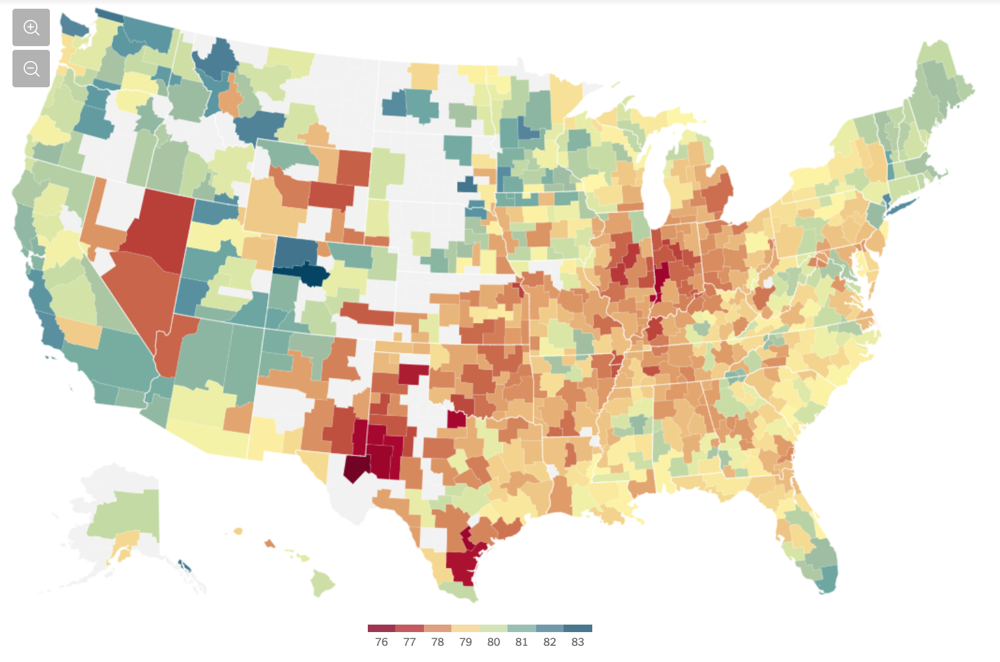

---
output:
  html_document: default
  pdf_document: default
---
# How to run a data visualization project

Every data viz project begins with a need, whether that needs come from a problem, decision, or clarification, there is a certain process for each project. Firstly, each project needs data to visualize. The data that is being used and the procurement of that data is essential as it will mold the audience, argument and metric that will all need to be evaluated throughout the steps of the project. Next, an argument needs to be made that will utilize the data to explain, answer, or convey the point the viz is made to get across. Developing a good argument requires a warrant and backing followed by a rebuttal and qualifier all to support the overall argument. Following a formed argument the visualization can be constructed to establish the audience and take into account the aspects of the data that will be used. In all, a data viz project has these basic steps, but the intricacies of each use case is where complexity plays a factor. Complexity can be rivaled by using subject matter experts and practices utilized by other viz projects that are explained throughout this reader.

In each data visualization project there are many things to consider to minimize risk and ensure a successful project. This chapter will explain many of these concepts along with some use cases that can be utilized for specific types of businesses. One of the critical topics that is explored is risk, as minimizing risk is a key factor when deciding what data to utilize and how a specific chart type would characterize the data best. Along with risk there are certain limitations a team could face that do not pertain to data. The people and skills that are a part of the team need to be considered as this could limit what audience the visualization could be presented to. For example, a tableau user would most likely not have the skills to use Altair, let alone D3. These are just a few examples of items that will be found in the Health, Finance, and Retail use cases explained in the chapter.

## Introduction

While designing a data analytics project, we are often left wondering where to begin with in the first place? From data collection, cleaning, exploration, analysis and visualization, there is a lot that needs to be done in order to derive an insight that is - actionable & profitable, for the business.

There seems to be a no set way to approach this problem. However, in order to provide a framework to organize the work needed by an organization and deliver clear insights from data, it’s useful to think of it as a cycle with different stages.[@dataviz_lifecycle1]. This article explains a data science framework, breaking it down and taking us through each step of the project lifecycle to get us familiarized with the whole process in a simpler way.[@dataviz_lifecycle2]

### Step 1: Understanding the Business Issues
At the start of the project, the focus is to get a clear understanding of the overall scope of the work, business objectives, information the stakeholders are seeking, the type of analysis they want you to use, and the key deliverables. Defining these elements prior to beginning the analysis is important, as it helps in delivering better insights. Also, it is important to get a clarity at the beginning as there may not be another opportunity to ask questions before the completion of the project.

### Step 2: Understanding Your Data Set
This phase starts with an initial data collection and proceeds with activities like data quality checks, data exploration to discover first insights into the data, or to detect interesting subsets to form hypotheses for hidden information. There are a variety of tools we can use to understand the data. Depending on the size of the dataset, we can use Excel for manageable datasets, or use more rigid tools like R, Python, Alteryx, Tableau Prep or Tableau Desktop to explore and prepare the data for further analysis.

Key things to remember would be to identify key variables of interest to study the data, look for errors (omitted data, data that doesn’t logically make sense, duplicate rows, or even spelling errors) or any missing variables that need to be amended so we can properly clean the data.

It is important to note here that when working in an enterprise/ business environment, it helps to involve someone with keen knowledge of the source system such as a DBA who can assist with understanding and extraction of data.

### Step 3: Data Preparation
Once the data has been organized and all the key variables have been identified, we can begin cleaning the dataset. Here, we will handle missing values (replace with means, drop the rows or replace with the most logical values), create new variables to help categorize the data, and remove duplicates. Data preparation tasks are likely to be performed multiple times, and not in any prescribed order. After this step, the final dataset is ready to be fed into a modeling tool for further analysis.

From a business perspective, throughout the data preparation process the need is to develop an ever-increasing understanding of the data’s structure, content, relationships, and derivation rules. It is imperative to verify that the data exists in a usable state, and its flaws can be managed, and understand what it takes to convert it into a useful dataset for reporting and visualization. In such a scenario, leveraging Data profiling can help explore the actual content and relationships in the enterprise' source systems. Data profiling can be as simple as writing some SQL statements or as sophisticated as a special purpose tool. Tableau's Data Prep for instance is a great tool for profiling data for small scale projects. With enterprises, many ETL vendors offer a variety of tools can be chosend based on the need and budget of the business.

### Step 4: Modeling
In this step, we will use various modeling techniques to test the data and seek out answers to the given objectives. Typically, there are several techniques for the same data mining problem type, with some specific requirements on the form of data. Common models include linear regressions, decision trees, and random forest modeling, among others.

### Step 5: Validation
Once we are done building the model (or models) and proceed to the final deployment, it is crucial to assess the model thoroughly and review the steps executed to construct the model, to ensure that it properly achieves the business objectives. Did the models work properly? Does the data need more cleaning? Did you find the outcome the client was looking to answer? If not, you may need to go over the previous steps again. You should expect a lot of trial and error!

At this step, it is key to identify issues, definitions, transformation rules, and data quality challenges and document them for future reference. Such a documentation is useful from a business standpoint for future users. Maintaining a list of issues and validating new issues faced during data validation can significantly enhance the quality of the project and help improve scope for future improvements and define infrastructure needs of the business.

### Step 6: Visualization
Creation of the model is generally not the end of the project. Even if the purpose of the model is to increase knowledge of the data, the derived information will need to be organized and presented in a way that is useful to the customer. Depending on the requirements, this step can be as simple as generating a report or as complex as implementing a repeatable data scoring (e.g. segment allocation) or data mining process.

In many cases, data visualization will be crucial in communicating your findings to the client. Not all clients are data savvy, and interactive visualization tools like Tableau are tremendously useful in illustrating your conclusions to clients. Being able to tell a story with your data is essential. Telling a story will help explain to the client the value of your findings.

As with any other project, it is important to identify the business objectives clearly. Breaking the process into steps will ensure we get the best deliverables for our clients.

### Step 7: Documentation
An important addition to the steps in a data visualization project is documentation. Similar to the projects done in class, this documentation should provide a brief description of the project, data sources, data profile and quality, limitations of the data or arising during the use of data, key transformations and models introduced and their impact or usefulness in enhancing the quality of visualization.
Lastly, this documentation should also note the issues encountered when working with the data or creating a certain visualization that can be addressed in the future.

## Important Prerequisites of data visualization project

The below are the important prerequisites of a successful data visualization project.  
[@prerequisites_vizhitachi]  

+ **Defining the project** Behind every project there is an organizational need. The need could be as simple as a weekly sales performance dashboard or a sophisticated predictive recommendation engine. Addressing these needs with a concrete measurable objectives provide the right framework to deliver the right information in  right fashion. The communication of Key Performance Indicators (KPIs) from the end product is very important for the consumers. To do this, you need to collect requirements, set design processes, schedule regular discussions with users and continue these meetings until the final project rollout. Sample questions that can help one understand the project better:  
    + what is the organization need you are trying to address?  
    + What are the main data sources you need to access?  
    + Is the data upto date or will it provide updated data in regular intervals?  
    + which type of data visual works best?  
    + Is there a measurable goal you want to achieve?  
    + What are the core KPIs to convey to users if any?  
    + Which type of KPI visualization is suitable for this goal?  

+ **Understanding the audience** How will they process this visualization is another important prerequisite. Designing a visualization for scientists is entirely different from a visualization designed for law-makers or for general public. Most user want to see 'Key performance indicators' which are the main drivers for visualizations. The following are different kinds of visualizations that can be used to display KPIs:
    + Quantities: counts or measures. Example - Count of likes or comments.  
    + Trends and changes over time:  time series. Example - Change in sales quantity over time.  
    + Relatives Share and proportions:  display relationship between the parts and the whole. Example - breakdown of a stock portfolio by asset.  
    + Ranked list: although not a real data visualization, it could achieve the goal needed.  
    + Geographical Location: Gives user spatial and physical relationships.  

+ **Understanding the data you are trying to visualize** such as shape, dimension of the data, is data a time-series, relationship in data between entities,categorical attributes is also an important prerequisite. Is this data from a single source or multiple sources?. If the data is from multiple sources, they need to be blended together without loosing the meta data constraints and business rules. When the data is collected, the end goal should be kept in mind.

+ **Deciding which visual is best**
One of the biggest challenges for business users is deciding which visual should be used to best represent the information. Tables, Linechart, Areachart, Barchart, Scatterplots, Piechart, Treemaps, Heatmaps, Natual Language Generation, Etc. Depending upon the industry and specific department business may want to measure success based on specific goals and targets. Few of the KPI examples that can help are listed as follows:  
    + Marketing Metrics.  
    + Sales Metrics.  
    + Saas Metrics and KPIs.  
    + Digital Marketing Metrics.  
    + Social Media Metrics.  
    + SEO KPIs.  
    + Financial Metrics and KPIs.  
    + Supply Chain Metrics.  
    + Healthcare Metrics.  
    + Call Center Metrics.  
    + Support Metrics.  
    + Retail Metrics and KPIs.  
    + Help Desk Metrics and KPIs.  
    + Insurance Metrics.  
    + E-Commerce Metrics and KPIs.  
    + HR Metrics.  
    + Devops Metrics and KPIs.  

+ **Choosing the tool for the project**  
[@prerequisites_tools]  
    Choosing a tool, depends on the person conducting or designing the visualization, and the platform he wants to integrate his work into.It also depends on the ability of the user and their needs. eg:-Tableau has a no code approach whereas D3.js ,Altair etc has coding approaches. These approaches help users to adopt and customize further. For example: With Tableau, users can add customization such as a new formula addition, sorting behaviors to the charts initially developed, whereas D3.js and other coding tools may not give that flexibility and the users are dependent on the designer to make further changes. These approaches are discussed in detail below:  
  + **No coding:** One can start with MS Excel and probably use pivot tables feature, in excel you come up with decent charts. If you already have some data and need a powerful tool to explore the data visually, Tableau is the tool. There is a free public version and a paid version , which students can get for free. One can publish the charts to web .To start Tableau Public website has a good number of examples to take inspiration from.  
  + **Some coding:** If somebody wants to venture in the coding world to build charts, R is a good start. It is easy to learn, free as it is opensource.One can us the ggplot library in R to come up with visual data exploration. You can publish these charts with the help Shiny package and add a bit of interaction as well.  
  + **More coding:** This section is derived because of recent innovation in interactive visualization, especially on the web. One might ask where to start to come up with interactive visualizations as good as New York Times. The answer is D3.js, many of the data visualizations running in the browser today is D3.js, created by Mike Bostock. This does mean you&#39;ll need to learn some Javascript in general and then D3.js specifically. One area to call out as a particular strength of D3 is geospatial visualizations. D3 is great at creating maps of many flavors. Finally, if you really want to learn a do-it-all programming language that just happens to be great at data visualization, go with Python. Python is a general purpose and powerful tool, and it&#39;s quite popular in the data science community. Finally, much like D3.js for Javascript or ggplot for R, there are many Python libraries dedicated to data visualization. Seaborn (which builds on an older popular library, matplotlib) and Bokeh are probably the best-in-class right now, but this is a quickly evolving and improving landscape. Both the [Seaborn](http://stanford.edu/~mwaskom/software/seaborn/examples/index.html) and [Bokeh](http://bokeh.pydata.org/en/latest/docs/gallery.html) websites include galleries showing off the kinds of visualizations you can create with those tools.

+ **User Interaction**  
[@prerequisites_vizhitachi]  
    Something to consider is wheter or not you want your project to be interactive. You can consider making your visualization dynamic with filters, drilldown capabilities and more. This provides a more engaging experience and increases user adaptation. While static and interactive visualizations have their pros and cons it is always imperative to analyze first if they will make your vixualization more effective.
      Some interactive tools:
   + **Filters and Selectors:** Flexibility is key
   + **Hover and Drill Down Interaction:** Provides great opportunity for interaction

+ **Effective Use of Colors in a Visualization**

	When coming up with a visualization one must understand the impact of colors used in a chart. Color can grab people's attention, set the mood, and influence perception.  Our brain views color in terms of lightness (black to white), saturation (dull to bright), and hue (red, orange, yellow, green, blue, purple.)

	To start with here are some Dos and Don'ts:
	[@prerequisites_colorrules]

	**Dos:**

	+ **Use one color to represent continuous data**  – Representing continuous data and ranges by varying the saturation or value of a color makes you chart straightforward and easy to read.

	+ **Use contrasting colors for comparisons**  – Contrasting colors help the viewer differentiate the data quickly
	+ **Use colors that appear in nature**  – People respond better to colors they are familiar with; colors that appear naturally in the world around them.

	+ **Use branded colors for marketing materials or presentations**  – Customizing your data visualizations to match your company&#39;s color scheme helps you align with your brand and keeps your messaging consistent. It also helps with brand recognition.

	+ **Use color to highlight your most important information**  – Color can be a great way to guide the viewer&#39;s eye to key points on your chart. We suggest using muted colors with one bright color to bring attention to your most important information.

	**Don'ts:**

	+ **Pick colors that are too hard to distinguish**  – It&#39;s important for your viewer to be able to understand the data you are presenting. If they need to quickly make comparisons, the colors need to be easy to distinguish.

	+ **Use too many colors**  – Try to avoid the rainbow effect! Less is more. Make sure the colors you choose have a purpose and make your chart easier to read, not harder.

	Some Prerequisites while choosing a color scheme for a visualization are:
	[@prerequisites_colorchoose]

	+ **Symbolism :** Symbolic colors vary by culture: for example, red is often used to represent love or passion in Western cultures, whilst Eastern cultures associate it with wealth and fortune.
	+ **Emotional values :** for example, think of age: little ones generally appreciate brighter colors, and therefore retailers whose target audience consist of children will use cheery and vivid colors on packaging and advertisements.
	+ **Historical experiences :** for example, if you once felt threatened by a fire, red and orange might have negative connotations for you throughout your life.
	+ **Signaling conventions in society :** Signal colors are hues that send our minds a message. They are part of our everyday life, just take for example how we use traffic lights to regulate our drives.

## Overview of process for a data visualization project
Before launching into any project it is most important to involve the right players. These players can be business owners who have commissioned the data viz project and/or key stakeholders who will be actively using the data visualization. Participation of business representatives is most ciritical to first identify the need for the project and achieve a common ground for requirements and what would define success. Involvement and collaboration
strongly increases the likelihood that the resultant visualization addresses business’s needs. Likewise, the organization’s data users should participate, especially when discussing the data they’re responsible for governing. Creating a data visualization should be a highly iterative and dynamic process.

## Planning a Data Visualization Project
Running a data visualization project can be a simple and easy task or a complicated and frustrating one. As with all other projects, the planning phase of a data visualization project is essential to ensure the final product of the project is an effective visualization - one that is easily understood, provides insight and perhaps stimulate an action from the reader. A well planned project also helps to reduce the number of iterations, or going back-and-forth, during the development of the visualizations and trying to make it fit with the narrative of the story being told through the visualizations.

At the core of all data visualization is its dataset. Each set of data has its own particular display needs, and the purpose for which you’re using the data set has just as much of an effect on those needs as the data itself. Understanding the characteristics of your data set can help you to determine what kind of visualization you’ll use. [@BenFry]

Some important points to keep in mind when planing a project are:  

  **Too Much Information**  
We should always remember that while we want to present information to our audience, the reader, we also do not want to present too much information that the visualization becomes challenging to understand and confuses the reader more than helps to clarify a situation.

  **Data Collection**  
Ensure that the data is obtained from a reliable source and that breadth and depth of the data is sufficient to establish a belief in the story being presented.

  **What Is the Question? Finding the Story**  
[@BenFry]  
When beginning a visualization project, while it is common to focus on the data that has been collected, we need to remember that great information visualization never starts from the standpoint of the data set, but rather, it starts with questions. _Why was the data collected, what’s interesting about it, and what stories can it tell?_ Think about how the data will be used and work backward to what was collected. You collect data because you want to know something about it. If you don’t really know why you’re collecting it, you’re just hoarding it!

Be concise and specific with your questions and this will lead to clear results. When questions have a broad scope, as in “exploratory data analysis” phase, the answers themselves will be broad and often geared toward those who are themselves versed in the data.

One of the most important (and least technical) skills in understanding data is asking good questions. An appropriate question shares an interest you have in the data, tries to convey it to others, and is curiosity-oriented rather than math-oriented. Visualizing data is just like any other type of communication: **success is defined by your audience’s ability to pick up on, and be excited about, your insight**.

Admittedly, you may have a rich set of data to which you want to provide flexible access by not defining your question too narrowly. Even then, your goal should be to highlight key findings. There is a tendency in the visualization field to borrow from the statistics field and separate problems into exploratory and expository, but for the purposes of this book, this distinction is not useful. The same methods and process are used for both.

In short, a proper visualization is a kind of narrative, providing a clear answer to a question without extraneous details. By focusing on the original intent of the question, you can eliminate such details because the question provides a benchmark for what is and is not necessary.

Ben Fry in his book on Visualizing Data, shares the 7 stages in visualizing data as follows:

1. **Acquire** - Obtain the data, whether from a file on a disk or a source over a network.
2. **Parse** - Provide some structure for the data’s meaning, and order it into categories.
3. **Filter** - Remove all but the data of interest.
4. **Mine** - Apply methods from statistics or data mining as a way to discern patterns or place the data in mathematical context.
5. **Represent** - Choose a basic visual model, such as a bar graph, list, or tree.
6. **Refine** - Improve the basic representation to make it clearer and more visually engaging.
7. **Interact** - Add methods for manipulating the data or controlling what features are visible.

## Finding Insights from Data Visualization
Visualizations enable discovery of patterns and insights which might already be known and obvious or might be new and unexpected. One should seek for insights which can be used to tell stories, and not just expect the visualization to illustrate a story by itself. The insights could represent different things such as a beginning of a story or an error in data, therefore, to ensure an effective approach in finding insights from data and visualizations, the following steps is helpful and can be repeated.

1. **Visualize**
This allows a unique take on the dataset and can be done in several different ways such as charts, tables, maps, and graphs.
For example, the information relayed should give invaluable insights that will help the viewer make business decisions. Jon Steel, a leader in the account planning field, said the following of looking at and understanding data: “In the context of an advertising agency, the ability of planners to look at the same information as everyone else and see something different is invaluable. They need to be able to take information of all sorts, shuffle it around, and rearrange it in new patterns until something interesting emerges.” Not only will good data visualization convey actionable information, but it will help you to see things other people maybe can’t see. [@The-Art-of-Visualizing-Data-to-Find-Actionable-Insights]

2. **Analyse and Interpret what you see**
In this step, ask yourself questions like:
What can I see in this image? Is it what I expected?
Are there any interesting patterns?
What does this mean in the context of the data?
These questions may not only help you find meaning within the visualization but may also show you that the visualization tells you nothing relevant about your data although the visualization might look nice.

3. **Documenting your Insights and steps**
This step of documentation can begin before you have a look at the data. Usually, we have expectations and assumptions about a dataset before we start working with it, and there is a reason on why that particular data was chosen. These thoughts can be documented to allow us to identify our preconception and lower the risk of misreading of the data by finding what we expected.
Documentation is the most crucial yet the most skipped step. Documentation provides context in which the charts were created, thereby eradicating any confusion that may arise from looking at several set of charts. Some things to note while documenting includes:
Why have I created this chart?
What have I done to the data to create it?
What does this chart tell me?

4. **Transform datasets**
This step allows for exploration of more patterns and findings. With the insights formed from previous steps, more questions regarding the data or findings might arise, and further inspection or analysis might be required. This can be done by transformation such as zooming(aggregating data points into a single group), filtering, and outlier removal.

## How to Structure a Data Viz Project

### Hook The Audience on Your Key Message

A Hook is simply something that draws the reader in.  Hooks communicate to the reader right away why he/she should pay attention to your project.  They can be surprising, unusual, or controversial, but one thing’s for certain: hooks can’t be ordinary.  After all, if your project tells people things they already know, then what does your project do for them?    

To help you formulate your hook, ask yourself: what is the biggest takeaway?  If someone could only remember one thing from your project, what would it be?  This takeaway could be a novel point of view, startling new research, or a bold opinion.  Often times, this is going to be the main argument of your project.  Condense your argument into a short, digestible, memorable chunk.     

Journalists have to write hooks all the time: their hooks are called headlines.  Nowadays headlines have a bad reputation, but they’ve been a part of journalism since the beginning for a reason: they work.  A great headline does all the things a great hook does: it summarizes the key information of the article, and it attracts the reader’s attention so that he/she will read the article.  This isn’t to say that you should publish click-bait, but it’s important to entice your reader’s attention no matter what kind of project you’re doing.  

Let’s take a look at a hook from a vox visualization project:

taken from: [@Hook_example]

**It's easy to become obese in America**

This hook is great on so many levels.  It’s simple and short; the key argument is being summarized in just one sentence.  It also tackles a controversial topic of Obesity in America.  Finally, the article takes a novel stance.  Rather than blaming obesity on poor parenting, lack of willpower, or corporate greed, the article is a different approach by saying that eating healthy is inconvenient.

Since hooks only serve as introductions, the reader will need more information in order to truly understand your argument.  in order to really gain an understanding, the reader needs to understand the background and context of your project.  

### Background and Context

Context is something universally appreciated when being presented with any type of new information, and with data visualizations context is necessary for both basic understanding and proper interpretation. Context show as early as the title and hook of the article.  Background is similar to context in how critical it is needed to avoid any poor interpretation, however it shows later on as a longer description.

Background begins with what drove the decision to use the subject matter. Even for purposes of work or schooling, the data used has a background which needs to be represented. Asking questions such as what history is behind this data, or where and from whom it is collected can provide the reader with the path to understanding the point of the project.

Background is both the history behind data or the history project creation itself, and context furthers the readers frame of mind. This frame of mind is necessary and is done such that they can understand how the data might be represented and how it can be interpreted it given the number of ways data is now provided.

An excellent example of both background and context comes from a visualization in the New York Times titled “The Rich Live Longer Everywhere. For the Poor, Geography Matters.” First, let’s assume we have no background or context, including the title and hook which already provides some. Below is the graph as one would see it without any interaction or background or context:

At best, some could recognize this as a division by collections of counties, and some scale between 76 and 83. What could someone take away from this? Average high temperature in the summer? Probably not, Nevada is mostly red, whereas blue is the high end of the spectrum which would be very counterintuitive. However, with proper context and background, a reader can actually interpret what the visualization means. The NYT does an excellent job at this:
“For poor Americans, the place they call home can be a matter of life or death.
The poor in some cities — big ones like New York and Los Angeles, and also quite a few smaller ones like Birmingham, Ala. — live nearly as long as their middle-class neighbors or have seen rising life expectancy in the 21st century. But in some other parts of the country, adults with the lowest incomes die on average as young as people in much poorer nations like Rwanda, and their life spans are getting shorter.” [@Irwin_Bui]

With this background and context, the graph can serve its purpose in representing the data that drives it. Once the reader has this, they can find their way to understanding the findings.

### Key Findings

Structuring a data visualization project ultimately comes down to the key findings. What is the most important takehome message you are attemping to present to an audience. The key findings must be visually represented in conjunction with the hook, context, background, and flow as previously mentioned. Most importantly, the visualization needs to be memorable for the audience. Visualizations should be efficient, punctual, informative, peak interest, and tailored to the audience with the latter being of utmost importance. The project final visualization should forefront the most important attributes and minimize junk or aesthetic noise. In conclusion, the key finding for any visualization project should be simple, digestible, and tailored to the audience.  A visualization should exclude junk and distractions while focusing on the underlying message (Borkin et all. 2013).

So how do we make a chart memorable to present key findings? In a new Harvard School of Engineering and Applied Sciences study that monitors and tracks people's eye movements as they look at graphs and visualizations, researchers have a better understanding of important visualization attributes that results in increased memory retention. [Making Visualizations More Memorable](https://www.seas.harvard.edu/news/2015/11/making-visualizations-more-memorable)

Perhaps surprisingly, the general conclusion was:

1. **Make your Title Count** - while the visualizations are clearly important, this study actually reports that the audience spends the most time on the header.

2. **Pictures are worth more than a few words** - being text heavy will bog the reader down. The visualization should minimize the text and maximize the effectiveness of the visualization.

3. **Repeat, Repeat, Repeat** - as anyone will tell you, repetition is crucial to enable long term memory.

Data visualization and business intelligence is a powerful tool to showcase and visualize pertinent company information. Presenters must always identify the overarching question and proceed to create a visualization that would highlight forward progress with respect to that question.

***

### Integration with Business
[@data_viz_idea]

#### Bring big data visualization up front

Enterprises are finding ways to create data visualization front ends that can be explored by front-line workers.
Rather than have developers create a purpose-built app, enterprises can wire up Google's Data Studio to their data sources, then create and style a simple UI with Analytics Canvas.

####  Connect time and space

Marketers use location intelligence to understand consumer preferences, behavior or loyalty based on when, where and how often someone shows up. Customer support managers use location intelligence to create better customer experiences, since physical location is usually a big part of servicing a customer -- from predicting arrival, delivering timely solutions to urgent issues and routing. Business development teams use location intelligence to reduce risk for future investments, such as where to open a new store, where to drill a new well, or where to construct a new cell tower.

#### Visualize the voice of the employee

Large organizations realize that employee turnover is a problem, but they struggle to shift to a more personalized and prescriptive engagement strategy. With a higher demand on skilled resources, increased attrition, and costly hiring and on-boarding processes, U.S. businesses are losing millions to tens of millions of dollars every year due to turnover.
Some employee experience elements that Acumen has built visualizations for include employee interaction analysis to visualize the drivers and satisfaction across multiple channels and workforce landscape analysis to understand workforce makeup and which types of employees are more or less loyal.

#### Map data visualization to the real world

In general, visual analytics experts recommend focusing on simple charts and lines to make it easier to tease apart relationships between elements in big data. For example, a data visualization project on flight seat analysis for a major airline. Using seat booking data from millions of transactions, the team built a visualization shaped like an airplane with the exact seating arrangement as the actual aircraft. The seats that generated more revenue appeared darker in the visualization, helping the airline identify profitable seats that could bepriced  higher, along with the poorly occupied ones that needed promotions. These visualizations were interactive and could be analyzed across several parameters to get deeper insights.

### Conclusion

Some possible components of the conclusion are takeaways, thoughts on the Future, how to improve your presentation, and references.

#### Components of the conclusion

**Takeaways:**
The essential question smart “visualization” and “visualizers” should address is not, “What’s the best and most accessible way of presenting the data?” but “What kinds of conversation and interaction should our visualization evoke?” (Source: [@Viz-project-conclusion])

Tips:

For takeaways, the essential question smart “visualization” and “visualizers” should address is not, “What’s the best and most accessible way of presenting the data?” but “What kinds of conversation and interaction should our visualization evoke?” ([@Viz-project-conclusion]) Here are some tips:

1. Avoid mixed messages on the same dashboard that leave the audience confused: Deliver ONE strong message by focusing the data you present to ensure a central theme emerges. 
2. Construct a good story: The way you organize and present your content can facilitate a clearer understanding. Group your visualizations so that each element within a dashboard reinforces your overall message. Ensure every metric and visualization is relevant, so viewers can easily draw the conclusion you wish to illustrate.
3. Establish context: Often, a clear picture can say a thousand words. But are they the ones you want?  Every viewer may not have the appropriate context to draw your desired conclusions

(Source: [@Viz-project-conclusion1])

**Thoughts on the Future:**
It would make the project more meaningful if we include some thoughts on the future of the topic, explaining to the audience where we think the results can lead us. What do we think are the next steps to take? What other questions do the results raise?

**How to improve your presentation:**
It would be informative to list out any currently missing but useful data in the existing dataset for creating the visualization, or discuss some other aspects of the topic they could've done.

**References:**
Always include any references used in the project, including data soureces, inspirations.
You must cite:

1. Facts, figures, ideas, or other information that is not common knowledge
2. Ideas, words, theories, or exact language that another person used in other publications
3. Publications that must be cited include:  books, book chapters, articles, web pages, theses, etc.
4. Another person's exact words should be quoted and cited to show proper credit

(Source: [@Viz-project-reference])

([@Viz-project-conclusion1])

For thoughts on the Future, it would make the project more meaningful if we include some thoughts on the future of the topic, explaining to the audience where we think the results can lead us. What do we think are the next steps to take? What other questions do the results raise? As for how to improve your presentation, it would also be informative to list out any currently missing but useful data in the existing dataset for creating the visualization, or discuss some other aspects of the topic they could've done.

Always include any references used in the project, including data sources and inspirations. You must cite facts, figures, ideas, or other information that is not common knowledge; ideas, words, theories, or exact language that another person used in other publications. Publications that must be cited include: books, book chapters, articles, web pages, theses, etc. Another person's exact words should be quoted and cited to show proper credit. ([@Viz-project-reference])

## How to decide what type of visualization to use:

### Business

As per [this](https://www.investopedia.com/terms/b/business.asp) article: A business is defined as an organization or enterprising entity engaged in commercial, industrial, or professional activities. Businesses can be for-profit entities or non-profit organizations that operate to fulfill a charitable mission or further a social cause.

The list is far from all inclusive but depending on the type of business following are some of the types of data that can be generated:

1. Product data
2. Profit and Loss data
3. Performance data
4. Promotions data
5. Supplier and customer data

Following are some of the visualizations that is common to any business. This list is also not exhaustive. [@graphs]

1. **Flow charts:** A flow chart allows a process to be sequenced step-by-step, from beginning to end, for the purpose of analyzing, designing, documenting or managing it. The charts can even feature multiple beginnings and ends, with countless pathways in between. While a simple flow chart can certainly document a basic process from A to B to C, the diagrams are more frequently used to illustrate more complex sequences with multiple decisions or conditions along the way. Each time a condition is met, the chart diagrams the various options, then the path continues following each choice.
Below is an example of the Flow Chart:

 

2. **Control charts:** Commonly known as a process-behavior chart, a control chart helps determine if a data set falls within a mean or predetermined control range. Frequently used in quality control processes, a typical control chart consists of points plotted on two axes, representing sample measurements.
Below is an example of the Control Chart:

 
3. **Stock charts:** One of the most vital of all financial graphs, stock charts help investors track the markets to determine profits and loss, as well as make buying and selling decisions. While a variety of graphs are used to represent market changes, the most common is likely the basic line graph turned histogram.
Below is an example of the Stock Chart:

 

4. **Gantt charts:** Gantt charts are special types of bar graphs used to diagram projects and schedules.
Below is the example of Gantt Chart

 
5. **Waterfall charts:** Particularly useful in accounting and qualitative analysis, waterfall charts illustrate how an initial value is affected positively and negatively by various factors. For example, a waterfall chart could clearly and efficiently communicate how an opening balance changes month by month over the course of a year.
Below is the example of Gantt Chart

 

6. **Hierarchy Diagrams:** Similar in appearance to a flow chart, a hierarchical diagram, also known as an organizational chart or an organigram, illustrates the structure of an organization, as well as the relationships within it.
Below is the example of Gantt Chart

 

### Health

Health is a huge business domain and generally comprises of three types of players:
* **Healthcare Providers** which includes hospitals and health systems
* **Health insurance** companies which include most providers of health insurance
* **Public health** organizations which take care of population health aspects

Due to difference in operations and objectives of these players, the metrics or KPIs that are relevant to each type of player are vastly different.

**For healthcare providers, while the metrics fall under general areas of operations, finance, quality etc. the type of metrics are very different from a typical business organization. Some of the sample metrics under these areas are**:

* **Finance** : Often also categorized as Revenue, the key metrics under this domain include revenue trend across time, share of revenue across different specialities such as cardiology, surgery, orthopedics etc., revenue by service areas which could include admissions, diagnostics, pharmacy etc. and revenue by physician, average revenue per patient and patient category and revenue by insurance payer to understand which payers are the largest insurance providers for the patients.

Following is a chart showing average revenue per patient (ARPP) at the national, state and hospital level for a hospital located in Tennessee. The chart also shows ARPP comparisons for different patient ailments such patients admitted via emergency, surgical patients and non-surgical patients and overall revenue per patient. Such a chart is useful in answering many questions - why does the hospital have a higher ARPP value for surgical patients than the state? Is it because they are renowned for complicated surgeries or have higher patient loads of in-state or out of state patients or do they simply charge higher for procedures that can be done in lower amounts at other hospitals.[@dexur]

* **Operations** : Second most important area is operations. This is the most critical of all domains because a hospital's operations determine the clinical outcomes for its patients. Hence, following standard procedures and ensuring the best outcomes are the top priorities for healthcare providers. Some of the key metrics under this domain include: number of outpatient visits by specialty and physician, number of daycare procedures, overall inpatient occupany rate and occupany by different specialties and average length of patient stay in the hospital.

Below is an image taken from [@hcup-us] which shows the average length of stay of patients and the total number of discharges per million population. The green line shows that average length of stay has declined over the years. This could be a good indicator of improved operations and advancing technology. Ideally the length of stay can be anywhere between 3-5 days or more depending on the nature of patient's ailment.

* **Clinical Quality** : For a healthcare provider, its performance is determined not just by revenue but by the quality of treatment provided to patients. Some key quality related KPIs include - surgery infection rates, re-admission and mortality rates, sentinel events, needle stick and other bodily injuries.

The following chart, taken from [@ncbi] shows re-admission rates for different procedures across states in 2009. Such a chart is very useful to understand why some procedures have significantly higher re-admission rates than others. Thus, a visualization need not be the be-all end-all for a data visualization project. It can be an ongoing process of generating questions through visualizations and looking for answers to help solve business problems.

* **Other important KPIs**: Some of the other important KPIs for healthcare providers include, patient satisfaction scores, asset utilization for operating theatres, diagnostic and other equipment and patient footfalls.

**In the public health sector, a few of the common data being generated are**:

1. Electronic medical records of patient
2. Insurance information
3. Medicine testing
4. Population surveys
5. Genomic sequencing of data
6. Social media posts on ailments
[@health_article]

**Important metrics**:

1. Some of the most common metrics in the health sector are tracking the geographic distribution of diseases, analyzing the prevalence of diseases, predicting outbreaks and discovering at-risk populations.
2. Long term trends can also be analysed, such as aging populations in advanced economies.
3. It can also be used by the general public to understand relevant health risks, recognize biases in health information, vote on environmental issues, and make decisions about their lifestyle.
[@health_article]

**Common types of Visualizations**:
Currently, many health visualization tools use simple charts, such as bar charts ,scatter plots etc. that only represent few facets of data and can be understood by the general population.

*A few examples are illustrated here*:

This multi-line plot depicts the life expectancy at birth for each gender and multi-racial background.

This stacked bar plot represents the proportion of teens being overweight from 1999 to 2009

[@health_sector]

### Finance

In the Finance world, data has always been one of the most important criteria for making decisions. Finance has always been about numbers, but complex algorithms that can collect data from an ever wider number of sources help inform and support trading decisions. [@finance_reference] Also, Risk management is an enormously important area for financial institutions, responsible for the company's security, trustworthiness, and strategic decisions.

**In Finance, a few of the common data being generated are as below**:

1. Stock prices
2. Trading data
3. Credit and debit card history
4. Balance sheets

**Important usecases**:
Data visualizations are used in performing various tasks for Algorithmic Trading, Risk Management, Predictive Analytics and Real-time Analytics.

**Common types of Visualizations**:
Financial visualizations should be able to display live and historical data feeds to alert to new opportunities faster than humans can read, and discover new opportunities while gaining a competitive edge. So, we need to choose the best suited for the goal.

Financial charts, in general, should be simple. It can be very technical and very elaborate. It should be able to show projections, predicting, what if analysis. In most of the cases, line charts and barcharts are enough to convey the message. Being able to quickly access and interpret market data is an essential component in the competitive trading arena.

*A few examples are illustrated here*:

Business and Finance Stock Charts

[@finance_sector]

Financial Performance Dashboard

[@finance_sector]

### Retail

**Common data being generated**:

1. Customer related data
2. Data about orders generated and products sold
3. Inventory and supply chain information
4. Store specific data

Data Visualization tools can prove to be of great help in retail as they can help understand customer behavior, product trends, store specific performance etc. in a visual manner. This helps managers assimilate and process information quicker and arrive at decisions sooner.

**How data is being used?**
Internet of Things shelf scanners are increasingly able to process information on whether stores are empty or full when it comes to stocks. Internal and third party data can be leveraged to understand the differences in merchandising perceptions for trends and pricing. Using in-store and online data managers can also understand customer behavior and design campaigns and order inventory accordingly.[@Retail_gen]

**Common types of Visualizations**
Visualization tools make use of simple scatter plots and heat maps to show the overall relationship in a large amount of data. Bubble charts can also be used to map out profit and sales and basic elements of demand and supply. Opportunity curves are commonly used to determine ost effecient price in terms of revenue or profit maximization. [@Retail_typesofviz]

Below the an example of a typical dashboard for the retail industry.

### Project Management

Data visualization can be used as a tool to understand conceptual and idea-development processes. The important advantages of data visualization for project management include:

1.	Enhance Communication
2.	Boost Collaboration
3.	Improve Clarity

To get teams to collaborate and better communicate, project managers have used such visual tools and techniques as a project display wall, project collaboration wall, project social media, 3-D project environments, project gamification, etc.

Rather than a meeting, conference call or email, the data visualization is shared in a common location, which fosters communications between the project manager and the team or stakeholders. The project manager can take the data visualization and target it to the needs of the audience.

Some visual tools that can be used in project management include mind mapping, process mapping, storyboarding, root cause analysis, charting, diagramming, graphing, drawing, sketching, wireframing and use cases.[@PMviz]

[@PMvizpic]

### Useful platforms and tips for data visualization project

### Useful platforms

[@platforms]

+ Looker
+ Zoho ANalytics
+ Tableau
+ Chartio
+ Kibana
+ Plotly
+ Qlikview
+ MATLAB
+ Infogram
+ Microsoft Power BI
+ D3.js

### For Non-Developers
Many free and web-based tools are very good for non-developers to design high quality visualization, especially these tools are no coding necessary.  Here is the tool list for reference:

1. **Excel** is one of the most widely used spreadsheet programs in the world, and comes built-in with many options for creating charts and graphs with an eye toward common business applications, from representing profit-and-loss to showing stock performance.  

2. **Google Sheets** contains a number of visualization options similar to Excel. With just a few clicks, anyone can put together a number of basic graphs, from line charts to bar graphs to scatterplots and histograms. Helpfully, Google Sheets looks at your data and grays out any options that aren’t appropriate for your spreadsheet, making it easy to quickly compare different plots.  

3. **Raw** is an open, customizable tool for building vector-based graphs and charts, built on D3.js. It allows you to simply copy and paste your data from Excel or Google Sheets, select a chart type, and customize it based on the variables and relationships you want to highlight. Once it’s ready to go, you can export it as an svg, image, or JSON data model.  

4. **Google Data** Studio is a relatively new product from Google that’s designed to make it easy for marketing teams to create detailed, shareable, interactive reports. It uses a simple drag-and-drop interface and templates to make putting together reports easy and quick. As you might expect, it integrates easily with data from other Google Analytics sources.  

5. **TimelineJS** provides an easy-to-use template for creating and embedding interactive timelines on the web. It’s especially great for blogs and other publications, and has been used by Time, CNN, Le Monde, and more.  

6. **Plotly** is a web app for creating charts and dashboards that’s popular with both data scientists as well as journalists from major organizations like the Washington Post, Boston Globe, and Wired. It’s basically a GUI for D3.js, which makes it well suited to building highly responsive graphs.  For heavier duty projects, it also comes with APIs for Python, R, Matlab, and other data science tools.

### For Complex Projects
Because some companies such as data-heavy startups, governmental organizations, and major corporations are making strategic decisions and analysis on complex data set, and shows complex 2d and 3d representations. The article ‘19 tools for data visualization project  visualization tools can manage heavy duty data and projects.

1. **Tableau** is an extremely popular data visualization and exploration tool used by a number of startups. It comes in a few different versions, from a full-featured Business Intelligence platform to a free cloud-based version for smaller companies and projects. It’s popular for its rich visualizations and an intuitive interface that makes it easy to use even for non-specialist. It also has a slick mobile app and can be embedded in other applications that want to make attractive analytics available to their users.

2. **D3.js** is a JavaScript library that uses HTML, CSS, and SVG to create a wide variety of dynamic, interactive visualizations. It emphasizes web standards, allowing it to take full advantage of modern browser technologies without being tied down to any one framework. It’s been used by the New York Times for some of their rich graphical features.

3.  **ggplot2** is a visualization package for R. At its core, ggplot2 abstracts graphs into certain basic building blocks like data, scales, layers, and transformations. This makes it easier for developers to tailor their graphs to their taste without sweating the details, though this flexibility comes at a cost to speed.

4. **NetworkX** is a Python library that allows you to create and analyze graphs and networks. It’s designed to work with both standard and nonstandard data formats, which makes it especially efficient and scalable. All this makes NetworkX especially well suited to analyzing complex social networks.

5. **matplotlib** is the standard Python library for creating 2D plots and graphs. It’s pretty low-level, meaning it requires more commands to generate nice-looking graphs and figures than with some more advanced libraries. However, the flip side of that is flexibility. With enough commands, you can make just about any kind of graph you want with matplotlib.

6. **Seaborn** is a popular visualization library for Python that builds on matplotlib’s foundation. The first thing you’ll notice about Seaborn is that its default styles are much more sophisticated than matplotlib’s. Beyond that, Seaborn is a higher-level library, meaning it’s easier to generate certain kinds of plots, including heat maps, time series, and violin plots.

### For Interactivity
Interactivity is also an important element for data visualization project.  Interactive visualization focus on graphic visualizations an improving the way users can access and interact with information.  Here are some recommended tools which contains strong interactive features:

1. **Dygraphs** is a highly customizable, open source Javascript charting library that places a heavy emphasis on interactivity. Zoom, pan, and mouseover are supported out of the box on just about every browser. It also supports pinch-to-zoom on mobile and tablet devices. It’s also built to be quick even when working with millions of data points.

2. **Leaflet** is an open-source JavaScript library for creating interactive, mobile-friendly maps. It’s designed to be beautiful and simple, with built-in animations for zooming, panning, and fading, as well as support for retina displays. While the core library is pretty small, it can be extended with a number of plugins.

3. **ggvis** is an R package for producing interactive plots made by (no surprise) the same team that made ggplot2. An important feature of ggvis is that it needs to be connected to a running R session in order to work. This makes it great for data exploration because you can do anything with it that you can do in R. However, that also means it’s less well-suited to publication than many of the other tools on this list.

4. **Bokeh** is a Python library that makes interactive, zoomable plots in modern web browsers using JavaScript widgets. Another nice feature of Bokeh is that it comes with three levels of interface, from high-level abstractions that allow you to quickly generate complex plots, to a low-level view that offers maximum flexibility to app developers.

5. **Basemap** is a Python library that adds support for simple maps to matplotlib by taking matplotlib’s coordinates and applying them to more than 25 different projections. The library Folium further builds on Basemap and allows for the creation of interactive web maps, similar to the JavaScript widgets created by Bokeh

### Tips for Data Visualization Projects

1. **Choose the chart that tells the story:** There may be more than one way to visualize the data accurately. In this case, consider what you’re trying to achieve, the message you’re communicating, who you’re trying to reach, etc.

2. **Remove anything that doesn’t support the story:** That doesn’t mean you kill half your data points. But be mindful of things like chart junk, extra copy, unnecessary illustrations, drop shadows, ornamentations, etc. The great thing about data visualization is that design can help do the heavy lifting to enhance and communicate the story. Let it do its job. (Oh, and don’t use 3D charts—they can skew perception of the visualization.)

3. **Design for comprehension:** Once you have your visualization created, take a step back and consider what simple elements might be added, tweaked, or removed to make the data easier for the reader to understand. You might add a trendline to a line chart. You might realize you have too many slices in your pie chart (use 6 max). These subtle tweaks make a huge difference.[@25_tips]

4. **Labeling:** Labeling can be a minefield. Readers rely on labels to interpret data, but too many or too few can interfere.

5. **Double check that everything is labeled.** Make sure everything that needs a label has one—and that there are no doubles or typos.

6. **Make sure labels are visible.** All labels should be unobstructed and easily identified with the corresponding data point.

7. **Label the lines directly.** If possible, include data labels with your data points. This lets readers quickly identify lines and corresponding labels so they don’t have to go hunting for a legend or similar point.

8. **Don’t over label.** If the precise value of a data point is important to telling your story, then include data labels to enhance comprehension. If the precise values are not important to telling your story, leave the data labels out.

9. **Don’t set your type at an angle.** If your axis labels are too crowded, consider removing every other label on an axis to allow the text to fit comfortably. (@viz-tips-25)

**Data visualization tip #1: Think like a journalist when planning your data visualization**

When it comes to creating data visualizations you need to think as much like a journalist as like a designer. Ask yourself, what angle am I going to take?

An example of a really creatively conceptualised data visualization can be found in the visual-audio feast that is Listen to Wikipedia. Edits made to Wikipedia articles are visualised by on-screen blips which vary in size according to the size of the edit. Additions and subtractions are given pluck or chime sounds, and new user registrations cue a synth stab.

The result is an elegant data visualization that feels a bit like a data-based Brian Eno album.

Of course, there are less abstract but equally creative ways to visualize newsworthy datasets. On his blog, Jon Schwabish walks his readers through a number of simple ways to reimagine existing data visualizations, to make your data attractive, loud and clear.
Another approach to take is to look for a hook that really brings home your arguments. (@viz-tips)

**Data visualization tip #2: Learn from the best**

Netflix’s #Cokenomics campaign set out to visualise the jaw dropping statistics behind the Colombian cocaine trade to promote their popular show Narcos.

The Narcos Netflix twitter account was set up to share the beautifully done visuals and the account gained over 200,000 followers. The campaign garnered more than 100,000 likes, shares, and comments and played a big role in making Narcos the top mentioned original series on Netflix in 2015.

It’s important to ask, what aspect of your business are you trying to promote? Are you pushing a new product line or trying to create topical content to increase the relevance of your brand?

With the Narcos example, Netflix created content that would resonate with fans of the drug running crime drama. They had the insight that the mind-blowing data behind the human stories could hook audiences.

What data sources can you tap into to make your products stand out? What’s the context for what you do?

Cryptocurrency analyst Willy Woo designs visualizations that keeps his Twitter feed fairly lively; his data visualization tweets regularly get hundreds of likes and retweets.

Data visualization makes us instant mathematicians, rapidly grasping complex topics and giving us almost instant insight and understanding. Note Willy Woo’s strong use of Twitter to get his data out there–this is a particularly good promotional medium because tweets with images get more engagements than plain text tweets. (@viz-tips)

#### Experts perspectives on visualization  

David McCandless, creator of this site and author of two infographic mega-tomes, Information is Beautiful (2009) and Knowledge is Beautiful (2014).
He has created around 540 data and information visualizations over six years. The visualization represents what he thinks are necessary for a "good" visualization.
All four elements in his graphic seem essential. With just two, you get something prototypical and sketchy – which is okay if you’re at an early stage. With three, the end result is strangely lacking.
See how, interestingly, if you combine information & function & visual form without story, you get “boring”. Something that looks good but isn’t that interesting.
Similarly, if you combine visuals, information & story without considering functionality and your goal, you get something useless.
These elements form the backbone of his process and also what he teaches in [his dataviz workshops]
(https://informationisbeautiful.net/2015/workshops-are-beautiful-learn-our-dataviz-process/).[@what_makes_a_good_viz]

## Risks and pitfalls in a Data Visualization Projects

### Critical points of failure in data visualization projects
Source: [@Fail_Reasons]

Regardless of the tremendous promise of data visualization, and the discipline is in focus for years now, it is not fully grown. With the existence of numerous visualization tools at disposal associated with fancy features, impactful use of data visualization is still scarce.
At times, one wonders what makes the visual display of information so hard.

- Conceivably it's got to do with the reduction of information design to the lame, but slick dashboards displaying an assortment of KPIs.
- Possibly it's the fancy charts and dazzling functionalities that have somewhere lost the pulse of the users.
- Or, 'it's the well-meaning initiatives that have gotten derailed midway due to conflicting priorities & confused execution.

Some of the failure points in visualization projects are as below:

1. **Ignoring End Users:**
End users are often not directly engaged while defining needs for visualization projects. This is a prime reason why visual dashboards often go unused after rollout. What matters is a mapping of user stories, and hearing how users approach business problems. This is the user's practical wisdom that can't be transferred, and which is closely linked to action ability.
It's advisable to coordinate with the end users and gather their nuanced business perspectives so that it can be built into dashboards. Build the user thoughts through interviews, map the user journey by gentle probing, and jointly sketch out the as-is business scenarios. It's also helpful to list the questions that will be answered by the visualization, and clarify on the ones that will not be.

2. **Attempt to include all features:**
The more features dump into an application, the lesser it will get used. While one gets a false sense of satisfaction by checking all boxes, the cognitive load could get so high that users stop using it altogether. When it comes to prioritization, the most knowledgeable users may not have the right perspective to take hard calls.
It's necessary to play a consultative role and help deduce the feature list to just the most critical ones. While screen space is technically unlimited, its useful to impose constraints on data density. Onboard stakeholders who know the priority, who can take hard decisions and also capable to convince other users.

3. **Overlooking need for data exploration:**
Retrofitting data is the root cause for ending up with non-actionable dashboards or weird-looking charts. Without exploratory analysis, maps could be skewed by outliers or worse, end up without patterns. Data also drive choice of charts.
As part of project planning, its critical to account for data upfront. While getting the header rows is a useful start, full data is essential before crucial decisions of design can be taken. Clients must be educated that data is indeed in the critical path of visualization, and that data insights drive design decisions.

4. **Driving self-satisfaction over visualizations:**
At times individuals develop such a great affection with a chart, that they fatefully try extending this relationship beyond the scope of cool visualization examples. This leads to unproductive force-fitting of charts into the solution. The compromises made for this adjustment can wreak havoc on the entire project.
Those who demand exotic or 3D charts even when use cases don’t support it are doing so for their satisfaction, and end up alienating users. The choice of the chart is a science, and there are robust disciplines to adhere to.

5. **Endeavoring to Make everything clickable:**
When designing navigation and interactivity, it’s a common fantasy to make everything clickable. When pushed to prioritize features within a screen, a common excuse is for users to try and hide entire dashboards behind unrelated clicks.
Rich UI doesn’t mean many clicks; it means just the right and intuitively placed ones. It may be useful to impose some guidelines, say, no more than eight clicks per screen. Data stories can be equally compelling in the static format, so carefully question the interactivity needed. Users will be thankful for this call.

6. **Being opinionated in choice of colors:**
Everyone has their choice of colors, and they can get pretty extreme. Unfortunately, this can have an essential bearing on the viewer's acceptance. And the color is not just about look-and-feel. It's important to consider users with red-green color blindness.
Color theory is more an art than science, though there are standard guidelines to handle the aesthetic, functional, and social aspects. It's best to go with the user persona and application requirements, rather than trying to please everyone. One must also take the effort to articulate choices and help resolve disconnect since most users are unable to explain their color preferences.

### Pitfalls in the different stages of visualizations
Data visualization is trending in data science and can help a company thrive. It can convey clear messages to shareholders who are less familiar with the data, like a company’s board. It can lead to valuable insights that help improve customer satisfaction, increase profits and improve processes. However, misinterpreting data can lead to bad decisions[@Pitfalls2]. Below mentioned are some of the most common pitfalls in data visualization. Avoiding these pitfalls can help in clearly conveying the right message.[@Pitfalls1]

1. **Color Abuse**: Color has its place but don’t overdo it in data visualizations. The wrong color can lead to confusion, or even worse, misinterpretation. For example, red is often associated with something negative. Linking the color red to data that is relatively less good than an alternative but not per se bad can cause misinterpretation.
[@Pitfalls1]

Analysis always comes first. So, despite what your branding department might say, brand colors are often not the best choice for visualizations. Consider the color blind and use shapes and colors that are easiest for people to see. Don’t rely on color alone to convey meaning.[@PitfallsRemedies]

2. **Misuse of Pie Charts**: We all love our pies. But nothing is less satisfying than a tiny sliver. If you try to squeeze too much information into a pie chart, the big picture gets lost. Too much detail leaves your audience feeling unsatisfied and confused. Avoid using pie charts side by side — it’s an awkward way to compare data.
[@Pitfalls1]

Pie charts work best for limited dimensional values that let you easily distinguish each slice of the pie. Use pie charts to compare parts of a whole but don’t use them to compare different sets of data. Order your slices from largest to smallest for easier comparison.
[@PitfallsRemedies]

3. **Visual Clutter**: Making discoveries in a cluttered visualization is like finding a needle in a haystack. Too much information defeats the purpose of clarity. And unnecessary elements - or chartjunk crowd a visualization, obscure meaning, and lead to inaccurate conclusions.
[@Pitfalls1]

Limit the number of objects in a dashboard to eight or less. Too many objects are distracting, so remember to keep the visualizations simple. The less there is to interpret, the easier it is to understand. If your visual looks cluttered, try a different format. The cleanest format is usually the best.
[@PitfallsRemedies]

4. **Poor Design**: Design is not just what it looks like and feels like. Design is how it works. – Steve Jobs.
Just because visualization is beautiful to look at doesn’t mean it’s effective. Effective visualizations incorporate design best practices to enhance the communication of data.[@Pitfalls1]

Think about how your users will navigate through your apps – what do they need to see, how do they need to see it, what additional context will they require and how will they access this? It’s worth answering all these questions before building your visualization.
[@PitfallsRemedies]

5. **Bad Data**: Great visualizations start with great data. If your visualization reveals unexpected results, you may be the victim of bad data. Don’t let your visualization become the scapegoat for bad data.[@Pitfalls2]

Use your charts to spot issues with your data and address those issues before presenting your data. Don’t let your visualization take the blame for bad information. It’s important to understand the difference between an unexpected discovery and a data issue.
[@PitfallsRemedies]

### Limitations of Data Visualization Tools
Data visualization tools are required for analysis of data and trends but they have some limitations especially when datasets grow in size.  

1.  **Lack of explanation** While data visualizations can be generated in real-time, they do not provide any explanations. In fact, the process through which companies draw insight has not changed in the last 30 years. Analysts look at data and then write reports. This process is too slow for the market and too costly for the company. At the same time, data visualization tools expect the user to be an expert in all of the data and all of the corporate best practices.

2.  **Deriving different insights by different user**  Each user has a different conclusion with the same visualization, based on his/her previous experience. This presents several problems for companies. On the one hand, certain users could be erroneously drawing conclusions which cost the company money and on the other, in highly regulated industries, users’ incorrect conclusions could actually put the company at risk.

3.   **Lack of Guidance**   It is possible that the user who is interpreting the data lacks training. This can have huge impact on the company. At the same time, analysts could provide clients with incorrect or substandard advice. Even systems with Natural Language Query, expect the user to know what they are looking for. This works with simple data but the industry trend is towards big data, data lakes and complex analysis. It’s so complicated you might not even know what you don’t know, to paraphrase an American Defense secretary. The answer is so simple that its easy to miss.

4.  **False sense of security**  Graphics are great for conveying simple ideas fast – but sometimes, they are just not enough. Graphics can make users think they are making data driven decisions or think they fully understand the data when in reality they are only seeing a picture but they don’t know the full story.
[@Pitfalls3]

### Possible Scenarios which may create a dilemma for the user
1. **To cut or not to cut (The Y-axis):** By its design, a bar graph emphasizes the absolute magnitude of values associated with each category, whereas a line graph emphasizes the change in the dependent variable (usually the y-axis values) as the independent variable (usually the x value) changes.

	• Barplot: With this kind of chart there is consensus: your Y-axis should start at 0.

	• Line plot: Here however there is no consensus, even if in general you don’t have to start at 0.

2. **Using Area for the representation of numeric values:** The human eye does not perform well when it has to translate areas to numeric values. Thus it is recommended to use bar graphs to represent areas. This does not mean that area must never be used to represent a numeric variable. It means that other shapes and techniques must be before using area. For instance, the bubble chart does a good job representing the values of 3 numeric variables.

3. **Scaling to Radius or Area:** When working with 2d objects, the scaling must be done using the area and not the radius. Furthermore, note that areas are a poor metaphor of values, being poorly perceived by human eyes. It must be used only when better visuals have already been used on the graphic (like in bubble plot). A barplot would probably do a better job.

4. **When to use a heatmap:** Heatmap is really useful to display a general view of numerical data, not to extract specific data point. Heatmap is also useful to display the result of hierarchical clustering. Basically, clustering checks which set of objects tend to have the same features on their numeric variables.

Source: [@dilemma]

### Tips to upgrade data visualization design
Data visualization design isn’t about displaying data; it is about displaying data in a way that makes it easier to comprehend—that is where the real value lies.

Following are some of the ways to upgrade data visualization design:
Source : [@rightviz]

#### Design

1. **Choose the chart that tells the story** - There may be more than one way to visualize the data accurately. In this case, consider what you’re trying to achieve, the message you’re communicating, who you’re trying to reach, etc.

2. **Remove anything that doesn’t support the story** - No, that doesn’t mean you kill half your data points. But be mindful of things like chart junk, extra copy, unnecessary illustrations, drop shadows, ornamentations, etc. The great thing about data visualization is that design can help do the heavy lifting to enhance and communicate the story. Let it do its job. (Oh, and don’t use 3D charts—they can skew perception of the visualization.)

3. **Design for comprehension** - Once you have your visualization created, take a step back and consider what simple elements might be added, tweaked, or removed to make the data easier for the reader to understand. You might add a trend line to a line chart. You might realize you have too many slices in your pie chart (use 6 max). These subtle tweaks make a huge difference.

4. **Comparison** - Watch your placement You may have two nice stacked bar charts that are meant to let your reader compare points, but if they’re placed too far apart to “get” the comparison, you’ve already lost.

#### Comparison  

1. **Include a zero baseline if possible** - Although a line chart does not have to start at a zero baseline, it should be included if it gives more context for comparison. If relatively small fluctuations in data are meaningful (e.g., in stock market data), you may truncate the scale to showcase these variances.  

2. **Always choose the most efficient visualization** - You want visual consistency so that the reader can compare at a glance. This might mean you use stacked bar charts, a grouped bar chart, or a line chart. Whatever you choose, don’t overwhelm by making the reader work to compare too many things.  

3. **Watch your placement** - You may have two nice stacked bar charts that are meant to let your reader compare points, but if they’re placed too far apart to “get” the comparison, you’ve already lost.  

4. **Tell the whole story** - Maybe you had a 30% sales increase in Q4. Exciting! But what’s more exciting? Showing that you’ve actually had a 100% sales increase since Q1.  

#### Color

1. **Use a single color to represent the same type of data** - If you are depicting sales month by month on a bar chart, use a single color. But if you are comparing last year’s sales to this year’s sales in a grouped chart, you should use a different color for each year. You can also use an accent color to highlight a significant data point.

2. **Avoid patterns** - Stripes and polka dots sound fun, but they can be incredibly distracting. If you are trying to differentiate, say, on a map, use different saturations of the same color. On that note, only use solid-colored lines (not dashes).

3. **Select colors appropriately** - Some colors stand out more than others, giving unnecessary weight to that data. Instead, use a single color with varying shade or a spectrum between two analogous colors to show intensity. Remember to intuitively code color intensity according to values as well.

4. **Don’t use more than 6 colors in a single layout** - Enough said.

5. **Make sure there is sufficient contrast between colors** If colors are too similar (light gray vs. light, light gray), it can be hard to tell the difference. Conversely, don’t use high-contrast color combinations such as red/green or blue/yellow.

6. **Don’t use distracting fonts or elements** - Sometimes you do need to emphasize a point. If so, only use bold or italic text to emphasize a point—and don’t use them both at the same time.

#### Labelling

1. **Double check that everything is labeled** - Make sure everything that needs a label has one—and that there are no doubles or typos.
2. **Make sure labels are visible** - All labels should be unobstructed and easily identified with the corresponding data point.
3. **Label the lines directly** - If possible, include data labels with your data points. This lets readers quickly identify lines and corresponding labels so they don’t have to go hunting for a legend or similar point.
4. **Don’t over label** - If the precise value of a data point is important to telling your story, then include data labels to enhance comprehension. If the precise values are not important to telling your story, leave the data labels out.
5. **Don’t set your type at an angle** - If your axis labels are too crowded, consider removing every other label on an axis to allow the text to fit comfortably.

#### Ordering

1. **Order data intuitively** - There should be a logical hierarchy. Order categories alphabetically, sequentially, or by value.
2. **Order consistently** - The ordering of items in your legend should mimic the order of your chart.
3. **Order evenly** - Use natural increments on your axes (0, 5, 10, 15, 20) instead of awkward or uneven increments (0, 3, 5, 16, 50).

## Case Study on data viz project for Marketing Analytics

### Important Prerequisites for Marketing Analytics

**Know your audience**:   
 
First and foremost, you need to define your audience: who are you creating your data visualization for? What kind of people or professionals are they, what do they do and what are they looking for? For example, the questions that your CEO asks and what she or he needs to know is drastically different to what your teams need to know, which is different to what a stakeholder wants to know; the developers will engage with the technical site performance, while a shop manager will have in his or her focus the E-commerce performance data such as shopping cart and conversion rate.[@data_viz_marketing]

Suppose your audience is composed of investors or the CFOs of your company evaluating performance of online marketing efforts; here are some of the metrics they could be interested in:

* Number of customers originated by marketing

* Customer Distribution

* Return on marketing investment

* Marketing spend evolution

* Total marketing revenue

(Source: [@Marketing_Metrics])

As we can see, the above shown dashboard shows all important metrics if it was to be shown to investors or CFOs.

**Know the relationships between Data**:
 
Looking at raw data in all its numerical, tabular, row-and-column glory is far from the most intuitive way to understand it. Knowing the data points will help you to illustrate how they are connected to one another, provide insights more quickly and identify hidden patterns and trends. [@best_data_viz_marketing]

Once you are aware of the data and type of data you can use many charts such as bar charts, line charts, area charts, scatterplots, etc. Choice of a particular chart type for the data visualization may also be constrained by the number of variables you want to graph, or you may want to choose your chart type based on what type of pattern you are trying to show (comparison, part-to-whole, hierarchy, etc.) [@data_viz_chart_types]

### Risks and Pitfalls: Identify reason for failure and how to avoid them
 

**Risks:**
 

**Inappropriate selection of data visualization:**
 
Different views answer different questions, and different charts tell different stories: you should choose them with care. For example selecting a pie chart to display different department of an organization will not make more sense as it is not showing any useful information

(Source: [@Marketing_Metrics])

**Poor selection of colors:**
 
Here’s an example of a poor use of colors, with a gradient of blue in the background that does not add anything but chaos to the visualization, clashing with the bright yellow and red that are too intense

(Source: [@Marketing_Metrics])

**Unclear message and complex data visualization:**
 
It is important to present information which is clear and easy to understand to make sure that the audience understand it clearly and can take actions from the visualization

(Source: [@Marketing_Metrics])

**How to avoid these risks:**

**Choose the data visualization carefully:**
 
The pie chart is a popular choice to visualize percentages that add up to 100%, but it’s often not the optimal choice. Beyond a few slices, it’s hard to compare the relative size of each section. Bar charts are the workhorses of dataviz for good reason (for a longer list of variables, horizontal bar charts often work better).

**Color selection (look and feel):**
 
The colors in the visualization should be meaningful and clearly indicate what does they represent. Do not add too intense colors making the visualization unattractive. Above all it is substantial to have the correct data an simple visualization that make more sense rather than colors.

**Less is more!:**
 
Be clear and concise about the visualization.One visualization should represent a clear message and should not leave audience in the confusion. Avoid using interactivity as most of the time audience might not be aware of it making it more confusing and useless for them. Provide clear single message with visualization at first and then can move ahead with further details on user demand.This makes it clear for user regarding what information they are looking at and what they need. This avoid any confusion to the audience

### Success factors for Marketing Analytics

[@perfect-marketing-dashboard]

With increasingly intense competition in digitalized industries, it is important for companies to use their data for the analysis of results and the efficiency of processes. Analytics data can readily be integrated into a long-term, structured monthly reporting in companies. Like other analytics dashboard, the ideal dashboard for Marketing analytics will include following features:

 **Well defined goals and KPIs in the Dashboard:**
 
Goals can be defined for all processes and phases of the online sales funnel and can be checked continually using Analytics. The best practice, which large players such as Amazon show, is defining and dismantling business processes as partial processes and expressing this success in mathematical relations. The figures like company impressions and visits are certainly important for online marketing analytics, but are only indirectly relevant for success. To ensure true success lies in  the achievement of an economic profit. In E-commerce, return ratios, conversion rates, and shopping cart size decide the long-term success of an online shop. In the marketing affiliate, conversion on the partner site is decisive for success.

**Target Groups for Dashboards:**
 
Decisive for the content-related conception of dashboards are the target groups for certain control parameters in the context of the analysis. The target groups also determine the level of detail and complexity of the dashboard according to their analytical understanding. If the entire workforce is addressed, easily understandable and consistent key figures should be summarized in a dashboard.

**The Temporal Perspective:**
 
The temporal levels of strategic, tactical, and operative, which can be translated with long, mid, and short-term, arise from the controlling. While individual online marketing processes are subject to long-term changes – such as the change of device usage from desktop to mobile – key performance indicators in E-commerce are overseen daily to make fast access possible. While long-term questions are best depicted through the display of data progress, values can be presented as individual values in the short-term oversight. If there are processes that can be seen as short-, middle- and long-term, the establishment of several dashboards is recommended because changed needs with regards to KPIs can arise from the change of temporal perspective.

**Strategic Dashboard:**
 
A strategic dashboard is a reporting tool for monitoring the long-term company strategy with the help of critical success factors.

(Source: [@types-of-dashboards])

**Operational Dashboard:**
 
Operational dashboards are used for monitoring and managing operations that have a shorter time horizon.

(Source: [@types-of-dashboards])

**Easily customizable:**
 
Marketing dashboards share some common characteristics with other dashboards. For a solution that’s sustainable and easy to use, a marketing dashboard should reflect business priorities and role in the department. Many platforms allow users to customize dashboards by dragging and dropping widgets onto the interface. Certain higher-level data may be restricted to managers or executives using role-based access controls.
