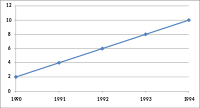
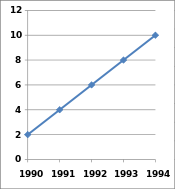
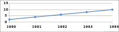
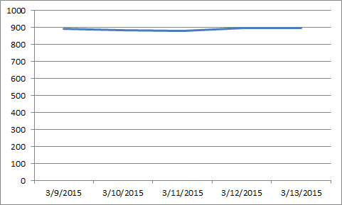
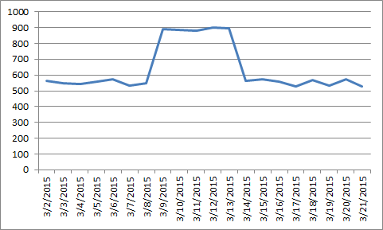

# References {-}

**1. 3 Expert Data Visualization Tips for Grabbing Readers' Attention** 

URL: https://towardsdatascience.com/3-expert-data-visualization-tips-for-grabbing-readers-attention-206d8c4621bf

*Summary*: This article found on Medium explores three important aspects to focus on when creating a data visualization.  The importance of each aspect is explained along with helpful questions to ask and to help you evaluate your visualization to ensure it caters to your audience.  Although it primarily focuses on the appearance of visuals, it also discusses the psychology of the reader as they're looking at a data visual, which offers a unique and useful perspective.

Here is an outline of each of the 3 aspects:
1. Know what you really want to say.  We want to share patterns, trends, anomalies, etc. with others through data visuals but we must find the right things to represent.

2. Design.  Visuals should be kept as simple as possible without leaving out key points.  This makes sense because then the audience can focus on what's really important.

3. Labeling.  This section of the article shows a nice comparison of before and after removing labels from a chart, and the 'after' chart looks much cleaner and easier to interpret.

I think often when working with data, we tend to gravitate toward including more information in a visual, so an important takeaway for me is that less is more, and not everything we want to show has to be crammed into one big-picture visual.

**2. Choose best colors for cartography visualization in a professional manner**

URL: http://colorbrewer.org

*Summary*: It has been carefully designed to be a diagnostic tool for evaluating the robustness of individual color schemes. Full use of this tool will benefit your map designs because colors (even very similar colors) are easy to differentiate when they appear in a nicely ordered sequence (such as a legend). The task of differentiating the colors, however, becomes much harder when the patterns on the map are complex, such as in the lower left corner of the diagnostic map.

It will automatically recommend the color schemes in the following aspects:

1: Can you easily distinguish every color in the random section of the map (the lower left)? If you have a ten-class map, you should be able to see clearly ten unique colors.

2: Within each large band of color on the map, we placed several polygons filled with each map color (‘outliers’). For example, if you have a seven-class map, there will be six outlier colors per band, demonstrating the appearance of all map colors with each as a surrounding color. Can you see each outlier clearly? Do all pairs of outliers in the band look different? If not, perhaps you should choose a different scheme or fewer classes.

3: You can also change the settings to colorblind-friendly on this site.

**3. Visualization Tools: An introduction to tools for creating infographics, timelines and other data visualizations.**

URL:https://guides.library.harvard.edu/c.php?g=310952&p=2073191

This website lists lots of tools to do different type of visualizations, check it out.

**4. Visual Capitalist**

URL:http://www.visualcapitalist.com/category/politics/

This company/website creates visual contents in the field of business and marketing.

**5. Misleading Graph**

As a student to learn how to be a good data scientis or business analytics professional, it is important to learn how to read the chart and interpret the statistic. Graphs can be one of the best ways to present statistical information, but they can also be one of the most misleading, even when they are completely accurate. Here, I would like to share how to detect misleading graphs.Furthermore, we can learn how to improve our data visualization skills.

1. Omitting Baselines

In the data visulization terms, we call it truncated graph. A truncated graph (also known as a torn graph) has a y axis that does not start at 0. These graphs can create the impression of important change where there is relatively little change.Truncated graphs are useful in illustrating small differences.[16] Graphs may also be truncated to save space. Commercial software such as MS Excel will tend to truncate graphs by default if the values are all within a narrow range. Truncating graphs make the readers to change their judement for something that is not significant looks like a huge differece. 

 A example of using good data in a misleading graph to fool readers comes from Fox News.

2. Axis Manipulation

Another trick of misleading graph is axis change: Changing thy y-axis maximum afftect how the graph look like. A higher maximum will make the grpha to appear less volatiliy ,less strrp than a lower maximum. The other way of axis change is changing the ratio of a graph's dimensions. This way will affect how the graph appears. We demostrate chaning the ratio of graph dimension for below graphs.

Axis manipulation is the opposite of truncating data, because they include the axis and baselines but change them so much that they lose meaning. This type of graph manipulation can be used to push a false narrative.

3.Cherry Picking Data
This is to pick the data that shows a typical viewpoint. For example, we know house price in Bay area kept increasing since 2011. However, for those house agencies who want convince buyers that house prices has decreased , they might select some areas in typical months that house prices happend to decreased.  

It is not technically wrong but it is definitely misleading.This is often called improper extraction or tactic omitting data, when only a certain chunk of data is included.This is more common in graphs that have time as one of their axis. Here is the graph to show what it is.

Reference:
How Writers Use Misleading Graphs To Manipulate You BY RYAN MCCREADY, AUG 10, 2017
https://venngage.com/blog/misleading-graphs/
Misleading graph, wikipedia
https://en.wikipedia.org/wiki/Misleading_graph#Truncated_graph
Data Analysis: Displaying Data - Deception with Graphs
https://web.archive.org/web/20030402093134/http://www.sao.state.tx.us/Resources/Manuals/Method/data/12DECEPD.pdf

**6. Hacks for Building Tableau Dashboards**
Reference:
https://www.tableaufit.com/

This website is a hub of effective and creative Tableau dashboards, reusable tips, and many blog posts about different Tableau topics.  One particularly useful post on the site is the following:
https://www.tableaufit.com/data-exploration-using-tableau-dashboards-see-understand-data/

This post walks the reader through several different visualizations, all using the same data.  Each type of visual is also manipulated in several ways to show how to change different features in Tableau, where to place different types of variables, switching between different chart types, etc.  The post offers information on both the technicalities of Tableau and also the conceptual differences between different chart types in Tableau.

In addition to the blog posts, the "Tableau Gallery" tab has a collection of amazing visuals and dashboards that people have created.  Interestingly, some of the visuals are optimized for different views, such as mobile viewing.
